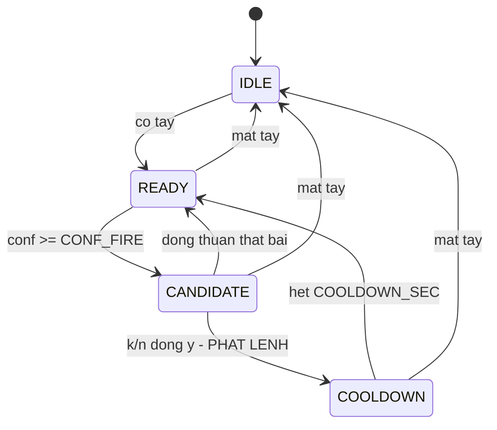

# Spec triển khai cho Claude Code

## Nhận dạng cử chỉ bàn tay thời gian thực để điều khiển máy tính

Cập nhật 2026-09-29 — hướng IPN trước

## Bối cảnh và cách dùng spec này

Spec này chia phần **code** của project thành 13 phase, mỗi phase có định nghĩa hoàn thành kiểm tra được bằng lệnh. Hệ thống cần xây: nhận dạng bốn cử chỉ bàn tay cộng một lớp nền từ webcam, rồi phát phím tắt điều khiển máy tính. Bốn lớp đích là `swipe_left`, `swipe_right`, `zoom_in`, `zoom_out`; lớp nền là `none`.

**Hướng triển khai: IPN Hand trước, dữ liệu tự quay sau nếu cần.** Toàn bộ huấn luyện, chọn ngưỡng và đánh giá chính dựa trên IPN Hand. Người dùng chủ động làm cử chỉ theo đúng cách người diễn trong IPN làm. Dữ liệu tự quay chỉ được bổ sung ở Phase 11 khi có bằng chứng cần tới nó — mục Chiến lược dữ liệu nói rõ khi nào.

Nguồn chân lý về *vì sao* là bộ tài liệu tầng 1–6 và cẩm nang 22 bước trong project. Spec này chỉ nói *làm gì*, *theo thứ tự nào*, và *làm xong thì chứng minh bằng cách nào*. Khi spec mâu thuẫn với cẩm nang về thứ tự hay nguồn dữ liệu, **spec thắng** vì nó phản ánh hướng IPN trước; với mọi điểm khác, Claude Code hỏi lại thay vì tự chọn.

**Cách chạy một phase**

1. Đọc lại mục Quy ước bất di bất dịch trước khi gõ dòng code đầu tiên.
2. Chỉ viết code và kiểm thử của phase hiện tại. Không viết trước cho phase sau, không tạo file "để dành".
3. Chạy `pytest -q` và mọi lệnh trong mục Định nghĩa hoàn thành của phase.
4. Dán nguyên văn kết quả các lệnh đó vào câu trả lời, rồi **dừng** và chờ người dùng xác nhận trước khi sang phase kế tiếp.

Một phase chỉ được coi là xong khi mọi dòng trong Định nghĩa hoàn thành chạy được trên máy sạch — không phải khi code trông có vẻ đúng.

**Ranh giới công việc.** Claude Code viết code, kiểm thử, script chạy thí nghiệm và bảng kết quả. Con người tải dữ liệu, xem video IPN để học cách làm cử chỉ, thử hệ thống trước webcam, dán các hằng số đã đo vào `config.py`, và viết báo cáo. Mục cuối tài liệu liệt kê đầy đủ các điểm bàn giao.

## Chiến lược dữ liệu: IPN trước, tự quay khi cần

Chỉ dùng IPN Hand gần như **không làm yếu mô hình**: dữ liệu tự quay vốn không bao giờ vào tập huấn luyện, còn phần lớn khác biệt hình ảnh giữa IPN và webcam — nền, ánh sáng, màu da — đã bị biểu diễn điểm mốc và phép chuẩn hóa loại bỏ. IPN lại có nhiều người diễn và split chính thức, đủ để chia tập theo người đúng chuẩn. Cái mất đi là khả năng *đo* hệ thống trong điều kiện thật, và phần này được bù ở Phase 10 và, nếu cần, Phase 11.

**Hai điều kiện đi kèm, không được bỏ**

1. **Làm cử chỉ theo IPN.** Mô hình học định nghĩa cử chỉ của IPN, không phải của bạn. Ở Phase 3, người dùng xem video IPN và viết `docs/gestures.md` mô tả năm điều cho từng cử chỉ: tay bắt đầu ở đâu, đi hướng nào, biên độ bao xa, nhanh chậm ra sao, các ngón xếp thế nào. Ở Phase 5, `demo.py --show-features` kiểm tra điều này **bằng số**: giá trị đặc trưng khi bạn làm cử chỉ phải nằm trong hộp của lớp đó trên IPN.
2. **IPN là chuẩn quy ước hướng.** `SWIPE_LEFT_SIGN` đo trên dữ liệu IPN ở Phase 3, `IPN_FLIP_X` mặc định `+1`. Lần kiểm tra trên webcam đầu tiên là ở Phase 5: vuốt sang trái của bạn phải ra `swipe_left`. Nếu ngược, quy ước của IPN ngược với webcam của bạn — cách sửa nằm ở mục Cổng chất lượng.

**Những gì chấp nhận mất, và phải nói ra trong báo cáo**

- Chưa có tập kiểm thử điều kiện thật ở mức cửa sổ; Bảng 4 ở Phase 8 tạm chỉ có hai hàng.
- Lớp `none` của IPN thiếu chuyển động gõ phím, với chuột, khua tay khi nói — nên hệ thống dễ kích hoạt nhầm khi dùng thật hơn con số offline gợi ý.
- Kết quả offline chỉ nói về người, camera và bối cảnh của IPN.

Bằng chứng điều kiện thật vẫn còn: FPS, độ trễ và tỉ lệ kích hoạt nhầm mỗi phút ở Phase 10 đều đo trực tiếp trên webcam, không cần bộ dữ liệu quay sẵn.

**Khi nào bật Phase 11.** Khi có ít nhất một trong bốn dấu hiệu:

- Đã làm đúng theo `docs/gestures.md` mà một lớp vẫn đúng dưới 7/10 lần khi thử trực tiếp.
- Kích hoạt nhầm khi làm việc bình thường vượt mức chấp nhận được — gợi ý: hơn 0,5 lần mỗi phút.
- Yêu cầu của môn học đòi đánh giá trong điều kiện thật.
- Có người khác cần dùng hệ thống.

Điểm quyết định là **ngay sau lần thử trực tiếp ở Phase 6** (tuần 6). Nếu bật, Phase 11 chạy song song với Phase 7–8 và phải xong trước tuần 9. Nếu chỉ phát hiện nhu cầu ở Phase 10, làm bản tối giản: chỉ quay tập đánh giá, không điều chỉnh gì.

## Quy ước bất di bất dịch

Mười lăm luật dưới đây áp dụng cho mọi phase. Mỗi luật chặn một lỗi **im lặng** — loại lỗi không làm chương trình sập, chỉ làm kết quả sai theo cách khó truy.

| # | Luật | Vi phạm thì hỏng ra sao |
| --- | --- | --- |
| 1 | Một đường ống, mọi nguồn: dữ liệu IPN, webcam lúc chạy thật, và dữ liệu tự quay nếu có, đi qua **cùng các hàm** trong `src/` | Kết quả offline đẹp, demo loạn, mất nhiều ngày để tìm nguyên nhân |
| 2 | `config.py` là nơi duy nhất chứa hằng số. Không hằng số nào lặp lại ở file khác | Sửa sót một chỗ, hệ thống chạy ngược đúng ở chỗ đó |
| 3 | Quy ước thì **đo**, không đoán: `SWIPE_LEFT_SIGN` đo trên dữ liệu IPN. IPN là chuẩn; `IPN_FLIP_X` chỉ đổi khi phép thử trên webcam chứng minh quy ước ngược | Vuốt trái thì slide chạy ngược, không có thông báo lỗi nào |
| 4 | Frame không thấy tay: ghi `NaN`, **không bỏ frame** | Trục thời gian đứt, `resample` nội suy qua khoảng trống mà không ai biết |
| 5 | Thứ tự đường ống cố định: `to_pixels` → `resample(15 Hz)` → `fill_short_gaps` → cắt cửa sổ → [tăng cường] → `normalize_window` → đặc trưng hoặc LSTM | Đổi thứ tự bất kỳ đều làm biểu diễn khác đi mà không báo lỗi |
| 6 | Gốc toạ độ = cổ tay của **frame đầu cửa sổ**; đơn vị = khoảng cách điểm 0→9 của frame đầu | Lấy gốc theo từng frame xóa sạch quỹ đạo, hai lớp vuốt biến mất |
| 7 | Cửa sổ và bước trượt tính bằng **giây**, không bằng frame | IPN 30 FPS và webcam 15 FPS cho hai tốc độ cử chỉ khác nhau |
| 8 | Chia tập **theo người**, dùng split chính thức của IPN | Macro-F1 98–99% hoàn toàn giả |
| 9 | Tăng cường chỉ trên tập huấn luyện, **sau** khi chia | Mẫu gốc và bản lật rơi vào hai tập — rò rỉ |
| 10 | Nhân quả một chiều: không dùng thông tin từ tương lai ở bất kỳ khâu nào | Con số báo cáo không đạt được trong hệ thống thời gian thực |
| 11 | Ảnh đưa **vào mô hình** không lật; chỉ lật bản hiển thị cho người xem | Hệ thống chạy ngược chiều so với dữ liệu huấn luyện |
| 12 | Chỉ dùng toạ độ 2D. Không `z`, không `hand_world_landmarks` | Thêm 21 chiều nhiễu từ một ước lượng độ sâu không tin cậy |
| 13 | Tập `test` và tập `real_test` mỗi tập chạy **đúng một lần**, ở cuối. Mọi quyết định — ngưỡng, siêu tham số, cấu hình — chọn trên `train`, `val` hoặc `real_tune` | Con số cuối bị thổi phồng vì đã dùng tập kiểm thử để ra quyết định |
| 14 | Mọi con số vào báo cáo phải tái tạo được bằng một lệnh ghi trong `README.md` | Không giải thích được kết quả khi bị hỏi |
| 15 | Dữ liệu tự quay, nếu có, chia thành `real_tune` và `real_test` theo người hoặc buổi quay **trước khi** nhìn vào nó | Điều chỉnh và đánh giá trên cùng dữ liệu — con số điều kiện thật vô nghĩa |

**Cấm tuyệt đối.** Nếu một yêu cầu nào đó đòi hỏi các việc dưới đây, Claude Code dừng và hỏi lại:

- Chạy bất kỳ lệnh git nào
- `train_test_split` ngẫu nhiên trên tập cửa sổ
- LSTM hai chiều, làm mượt hai phía, hay chuẩn hóa theo thống kê của cả video
- Viết cứng dấu của `dx` thay vì dùng `SWIPE_LEFT_SIGN`
- Chọn ngưỡng luật trên tập `val` hay `test`
- Định nghĩa lại `normalize_window` hoặc `window_features` bên trong `demo.py`
- `StandardScaler` fit trên toàn bộ dữ liệu
- `cap.set(cv2.CAP_PROP_POS_FRAMES, i)` bên trong vòng lặp đọc video
- Lưu điểm mốc ở dạng đã chuẩn hóa
- Nội suy các lỗ hổng dài hơn `MAX_GAP`
- Cân bằng lớp tới tỉ lệ 1:1
- Đường dẫn tuyệt đối, hoặc bất kỳ phụ thuộc nào vào CUDA

## Hợp đồng dữ liệu và cấu hình

Mọi phase đọc và ghi đúng các shape dưới đây. Một phase đổi schema là một phase phá vỡ hợp đồng và phải được nêu ra trước khi làm.

### `src/config.py`

| Hằng số | Giá trị khởi đầu | Ghi chú |
| --- | --- | --- |
| `CLASSES` | `["none", "swipe_left", "swipe_right", "zoom_in", "zoom_out"]` | Thứ tự cố định. `none` luôn là chỉ số 0 |
| `WRIST`, `MIDDLE_MCP` | `0`, `9` | Gốc toạ độ và đơn vị đo |
| `TIPS` | `[4, 8, 12, 16, 20]` | Năm đầu ngón |
| `HZ` | `15.0` | Lưới thời gian đều |
| `WIN_SEC`, `STRIDE_SEC` | `1.2`, `0.2` | Tính bằng giây. `T = round(WIN_SEC * HZ)` = 18 bước |
| `MAX_GAP` | `3` | Lỗ hổng dài hơn thì giữ `NaN` |
| `MIN_PRESENCE` | `0.7` | Tỉ lệ bước có tay tối thiểu của một cửa sổ |
| `LABEL_COVERAGE` | `0.6` | Ngưỡng phủ nhãn khi gán nhãn cửa sổ |
| `SWIPE_LEFT_SIGN` | `None` | **CHƯA ĐO** — đo trên IPN ở Phase 3 |
| `IPN_FLIP_X` | `1` | IPN là chuẩn quy ước. Chỉ đổi thành `-1` khi phép thử ở Phase 5 chứng minh ngược |
| `AUG_NOISE_SIGMA` | `None` | **CHƯA ĐO** — từ thí nghiệm quan sát Phase 1, hoặc ước lượng trên IPN ở Phase 4 |
| `RULE_S_HI`, `RULE_DX_HI`, `RULE_O_HI` | `None` | **CHƯA HIỆU CHUẨN** — chọn trên tập `train` của IPN ở Phase 5 |
| `CAM_W`, `CAM_H`, `CAM_FPS` | `640`, `480`, `30` | Giữ nguyên suốt dự án |
| `CONF_FIRE`, `CONF_HOLD` | `0.75`, `0.55` | Logic kích hoạt |
| `K_OF_N` | `(3, 5)` | Đồng thuận k trên n |
| `COOLDOWN_SEC` | `1.2` | Sau khi phát lệnh |
| `SEED` | `42` | Đặt cho `random`, `numpy`, `torch` |

Mọi hằng số còn `None` đều đọc qua `require_measured(name)`, và chương trình **dừng ngay** kèm tên phase cần chạy nếu nó chưa được điền.

### Điểm mốc thô — `data/landmarks/<source>/<clip_id>.npz`

```
xy          float32  (N, 21, 2)   toạ độ [0,1] của MediaPipe, NaN khi mất tay; to_pixels chạy lúc nạp
ts          float64  (N,)         giây, tăng đơn điệu, ts[0] = 0.0
present     bool     (N,)         True nếu frame đó có tay
segments    int64    (M, 3)       [start_idx, end_idx, class_id] — đoạn đã gán nhãn
src_labels  <U32     (M,)         nhãn gốc của nguồn, trước khi ánh xạ về 5 lớp
meta        str                   JSON: w, h, fps, source, subject, clip_id, flip_applied
```

`source` nhận một trong ba giá trị: `ipn`, `self`, `webcam`. Giai đoạn đầu chỉ có `ipn`; `self` xuất hiện nếu bật Phase 11. Không lưu bản đã chuẩn hóa.

### Bộ cửa sổ — `data/windows/windows.npz`

```
X         float32  (N, T, 21, 2)  ĐÃ chuẩn hóa, T = 18
y         int64    (N,)           chỉ số trong CLASSES
presence  float32  (N,)           tỉ lệ bước có tay
subject   <U16     (N,)           mã người diễn
clip      <U64     (N,)           clip_id nguồn
t0        float32  (N,)           thời điểm bắt đầu cửa sổ trong clip
src_label <U32     (N,)           nhãn gốc của đoạn phủ cửa sổ
```

`data/splits.json` giữ danh sách mã người:

```
{"train": [...], "val": [...], "test": [...], "real_tune": [], "real_test": []}
```

Hai khóa `real_*` để trống tới Phase 11, nhưng mọi script đánh giá **phải nhận** chúng qua `--split` ngay từ đầu. Chia tập là một phép lọc theo cột `subject`, không bao giờ là một phép chia ngẫu nhiên.

### Vector đặc trưng

Mười ba chiều, thứ tự cố định trong `FEATURE_NAMES`:

```
open_start, open_end, open_delta, open_range, open_trend,
dx, dy, max_vx, mean_vx, max_vy,
straightness, horiz_ratio, presence
```

Bốn đặc trưng **có dấu** — `open_delta`, `open_trend`, `dx`, `mean_vx` — gánh phần lớn việc phân biệt hai cặp lớp. Không đặc trưng nào được phép là `NaN`.

### Quy ước đặt tên và đầu ra

- `docs/gestures.md` là định nghĩa bộ cử chỉ, viết từ video IPN. Nó là tài liệu hướng dẫn người dùng và là một phần của báo cáo.
- Video tự quay, nếu có: `p03_swipe_left_07.mp4`. Tên file suy ra được cả mã người lẫn nhãn.
- Mọi script nằm trong `scripts/`, dùng `argparse`, không nhận tham số qua biến toàn cục.
- Mỗi lần chạy ghi vào `results/phase<N>/<tên_chạy>/` kèm `manifest.json` chứa: dòng lệnh đầy đủ, thời điểm chạy, seed, và bản sao các hằng số `config.py` đang dùng.
- Bảng kết quả xuất song song `.csv` và `.md`; hình xuất `.png` ở 150 dpi.

## Bản đồ 13 phase

Phase đánh số theo **đúng thứ tự thực hiện**. Phase 0 đến 2 chạy được ngay, không cần IPN. Từ Phase 3 trở đi mọi thứ dựa trên IPN, nên hãy **bắt đầu tải IPN Hand từ tuần 2** — bộ dữ liệu lớn, và trích điểm mốc mất cả đêm. Phase 11 là nhánh tùy chọn, chỉ bật theo điều kiện ở mục Chiến lược dữ liệu.

| Phase | Nội dung | Bước cẩm nang | Tuần | Sản phẩm mốc |
| --- | --- | --- | --- | --- |
| 0 | Khung dự án và `config.py` | 2 | 1 | Repo chạy `pytest` được |
| 1 | Thu nhận điểm mốc, thí nghiệm quan sát | 3, 6 | 1–2 | 21 điểm bám tay trên webcam |
| 2 | Tiền xử lý, chuẩn hóa, đặc trưng | 7, 8, 9 | 3–4 | Bộ kiểm thử biểu diễn xanh |
| 3 | Trích điểm mốc IPN, đo quy ước hướng | 11 | 4–5 | `data/landmarks/ipn/`, `SWIPE_LEFT_SIGN`, `docs/gestures.md` |
| 4 | Cắt cửa sổ, tăng cường, chia tập theo người | 13 | 5 | `windows.npz`, `splits.json`, ba hình boxplot |
| 5 | Mô hình luật và demo v0 | 10 | 5 | **Hệ thống chạy được đầu tiên** |
| 6 | Rừng ngẫu nhiên và demo học máy | 14 | 6 | **Demo học máy đầu tiên** + quyết định có bật Phase 11 |
| 7 | LSTM trên chuỗi 42 chiều | 15 | 7–8 | Đường loss + mô hình đã lưu |
| 8 | Đánh giá hai mức, bảy bảng khảo sát | 16, 17 | 8 | `results/` đủ bảng cho phần thí nghiệm |
| 9 | Logic kích hoạt — máy trạng thái | 18 | 9 | `ActivationFSM` + 5 kiểm thử |
| 10 | Demo hoàn chỉnh và đo đạc | 19, 20 | 9 | **Video demo** + bảng đánh đổi |
| 11 | Dữ liệu tự quay — *tùy chọn* | 12 | 6–8 nếu bật | Tập `real_test` + hàng 3 của Bảng 4 |
| 12 | Tái lập và bàn giao | 22 | 10 | Dựng lại từ đầu ra cùng số |

Phụ thuộc cứng: Phase 3 cần IPN đã tải về và cần Phase 2 vì dùng `load_sequence`. Phase 5 cần boxplot từ Phase 4 để chọn ngưỡng. Phase 8 mức sự kiện cần `ActivationFSM` của Phase 9, nên hai phase này đan vào nhau — viết `evaluate.py` ở Phase 8 với một tham số nhận bất kỳ bộ lọc sự kiện nào, rồi nối FSM vào sau. Phase 11 nếu bật thì chạy song song với Phase 7–8, và sau nó phải chạy lại đánh giá của Phase 8–10.

## Phase 0 — Khung dự án

**Mục tiêu.** Một cây thư mục cố định, một file cấu hình duy nhất và một bộ kiểm thử chạy được — trước khi có dòng code xử lý nào.

**Việc phải làm**

1. Dựng cây thư mục: `models/`, `data/{ipn,raw,landmarks,windows}/`, `src/`, `scripts/`, `tests/`, `docs/`, `notebooks/`, `results/`.
2. Viết `CLAUDE.md` ở gốc thư mục chứa các quy ước bất di bất dịch, gồm cả luật không dùng git.
3. Viết `src/config.py` đủ mọi hằng số ở bảng Hợp đồng dữ liệu, kèm `ROOT = Path(__file__).resolve().parents[1]` và các đường dẫn suy ra từ `ROOT`.
4. Viết `require_measured(name)` trong `config.py`: ném `RuntimeError` kèm tên phase cần chạy nếu hằng số đó còn là `None`.
5. Viết `requirements.txt` (chưa ghim phiên bản) và cấu hình `pytest` với `testpaths = tests`.
6. Viết `README.md` khung: tên project, lệnh tạo môi trường, cách tải `hand_landmarker.task` và IPN Hand, bảng hằng số đã đo (để trống), thứ tự chạy script.

**Kiểm thử bắt buộc** — `tests/test_config.py`

```
test_classes_du_nam_lop_va_none_o_dau
test_T_la_so_nguyen_duong          # round(WIN_SEC * HZ) == 18
test_tips_du_nam_dau_ngon
test_require_measured_nem_loi       # SWIPE_LEFT_SIGN còn None
test_moi_duong_dan_deu_tuong_doi_tu_ROOT
```

**Định nghĩa hoàn thành**

- [ ] `python -c "import mediapipe, cv2, torch, sklearn"` chạy không lỗi
- [ ] `python -c "import cv2; print(cv2.VideoCapture(0).isOpened())"` in ra `True`
- [ ] `pytest -q` xanh với ít nhất năm kiểm thử
- [ ] `models/hand_landmarker.task` đã có trong `models/`
- [ ] Đọc lại toàn bộ `src/`: không file nào ngoài `config.py` chứa số ma thuật

## Phase 1 — Thu nhận điểm mốc và thí nghiệm quan sát

**Mục tiêu.** 21 điểm mốc bám theo bàn tay trên webcam, mỗi frame có mốc thời gian thật, và ghi được ra CSV. Phase này chia hai phần: **1A** là phần bắt buộc để thấy khung xương tay; **1B** là công cụ cho tám thí nghiệm quan sát.

**Việc phải làm — 1A**

1. `src/io_video.py` — `iter_frames(source)` sinh ra `(frame_bgr, ts_sec)` cho **cả** webcam lẫn file video. Webcam đọc `time.perf_counter()`, gốc 0 ở frame đầu; video lấy chỉ số frame chia FPS và đọc **tuần tự** bằng `cap.read()`. Đây là cửa vào duy nhất của mọi nguồn.
2. `src/hands.py` — lớp `HandTracker` bọc MediaPipe Tasks API (`HandLandmarker`, không dùng `mp.solutions.hands`), `running_mode` VIDEO, `num_hands=1`. `process(frame_bgr, ts_ms)` trả về `(xy_norm: (21,2) float32, present: bool, score: float)`. `ts_ms` là số nguyên tăng nghiêm ngặt. Chuyển BGR sang RGB **bên trong** lớp này. Không thấy tay thì trả về mảng `NaN` và `present=False`, không trả về `None`.
3. `scripts/live_landmarks.py` — vòng lặp webcam, vẽ 21 điểm và các cạnh nối lên **bản hiển thị đã lật** (đổi `x` thành `1 - x` khi vẽ), hiện FPS trung bình và phân vị thấp, bỏ 3 giây đầu khỏi thống kê.
4. `scripts/record_csv.py` — ghi mỗi frame một dòng: `ts, present, score, w, h, x0..x20, y0..y20`. Frame mất tay vẫn có dòng, các cột toạ độ để trống.

**Việc phải làm — 1B**

5. `scripts/observe.py` — chạy một thí nghiệm quan sát có tên, ghi CSV vào `results/phase1/<tên>/`.
6. `scripts/analyze_observations.py` — tính tỉ lệ phát hiện, độ rung đầu ngón trỏ tính bằng pixel khi tay đứng yên, và độ lệch chuẩn `σ` sau chuẩn hóa. In ra dòng `AUG_NOISE_SIGMA = ...` để dán vào `config.py`.

1B không chặn Phase 2 và 3. Nếu bỏ qua, Phase 4 ước lượng `σ` từ các đoạn tay đứng yên của IPN.

**Kiểm thử bắt buộc**

```
test_hands_tra_ve_nan_tren_anh_den       # ảnh đen → present False, xy toàn NaN
test_iter_frames_ts_tang_don_dieu
test_hands_khong_lat_anh_dau_vao         # đọc mã nguồn: không cv2.flip trong hands.py
test_record_csv_giu_dong_khi_mat_tay
```

**Định nghĩa hoàn thành**

- [ ] `python scripts/live_landmarks.py` vẽ 21 điểm bám theo tay, có FPS trên màn hình
- [ ] Đưa tay ra khỏi khung rồi vào lại: không sập, hiện "mất tay" rồi bám lại
- [ ] CSV từ một phiên có tay ra vào khung hình: số dòng bằng số frame, các dòng mất tay vẫn còn
- [ ] `pytest -q` xanh
- [ ] *(1B)* `results/phase1/` có số liệu của tám thí nghiệm quan sát và `AUG_NOISE_SIGMA` đã điền

## Phase 2 — Tiền xử lý, chuẩn hóa và đặc trưng

**Mục tiêu.** Một đường ống biểu diễn dùng chung cho mọi nguồn dữ liệu, kèm bộ kiểm thử chứng minh nó bất biến với vị trí và cỡ bàn tay nhưng **giữ nguyên quỹ đạo** chuyển động. Không đụng tới webcam, không viết mô hình.

**Việc phải làm**

1. `src/io_data.py` — `read_record_csv(path) -> (ts, xy_norm, present, w, h)` đọc đúng định dạng CSV của Phase 1.
2. `src/preprocess.py` — năm hàm công khai, không hơn:
    - `to_pixels(xy_norm, w, h)` — nhân `x` với `w`, `y` với `h`. Không dùng chung một hệ số cho hai trục.
    - `resample(ts, xy, hz=HZ)` — lưới đều từ `ts[0]`, bước đúng `1/hz`. Nội suy tuyến tính **chỉ từ frame có tay**; một điểm lưới là `NaN` nếu hai frame kẹp nó không cùng có tay. `np.interp` tự nó nội suy xuyên qua khoảng mất tay mà không báo gì — lỗi im lặng phải chặn.
    - `fill_short_gaps(xy, max_gap=MAX_GAP)` — nội suy các đoạn `NaN` ngắn **và** có đủ hai đầu mút. Đoạn dài hơn, hoặc chạm đầu hay cuối chuỗi, giữ `NaN`. Không sửa mảng đầu vào tại chỗ.
    - `load_sequence(ts, xy_norm, w, h)` — gọi ba hàm trên theo đúng thứ tự. Là cửa duy nhất vào đường ống; ngoài `tests/`, không nơi nào khác gọi `resample` hay `fill_short_gaps` trực tiếp.
    - `normalize_window(win)` — dời gốc về **cổ tay của frame đầu cửa sổ**, chia cho khoảng cách điểm 0 đến điểm 9 **của frame đầu**, dùng chung cho mọi frame. Ném `ValueError` nếu frame đầu có `NaN` hoặc thang đo quá nhỏ.
3. `src/features.py` — `openness(win)` là trung bình khoảng cách từ năm đầu ngón tới cổ tay **của cùng frame**; `window_features(win_norm, presence_ratio)` trả về vector 13 chiều `float32`; `FEATURE_NAMES` đúng thứ tự. Định nghĩa từng đặc trưng:

| Đặc trưng | Định nghĩa ("đầu", "cuối" = trung bình 3 bước đầu, cuối) |
| --- | --- |
| `open_start`, `open_end` | độ xòe đầu, cuối |
| `open_delta` | `open_end - open_start` — có dấu |
| `open_range` | max − min của độ xòe |
| `open_trend` | hệ số góc hồi quy tuyến tính của độ xòe theo giây — có dấu |
| `dx`, `dy` | cổ tay cuối − cổ tay đầu, từng trục — `dx` có dấu |
| `max_vx`, `mean_vx`, `max_vy` | từ vận tốc cổ tay `np.diff(w) * HZ`; `mean_vx` có dấu |
| `straightness` | độ dời thẳng / tổng độ dài đường đi của cổ tay, trong `[0, 1]` |
| `horiz_ratio` | `|dx| / (|dx| + |dy| + eps)` |
| `presence` | `presence_ratio` truyền vào |

Dùng hàm nan-aware; bỏ qua đoạn có `NaN` khi tính độ dài đường đi. Kết quả **không bao giờ** chứa `NaN` hay `inf`. Không suy ra hướng trái/phải ở đây.

4. `src/viz.py` — `plot_boxplots(F, y, names, out_path)`, dùng lại ở Phase 4 và 5.
5. `tests/fixtures.py` — cửa sổ tổng hợp ở toạ độ pixel, bàn tay mẫu 21 điểm với `||p9 − p0|| = 80 px` quanh `(320, 240)`: `make_swipe(direction)`, `make_zoom(direction)`, `make_static()`, `make_wave()`. Không kiểm thử nào phụ thuộc dữ liệu thật hay webcam.
6. `scripts/check_pipeline.py <csv>` — chạy `load_sequence` trên một CSV thật, in số frame, FPS thực, số bước lưới, độ lệch lớn nhất của khoảng cách lưới, tỉ lệ `NaN` trước và sau khi vá.

**Kiểm thử bắt buộc** — bộ kiểm thử quan trọng nhất của cả dự án

```
test_to_pixels_hai_truc_khac_thang
test_resample_luoi_deu_dung_1_tren_15          # ts đầu vào có jitter
test_resample_khong_noi_suy_xuyen_lo_mat_tay
test_fill_va_lo_hong_2_buoc_giu_lo_hong_10_buoc
test_fill_giu_nan_o_dau_va_cuoi_chuoi
test_normalize_bat_bien_voi_tinh_tien           # dời 137 px → sai khác < 1e-5
test_normalize_bat_bien_voi_ti_le               # phóng 1,6 lần → sai khác < 1e-5
test_normalize_giu_quy_dao                      # make_swipe → |dx| > 2
test_normalize_nem_loi_khi_frame_dau_mat_tay
test_flip_doi_dau_dx_va_mean_vx                 # lật x = 640 - x trước khi chuẩn hoá
test_flip_giu_nguyen_open_delta
test_zoom_in_open_delta_duong_zoom_out_am
test_swipe_straightness_tren_0_8_wave_duoi_0_5
test_features_dung_13_chieu_va_khop_FEATURE_NAMES
test_features_khong_bao_gio_tra_ve_nan          # kể cả cửa sổ còn 30% bước NaN
```

**Định nghĩa hoàn thành**

- [ ] `pytest -q` xanh: đủ 15 kiểm thử trên, cộng các kiểm thử cũ
- [ ] `check_pipeline.py` trên một CSV từ Phase 1: độ lệch lưới nhỏ hơn `1e-9`
- [ ] Trong `src/` và `scripts/`: `resample` và `fill_short_gaps` chỉ được gọi bên trong `load_sequence`; `normalize_window` chỉ được định nghĩa đúng một lần

## Phase 3 — Trích điểm mốc IPN và đo quy ước hướng

**Mục tiêu.** Toàn bộ video IPN Hand đã thành điểm mốc trên đĩa, nhãn đã ánh xạ về năm lớp, `SWIPE_LEFT_SIGN` được **đo trên chính IPN**, và người dùng có tư liệu để học cách làm cử chỉ theo IPN.

**Việc phải làm**

1. `src/io_data.py` bổ sung `save_clip(path, ...)` và `load_clip(path)`. `load_clip` trả về đúng những gì `load_sequence` cần, cộng `segments`, `src_labels`, `meta`. Đây là **chỗ duy nhất** áp dụng `IPN_FLIP_X`: khi nguồn là `ipn` và cờ bằng `-1`, đổi `x` thành `1 - x` trước khi trả về.
2. `src/ipn.py` — đọc file nhãn chính thức của IPN, quy đổi chỉ số frame về frame của mình, ánh xạ về năm lớp. Hất trái, hất phải, zoom in, zoom out và không-cử-chỉ ánh xạ thẳng; **mọi lớp cử chỉ còn lại ánh xạ về `none`** và trở thành mẫu âm khó. Nhãn gốc giữ trong `src_labels`.
3. `scripts/extract_landmarks.py --source {ipn,self}` — duyệt video qua `iter_frames`, chạy `HandTracker`, lưu `.npz` đúng schema. Đọc tuần tự, bỏ qua clip đã có `.npz` để chạy lại được, in tiến độ, ghi clip lỗi ra `results/phase3/failed.txt`. Tham số `--source self` viết sẵn cho Phase 11 nhưng chưa chạy. Đây là bước tốn thời gian nhất của cả project — thiết kế để chạy qua đêm.
4. `scripts/measure_direction.py` — với mỗi đoạn thuộc bốn lớp đích: `load_sequence` trên đoạn, `normalize_window` trên cả đoạn, tính `dx` và `open_delta`. In ra:
    - trung vị `dx` của `swipe_left` và `swipe_right` — **phải trái dấu**;
    - trung vị `open_delta` của `zoom_in` — **phải dương**, của `zoom_out` — phải âm;
    - tỉ lệ đoạn cùng dấu với trung vị của lớp mình;
    - đúng dòng `SWIPE_LEFT_SIGN = ...` để dán vào `config.py`. Script không tự sửa `config.py`.

    Nếu một trong hai điều "phải" không đạt, **không** đề xuất giá trị nào — nghĩa là tên lớp IPN không khớp hình dung, và phải kiểm tra lại bảng ánh xạ. Ghi bằng chứng vào `results/phase3/direction.md`.
5. `scripts/dataset_stats.py` — số clip, số frame, tỉ lệ frame mất tay theo lớp, số đoạn theo lớp và theo người, và **thời lượng trung vị của từng lớp**. Con số cuối cho biết nên làm cử chỉ nhanh cỡ nào, và có bao nhiêu cử chỉ dài hơn `WIN_SEC`.
6. `scripts/export_examples.py` — cắt ba đoạn mẫu mỗi lớp đích, từ ba người khác nhau, ra `results/phase3/examples/*.mp4` có vẽ điểm mốc đè lên. Đây là tư liệu để viết `docs/gestures.md`.

**Kiểm thử bắt buộc**

```
test_anh_xa_nhan_ipn_phu_het_moi_lop_goc     # không lớp IPN nào rơi ra ngoài bảng
test_lat_x_hai_lan_bang_khong_lat
test_ipn_flip_chi_ap_dung_trong_load_clip
test_npz_dung_schema                          # shape, dtype, ts đơn điệu tăng
test_extract_bo_qua_clip_da_co
test_measure_direction_tren_du_lieu_tong_hop  # dùng fixtures Phase 2
```

**Định nghĩa hoàn thành**

- [ ] `data/landmarks/ipn/` có `.npz` cho mọi video IPN; số clip khớp với file nhãn gốc
- [ ] `measure_direction.py` cho kết luận dứt khoát; `SWIPE_LEFT_SIGN` đã điền vào `config.py`
- [ ] Trung vị `open_delta` của `zoom_in` dương và của `zoom_out` âm
- [ ] `dataset_stats.py` xuất bảng `.csv` và `.md`, có tỉ lệ mất tay theo lớp và thời lượng trung vị từng lớp
- [ ] `results/phase3/examples/` có ba đoạn mẫu cho mỗi lớp đích
- [ ] `docs/gestures.md` đã được người dùng viết xong

**Con người phải làm.** Tải và giải nén IPN Hand vào `data/ipn/`. Xem các đoạn mẫu, rồi viết `docs/gestures.md`: với mỗi cử chỉ ghi tay bắt đầu ở đâu, đi hướng nào, biên độ bao xa, nhanh chậm ra sao (lấy thời lượng trung vị từ bảng thống kê), và các ngón xếp thế nào. Đặc biệt chú ý zoom in và zoom out — tên gọi có thể không khớp với hình dung của bạn.

## Phase 4 — Cửa sổ, tăng cường và chia tập theo người

**Mục tiêu.** Một tập mẫu kích thước cố định `(N, 18, 21, 2)` kèm nhãn, chia theo người, sẵn sàng cho cả ba mô hình — cộng bằng chứng trực quan rằng thiết kế đặc trưng hoạt động trên IPN.

**Việc phải làm**

1. `src/windows.py` — `cut_windows(...)` nạp clip qua `load_clip` và `load_sequence`, cắt cửa sổ theo `WIN_SEC` và `STRIDE_SEC` **trong phạm vi từng clip**. Nhãn cửa sổ là lớp phủ ít nhất `LABEL_COVERAGE` số bước; không lớp nào đạt thì nhãn là `none`. Loại cửa sổ có `presence_ratio < MIN_PRESENCE` hoặc bước đầu không có tay. Ghi `src_label` của đoạn phủ cửa sổ.
2. `src/augment.py` — mỗi phép trả lời câu hỏi "biến đổi này có làm đổi lớp không":

| Phép | Tham số | Đổi nhãn? |
| --- | --- | --- |
| Lật ngang | — | **Có** với cặp vuốt, **không** với cặp zoom |
| Co giãn | ±10% | Không |
| Xoay nhẹ | ±10° | Không |
| Co giãn thời gian | 0,8–1,2× rồi nội suy về đúng `T` | Không |
| Nhiễu Gauss | `AUG_NOISE_SIGMA` | Không |
| Xóa bước ngẫu nhiên | 1–3 bước rồi `fill_short_gaps` | Không |

3. Nếu `AUG_NOISE_SIGMA` còn `None`: `scripts/estimate_sigma.py` ước lượng từ các cửa sổ `none` của tập `train` mà cổ tay gần như đứng yên — độ lệch chuẩn của đầu ngón quanh vị trí trung bình, sau chuẩn hóa — rồi in dòng để dán vào `config.py`.
4. `scripts/make_splits.py` — dựng `splits.json` theo **split chính thức của IPN**; tách một nhóm người trong phần huấn luyện làm `val`. Hai khóa `real_tune`, `real_test` để trống.
5. `scripts/build_dataset.py` — cắt cửa sổ, `normalize_window`, lấy mẫu con lớp `none` xuống còn 40–50% tập huấn luyện. Dùng `src_label` để **giữ lại toàn bộ mẫu âm khó**, chỉ bỏ bớt phần tay đứng yên trùng lặp. Xuất `windows.npz` và bảng thống kê trước/sau.
6. Chạy `plot_feature_boxplots.py` trên tập `train`, và lưu phân vị 25/75 của từng đặc trưng theo từng lớp vào `results/phase4/ipn_feature_ranges.json` — Phase 5 dùng file này để kiểm tra bạn làm cử chỉ có giống IPN không.

**Kiểm thử bắt buộc**

```
test_khong_ma_nguoi_nao_xuat_hien_o_hai_tap   # phép giao in ra tập rỗng
test_cua_so_khong_bac_cau_qua_hai_clip
test_gan_nhan_theo_nguong_phu_60_phan_tram
test_flip_doi_nhan_cap_vuot_va_giu_nhan_cap_zoom
test_tang_cuong_khong_cham_vao_val_va_test
test_shape_X_dung_N_18_21_2
```

**Cổng kiểm tra — ba hình boxplot.** Chỗ dừng bắt buộc của phase này:

- `open_delta`: hộp `zoom_in` nằm hẳn bên dương, hộp `zoom_out` nằm hẳn bên âm, hai hộp gần như không chồng nhau.
- `dx`: hai hộp của hai lớp vuốt nằm ở hai phía của số 0.
- `straightness`: hộp của hai lớp vuốt cao hơn hẳn hộp của lớp `none`.

Nếu ba hình không như mô tả, **dừng lại và quay về Phase 2**. Không mô hình nào cứu được đặc trưng không tách lớp.

**Định nghĩa hoàn thành**

- [ ] `windows.npz` đúng schema, nạp trong dưới một giây
- [ ] Phép giao mã người giữa `train`, `val`, `test` in ra tập rỗng
- [ ] Bảng số cửa sổ theo lớp và theo tập, trước và sau lấy mẫu con
- [ ] Lớp `none` chiếm 40–50% tập huấn luyện, không phải 1:1
- [ ] Ba hình boxplot đạt mô tả ở cổng kiểm tra
- [ ] `AUG_NOISE_SIGMA` đã có giá trị, và `ipn_feature_ranges.json` tồn tại
- [ ] Vẽ quỹ đạo cổ tay và đường độ xòe cho một cửa sổ ngẫu nhiên mỗi lớp, xem bằng mắt là đúng cử chỉ mang nhãn đó

## Phase 5 — Mô hình luật và demo v0

**Mục tiêu.** Hệ thống hoàn chỉnh đầu tiên chạy trên webcam — camera → 21 điểm → cửa sổ 1,2 giây → 13 đặc trưng → luật ngưỡng → nhãn trên màn hình — với ngưỡng chọn từ IPN. Đây cũng là lần đầu kiểm tra quy ước hướng và cách bạn làm cử chỉ trên webcam thật.

**Việc phải làm**

1. `src/calibration.py` (logic, kiểm thử được) và `scripts/calibrate_rules.py` (dòng lệnh). **Chỉ dùng cửa sổ của tập `train`.** Đề xuất:
    - `RULE_S_HI` = trung điểm của phân vị 90 `straightness` lớp `none` và phân vị 10 `straightness` hai lớp vuốt;
    - `RULE_DX_HI` = phân vị 10 của `|dx|` trên hai lớp vuốt;
    - `RULE_O_HI` = trung điểm của phân vị 90 `|open_delta|` (lớp `none` cộng hai lớp vuốt) và phân vị 10 `|open_delta|` hai lớp zoom.

    Nếu hai phân vị chồng nhau, in cảnh báo kèm hai con số nhưng vẫn đề xuất trung điểm. In ra đúng ba dòng để dán vào `config.py`, không tự sửa file. Ghi bảng phân vị và lý do vào `results/phase5/thresholds.md`.
2. `src/rules.py` — `classify(feat) -> (label, confidence)`, thứ tự kiểm tra cố định:

```
presence < MIN_PRESENCE                         → none
straightness > RULE_S_HI và |dx| > RULE_DX_HI   → swipe_left nếu sign(dx) == SWIPE_LEFT_SIGN,
                                                   ngược lại swipe_right
open_delta > RULE_O_HI                          → zoom_in
open_delta < -RULE_O_HI                         → zoom_out
còn lại                                         → none
```

Vuốt được xét **trước** zoom vì cú vuốt cũng làm tay biến dạng chút ít, còn cú xoè thì gần như không dời chỗ. `confidence` = `0.5 + 0.5 × min_i clip(v_i/θ_i − 1, 0, 1)` trên các điều kiện của luật vừa khớp; `none` trả về `1.0` — một con số heuristic, ghi rõ trong docstring. Đọc hằng số qua `config.X` lúc gọi hàm để kiểm thử `monkeypatch` được.

3. `src/buffer.py` — `TimeBuffer.push(ts, xy_norm, w, h)` giữ frame trong `WIN_SEC + 0,5` giây gần nhất, theo thời gian. `window()` gọi `load_sequence` trên dữ liệu đang giữ, lấy `T` bước cuối, trả về `(win_pixel, presence_ratio)` hoặc `None` khi chưa đủ, `presence` thấp, hay bước đầu mất tay. Không gọi `resample` hay `fill_short_gaps` trực tiếp.
4. `scripts/demo.py --model rules [--log FILE] [--show-features]` — vòng lặp `iter_frames(0)` → `HandTracker` → `TimeBuffer` → mỗi `STRIDE_SEC`: `normalize_window` → `window_features` → `classify`. Hiển thị trên bản đã lật: 21 điểm, nhãn chữ to kèm `confidence`, `presence_ratio`, FPS; `—` khi `window()` trả về `None`. `--model` thiết kế để thêm lựa chọn khác mà không sửa vòng lặp. `demo.py` chỉ import từ `src/`, không tự định nghĩa hàm xử lý nào.
5. `--show-features` — chế độ **luyện làm cử chỉ theo IPN**. Phím 1–4 chọn cử chỉ đang luyện; màn hình hiện `open_delta`, `dx`, `straightness` của cửa sổ gần nhất, tô xanh nếu nằm trong khoảng phân vị 25–75 của lớp đó theo `ipn_feature_ranges.json`, đỏ nếu nằm ngoài.
6. `scripts/eval_rules.py` — chạy luật trên tập `val`: ma trận nhầm lẫn, macro-F1, hai đường cơ sở (ngẫu nhiên 20% và luôn đoán `none`). Hợp lệ vì ngưỡng chọn trên `train`.

**Kiểm thử bắt buộc**

```
test_rules_tra_ve_none_khi_khong_thoa_mau_hinh_nao
test_rules_dao_khi_dao_SWIPE_LEFT_SIGN        # đảo hằng số → hai nhãn vuốt đổi chỗ
test_rules_vuot_duoc_xet_truoc_zoom
test_rules_presence_thap_luon_ra_none
test_timebuffer_tra_ve_dung_T_buoc
test_timebuffer_tra_ve_none_khi_presence_duoi_MIN_PRESENCE
test_timebuffer_giu_theo_thoi_gian_khong_theo_so_frame
test_calibration_chi_doc_tap_train
test_calibration_de_xuat_hop_ly_tren_du_lieu_tong_hop
```

**Định nghĩa hoàn thành**

- [ ] `pytest -q` xanh
- [ ] Ba ngưỡng đã điền vào `config.py`, `thresholds.md` có lý do cho từng giá trị
- [ ] `eval_rules.py`: macro-F1 trên `val` cao hơn cả hai đường cơ sở; con số được ghi lại làm hàng đầu tiên của bảng so sánh mô hình
- [ ] `python scripts/demo.py --model rules` chạy mượt trên webcam
- [ ] Vuốt sang trái **của bạn** hiện `swipe_left`. Nếu ngược: xem mục Cổng chất lượng, không sửa code
- [ ] Với `--show-features`, cả ba đặc trưng xanh ở ít nhất 7/10 lần cho mỗi cử chỉ
- [ ] Làm từng cử chỉ theo `docs/gestures.md` 10 lần: mỗi cử chỉ đúng ít nhất 7 lần; vẫy tay qua lại không ra `swipe`
- [ ] Gõ phím, dùng chuột 2 phút, đếm số lần báo nhầm, ghi vào `results/phase5/misfires.md` — đường cơ sở để so ở Phase 6 và 10

Nhãn nhấp nháy liên tục hơn một giây mỗi khi làm cử chỉ là **hành vi đúng** ở mốc này, vì cứ 0,2 giây lại có một cửa sổ mới — việc dẹp nó thuộc về Phase 9. **Không xóa `rules.py`** sau khi có mô hình học máy: nó là hàng đường cơ sở trong bảng so sánh và là phương án dự phòng khi demo.

## Phase 6 — Rừng ngẫu nhiên và demo học máy đầu tiên

**Mục tiêu.** Mô hình học máy đầu tiên, bằng chứng thực nghiệm rằng thiết kế đặc trưng là đúng, và **lần thử trực tiếp quyết định có cần dữ liệu tự quay hay không**.

**Việc phải làm**

1. `scripts/train_rf.py` — nén mỗi cửa sổ thành vector 13 chiều, huấn luyện `RandomForestClassifier(n_estimators=300, class_weight="balanced_subsample", random_state=SEED)`. Không dùng `StandardScaler`.
2. Đánh giá **trên tập `val`**: macro-F1, `classification_report` đầy đủ, ma trận nhầm lẫn cả dạng thô lẫn chuẩn hóa theo hàng. In cùng bảng với hai đường cơ sở và hàng của `rules.py`.
3. Vẽ `feature_importances_`, chạy `permutation_importance` trên `val`, và **so sánh hai bảng xếp hạng**.
4. `scripts/evaluate.py --split {test,real_test}` phải **từ chối chạy** trừ khi có cờ `--final`, và khi chạy thì ghi một dòng vào `results/TEST_USED.log` kèm tên tập, thời điểm và cấu hình đã dùng. Đây là cơ chế kỹ thuật cho luật 13.
5. `demo.py --model rf` — nạp mô hình đã lưu; nhãn là lớp có xác suất cao nhất, `confidence` là xác suất đó. Không đụng tới vòng lặp đã viết ở Phase 5.
6. `scripts/summarize_log.py <log>` — gom các dự đoán liên tiếp cùng nhãn thành một "cụm", đếm số cụm theo nhãn và số cụm mỗi phút. Chưa có máy trạng thái nên đây là cách xấp xỉ số lần hệ thống *sẽ* phát lệnh.
7. Ghi giả thuyết bằng lời cho từng ô lớn ngoài đường chéo vào `results/phase6/notes.md`.

**Cổng kiểm tra**

| Điều kiện | Ý nghĩa | Phải làm gì |
| --- | --- | --- |
| Macro-F1 không cao hơn hẳn `rules.py` | Lỗi nằm trong đường ống, không nằm ở mô hình | Dừng, quay về Phase 2 và 4 |
| Macro-F1 trên 0,97 | Gần như chắc chắn có rò rỉ | Dừng, kiểm tra lại `splits.json` |
| Ba đặc trưng đầu bảng không phải `open_delta`, `dx`, `straightness` | Chưa hẳn sai, nhưng phải giải thích được | Viết giải thích trước khi đi tiếp |

**Lần thử trực tiếp — quyết định Phase 11.** Chạy `demo.py --model rf --log`, rồi:

- làm mỗi cử chỉ 10 lần theo `docs/gestures.md`, đếm số lần đúng;
- làm việc bình thường 5 phút — gõ phím, dùng chuột, nói chuyện có khua tay — rồi dùng `summarize_log.py` đếm số cụm nhãn khác `none`;
- so cả hai con số với `rules.py` trong cùng điều kiện.

Đối chiếu với bốn dấu hiệu ở mục Chiến lược dữ liệu, rồi ghi **quyết định có bật Phase 11 hay không, kèm số liệu**, vào `results/phase6/live_check.md`.

**Định nghĩa hoàn thành**

- [ ] `results/phase6/` có mô hình đã lưu, `classification_report`, hai dạng ma trận nhầm lẫn
- [ ] Hai biểu đồ độ quan trọng đặc trưng đặt cạnh nhau, kèm một đoạn so sánh
- [ ] Bảng đối chiếu: đặc trưng nào bạn dự đoán quan trọng, đặc trưng nào thực sự đứng đầu
- [ ] Ít nhất hai ô ngoài đường chéo có phân tích bằng lời
- [ ] `demo.py --model rf` chạy trên webcam
- [ ] `live_check.md` có số liệu lần thử trực tiếp và quyết định về Phase 11
- [ ] `results/TEST_USED.log` vẫn trống

## Phase 7 — LSTM trên chuỗi 42 chiều

**Mục tiêu.** Một mô hình học sâu đọc thẳng chuỗi toạ độ đã chuẩn hóa, kèm đường loss chứng minh quá khớp được kiểm soát và một so sánh trung thực với hai mô hình trước.

**Việc phải làm**

1. `src/datasets.py` — `WindowDataset` trả về tensor `(T, 42)`, tức `(T, 21, 2)` được `reshape`. Tăng cường nhận qua tham số và chỉ bật cho tập huấn luyện, tạo mới **mỗi epoch**.
2. `src/models.py` — `LSTMClassifier(input_size=42, hidden=128, num_layers=2, dropout=0.3, pooling="last", n_classes=5)`. Lớp LSTM tạo với `bidirectional=False` **cố định bên trong**, không phải tham số người dùng đặt được.
3. `scripts/train_lstm.py` — Adam, `CrossEntropyLoss` có trọng số lớp, dừng sớm theo macro-F1 tập `val`, lưu checkpoint tốt nhất, vẽ đường loss của cả `train` lẫn `val` trên một hình.
4. Cố định seed ở ba chỗ: `random`, `numpy`, `torch`. Ghi seed vào `manifest.json`.
5. `demo.py --model lstm` — nạp checkpoint, softmax ra nhãn và `confidence`. Chạy trên CPU, không thêm phụ thuộc CUDA nào.

**Kiểm thử bắt buộc**

```
test_model_khong_bao_gio_bidirectional     # assert model.lstm.bidirectional is False
test_dau_vao_dung_42_chieu
test_augment_chi_bat_o_tap_train
test_overfit_10_mau                        # 10 mẫu, 200 epoch → gần 100%
```

Kiểm thử cuối là phép thử vòng huấn luyện: nếu mô hình **không** học thuộc nổi mười mẫu thì lỗi nằm ở vòng huấn luyện chứ không ở dữ liệu, và mọi kết quả sau đó đều vô nghĩa.

**Định nghĩa hoàn thành**

- [ ] Checkpoint tốt nhất đã lưu kèm epoch và macro-F1 tập `val`
- [ ] Đường loss cho thấy rõ điểm bắt đầu quá khớp
- [ ] Bảng một hàng mỗi mô hình — luật, rừng ngẫu nhiên, LSTM — trên **cùng** tập `val`
- [ ] `test_overfit_10_mau` xanh
- [ ] `demo.py --model lstm` chạy trên webcam
- [ ] `results/TEST_USED.log` vẫn trống

**Nếu LSTM không thắng rừng ngẫu nhiên.** Chuyện này hoàn toàn có thể xảy ra với vài nghìn mẫu, và **nó không phải thất bại**. Ghi kết quả đúng như nó là, rồi giải thích: học sâu cần dữ liệu lớn mới phát huy, còn đặc trưng thủ công tốt đã mã hóa sẵn kiến thức về bài toán. Không được giấu hàng này khỏi bảng.

## Phase 8 — Đánh giá hai mức và bảy bảng khảo sát

**Mục tiêu.** Hai mức đo — mức cửa sổ và mức sự kiện — cộng bảy bảng đủ làm phần thí nghiệm của báo cáo. Hai mức có thể cho hai kết luận ngược nhau, nên phải báo cáo cả hai.

**Việc phải làm**

1. `src/evaluate.py`, mức cửa sổ: macro-F1, precision/recall/F1 từng lớp, ma trận nhầm lẫn thô và chuẩn hóa theo hàng, hai đường cơ sở, hình nhiệt **có số trong từng ô**.
2. Mức sự kiện: chạy hệ thống hoàn chỉnh trên các **video IPN liên tục** của tập đang đánh giá, so chuỗi lệnh phát ra với chuỗi cử chỉ đã gán nhãn.
    - **TP** — một lệnh đúng loại, phát trong dung sai ±1 giây kể từ lúc cử chỉ kết thúc.
    - **FP** — một lệnh không khớp cử chỉ thật nào, **gồm cả lệnh thứ hai cho cùng một cử chỉ**.
    - **FN** — một cử chỉ thật không có lệnh nào khớp.
    - Thêm hai chỉ số: **số lệnh trên một cử chỉ** (lý tưởng 1,0) và **tỉ lệ kích hoạt nhầm mỗi phút**.
3. `evaluate.py` nhận bộ lọc sự kiện qua tham số, để Phase 9 nối `ActivationFSM` vào mà không sửa lại file này.
4. Dùng `src_label` để phân tích *loại* `none` nào bị nhận nhầm, không chỉ đếm tổng.
5. `scripts/run_experiments.py` sinh bảy bảng, mỗi bảng ra `.csv` và `.md`. Mọi khảo sát chạy trên `val` hoặc k-fold, không bao giờ trên `test`.

| # | Bảng | Điều đáng tìm |
| --- | --- | --- |
| 1 | So sánh ba mô hình — có `rules.py` làm đường cơ sở | LSTM có thực sự thêm được gì |
| 2 | Thí nghiệm chuẩn hóa: gốc từng frame so với gốc frame đầu | Dự đoán: gốc từng frame làm F1 hai lớp vuốt sập; báo cáo **F1 riêng từng lớp** |
| 3 | Độ dài cửa sổ 0,8 / 1,2 / 1,6 giây | Độ dài tối ưu có thể khác nhau giữa cặp vuốt và cặp zoom |
| 4 | Cách chia tập: ngẫu nhiên theo cửa sổ / theo người | Khoảng cách do rò rỉ. Hàng thứ ba — tập tự quay — chỉ thêm nếu bật Phase 11 |
| 5 | Loại bỏ đặc trưng: đủ 13 / bỏ nhóm có dấu / bỏ `straightness` / bỏ `presence` / thêm góc khớp | Dự đoán: bỏ nhóm có dấu làm hai cặp lớp sập hoàn toàn |
| 6 | Năm seed, trung bình ± độ lệch chuẩn | Chênh lệch nhỏ hơn độ lệch chuẩn thì không kết luận được gì |
| 7 | k-fold theo nhóm người, 5 fold | Hệ thống hoạt động khác nhau tới đâu tuỳ người |

Bảng 2 là bảng quan trọng nhất về mặt học thuật. Bảng 4 cho thấy con số 98–99% của phép chia ngẫu nhiên giả tới mức nào.

6. Các hàng rẻ trong bảng phụ: 21 điểm so với 11 điểm rút gọn, GRU thay LSTM, `hidden` 64 so với 128, cách gộp cuối/trung bình/cực đại, có so với không tăng cường, ngưỡng phủ nhãn 40/60/80%. Hàng "chỉ IPN so với IPN cộng `none` tự quay" chỉ có nếu bật Phase 11.
7. `run_experiments.py` tự in cụm từ **"không đủ bằng chứng để kết luận"** bên cạnh mọi so sánh có chênh lệch nhỏ hơn độ lệch chuẩn.
8. Lần chạy cuối trên `test`, bằng `evaluate.py --split test --final`, làm **đúng một lần** sau khi mọi cấu hình đã chốt.

**Định nghĩa hoàn thành**

- [ ] Cả bảy bảng có mặt trong `results/phase8/`, mỗi bảng kèm ít nhất một câu diễn giải
- [ ] Hình nhiệt ma trận nhầm lẫn có số trong ô, cho cả ba mô hình
- [ ] Ít nhất hai ô ngoài đường chéo có phân tích bằng lời, kèm giả thuyết kiểm chứng được
- [ ] Phân tích *loại* `none` nào bị nhận nhầm nhiều nhất, theo `src_label`
- [ ] Đã chạy vòng cải tiến ít nhất một lần: đọc ô lớn nhất ngoài đường chéo, thêm hoặc sửa một đặc trưng, chạy lại, xem ô đó có nhỏ đi
- [ ] `results/TEST_USED.log` chỉ có dòng của lần chạy cuối

## Phase 9 — Logic kích hoạt

**Mục tiêu.** Một tầng logic biến chuỗi nhãn liên tục thành **chuỗi sự kiện rời rạc**: mỗi cử chỉ thật phát ra đúng một lệnh, và những lúc còn lại không phát gì.

Bốn vấn đề mà tầng này giải — một cử chỉ sinh nhiều cửa sổ, nhãn nhấp nháy, cửa sổ chuyển tiếp, và không có cách hủy — **không vấn đề nào sửa được bằng cách huấn luyện mô hình tốt hơn**.

**Việc phải làm**

1. `src/activation.py` — lớp `ActivationFSM` với một phương thức duy nhất: `update(label, confidence, presence, ts) -> command | None`.
2. Năm cơ chế, tham số lấy từ `config.py`: ngưỡng tin cậy `CONF_FIRE`; đồng thuận `K_OF_N`; `COOLDOWN_SEC` sau khi phát lệnh; trễ với `CONF_HOLD < CONF_FIRE`; và hạ tay xuống xóa sạch trạng thái.
3. Toàn bộ trạng thái nằm **bên trong** lớp, không biến toàn cục — Phase 8 cần khởi tạo lại một bản sạch cho mỗi video đánh giá.
4. Nối FSM vào `demo.py` cho cả ba mô hình, ghi mọi chuyển trạng thái ra file log.



Ba mũi tên về `IDLE` là cơ chế thứ năm: với camera laptop, tay đặt trên bàn phím nằm dưới mép khung hình nên không phát hiện được. Hạn chế đó thành **thao tác hủy tự nhiên** — người dùng học được trong ba giây. Nó cũng bù một phần cho việc lớp `none` của IPN thiếu chuyển động gõ phím.

**Kiểm thử bắt buộc** — logic thuần, không cần camera

```
test_mot_cu_chi_mot_lenh      # 8 cửa sổ swipe_left liên tiếp → đúng 1 lệnh
test_nhan_nhay_khong_phat     # swipe, none, swipe, none, swipe → 0 lệnh
test_cooldown                 # hai cụm cách nhau 0,5 s → 1 lệnh
test_ha_tay_xoa_trang_thai    # 2 cửa sổ swipe, mất tay, 2 cửa sổ swipe → 0 lệnh
test_nguong_tin_cay           # 5 cửa sổ conf 0,6 với CONF_FIRE 0,75 → 0 lệnh
```

**Định nghĩa hoàn thành**

- [ ] Năm kiểm thử trên xanh
- [ ] `evaluate.py --events` chạy được với FSM, cho ra F1 mức sự kiện, số lệnh trên một cử chỉ, tỉ lệ kích hoạt nhầm
- [ ] Số lệnh trên một cử chỉ trên video IPN của tập `val` nằm trong khoảng 0,9–1,1
- [ ] Bảng 1 của Phase 8 đã có cột F1 mức sự kiện cho cả ba mô hình

**Đánh đổi phải ghi lại.** Nâng `MIN_PRESENCE` để chống kích hoạt nhầm đồng thời làm **bỏ sót đúng những cú vuốt nhanh**, vì cửa sổ vuốt nhanh chính là cửa sổ hay mất tay nhất. Ghi số liệu của đánh đổi này vào `results/phase9/tradeoff.md` — một trong những đoạn hay nhất của phần thảo luận.

## Phase 10 — Demo hoàn chỉnh và đo đạc

**Mục tiêu.** Một chương trình thời gian thực phát phím tắt thật, cộng số liệu định lượng cho chữ "thời gian thực" trong tên đề tài. Với hướng IPN trước, các phép đo ở đây là **bằng chứng chính về điều kiện thật** — không được bỏ.

**Việc phải làm**

1. `scripts/demo.py --model {rules,rf,lstm}` có đủ `ActivationFSM`. Giao diện hiển thị: nhãn hiện tại, độ tin cậy, trạng thái FSM, `presence_ratio`, FPS, và cờ điều khiển đang bật hay tắt.
2. Ánh xạ lệnh qua `pyautogui`: `swipe_left` → slide trước, `swipe_right` → slide sau, `zoom_in` → phóng to, `zoom_out` → thu nhỏ. Có phím bật/tắt điều khiển, **mặc định tắt**.
3. Phím `?` hiện tóm tắt `docs/gestures.md` ngay trên màn hình, để người khác dùng thử biết phải làm cử chỉ theo cách của IPN.
4. `scripts/bench.py` sinh năm nhóm số liệu:
    - **FPS** — bỏ 3 giây đầu, đo ít nhất 30 giây, báo trung bình và phân vị thấp, cho cả ba mô hình và hai mức ánh sáng.
    - **Phân rã thời gian** — chuyển màu / MediaPipe / chuẩn hóa và đặc trưng / mô hình / vẽ, tính phần trăm.
    - **Độ trễ bốn thành phần** — cửa sổ, dự đoán, đồng thuận, xử lý.
    - **Kích hoạt nhầm mỗi phút** ở ba kịch bản: ngồi yên đọc tài liệu; gõ phím và dùng chuột; **nói chuyện có khua tay**. Hai kịch bản sau chính là những chuyển động lớp `none` của IPN thiếu.
    - **Số lệnh trên một cử chỉ** — làm 20 cử chỉ đã đếm, chia số lệnh cho 20.
5. Bảng đánh đổi chính, ba hàng: `CONF_FIRE` 0,60 với k/n 2/5; 0,75 với 3/5; 0,85 với 4/5. Mỗi hàng ba cột: F1 mức sự kiện, kích hoạt nhầm mỗi phút, độ trễ.
6. Chọn cấu hình cuối **dựa trên bảng đó**, ghi lý do vào `results/phase10/final_config.md`. Ghi cấu hình máy vào chú thích mọi bảng tốc độ.

**Kiểm thử bắt buộc**

```
test_dieu_khien_mac_dinh_tat
test_demo_import_ham_chung          # demo.py không tự định nghĩa normalize hay features
test_fps_bo_qua_ba_giay_dau
```

**Định nghĩa hoàn thành**

- [ ] Vuốt sang trái của bạn: slide đi **đúng chiều**
- [ ] Làm một cử chỉ: **đúng một lệnh** được phát
- [ ] Đưa tay ra khỏi khung rồi vào lại: trạng thái về `IDLE` rồi `READY`, không có lệnh lạ
- [ ] Tổng phần trăm phân rã thời gian xấp xỉ 100%
- [ ] Ba con số kích hoạt nhầm **tăng dần** theo độ khó kịch bản; nếu không, phép đo sai
- [ ] Số lệnh trên một cử chỉ trong khoảng 0,9–1,1
- [ ] Đo lại lần hai cho kết quả gần giống lần một
- [ ] Có **video demo hoàn chỉnh**, kèm ghi chú các trường hợp hệ thống làm sai

**Con người phải làm.** Chạy ba kịch bản 10 phút. Đo độ trễ thủ công: quay video có cả khung hình webcam và ứng dụng bị điều khiển, xem lại từng frame, lặp 10 lần mỗi cử chỉ. Ghi video demo.

## Phase 11 — Dữ liệu tự quay *(tùy chọn)*

**Mục tiêu.** Đo — và nếu cần, cải thiện — hệ thống trong điều kiện thật của bạn. **Chỉ bật** khi `results/phase6/live_check.md` ghi nhận ít nhất một trong bốn dấu hiệu ở mục Chiến lược dữ liệu. Không bật thì bỏ qua cả phase này, và báo cáo nêu rõ giới hạn.

Có hai bản. **Bản đầy đủ** — quyết định ở tuần 6, chạy song song với Phase 7–8 — gồm cả điều chỉnh lẫn đánh giá. **Bản tối giản** — khi nhu cầu chỉ lộ ra ở Phase 10 — chỉ quay tập đánh giá và làm bước 6 dưới đây, không điều chỉnh gì.

**Việc phải làm**

1. `scripts/record_session.py` — phiên quay có hướng dẫn: đếm ngược, hiện tên cử chỉ, ghi video `.mp4` không lật, đặt tên theo quy ước `p03_swipe_left_07.mp4`. Có chế độ ghi liên tục cho lớp `none`, và phím quay lại lần vừa hỏng.
2. `src/selfdata.py` — suy ra mã người, nhãn, số thứ tự từ tên file. `extract_landmarks.py --source self` dùng nó; **không sửa gì khác** trong đường ống.
3. `scripts/split_self.py` — chia dữ liệu tự quay thành `real_tune` và `real_test` theo người, hoặc theo buổi quay nếu chỉ có một người, rồi ghi vào `splits.json` **trước khi chạy bất kỳ phân tích nào**. Script từ chối ghi đè nếu hai khóa này đã có dữ liệu.
4. Trên `real_tune`: vẽ boxplot và so hình dạng với IPN; nếu khác nhiều, tìm nguyên nhân trước khi làm gì khác.
5. Điều chỉnh, **chỉ dùng `real_tune`**: chọn lại ngưỡng luật, `CONF_FIRE`, `K_OF_N`; thử thêm các cửa sổ `none` của `real_tune` vào tập huấn luyện — đây là hàng "chỉ IPN so với IPN cộng `none` tự quay" trong bảng phụ của Phase 8.
6. `evaluate.py --split real_test --final` — **đúng một lần** — cho hàng thứ ba của Bảng 4: kết quả tụt bao nhiêu khi chuyển từ IPN sang webcam của bạn, và vì sao.
7. Chạy lại Bảng 1 của Phase 8 và `bench.py` của Phase 10 với cấu hình mới.

**Kiểm thử bắt buộc**

```
test_ten_file_suy_ra_nhan_va_ma_nguoi
test_extract_self_dung_cung_ham_voi_ipn
test_real_tune_va_real_test_khong_chung_nguoi_hoac_buoi
test_split_self_tu_choi_ghi_de
```

**Định nghĩa hoàn thành**

- [ ] `data/landmarks/self/` có `.npz` cho toàn bộ video tự quay
- [ ] `splits.json` có `real_tune` và `real_test`, không chung người hay buổi quay
- [ ] Lớp `none` tự quay có đủ bảy nhóm: tay đứng yên, hoạt động bình thường, chuyển động lớn vô tình, nói chuyện khua tay, chuyển tiếp, cử chỉ gần giống, không có tay
- [ ] Boxplot hai nguồn đặt cạnh nhau, kèm một đoạn nhận xét
- [ ] Bảng 4 có đủ ba hàng, kèm đoạn giải thích hai khoảng cách
- [ ] `results/TEST_USED.log` có đúng một dòng cho `real_test`

**Con người phải làm.** Quay dữ liệu theo giao thức bước 12 của cẩm nang: cử chỉ theo `docs/gestures.md`, lớp `none` ít nhất bằng tổng bốn lớp kia. Quay ít nhất hai buổi khác ngày để chia được tập.

## Phase 12 — Tái lập và bàn giao

**Mục tiêu.** Người khác — hoặc chính bạn sáu tháng sau — dựng lại môi trường từ `README.md` và chạy ra **cùng những con số** trong báo cáo.

**Việc phải làm**

1. `README.md` hoàn chỉnh: mô tả project, lệnh cài môi trường, cách tải `hand_landmarker.task` và IPN Hand, cấu hình camera, **giá trị của `SWIPE_LEFT_SIGN`, `IPN_FLIP_X`, `AUG_NOISE_SIGMA` và ba ngưỡng luật kèm cách đo từng giá trị**, thứ tự chạy script, seed, cấu hình máy đã đo tốc độ, và một đoạn nêu rõ chiến lược dữ liệu — chỉ IPN, hay IPN cộng dữ liệu tự quay.
2. Liên kết tới `docs/gestures.md` ngay đầu README, vì người dùng phải làm cử chỉ theo cách của IPN.
3. `requirements.txt` với số phiên bản cụ thể cho mọi gói.
4. `scripts/run_all.py` — chạy lại toàn bộ đường ống bằng một lệnh: điểm mốc → cửa sổ → ba mô hình → bảng kết quả. Mỗi bước bỏ qua được nếu đầu ra đã tồn tại.
5. Dọn code: xóa file nháp, gom mọi hằng số còn sót về `config.py`, bỏ hết đường dẫn tuyệt đối.
6. Chạy lại **toàn bộ** `tests/`, đặc biệt là kiểm thử `flip` và kiểm thử máy trạng thái.

**Định nghĩa hoàn thành**

- [ ] `pytest -q` xanh toàn bộ
- [ ] `python scripts/run_all.py` chạy từ đầu tới bảng kết quả, không lỗi
- [ ] Tìm đường dẫn tuyệt đối trong `src/` và `scripts/`: không còn dòng nào
- [ ] Mọi gói trong `requirements.txt` đều có `==`
- [ ] `README.md` có bảng hằng số đã đo, mỗi hằng số kèm một câu về cách đo
- [ ] `results/TEST_USED.log` có **đúng một** dòng cho `test`, và đúng một dòng cho `real_test` nếu đã bật Phase 11
- [ ] **Phép thử tái lập:** xóa môi trường conda, tạo lại theo đúng `README.md`, chạy `run_all.py`, các con số khớp trong phạm vi độ lệch chuẩn đã báo cáo

Làm phép thử tái lập **trước** tuần cuối. Nếu để tới tuần 10 mà nó thất bại thì không còn thời gian sửa.

**Con người phải làm.** Viết báo cáo, chuẩn bị slide, tập trả lời 12 câu hỏi ở bước 22 của cẩm nang, và luôn có video demo dự phòng.

## Cổng chất lượng và tiêu chí dừng

Claude Code **dừng lại và báo người dùng** khi gặp bất kỳ hiện tượng nào dưới đây, thay vì đi tiếp hoặc tự nới điều kiện.

| Hiện tượng | Nghĩa là gì | Phải làm gì |
| --- | --- | --- |
| `measure_direction.py`: hai lớp vuốt cùng dấu, hoặc `zoom_in` có `open_delta` không dương | Tên lớp IPN không khớp bảng ánh xạ | Dừng, kiểm tra `src/ipn.py` và xem lại video mẫu |
| Vuốt sang trái của bạn ra `swipe_right` trên webcam | Quy ước của IPN ngược với webcam của bạn | Đặt `IPN_FLIP_X = -1`, chạy lại Phase 3 đo dấu, Phase 4 dựng cửa sổ, Phase 5 hiệu chuẩn. **Không sửa code** |
| `--show-features` báo đỏ liên tục dù đã làm theo `docs/gestures.md` | Bạn làm cử chỉ khác IPN | Xem lại đoạn mẫu, sửa `docs/gestures.md`, luyện lại. Vẫn lệch → dấu hiệu cho Phase 11 |
| Macro-F1 trên 0,97 | Gần như chắc chắn rò rỉ dữ liệu | Dừng, kiểm tra `splits.json` và cách cắt cửa sổ |
| Ba hình boxplot không tách lớp | Lỗi ở chuẩn hóa hoặc đặc trưng | Dừng, quay về Phase 2. Không huấn luyện mô hình nào |
| Rừng ngẫu nhiên không cao hơn hẳn `rules.py` | Lỗi trong đường ống, không phải ở mô hình | Dừng, kiểm tra Phase 2 và 4 |
| LSTM không học thuộc nổi 10 mẫu | Lỗi vòng huấn luyện | Dừng, sửa vòng huấn luyện trước mọi thứ khác |
| MediaPipe không phát hiện được tay | Ảnh vào là BGR thay vì RGB | `cv2.cvtColor` trong `hands.py` |
| Demo tệ hơn rõ rệt so với kết quả offline | Hai bản chuẩn hóa "gần giống nhau", hoặc khác biệt thật giữa IPN và webcam | Kiểm tra trường hợp đầu trước; loại trừ được thì đó là dấu hiệu cho Phase 11 |
| Kích hoạt nhầm khi làm việc bình thường hơn 0,5 lần mỗi phút | Lớp `none` của IPN không đủ | Dấu hiệu bật Phase 11 |
| Kích hoạt nhầm khi nói chuyện không tệ hơn khi ngồi yên | Phép đo sai | Đo lại, đừng báo cáo con số đó |
| Số lệnh trên một cử chỉ lớn hơn 1,1 | Cooldown hoặc đồng thuận chưa đủ | Chỉnh theo bảng đánh đổi, không theo cảm giác |
| Một yêu cầu đòi vi phạm luật ở mục Quy ước | Có thể người dùng chưa thấy hệ quả | Dừng, nêu hệ quả, chờ xác nhận |
| Hai phương án thiết kế đều hợp lý | Đây là quyết định của người dùng | Hỏi, không tự chọn |

Ba việc Claude Code **không bao giờ** tự làm: nới một điều kiện trong Định nghĩa hoàn thành, bỏ hoặc vô hiệu một kiểm thử để phase được coi là xong, và chạy `test` hay `real_test` ngoài lần chạy cuối cùng.

## Việc con người phải tự làm

Những việc dưới đây không giao được cho Claude Code. Mỗi việc có một **điểm bàn giao** — thứ phải tồn tại trên đĩa hoặc trong `config.py` để phase tiếp tục chạy được.

| Việc | Phase | Điểm bàn giao |
| --- | --- | --- |
| Cài môi trường conda, tải `hand_landmarker.task` | 0 | File `.task` nằm trong `models/` |
| Tám thí nghiệm quan sát — không chặn phase nào | 1 | CSV trong `results/phase1/`, `AUG_NOISE_SIGMA` đã điền |
| Tải và giải nén IPN Hand — **bắt đầu từ tuần 2** | 3 | `data/ipn/` có video và file nhãn |
| Dán `SWIPE_LEFT_SIGN` từ `measure_direction.py` | 3 | Giá trị ±1 trong `config.py` |
| Xem đoạn mẫu IPN, viết định nghĩa bộ cử chỉ | 3 | `docs/gestures.md` |
| Dán `AUG_NOISE_SIGMA` nếu ước lượng từ IPN | 4 | Giá trị trong `config.py` |
| Xem quỹ đạo một cửa sổ ngẫu nhiên mỗi lớp | 4 | Một dòng xác nhận cửa sổ đúng là cử chỉ mang nhãn đó |
| Dán ba ngưỡng luật | 5 | Ba giá trị trong `config.py` |
| Luyện cử chỉ với `--show-features`, thử demo v0, 2 phút gõ phím | 5 | `results/phase5/misfires.md` |
| Thử trực tiếp với rừng ngẫu nhiên, **quyết định Phase 11** | 6 | `results/phase6/live_check.md` |
| Ba kịch bản 10 phút đo kích hoạt nhầm | 10 | Ba con số trong `results/phase10/` |
| Đo độ trễ thủ công, 10 lần mỗi cử chỉ | 10 | Bảng độ trễ trung bình và độ lệch chuẩn |
| Ghi video demo hoàn chỉnh | 10 | File video, kèm ghi chú các ca hệ thống làm sai |
| Quay dữ liệu tự quay — *chỉ khi bật* | 11 | Video trong `data/raw/`, ít nhất hai buổi quay |
| Phép thử tái lập: xóa môi trường, dựng lại theo README | 12 | Các con số khớp trong phạm vi độ lệch chuẩn |

Hai việc chạy song song suốt dự án: **ghi chú lý thuyết từ tuần 2** để không phải viết cả báo cáo trong tuần 10, và **viết báo cáo** cộng slide cộng bản trả lời 12 câu hỏi ở bước 22. Báo cáo phải nêu rõ chiến lược dữ liệu đã dùng và giới hạn đi kèm.

Khi hoàn thành một việc, nói rõ với Claude Code việc nào đã xong. Claude Code không được giả định một điểm bàn giao đã có nếu chưa kiểm tra được sự tồn tại của nó trên đĩa.
