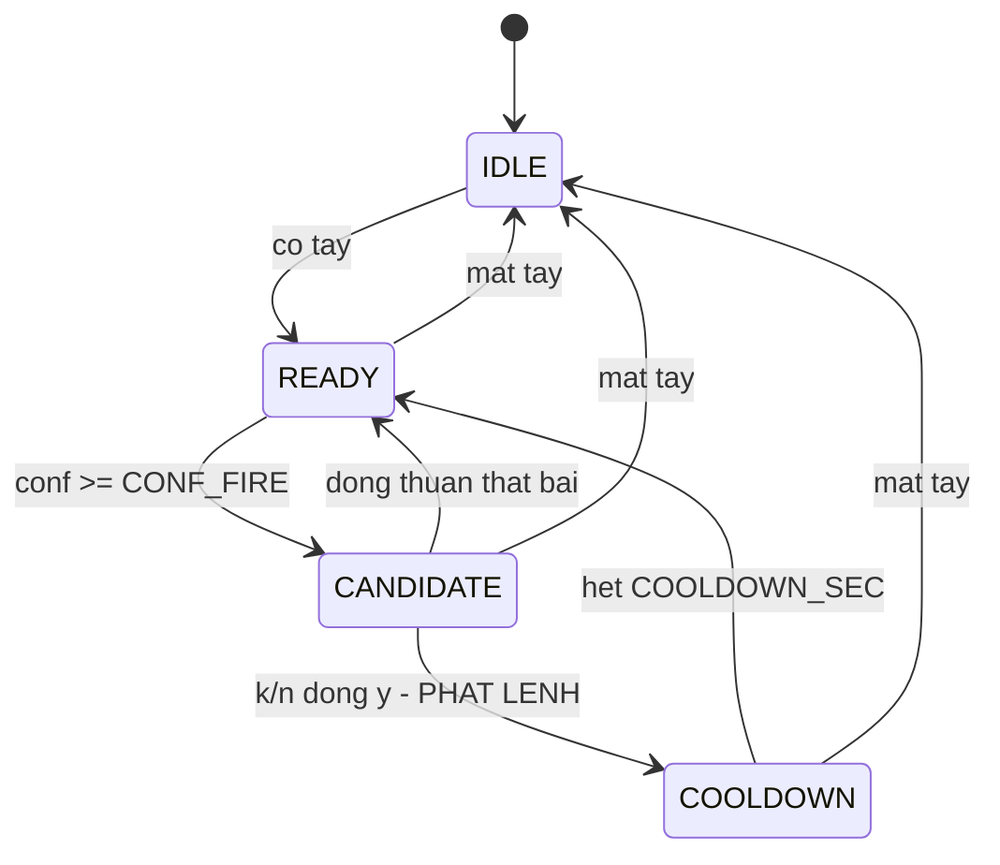

# Spec triển khai cho Claude Code

## Nhận dạng cử chỉ bàn tay thời gian thực để điều khiển máy tính

Cập nhật: 2026-09-17

## Bối cảnh và cách dùng spec này

Spec này chia phần **code** của đề tài thành 12 phase, mỗi phase có định nghĩa hoàn thành kiểm tra được bằng lệnh. Hệ thống cần xây: nhận dạng bốn cử chỉ bàn tay cộng một lớp nền từ webcam, rồi phát phím tắt điều khiển máy tính. Bốn lớp đích là `swipe_left`, `swipe_right`, `zoom_in`, `zoom_out`; lớp nền là `none`.

Nguồn chân lý về *vì sao* là bộ tài liệu tầng 1–6 và cẩm nang 22 bước trong project. Spec này chỉ nói *làm gì*, *theo thứ tự nào*, và *làm xong thì chứng minh bằng cách nào*. Khi spec mâu thuẫn với cẩm nang, cẩm nang thắng — và Claude Code phải hỏi lại thay vì tự chọn.

**Cách chạy một phase**

1. Đọc lại mục Quy ước bất di bất dịch trước khi gõ dòng code đầu tiên.
2. Chỉ viết code và kiểm thử của phase hiện tại. Không viết trước cho phase sau, không tạo file "để dành".
3. Chạy `pytest -q` và mọi lệnh trong mục Định nghĩa hoàn thành của phase.
4. Dán nguyên văn kết quả các lệnh đó vào câu trả lời, rồi **dừng** và chờ người dùng xác nhận trước khi sang phase kế tiếp.

Một phase chỉ được coi là xong khi mọi dòng trong Định nghĩa hoàn thành chạy được trên máy sạch — không phải khi code trông có vẻ đúng.

**Ranh giới công việc.** Claude Code viết code, kiểm thử, script chạy thí nghiệm và bảng kết quả. Con người quay video, chạy tám thí nghiệm quan sát, đo các hằng số quy ước, và viết báo cáo. Mục cuối tài liệu liệt kê đầy đủ các điểm bàn giao.

## Quy ước bất di bất dịch

Mười bốn luật dưới đây áp dụng cho mọi phase. Mỗi luật chặn một lỗi **im lặng** — loại lỗi không làm chương trình sập, chỉ làm kết quả sai theo cách khó truy.

| # | Luật | Vi phạm thì hỏng ra sao |
| --- | --- | --- |
| 1 | Một đường ống, ba nguồn: dữ liệu IPN, dữ liệu tự quay và webcam lúc chạy thật đi qua **cùng các hàm** trong `src/` | Kết quả offline đẹp, demo loạn, mất nhiều ngày để tìm nguyên nhân |
| 2 | `config.py` là nơi duy nhất chứa hằng số. Không hằng số nào lặp lại ở file khác | Sửa sót một chỗ, hệ thống chạy ngược đúng ở chỗ đó |
| 3 | Quy ước thì **đo**, không đoán: `SWIPE_LEFT_SIGN` và `IPN_FLIP_X` đến từ script đo, không từ trực giác | Vuốt trái thì slide chạy ngược, không có thông báo lỗi nào |
| 4 | Frame không thấy tay: ghi `NaN`, **không bỏ frame** | Trục thời gian đứt, `resample` nội suy qua khoảng trống mà không ai biết |
| 5 | Thứ tự đường ống cố định: `to_pixels` → `resample(15 Hz)` → `fill_short_gaps` → cắt cửa sổ → [tăng cường] → `normalize_window` → đặc trưng hoặc LSTM | Đổi thứ tự bất kỳ đều làm biểu diễn khác đi mà không báo lỗi |
| 6 | Gốc toạ độ = cổ tay của **frame đầu cửa sổ**; đơn vị = khoảng cách điểm 0→9 của frame đầu | Lấy gốc theo từng frame xóa sạch quỹ đạo, hai lớp vuốt biến mất |
| 7 | Cửa sổ và bước trượt tính bằng **giây**, không bằng frame | IPN 30 FPS và webcam 15 FPS cho hai tốc độ cử chỉ khác nhau |
| 8 | Chia tập **theo người**, ưu tiên split chính thức của IPN | Macro-F1 98–99% hoàn toàn giả |
| 9 | Tăng cường chỉ trên tập huấn luyện, **sau** khi chia | Mẫu gốc và bản lật rơi vào hai tập — rò rỉ |
| 10 | Nhân quả một chiều: không dùng thông tin từ tương lai ở bất kỳ khâu nào | Con số báo cáo không đạt được trong hệ thống thời gian thực |
| 11 | Ảnh đưa **vào mô hình** không lật; chỉ lật bản hiển thị cho người xem | Hệ thống chạy ngược chiều so với dữ liệu huấn luyện |
| 12 | Chỉ dùng toạ độ 2D. Không `z`, không `hand_world_landmarks` | Thêm 21 chiều nhiễu từ một ước lượng độ sâu không tin cậy |
| 13 | Tập kiểm thử chạy **đúng một lần**, ở cuối. Mọi khảo sát chạy trên tập kiểm định hoặc k-fold | Con số cuối bị thổi phồng vì đã dùng tập kiểm thử để ra quyết định |
| 14 | Mọi con số vào báo cáo phải tái tạo được bằng một lệnh ghi trong `README.md` | Không giải thích được kết quả khi bị hỏi |

**Cấm tuyệt đối.** Nếu một yêu cầu nào đó đòi hỏi các việc dưới đây, Claude Code dừng và hỏi lại:

- `train_test_split` ngẫu nhiên trên tập cửa sổ
- LSTM hai chiều, làm mượt hai phía, hay chuẩn hóa theo thống kê của cả video
- Viết cứng dấu của `dx` thay vì dùng `SWIPE_LEFT_SIGN`
- Định nghĩa lại `normalize_window` hoặc `window_features` bên trong `demo.py`
- `StandardScaler` fit trên toàn bộ dữ liệu
- `cap.set(cv2.CAP_PROP_POS_FRAMES, i)` bên trong vòng lặp đọc video
- Lưu điểm mốc ở dạng đã chuẩn hóa
- Nội suy các lỗ hổng dài hơn `MAX_GAP`
- Cân bằng lớp tới tỉ lệ 1:1
- Đường dẫn tuyệt đối, hoặc bất kỳ phụ thuộc nào vào CUDA

## Hợp đồng dữ liệu và cấu hình

Mọi phase đọc và ghi đúng các shape dưới đây. Một phase đổi schema là một phase phá vỡ hợp đồng và phải được nêu ra trước khi làm.

### `src/config.py`

| Hằng số | Giá trị khởi đầu | Ghi chú |
| --- | --- | --- |
| `CLASSES` | `["none", "swipe_left", "swipe_right", "zoom_in", "zoom_out"]` | Thứ tự cố định. `none` luôn là chỉ số 0 |
| `WRIST`, `MIDDLE_MCP` | `0`, `9` | Gốc toạ độ và đơn vị đo |
| `TIPS` | `[4, 8, 12, 16, 20]` | Năm đầu ngón |
| `HZ` | `15.0` | Lưới thời gian đều |
| `WIN_SEC`, `STRIDE_SEC` | `1.2`, `0.2` | Tính bằng giây. `T = round(WIN_SEC * HZ)` = 18 bước |
| `MAX_GAP` | `3` | Lỗ hổng dài hơn thì giữ `NaN` |
| `MIN_PRESENCE` | `0.7` | Tỉ lệ bước có tay tối thiểu của một cửa sổ |
| `LABEL_COVERAGE` | `0.6` | Ngưỡng phủ nhãn khi gán nhãn cửa sổ |
| `SWIPE_LEFT_SIGN` | `None` | **CHƯA ĐO** — chặn bằng `assert` cho tới Phase 1 |
| `IPN_FLIP_X` | `None` | **CHƯA ĐO** — chặn bằng `assert` cho tới Phase 4 |
| `CAM_W`, `CAM_H`, `CAM_FPS` | `640`, `480`, `30` | Giữ nguyên suốt dự án |
| `CONF_FIRE`, `CONF_HOLD` | `0.75`, `0.55` | Logic kích hoạt |
| `K_OF_N` | `(3, 5)` | Đồng thuận k trên n |
| `COOLDOWN_SEC` | `1.2` | Sau khi phát lệnh |
| `SEED` | `42` | Đặt cho `random`, `numpy`, `torch` |

Hai hằng số chưa đo phải làm chương trình **dừng ngay** khi được dùng: `assert SWIPE_LEFT_SIGN in (-1, 1), "Chưa đo SWIPE_LEFT_SIGN — xem Phase 1"`.

### Điểm mốc thô — `data/landmarks/<source>/<clip_id>.npz`

```
xy        float32  (N, 21, 2)   toạ độ PIXEL, NaN ở frame không thấy tay
ts        float64  (N,)         giây, tăng đơn điệu, ts[0] = 0.0
present   bool     (N,)         True nếu frame đó có tay
segments  int64    (M, 3)       [start_idx, end_idx, class_id] — đoạn đã gán nhãn
meta      str                   JSON: w, h, fps, source, subject, clip_id, flip_applied
```

`source` nhận một trong ba giá trị: `ipn`, `self`, `webcam`. Không lưu bản đã chuẩn hóa — chuẩn hóa là quyết định thiết kế có thể đổi ở Phase 8.

### Bộ cửa sổ — `data/windows/windows.npz`

```
X         float32  (N, T, 21, 2)  ĐÃ chuẩn hóa, T = 18
y         int64    (N,)           chỉ số trong CLASSES
presence  float32  (N,)           tỉ lệ bước có tay
subject   <U16     (N,)           mã người diễn
clip      <U64     (N,)           clip_id nguồn
t0        float32  (N,)           thời điểm bắt đầu cửa sổ trong clip
```

`data/splits.json` giữ danh sách mã người: `{"train": [...], "val": [...], "test": [...], "real": [...]}`. Chia tập là một phép lọc theo cột `subject`, không bao giờ là một phép chia ngẫu nhiên.

### Vector đặc trưng

Mười ba chiều, thứ tự cố định trong `FEATURE_NAMES`:

```
open_start, open_end, open_delta, open_range, open_trend,
dx, dy, max_vx, mean_vx, max_vy,
straightness, horiz_ratio, presence
```

Bốn đặc trưng **có dấu** — `open_delta`, `open_trend`, `dx`, `mean_vx` — gánh phần lớn việc phân biệt hai cặp lớp. Không đặc trưng nào được phép là `NaN`.

### Quy ước đặt tên và đầu ra

- Video tự quay: `p03_swipe_left_07.mp4`. Tên file suy ra được cả mã người lẫn nhãn.
- Mọi script nằm trong `scripts/`, dùng `argparse`, không nhận tham số qua biến toàn cục.
- Mỗi lần chạy ghi vào `results/<phase>/<tên_chạy>/` kèm `manifest.json` chứa: dòng lệnh đầy đủ, thời điểm chạy, seed, và bản sao các hằng số `config.py` đang dùng.
- Bảng kết quả xuất song song `.csv` và `.md`; hình xuất `.png` ở 150 dpi.

## Bản đồ 12 phase

Phase 0 đến 3 chạy được ngay, không cần tải IPN Hand và không cần quay video. Mốc quan trọng nhất là **Phase 3**: từ đó trở đi luôn có một hệ thống chạy được để nộp và để demo, bất kể chuyện gì xảy ra sau.

| Phase | Nội dung | Bước cẩm nang | Tuần | Sản phẩm mốc |
| --- | --- | --- | --- | --- |
| 0 | Khung dự án và `config.py` | 2 | 1 | Repo chạy `pytest` được |
| 1 | Thu nhận điểm mốc, hiệu chuẩn quy ước | 3, 4 | 1–2 | `SWIPE_LEFT_SIGN` đã đo |
| 2 | Tiền xử lý, chuẩn hóa, đặc trưng | 7, 8, 9 | 4 | Bộ kiểm thử biểu diễn xanh |
| 3 | Mô hình luật và demo v0 | 10 | 4 | **Hệ thống chạy được đầu tiên** |
| 4 | Trích điểm mốc IPN và tự quay | 11, 12 | 5 | `data/landmarks/` đầy đủ |
| 5 | Cắt cửa sổ, chia tập theo người | 13 | 5 | `windows.npz` + `splits.json` |
| 6 | Rừng ngẫu nhiên trên 13 đặc trưng | 14 | 6 | Ma trận nhầm lẫn đầu tiên |
| 7 | LSTM trên chuỗi 42 chiều | 15 | 7–8 | Đường loss + mô hình đã lưu |
| 8 | Đánh giá hai mức, bảy bảng khảo sát | 16, 17 | 8 | `results/` đủ bảng cho phần thí nghiệm |
| 9 | Logic kích hoạt — máy trạng thái | 18 | 9 | `ActivationFSM` + 5 kiểm thử |
| 10 | Demo hoàn chỉnh và đo đạc | 19, 20 | 9 | **Video demo** + bảng đánh đổi |
| 11 | Tái lập và bàn giao | 22 | 10 | Repo dựng lại từ đầu ra cùng số |

Phụ thuộc cứng: Phase 2 cần `SWIPE_LEFT_SIGN` từ Phase 1. Phase 5 cần cả IPN lẫn dữ liệu tự quay từ Phase 4. Phase 8 mức sự kiện cần `ActivationFSM` của Phase 9, nên hai phase này đan vào nhau — viết `evaluate.py` ở Phase 8 với một tham số nhận bất kỳ bộ lọc sự kiện nào, rồi nối FSM vào sau.

## Phase 0 — Khung dự án

**Mục tiêu.** Một cây thư mục cố định, một file cấu hình duy nhất và một bộ kiểm thử chạy được — trước khi có dòng code xử lý nào.

**Việc phải làm**

1. Dựng cây thư mục: `models/`, `data/{ipn,raw,landmarks,windows}/`, `src/`, `scripts/`, `tests/`, `notebooks/`, `results/`.
2. Viết `src/config.py` đủ mọi hằng số ở bảng Hợp đồng dữ liệu, kèm `ROOT = Path(__file__).resolve().parents[1]` và các đường dẫn suy ra từ `ROOT`.
3. Viết `require_measured(name)` trong `config.py`: ném `RuntimeError` kèm tên phase cần chạy nếu hằng số đó còn là `None`.
4. Viết `requirements.txt` (chưa ghim phiên bản) và ghi lệnh tạo môi trường vào `README.md` ngay bây giờ.
5. Cấu hình `pytest` với `testpaths = tests`.
6. Viết `README.md` khung: tên project, cài đặt, cách tải `hand_landmarker.task` và IPN Hand, bảng hằng số đã đo (để trống), thứ tự chạy script.

**Kiểm thử bắt buộc** — `tests/test_config.py`

```
test_classes_du_nam_lop_va_none_o_dau
test_T_la_so_nguyen_duong          # round(WIN_SEC * HZ) == 18
test_tips_du_nam_dau_ngon
test_require_measured_nem_loi       # SWIPE_LEFT_SIGN còn None
test_moi_duong_dan_deu_tuong_doi_tu_ROOT
```

**Định nghĩa hoàn thành**

- [ ] `python -c "import mediapipe, cv2, torch, sklearn"` chạy không lỗi
- [ ] `python -c "import cv2; print(cv2.VideoCapture(0).isOpened())"` in ra `True`
- [ ] `pytest -q` xanh với ít nhất năm kiểm thử
- [ ] `models/hand_landmarker.task` đã có trong `models/`
- [ ] Đọc lại toàn bộ `src/`: không file nào ngoài `config.py` chứa số ma thuật

## Phase 1 — Thu nhận điểm mốc và hiệu chuẩn quy ước

**Mục tiêu.** 21 điểm mốc bám theo bàn tay trên webcam, mỗi frame có mốc thời gian thật, và hằng số `SWIPE_LEFT_SIGN` được đo chứ không đoán.

**Việc phải làm**

1. `src/io_video.py` — `iter_frames(source)` sinh ra `(frame_bgr, ts_sec)` cho **cả** webcam lẫn file video. Webcam đọc đồng hồ thật; video suy mốc thời gian từ chỉ số frame chia FPS và đọc **tuần tự**. Đây là cửa vào duy nhất của mọi nguồn.
2. `src/hands.py` — lớp `HandTracker` bọc MediaPipe Hand Landmarker với `num_hands=1`, chế độ VIDEO. Phương thức `process(frame_bgr, ts_ms)` trả về `(xy_norm: (21,2) float32, present: bool, score: float)`. Chuyển BGR sang RGB **bên trong** lớp này. Không thấy tay thì trả về mảng `NaN` và `present=False`, không trả về `None`.
3. `scripts/live_landmarks.py` — vòng lặp webcam, vẽ điểm mốc lên **bản hiển thị đã lật**, hiện FPS trung bình và phân vị thấp, bỏ 3 giây đầu khỏi thống kê.
4. `scripts/record_csv.py` — ghi mỗi frame một dòng: `ts, present, score, w, h, x0..x20, y0..y20`. Frame mất tay vẫn có dòng, các cột toạ độ để trống.
5. `scripts/measure_swipe_sign.py` — script có hướng dẫn: đếm ngược, yêu cầu làm cử chỉ vuốt trái năm lần, tính trung vị độ dời ngang của cổ tay từ đầu tới cuối mỗi lần, in ra dấu kèm **đúng dòng cần dán** vào `config.py`. Script **không** tự sửa `config.py`.
6. `scripts/observe.py` — chạy một thí nghiệm quan sát có tên, ghi CSV vào `results/phase1/<tên>/`; kèm `scripts/analyze_observations.py` tính tỉ lệ phát hiện, độ rung đầu ngón trỏ tính bằng pixel, và độ lệch chuẩn `σ` dùng cho tăng cường nhiễu ở Phase 5.

**Kiểm thử bắt buộc**

```
test_hands_tra_ve_nan_tren_anh_den       # ảnh đen → present False, xy toàn NaN
test_iter_frames_ts_tang_don_dieu
test_hands_khong_lat_anh_dau_vao         # đọc mã nguồn: không cv2.flip trong hands.py
test_record_csv_giu_dong_khi_mat_tay
```

**Định nghĩa hoàn thành**

- [ ] `python scripts/live_landmarks.py` vẽ 21 điểm bám theo tay, có FPS trên màn hình
- [ ] CSV từ một phiên có tay ra vào khung hình: số dòng bằng số frame, các dòng mất tay vẫn còn
- [ ] `measure_swipe_sign.py` cho cùng một dấu qua ba lần chạy độc lập
- [ ] `SWIPE_LEFT_SIGN` đã điền vào `config.py`, và kiểm thử Phase 0 đổi từ "ném lỗi" sang "nhận giá trị ±1"
- [ ] `results/phase1/` có số liệu của cả tám thí nghiệm quan sát
- [ ] `pytest -q` xanh

**Con người phải làm.** Chạy `measure_swipe_sign.py` và dán kết quả vào `config.py`. Thực hiện tám thí nghiệm quan sát ở bước 6 của cẩm nang, mỗi thí nghiệm lặp ít nhất ba lần.

## Phase 2 — Tiền xử lý, chuẩn hóa và đặc trưng

**Mục tiêu.** Một đường ống biểu diễn dùng chung cho cả ba nguồn dữ liệu, kèm bộ kiểm thử chứng minh nó bất biến với những thứ cần bất biến và giữ nguyên những thứ cần giữ.

Đây là phase ngắn nhất về code và nặng nhất về hệ quả. Hàm chuẩn hóa khoảng mười dòng, nhưng ba quyết định trong nó quyết định chất lượng của mọi phase sau.

**Việc phải làm**

1. `src/preprocess.py` với đúng bốn hàm công khai, theo đúng thứ tự gọi:
    - `to_pixels(seq_norm, w, h)` — nhân `[w, h]`. Dòng đầu tiên của đường ống.
    - `resample(ts, pts, hz=HZ)` — lưới đều từ `ts[0]` tới `ts[-1]`, `np.interp` cho từng toạ độ.
    - `fill_short_gaps(x, max_gap=MAX_GAP)` — nội suy tuyến tính các đoạn `NaN` ngắn **và** có đủ hai đầu mút. Đoạn dài hơn, hoặc đoạn chạm đầu hay cuối chuỗi, giữ `NaN`.
    - `load_sequence(clip)` — gọi ba hàm trên theo đúng thứ tự. Mọi nguồn dữ liệu chỉ được vào đường ống qua hàm này.
2. `normalize_window(win)` trong cùng file — dời gốc về **cổ tay của frame đầu cửa sổ**, chia cho khoảng cách điểm 0 đến điểm 9 **của frame đầu**. Ném lỗi nếu frame đầu không có tay.
3. `src/features.py` — `openness(seq)`, `window_features(seq, presence_ratio)` trả về vector 13 chiều `float32`, và `FEATURE_NAMES` đúng thứ tự. Nhớ `np.clip` trước mọi `arccos`.
4. `tests/fixtures.py` — sinh cửa sổ tổng hợp cho kiểm thử: `make_swipe(direction)`, `make_zoom(direction)`, `make_static()`, `make_wave()`. Không kiểm thử nào được phụ thuộc vào dữ liệu thật.
5. `scripts/plot_feature_boxplots.py` — vẽ boxplot từng đặc trưng theo từng lớp. Viết ở phase này, **chạy** ở Phase 5 khi đã có dữ liệu.

**Kiểm thử bắt buộc** — đây là bộ kiểm thử quan trọng nhất của cả dự án

```
test_to_pixels_hai_truc_khac_thang
test_resample_luoi_deu_dung_1_tren_15
test_fill_va_lo_hong_2_buoc_giu_lo_hong_10_buoc
test_fill_giu_nan_o_dau_va_cuoi_chuoi
test_normalize_bat_bien_voi_tinh_tien     # dời cả cửa sổ 137 px → sai khác < 1e-5
test_normalize_bat_bien_voi_ti_le         # phóng to 1,6 lần → sai khác < 1e-5
test_normalize_giu_quy_dao                # cửa sổ vuốt → dx khác 0 rõ rệt
test_normalize_nem_loi_khi_frame_dau_mat_tay
test_flip_doi_dau_dx
test_flip_giu_nguyen_open_delta
test_zoom_in_co_open_delta_duong
test_swipe_co_straightness_tren_0_8
test_features_dung_13_chieu_va_khop_FEATURE_NAMES
test_features_khong_bao_gio_tra_ve_nan
```

**Định nghĩa hoàn thành**

- [ ] `pytest -q` xanh với đủ 14 kiểm thử trên
- [ ] Đọc lại `src/`: `resample` chỉ được gọi bên trong `load_sequence`, không nơi nào khác
- [ ] `normalize_window` chỉ xuất hiện đúng một lần trong toàn repo
- [ ] Chạy `load_sequence` trên một CSV webcam có FPS dao động: khoảng cách mốc thời gian đầu ra đều tuyệt đối
- [ ] Ghi lại tỉ lệ bước còn `NaN` sau khi vá, trên dữ liệu thử của Phase 1

## Phase 3 — Mô hình luật và demo v0

**Mục tiêu.** Một hệ thống hoàn chỉnh chạy trên webcam, phân loại bốn cử chỉ bằng vài ngưỡng — **trước khi** đụng tới học máy. Đây là mốc quản trị rủi ro: từ đây luôn có thứ để nộp.

**Việc phải làm**

1. `src/buffer.py` — lớp `TimeBuffer(win_sec, hz)` giữ các cặp `(ts, xy_pixel)` gần nhất theo **thời gian**, không theo số frame. Phương thức `window()` gọi lại `resample` và `fill_short_gaps` của Phase 2 rồi trả về `(T, 21, 2)` cùng `presence_ratio`, hoặc `None` khi chưa đủ dữ liệu.
2. `src/rules.py` — `classify(feat) -> (label, confidence)`. Ba ngưỡng `RULE_S_HI`, `RULE_DX_HI`, `RULE_O_HI` nằm trong `config.py`. Hàm dùng `SWIPE_LEFT_SIGN` để quyết chiều, không viết cứng dấu. Trả về `none` khi không mẫu hình nào thỏa.
3. `scripts/demo.py --model rules` — vòng lặp đầy đủ: `iter_frames` → `HandTracker` → `to_pixels` → `TimeBuffer` → mỗi `STRIDE_SEC` thì `normalize_window` → `window_features` → `classify` → vẽ nhãn và độ tin cậy lên bản hiển thị đã lật.
4. `--log <file>` ghi mỗi dự đoán một dòng `ts, label, confidence, presence` để đếm báo nhầm.

**Về ba ngưỡng.** Giá trị khởi đầu lấy từ một bộ hiệu chuẩn nhỏ do người dùng tự quay: mỗi cử chỉ 10 lần cộng 2 phút `none`. Sau Phase 5, chọn lại từ boxplot và ghi lý do vào `results/phase3/thresholds.md`. Không chỉnh ngưỡng bằng cách thử tới khi trông có vẻ được.

**Kiểm thử bắt buộc**

```
test_rules_tra_ve_none_khi_khong_thoa_mau_hinh_nao
test_rules_dao_khi_dao_SWIPE_LEFT_SIGN     # đảo hằng số → hai nhãn vuốt đổi chỗ
test_timebuffer_tra_ve_dung_T_buoc
test_timebuffer_tra_ve_none_khi_presence_duoi_MIN_PRESENCE
```

**Định nghĩa hoàn thành**

- [ ] `python scripts/demo.py --model rules` chạy mượt trên webcam và hiện nhãn
- [ ] Làm từng cử chỉ rõ ràng 10 lần: mỗi cử chỉ đúng ít nhất 7 lần
- [ ] Vuốt trái hiện `swipe_left`. Nếu ngược thì sửa **hằng số**, không sửa code
- [ ] Vẫy tay qua lại không sinh nhãn `swipe`
- [ ] Gõ phím 2 phút, đếm số lần báo nhầm, ghi vào `results/phase3/misfires.md` — con số này là đường cơ sở để so ở Phase 10
- [ ] Đọc lại `demo.py`: không định nghĩa lại bất kỳ hàm nào của `preprocess.py` hay `features.py`

**Không được xóa `rules.py` sau khi có rừng ngẫu nhiên.** Nó là một hàng trong bảng so sánh mô hình và là phương án dự phòng khi demo.

## Phase 4 — Trích điểm mốc và kiểm chứng quy ước hướng

**Mục tiêu.** Toàn bộ video IPN Hand và video tự quay đã thành điểm mốc trên đĩa, nhãn đã ánh xạ về năm lớp, và quy ước hướng đã được **chứng minh bằng số liệu** chứ không giả định.

**Việc phải làm**

1. `scripts/extract_landmarks.py --source {ipn,self}` — duyệt video qua `iter_frames`, chạy `HandTracker`, lưu `.npz` đúng schema. Bắt buộc: đọc tuần tự, bỏ qua clip đã có `.npz` để chạy lại được, in tiến độ, ghi clip lỗi ra `results/phase4/failed.txt`. Đây là bước tốn thời gian nhất của cả project — thiết kế để chạy qua đêm.
2. `src/ipn.py` — đọc file nhãn chính thức của IPN, ánh xạ về năm lớp. Hất trái, hất phải, xòe, chụm và không-cử-chỉ ánh xạ thẳng; **mọi lớp cử chỉ còn lại ánh xạ về `none`** và trở thành mẫu âm khó.
3. Bổ sung vào `.npz` một mảng `src_labels` `(M,)` giữ nhãn gốc của nguồn. Phase 8 cần nó để trả lời câu hỏi "*loại* `none` nào bị nhận nhầm", không chỉ "`none` bị nhận nhầm bao nhiêu lần".
4. `scripts/verify_direction.py` — với mọi mẫu lớp hất trái của IPN, tính độ dời ngang của cổ tay từ đầu tới cuối cử chỉ, lấy trung vị theo lớp, so dấu với `SWIPE_LEFT_SIGN`. In kết luận và giá trị `IPN_FLIP_X` cần đặt. Ghi bằng chứng kèm số liệu vào `results/phase4/direction.md`.
5. Áp dụng `IPN_FLIP_X` ở **đúng một chỗ**: trong loader, ngay sau `to_pixels`, đổi `x` thành `w - x` khi cờ bật. Không rải phép lật ra nơi khác.
6. `scripts/dataset_stats.py` — bảng số clip, số frame, tỉ lệ frame mất tay, số đoạn theo lớp và theo người, tách riêng hai nguồn.

**Kiểm thử bắt buộc**

```
test_anh_xa_nhan_ipn_phu_het_moi_lop_goc   # không lớp IPN nào rơi ra ngoài bảng
test_lat_x_hai_lan_bang_khong_lat
test_npz_dung_schema                        # shape, dtype, ts đơn điệu tăng
test_extract_bo_qua_clip_da_co
```

**Định nghĩa hoàn thành**

- [ ] `data/landmarks/ipn/` có `.npz` cho mọi video IPN; số clip khớp với file nhãn gốc
- [ ] `data/landmarks/self/` có `.npz` cho toàn bộ video tự quay
- [ ] `verify_direction.py` cho kết luận dứt khoát; `IPN_FLIP_X` đã điền vào `config.py`
- [ ] Đã mở bằng mắt ít nhất hai video mỗi lớp IPN và xác nhận tên lớp khớp với hình dung — đặc biệt là xòe và chụm
- [ ] `dataset_stats.py` xuất bảng `.csv` và `.md`, có dòng "X% số bước bị thiếu do không phát hiện được bàn tay"
- [ ] Tỉ lệ mất tay của IPN và của dữ liệu tự quay được báo cáo **riêng**

**Con người phải làm.** Tải và giải nén IPN Hand. Quay dữ liệu tự quay theo giao thức ở bước 12 của cẩm nang — đặc biệt là lớp `none` với đủ bảy nhóm, trong đó có gõ phím, khua tay khi nói, vẫy tay, và hất dọc. Dữ liệu tự quay **không** vào tập huấn luyện.

## Phase 5 — Cửa sổ, tăng cường và chia tập theo người

**Mục tiêu.** Một tập mẫu kích thước cố định `(N, 18, 21, 2)` kèm nhãn, chia theo người, sẵn sàng cho cả ba mô hình — cộng bằng chứng trực quan rằng thiết kế đặc trưng hoạt động.

**Việc phải làm**

1. `src/windows.py` — `cut_windows(...)` cắt cửa sổ theo `WIN_SEC` và `STRIDE_SEC`, **trong phạm vi từng clip**. Nhãn cửa sổ là lớp phủ ít nhất `LABEL_COVERAGE` số bước; không lớp nào đạt thì nhãn là `none`. Loại cửa sổ có `presence_ratio < MIN_PRESENCE` hoặc bước đầu không có tay.
2. `src/augment.py` — năm phép, mỗi phép trả lời câu hỏi "biến đổi này có làm đổi lớp không":

| Phép | Tham số | Đổi nhãn? |
| --- | --- | --- |
| Lật ngang | — | **Có** với cặp vuốt, **không** với cặp zoom |
| Co giãn | ±10% | Không |
| Xoay nhẹ | ±10° | Không |
| Co giãn thời gian | 0,8–1,2× rồi nội suy về đúng `T` | Không |
| Nhiễu Gauss | `σ` đo ở Phase 1 | Không |
| Xóa bước ngẫu nhiên | 1–3 bước rồi `fill_short_gaps` | Không |

3. `scripts/make_splits.py` — dựng `splits.json` theo người, **ưu tiên split chính thức của IPN**. Toàn bộ dữ liệu tự quay vào nhóm `real`, không bao giờ vào `train`.
4. `scripts/build_dataset.py` — cắt cửa sổ, `normalize_window`, lấy mẫu con lớp `none` xuống còn 40–50% tập huấn luyện. Dùng `src_labels` để **giữ lại toàn bộ mẫu âm khó**, chỉ bỏ bớt phần tay đứng yên trùng lặp. Xuất `windows.npz` và bảng thống kê trước/sau.
5. Chạy `scripts/plot_feature_boxplots.py` viết ở Phase 2.

**Kiểm thử bắt buộc**

```
test_khong_ma_nguoi_nao_xuat_hien_o_hai_tap   # phép giao in ra tập rỗng
test_cua_so_khong_bac_cau_qua_hai_clip
test_gan_nhan_theo_nguong_phu_60_phan_tram
test_flip_doi_nhan_cap_vuot_va_giu_nhan_cap_zoom
test_tang_cuong_khong_cham_vao_val_va_test
test_shape_X_dung_N_18_21_2
```

**Cổng kiểm tra — ba hình boxplot.** Đây là chỗ dừng bắt buộc của phase này:

- `open_delta`: hộp `zoom_in` nằm hẳn bên dương, hộp `zoom_out` nằm hẳn bên âm, hai hộp gần như không chồng nhau.
- `dx`: hai hộp của hai lớp vuốt nằm ở hai phía của số 0.
- `straightness`: hộp của hai lớp vuốt cao hơn hẳn hộp của lớp `none`.

Nếu ba hình không như mô tả, **dừng lại và quay về Phase 2**. Không mô hình nào cứu được đặc trưng không tách lớp, và phát hiện lỗi ở đây rẻ hơn rất nhiều so với phát hiện nó ở Phase 8.

**Định nghĩa hoàn thành**

- [ ] `windows.npz` đúng schema, nạp trong dưới một giây
- [ ] Phép giao mã người giữa `train`, `val`, `test` in ra tập rỗng
- [ ] Bảng số cửa sổ theo lớp và theo tập, trước và sau lấy mẫu con
- [ ] Lớp `none` chiếm 40–50% tập huấn luyện, không phải 1:1
- [ ] Ba hình boxplot đạt mô tả ở cổng kiểm tra
- [ ] Vẽ quỹ đạo cổ tay và đường độ xòe cho một cửa sổ ngẫu nhiên mỗi lớp, xem bằng mắt là đúng cử chỉ mang nhãn đó
- [ ] Đã chốt lại ba ngưỡng của `rules.py` từ boxplot, ghi lý do vào `results/phase3/thresholds.md`

## Phase 6 — Rừng ngẫu nhiên trên 13 đặc trưng

**Mục tiêu.** Mô hình học máy đầu tiên, cùng bằng chứng thực nghiệm rằng thiết kế đặc trưng ở Phase 2 là đúng.

**Việc phải làm**

1. `scripts/train_rf.py` — nén mỗi cửa sổ thành vector 13 chiều, huấn luyện `RandomForestClassifier(n_estimators=300, class_weight="balanced_subsample", random_state=SEED)`. Không dùng `StandardScaler`: rừng ngẫu nhiên không cần, nên cách an toàn nhất là bỏ hẳn.
2. Đánh giá **trên tập kiểm định**: macro-F1, `classification_report` đầy đủ, ma trận nhầm lẫn cả dạng thô lẫn chuẩn hóa theo hàng.
3. Hai đường cơ sở bắt buộc in cùng bảng: đoán ngẫu nhiên đều (20%) và luôn đoán `none`.
4. Vẽ biểu đồ `feature_importances_`, rồi chạy `permutation_importance` trên tập kiểm định và **so sánh hai bảng xếp hạng** — nêu được khác biệt giữa hai cách đo là một điểm cộng trong báo cáo.
5. `scripts/evaluate.py --split test` phải **từ chối chạy** trừ khi có cờ `--final`, và khi chạy thì ghi một dòng vào `results/TEST_USED.log` kèm thời điểm và cấu hình đã dùng. Đây là cơ chế kỹ thuật cho luật 13.
6. Ghi giả thuyết bằng lời cho từng ô lớn ngoài đường chéo vào `results/phase6/notes.md`.

**Cổng kiểm tra**

| Điều kiện | Ý nghĩa | Phải làm gì |
| --- | --- | --- |
| Macro-F1 không cao hơn hẳn `rules.py` | Lỗi nằm trong đường ống, không nằm ở mô hình | Dừng, quay về Phase 2 và 5 |
| Macro-F1 trên 0,97 | Gần như chắc chắn có rò rỉ | Dừng, kiểm tra lại `splits.json` |
| Ba đặc trưng đầu bảng không phải `open_delta`, `dx`, `straightness` | Chưa hẳn sai, nhưng phải giải thích được | Viết giải thích trước khi đi tiếp |

**Định nghĩa hoàn thành**

- [ ] `results/phase6/` có mô hình đã lưu, `classification_report`, hai dạng ma trận nhầm lẫn
- [ ] Hai biểu đồ độ quan trọng đặc trưng, đặt cạnh nhau, kèm một đoạn so sánh
- [ ] Bảng đối chiếu: đặc trưng nào bạn dự đoán quan trọng, đặc trưng nào thực sự đứng đầu. Nếu một đặc trưng kỳ vọng lại vô dụng thì **viết ra** — đó là kết quả, không phải thất bại
- [ ] Ít nhất hai ô ngoài đường chéo có phân tích bằng lời
- [ ] `results/TEST_USED.log` vẫn trống

## Phase 7 — LSTM trên chuỗi 42 chiều

**Mục tiêu.** Một mô hình học sâu đọc thẳng chuỗi toạ độ đã chuẩn hóa, kèm đường loss chứng minh bạn kiểm soát được quá khớp và một so sánh trung thực với hai mô hình trước.

**Việc phải làm**

1. `src/datasets.py` — `WindowDataset` trả về tensor `(T, 42)`, tức `(T, 21, 2)` được `reshape`. Tăng cường nhận qua tham số và chỉ bật cho tập huấn luyện, tạo mới **mỗi epoch**.
2. `src/models.py` — `LSTMClassifier(input_size=42, hidden=128, num_layers=2, dropout=0.3, bidirectional=False, pooling="last", n_classes=5)`. `bidirectional` phải là tham số **cố định `False`**, không phải tuỳ chọn người dùng đặt được.
3. `scripts/train_lstm.py` — Adam, `CrossEntropyLoss` có trọng số lớp, dừng sớm theo macro-F1 tập kiểm định, lưu checkpoint tốt nhất, vẽ đường loss của cả tập huấn luyện và tập kiểm định trên một hình.
4. Cố định seed ở ba chỗ: `random`, `numpy`, `torch`. Ghi seed vào `manifest.json` của mỗi lần chạy.
5. Chạy trên CPU. Không thêm bất kỳ phụ thuộc CUDA nào.

**Kiểm thử bắt buộc**

```
test_model_khong_bao_gio_bidirectional     # assert model.lstm.bidirectional is False
test_dau_vao_dung_42_chieu
test_augment_chi_bat_o_tap_train
test_overfit_10_mau                        # 10 mẫu, 200 epoch → gần 100%
```

Kiểm thử cuối là phép thử vòng huấn luyện: nếu mô hình **không** học thuộc nổi mười mẫu thì lỗi nằm ở vòng huấn luyện chứ không ở dữ liệu, và mọi kết quả sau đó đều vô nghĩa.

**Định nghĩa hoàn thành**

- [ ] Checkpoint tốt nhất đã lưu kèm epoch và macro-F1 tập kiểm định
- [ ] Đường loss cho thấy rõ điểm bắt đầu quá khớp
- [ ] Bảng một hàng mỗi mô hình — luật, rừng ngẫu nhiên, LSTM — trên **cùng** tập kiểm định
- [ ] `test_overfit_10_mau` xanh
- [ ] `results/TEST_USED.log` vẫn trống

**Nếu LSTM không thắng rừng ngẫu nhiên.** Chuyện này hoàn toàn có thể xảy ra với vài nghìn mẫu, và **nó không phải thất bại**. Ghi kết quả đúng như nó là, rồi viết một đoạn giải thích: học sâu cần dữ liệu lớn mới phát huy, còn đặc trưng thủ công tốt đã mã hóa sẵn kiến thức về bài toán. Không được giấu hàng này khỏi bảng.

## Phase 8 — Đánh giá hai mức và bảy bảng khảo sát

**Mục tiêu.** Hai mức đo — mức cửa sổ và mức sự kiện — cộng bảy bảng đủ làm phần thí nghiệm của báo cáo. Hai mức có thể cho hai kết luận ngược nhau, nên phải báo cáo cả hai.

**Việc phải làm**

1. `src/evaluate.py`, mức cửa sổ: macro-F1, precision/recall/F1 từng lớp, ma trận nhầm lẫn thô và chuẩn hóa theo hàng, hai đường cơ sở, ma trận nhầm lẫn dạng hình nhiệt **có số trong từng ô**.
2. Mức sự kiện: chạy hệ thống hoàn chỉnh trên video kiểm thử liên tục, so chuỗi lệnh phát ra với chuỗi cử chỉ thật.
    - **TP** — một lệnh đúng loại, phát trong dung sai ±1 giây kể từ lúc cử chỉ kết thúc.
    - **FP** — một lệnh không khớp cử chỉ thật nào, **gồm cả lệnh thứ hai cho cùng một cử chỉ**.
    - **FN** — một cử chỉ thật không có lệnh nào khớp.
    - Thêm hai chỉ số: **số lệnh trên một cử chỉ** (lý tưởng 1,0) và **tỉ lệ kích hoạt nhầm mỗi phút**.
3. `evaluate.py` nhận bộ lọc sự kiện qua tham số, để Phase 9 nối `ActivationFSM` vào mà không sửa lại file này.
4. Dùng `src_labels` để phân tích *loại* `none` nào bị nhận nhầm, không chỉ đếm tổng.
5. `scripts/run_experiments.py` sinh bảy bảng, mỗi bảng ra `.csv` và `.md`:

| # | Bảng | Điều đáng tìm |
| --- | --- | --- |
| 1 | So sánh ba mô hình — phải có `rules.py` làm đường cơ sở | LSTM có thực sự thêm được gì |
| 2 | Thí nghiệm chuẩn hóa: gốc từng frame so với gốc frame đầu | Dự đoán: gốc từng frame làm F1 hai lớp vuốt sập; báo cáo **F1 riêng từng lớp**, không chỉ macro |
| 3 | Độ dài cửa sổ 0,8 / 1,2 / 1,6 giây | Độ dài tối ưu có thể khác nhau giữa cặp vuốt và cặp zoom |
| 4 | Cách chia tập: ngẫu nhiên theo cửa sổ / theo người / tập tự quay | Hai khoảng cách, và lời giải thích cho từng khoảng cách |
| 5 | Loại bỏ đặc trưng: đủ 13 / bỏ nhóm có dấu / bỏ `straightness` / bỏ `presence` / thêm góc khớp | Dự đoán: bỏ nhóm có dấu làm hai cặp lớp sập hoàn toàn |
| 6 | Năm seed, trung bình ± độ lệch chuẩn | Chênh lệch nhỏ hơn độ lệch chuẩn thì không kết luận được gì |
| 7 | k-fold theo nhóm người, 5 fold mỗi fold 10 người | Hệ thống hoạt động khác nhau tới đâu tuỳ người |

Bảng 2 là bảng quan trọng nhất về mặt học thuật. Bảng 4 chứa hai con số hiếm thấy trong một project môn học: khoảng cách do rò rỉ, và khoảng cách giữa bộ dữ liệu chuẩn với điều kiện triển khai thật.

6. Các hàng rẻ, mỗi hàng một dòng trong bảng phụ: 21 điểm so với 11 điểm rút gọn, GRU thay LSTM, `hidden` 64 so với 128, cách gộp cuối/trung bình/cực đại, có so với không tăng cường, ngưỡng phủ nhãn 40/60/80%, và chỉ IPN so với IPN cộng dữ liệu tự quay trong tập huấn luyện.
7. `run_experiments.py` tự in cụm từ **"không đủ bằng chứng để kết luận"** bên cạnh mọi so sánh có chênh lệch nhỏ hơn độ lệch chuẩn. Đây là luật của script, không phải lựa chọn lúc viết báo cáo.

**Định nghĩa hoàn thành**

- [ ] Cả bảy bảng có mặt trong `results/phase8/`, mỗi bảng kèm ít nhất một câu diễn giải
- [ ] Ma trận nhầm lẫn dạng hình nhiệt, có số trong ô, cho cả ba mô hình
- [ ] Ít nhất hai ô ngoài đường chéo có phân tích bằng lời, kèm giả thuyết kiểm chứng được
- [ ] Bảng 4 có cả ba hàng và có đoạn giải thích hai khoảng cách
- [ ] Đã chạy vòng cải tiến ít nhất một lần: đọc ô lớn nhất ngoài đường chéo, thêm hoặc sửa một đặc trưng, chạy lại, xem ô đó có nhỏ đi
- [ ] Mọi khảo sát chạy trên tập kiểm định hoặc k-fold; `results/TEST_USED.log` vẫn trống cho tới lần chạy cuối

## Phase 9 — Logic kích hoạt

**Mục tiêu.** Một tầng logic biến chuỗi nhãn liên tục thành **chuỗi sự kiện rời rạc**: mỗi cử chỉ thật phát ra đúng một lệnh, và những lúc còn lại không phát gì.

Bốn vấn đề mà tầng này giải — một cử chỉ sinh nhiều cửa sổ, nhãn nhấp nháy, cửa sổ chuyển tiếp, và không có cách hủy — **không vấn đề nào sửa được bằng cách huấn luyện mô hình tốt hơn**.

**Việc phải làm**

1. `src/activation.py` — lớp `ActivationFSM` với một phương thức duy nhất: `update(label, confidence, presence, ts) -> command | None`.
2. Năm cơ chế, tham số lấy từ `config.py`: ngưỡng tin cậy `CONF_FIRE`; đồng thuận `K_OF_N`; `COOLDOWN_SEC` sau khi phát lệnh; trễ với `CONF_HOLD < CONF_FIRE`; và hạ tay xuống xóa sạch trạng thái.
3. Toàn bộ trạng thái nằm **bên trong** lớp, không biến toàn cục — Phase 8 cần khởi tạo lại một bản sạch cho mỗi video kiểm thử.
4. Ghi mọi chuyển trạng thái ra file log khi chạy demo.



Ba mũi tên về `IDLE` là cơ chế thứ năm: với camera laptop, tay đặt trên bàn phím nằm dưới mép dưới khung hình nên không phát hiện được. Đề tài biến hạn chế đó thành **thao tác hủy tự nhiên** — người dùng học được trong ba giây mà không cần ai dạy.

**Kiểm thử bắt buộc** — logic thuần, không cần camera, nên kiểm thử rất rẻ

```
test_mot_cu_chi_mot_lenh      # 8 cửa sổ swipe_left liên tiếp → đúng 1 lệnh
test_nhan_nhay_khong_phat     # swipe, none, swipe, none, swipe → 0 lệnh
test_cooldown                 # hai cụm cách nhau 0,5 s → 1 lệnh
test_ha_tay_xoa_trang_thai    # 2 cửa sổ swipe, mất tay, 2 cửa sổ swipe → 0 lệnh
test_nguong_tin_cay           # 5 cửa sổ conf 0,6 với CONF_FIRE 0,75 → 0 lệnh
```

**Định nghĩa hoàn thành**

- [ ] Năm kiểm thử trên xanh
- [ ] `evaluate.py --events` chạy được với FSM và cho ra F1 mức sự kiện, số lệnh trên một cử chỉ, tỉ lệ kích hoạt nhầm
- [ ] Số lệnh trên một cử chỉ trên video kiểm thử nằm trong khoảng 0,9–1,1
- [ ] Bảng 1 của Phase 8 đã có cột F1 mức sự kiện cho cả ba mô hình

**Đánh đổi phải ghi lại.** Nâng `MIN_PRESENCE` để chống kích hoạt nhầm đồng thời làm **bỏ sót đúng những cú vuốt nhanh** mà bạn muốn bắt, vì cửa sổ vuốt nhanh chính là cửa sổ hay mất tay nhất. Ghi số liệu của đánh đổi này vào `results/phase9/tradeoff.md` — nó là một trong những đoạn hay nhất của phần thảo luận.

## Phase 10 — Demo hoàn chỉnh và đo đạc

**Mục tiêu.** Một chương trình thời gian thực phát phím tắt thật, cộng số liệu định lượng cho chữ "thời gian thực" trong tên đề tài. Phần đo đạc là **bắt buộc**, không phải tuỳ chọn.

**Việc phải làm**

1. `scripts/demo.py --model {rules,rf,lstm}` — chọn mô hình bằng tham số dòng lệnh, để Phase 10 so cả ba trong cùng điều kiện.
2. Nối `ActivationFSM` vào sau mô hình. Giao diện hiển thị: nhãn hiện tại, độ tin cậy, trạng thái FSM, `presence_ratio`, FPS, và cờ điều khiển đang bật hay tắt.
3. Ánh xạ lệnh qua `pyautogui`: `swipe_left` → slide trước, `swipe_right` → slide sau, `zoom_in` → phóng to, `zoom_out` → thu nhỏ. Có phím bật/tắt điều khiển, và **mặc định là tắt** — không ai muốn một chương trình vừa chạy đã bắt đầu gõ phím hộ.
4. `scripts/bench.py` sinh năm nhóm số liệu:
    - **FPS** — bỏ 3 giây đầu, đo trên ít nhất 30 giây, báo cả trung bình và phân vị thấp, cho cả ba mô hình và hai mức ánh sáng.
    - **Phân rã thời gian** — chuyển màu / MediaPipe / chuẩn hóa và đặc trưng / mô hình / vẽ, tính phần trăm. Kết quả điển hình: MediaPipe chiếm 80–90%.
    - **Độ trễ bốn thành phần** — độ trễ cửa sổ, độ trễ dự đoán, độ trễ đồng thuận, độ trễ xử lý; tổng dự kiến tới khoảng 2 giây.
    - **Kích hoạt nhầm mỗi phút** ở ba kịch bản riêng: ngồi yên đọc tài liệu, gõ phím và dùng chuột, và **nói chuyện có khua tay** — kịch bản khó nhất, và là kịch bản hệ thống sẽ gặp khi demo trên lớp.
    - **Số lệnh trên một cử chỉ** — làm 20 cử chỉ đã đếm, chia số lệnh cho 20.
5. Bảng đánh đổi chính, ba hàng: `CONF_FIRE` 0,60 với k/n 2/5; 0,75 với 3/5; 0,85 với 4/5. Mỗi hàng ba cột: F1 mức sự kiện, kích hoạt nhầm mỗi phút, độ trễ.
6. Chọn cấu hình cuối cùng **dựa trên bảng đó** và ghi lý do vào `results/phase10/final_config.md`. Ghi cấu hình máy vào chú thích mọi bảng tốc độ.

**Kiểm thử bắt buộc**

```
test_dieu_khien_mac_dinh_tat
test_demo_import_ham_chung          # demo.py không tự định nghĩa normalize hay features
test_fps_bo_qua_ba_giay_dau
```

**Định nghĩa hoàn thành**

- [ ] Làm cử chỉ vuốt trái: slide đi **đúng chiều**
- [ ] Làm một cử chỉ: **đúng một lệnh** được phát
- [ ] Đưa tay ra khỏi khung rồi vào lại: trạng thái về `IDLE` rồi `READY`, không có lệnh lạ
- [ ] Tổng phần trăm phân rã thời gian cộng lại xấp xỉ 100%
- [ ] Ba con số kích hoạt nhầm **tăng dần** theo độ khó kịch bản. Nếu kịch bản nói chuyện không tệ hơn kịch bản ngồi yên thì phép đo sai
- [ ] Số lệnh trên một cử chỉ trong khoảng 0,9–1,1
- [ ] Đo lại lần hai cho kết quả gần giống lần một
- [ ] Có **video demo hoàn chỉnh**, kèm ghi chú các trường hợp hệ thống làm sai

**Con người phải làm.** Chạy ba kịch bản 10 phút. Đo độ trễ thủ công: quay video có cả khung hình webcam và ứng dụng bị điều khiển, xem lại từng frame, ghi frame cử chỉ kết thúc và frame lệnh phát ra, lặp 10 lần mỗi cử chỉ. Ghi video demo.

## Phase 11 — Tái lập và bàn giao

**Mục tiêu.** Người khác — hoặc chính bạn sáu tháng sau — dựng lại môi trường từ `README.md` và chạy ra **cùng những con số** trong báo cáo.

**Việc phải làm**

1. `README.md` hoàn chỉnh: mô tả đề tài, lệnh cài môi trường, cách tải `hand_landmarker.task` và IPN Hand, cấu hình camera đã dùng, **giá trị của `SWIPE_LEFT_SIGN` và `IPN_FLIP_X` kèm cách đo chúng**, thứ tự chạy script, seed, và cấu hình máy đã đo tốc độ.
2. `requirements.txt` với số phiên bản cụ thể cho mọi gói.
3. `scripts/run_all.py` — chạy lại toàn bộ đường ống bằng một lệnh: điểm mốc → cửa sổ → ba mô hình → bảng kết quả. Mỗi bước bỏ qua được nếu đầu ra đã tồn tại.
4. Dọn code: xóa file nháp, gom mọi hằng số còn sót về `config.py`, bỏ hết đường dẫn tuyệt đối.
5. Chạy lại **toàn bộ** `tests/`, đặc biệt là kiểm thử `flip` và kiểm thử máy trạng thái.

**Định nghĩa hoàn thành**

- [ ] `pytest -q` xanh toàn bộ
- [ ] `python scripts/run_all.py` chạy từ đầu tới bảng kết quả, không lỗi
- [ ] Tìm đường dẫn tuyệt đối trong `src/` và `scripts/`: không còn dòng nào
- [ ] Mọi gói trong `requirements.txt` đều có `==`
- [ ] `README.md` có bảng hằng số đã đo, mỗi hằng số kèm một câu về cách đo
- [ ] `results/TEST_USED.log` có **đúng một** dòng
- [ ] **Phép thử tái lập:** xóa môi trường conda, tạo lại từ đầu đúng theo `README.md`, chạy `run_all.py`, và các con số khớp trong phạm vi độ lệch chuẩn đã báo cáo

Làm phép thử tái lập **trước** tuần cuối. Nếu để tới tuần 10 mà nó thất bại thì không còn thời gian sửa.

**Con người phải làm.** Viết báo cáo, chuẩn bị slide, tập trả lời 12 câu hỏi ở bước 22 của cẩm nang, và luôn có video demo dự phòng.

## Cổng chất lượng và tiêu chí dừng

Claude Code **dừng lại và báo người dùng** khi gặp bất kỳ hiện tượng nào dưới đây, thay vì đi tiếp hoặc tự nới điều kiện.

| Hiện tượng | Nghĩa là gì | Phải làm gì |
| --- | --- | --- |
| Macro-F1 trên 0,97 | Gần như chắc chắn rò rỉ dữ liệu | Dừng, kiểm tra `splits.json` và cách cắt cửa sổ |
| Ba hình boxplot không tách lớp | Lỗi ở chuẩn hóa hoặc đặc trưng | Dừng, quay về Phase 2. Không huấn luyện mô hình nào |
| Rừng ngẫu nhiên không cao hơn hẳn `rules.py` | Lỗi trong đường ống, không phải ở mô hình | Dừng, kiểm tra Phase 2 và 5 |
| LSTM không học thuộc nổi 10 mẫu | Lỗi vòng huấn luyện | Dừng, sửa vòng huấn luyện trước mọi thứ khác |
| Vuốt trái cho ra `swipe_right` | Quy ước dấu | Sửa **hằng số**, không sửa code |
| MediaPipe không phát hiện được tay | Ảnh vào là BGR thay vì RGB | `cv2.cvtColor` trong `hands.py` |
| Demo tệ hơn rõ rệt so với kết quả offline | Có hai bản chuẩn hóa "gần giống nhau" | Gộp về một hàm duy nhất trong `src/` |
| Kích hoạt nhầm khi nói chuyện không tệ hơn khi ngồi yên | Phép đo sai | Đo lại, đừng báo cáo con số đó |
| Số lệnh trên một cử chỉ lớn hơn 1,1 | Cooldown hoặc đồng thuận chưa đủ | Chỉnh theo bảng đánh đổi, không theo cảm giác |
| Một yêu cầu đòi vi phạm luật ở mục Quy ước | Có thể người dùng chưa thấy hệ quả | Dừng, nêu hệ quả, chờ xác nhận |
| Hai phương án thiết kế đều hợp lý | Đây là quyết định của người dùng | Hỏi, không tự chọn |

Ba việc Claude Code **không bao giờ** tự làm: nới một điều kiện trong Định nghĩa hoàn thành, bỏ hoặc vô hiệu một kiểm thử để phase được coi là xong, và chạy tập kiểm thử ngoài lần chạy cuối cùng.

## Việc con người phải tự làm

Mười bốn việc dưới đây không giao được cho Claude Code. Mỗi việc có một **điểm bàn giao** — thứ phải tồn tại trên đĩa hoặc trong `config.py` để phase tiếp tục chạy được.

| Việc | Phase | Điểm bàn giao |
| --- | --- | --- |
| Cài môi trường conda, tải `hand_landmarker.task` | 0 | File `.task` nằm trong `models/` |
| Đo `SWIPE_LEFT_SIGN` bằng script hướng dẫn | 1 | Giá trị ±1 đã điền vào `config.py` |
| Tám thí nghiệm quan sát, mỗi thí nghiệm ba lần | 1 | CSV trong `results/phase1/` và `σ` độ rung đã đo |
| Quay bộ hiệu chuẩn nhỏ: mỗi cử chỉ 10 lần, 2 phút `none` | 3 | Video trong `data/raw/calib/` |
| Thử demo v0: 10 lần mỗi cử chỉ, 2 phút gõ phím | 3 | `results/phase3/misfires.md` |
| Tải và giải nén IPN Hand | 4 | `data/ipn/` có video và file nhãn |
| Xem bằng mắt hai video mỗi lớp IPN | 4 | Một dòng xác nhận tên lớp khớp hình dung, đặc biệt xòe và chụm |
| Quay dữ liệu tự quay theo giao thức bước 12 | 4 | `data/raw/` đúng quy ước tên `p03_swipe_left_07.mp4` |
| Quay lớp `none` ít nhất bằng tổng bốn lớp kia, đủ bảy nhóm | 4 | Bảng phân nhóm lớp `none` |
| Xem quỹ đạo một cửa sổ ngẫu nhiên mỗi lớp | 5 | Một dòng xác nhận cửa sổ đúng là cử chỉ mang nhãn đó |
| Ba kịch bản 10 phút đo kích hoạt nhầm | 10 | Ba con số trong `results/phase10/` |
| Đo độ trễ thủ công, xem lại từng frame, 10 lần mỗi cử chỉ | 10 | Bảng độ trễ trung bình và độ lệch chuẩn |
| Ghi video demo hoàn chỉnh | 10 | File video, kèm ghi chú các ca hệ thống làm sai |
| Phép thử tái lập: xóa môi trường, dựng lại theo README | 11 | Các con số khớp trong phạm vi độ lệch chuẩn |

Hai việc chạy song song suốt dự án và cũng thuộc về con người: **ghi chú lý thuyết từ tuần 2** (để không phải viết cả báo cáo trong tuần 10), và **viết báo cáo** cộng slide cộng bản trả lời 12 câu hỏi ở bước 22.

Khi hoàn thành một việc, nói rõ với Claude Code việc nào đã xong. Claude Code không được giả định một điểm bàn giao đã có nếu chưa kiểm tra được sự tồn tại của nó trên đĩa.
