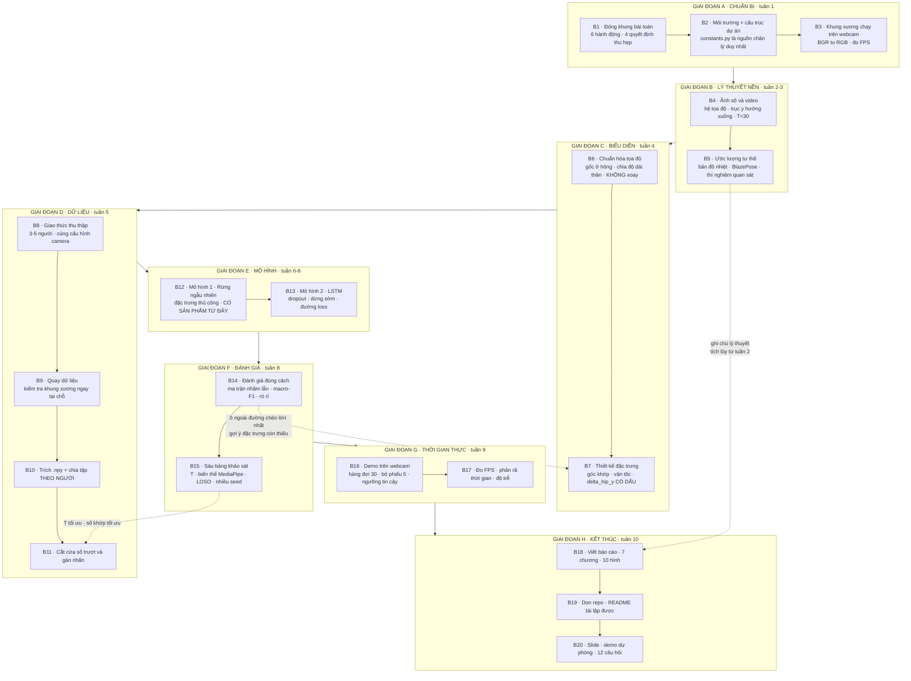

# Cẩm nang thực hiện từng bước
## Nhận dạng hành động người thời gian thực dựa trên ước lượng tư thế

> **Tài liệu này là gì.** Đề cương 10 tuần cho bạn biết *cần làm gì*. Năm tài
> liệu tầng 1–5 cho bạn biết *vì sao*. Tài liệu này ghép hai thứ đó lại thành
> một chuỗi **20 bước tuần tự**: mỗi bước nói rõ phải hiểu gì trước khi làm,
> làm gì, làm xong thì kiểm chứng bằng cách nào, và nộp ra sản phẩm gì.
>
> Đọc theo thứ tự. Mỗi bước giả định các bước trước đã xong.

---

## 0. Cách dùng tài liệu này

### 0.1. Cấu trúc một bước

Mỗi bước có sáu mục cố định:

| Mục | Ý nghĩa |
|---|---|
| **Mục tiêu** | Một câu: sau bước này bạn có gì mà trước đó chưa có |
| **Lý thuyết cần nắm** | Khái niệm phải hiểu *trước khi* gõ dòng code đầu tiên |
| **Việc cụ thể** | Danh sách hành động, theo thứ tự |
| **Kiểm chứng** | Cách tự chứng minh bước này làm đúng — không có bước này thì lỗi âm thầm tích lũy |
| **Sản phẩm** | Thứ để lại cho báo cáo hoặc cho bước sau |
| **Cạm bẫy** | Lỗi phổ biến ở đúng bước này |

### 0.2. Bản đồ: 20 bước ↔ 5 tầng lý thuyết ↔ 10 tuần

| Bước | Nội dung | Tầng lý thuyết | Tuần |
|---|---|---|---|
| 1 | Đóng khung bài toán và chốt phạm vi | — | 1 |
| 2 | Dựng môi trường và cấu trúc dự án | 0 | 1 |
| 3 | Khung xương chạy được trên webcam | 1, 2 | 1 |
| 4 | Ảnh số và video | 1 | 2 |
| 5 | Ước lượng tư thế: lý thuyết và quan sát | 2 | 3 |
| 6 | Chuẩn hóa tọa độ khung xương | 3 | 4 |
| 7 | Thiết kế đặc trưng | 3 | 4 |
| 8 | Thiết kế giao thức thu thập dữ liệu | 5 | 4–5 |
| 9 | Quay dữ liệu | — | 5 |
| 10 | Trích khung xương và chia tập | 3, 5 | 5 |
| 11 | Cắt cửa sổ trượt và gán nhãn | 4 | 5–6 |
| 12 | Mô hình 1 — rừng ngẫu nhiên | 4 | 6 |
| 13 | Mô hình 2 — LSTM | 4 | 7–8 |
| 14 | Đánh giá đúng cách | 5 | 8 |
| 15 | Các bảng khảo sát | 4, 5 | 8 |
| 16 | Demo thời gian thực | 4 | 9 |
| 17 | Đo tốc độ và độ trễ | 1, 5 | 9 |
| 18 | Viết báo cáo | tất cả | 2–10 |
| 19 | Dọn repo và khả năng tái lập | 0 | 10 |
| 20 | Chuẩn bị bảo vệ | tất cả | 10 |

### 0.3. Ba nguyên tắc xuyên suốt

**Nguyên tắc 1 — Mọi khâu đều phải nhìn thấy được.** Lợi thế lớn nhất của đề
tài này là bạn có thể *vẽ* trạng thái trung gian ra màn hình ở mọi bước: khung
xương đè lên video, tọa độ chuẩn hóa in ra số, ma trận nhầm lẫn dạng hình
nhiệt. Khi có lỗi, luôn hỏi trước: **hỏng ở ước lượng tư thế hay ở phân loại?**
Vẽ khung xương lên video là cách trả lời nhanh nhất. Nếu khung xương đã sai,
không mô hình nào cứu được.

**Nguyên tắc 2 — Viết ghi chú lý thuyết ngay khi học, đừng để tới tuần 10.**
Chương 2 (Cơ sở lý thuyết) là chương dày nhất và có trọng số cao nhất trong
đồ án loại này, vì mục tiêu của bạn là *hiểu*, không phải tạo đóng góp mới.
Nếu bạn ghi chú đều đặn từ bước 4 trở đi, tới tuần 10 bạn chỉ còn việc ráp
lại. Nếu không, bạn sẽ viết 40 trang trong bảy ngày.

**Nguyên tắc 3 — Có sản phẩm chạy được càng sớm càng tốt.** Sau bước 12 (tuần
6) bạn đã có một hệ thống phân loại hoàn chỉnh, *trước khi* đụng tới PyTorch.
Từ thời điểm đó, dù có chuyện gì xảy ra bạn vẫn có thứ để nộp. Đây là lý do
thứ tự hai mô hình được thiết kế như vậy, và nó là quyết định quản trị rủi ro
chứ không chỉ là quyết định sư phạm.

---

# GIAI ĐOẠN A — CHUẨN BỊ

---

## Bước 1. Đóng khung bài toán và chốt phạm vi

**Mục tiêu.** Có một câu phát biểu bài toán rõ ràng, sáu nhãn hành động đã
chốt, và bốn quyết định thu hẹp phạm vi đã viết ra kèm lý do — trước khi cài
bất cứ thứ gì.

### Lý thuyết cần nắm

**Nhận dạng hành động (action recognition)** khác **phân loại ảnh** ở một điểm
duy nhất nhưng quyết định mọi thứ: nhãn không nằm trong một khung hình nào, mà
nằm trong **quan hệ giữa các khung hình**. Một bức ảnh người ở tư thế nửa ngồi
là bằng chứng ngang nhau cho "đang ngồi xuống" và "đang đứng dậy". Thông tin
phân biệt hai lớp đó chỉ tồn tại khi bạn nhìn nhiều frame liên tiếp và biết
thứ tự của chúng.

**Vì sao chọn biểu diễn khung xương thay vì pixel.** Đây là quyết định trung
tâm của đề tài, và nó là một phép đánh đổi có thể định lượng:

| Cách biểu diễn một frame | Số con số |
|---|---|
| Ảnh màu 1280×720 | 2.764.800 |
| Ảnh màu 640×480 | 921.600 |
| Khung xương 33 khớp × (x, y) | 66 |
| Khung xương 23 khớp × (x, y) | 46 |

Một cửa sổ 30 frame ở dạng pixel là khoảng 83 triệu con số; ở dạng khung xương
là 1.380. Con số thứ hai là kích thước mà một laptop không GPU xử lý được và
mà vài nghìn mẫu tự quay đủ để huấn luyện. Con số thứ nhất thì không — nó đòi
GPU, hàng chục nghìn video và vài tuần huấn luyện.

**Cái giá phải trả.** Khung xương vứt bỏ toàn bộ ngoại hình: quần áo, khuôn
mặt, vật cầm trong tay, bối cảnh. Hệ quả trực tiếp: hệ thống **không bao giờ**
phân biệt được "uống nước" với "đánh răng", vì cả hai đều là đưa tay lên mặt
và quỹ đạo khớp gần như y hệt.

Từ đó suy ra tiêu chí chọn hành động: **phải khác nhau về hình học thân thể**,
không phải khác nhau về vật thể.

### Việc cụ thể

**1.1. Viết tên đề tài thành một câu.**

> Nhận dạng hành động người thời gian thực dựa trên ước lượng tư thế.

**1.2. Chốt sáu hành động và ghi rõ đặc trưng hình học phân biệt từng cái.**

| # | Hành động | Đặc trưng hình học phân biệt |
|---|---|---|
| 1 | Đứng yên | Thân thẳng, mọi khớp gần như bất động |
| 2 | Đi bộ tại chỗ | Thân thẳng, chân dao động tuần hoàn |
| 3 | Vẫy tay | Thân thẳng, cổ tay dao động biên độ lớn |
| 4 | Ngồi xuống ghế | Hông đi xuống, gối gập, kết thúc ở tư thế thấp |
| 5 | Đứng dậy khỏi ghế | Hông đi lên, gối duỗi, kết thúc ở tư thế cao |
| 6 | Ngã xuống sàn | Hông đi xuống rất nhanh, thân nghiêng ngang |

Cột bên phải không phải trang trí — nó là **dàn ý thiết kế đặc trưng** ở bước
7 và là bảng biện minh trong báo cáo.

**1.3. Hiểu vì sao ba hành động sau được chọn có chủ ý.** Ba hành động đầu là
trạng thái kéo dài; ba hành động sau là chuyển tiếp có hướng thời gian. Đặc
biệt, "ngồi xuống" và "đứng dậy" đi qua **đúng cùng những tư thế** nhưng theo
thứ tự ngược nhau. Cặp này là bằng chứng thực nghiệm rằng mô hình của bạn thực
sự học được chiều thời gian chứ không chỉ đoán từ một khung hình đơn lẻ. Nói
rõ điều này trong báo cáo.

**1.4. Viết ra bốn quyết định thu hẹp phạm vi kèm lý do.**

| Quyết định | Loại bỏ được gì |
|---|---|
| Chỉ một người trong khung hình | Không cần theo vết đa đối tượng, không cần gán ID qua các frame — bỏ được một mô-đun và cả một lớp lỗi khó gỡ |
| Dùng MediaPipe Pose | Gộp phát hiện người và ước lượng tư thế vào một lời gọi, chạy 30 FPS trên CPU |
| Chạy thẳng trên Windows | Không cần WSL2, không cần CUDA, không vướng chuyện webcam không truy cập được từ Linux ảo |
| Tự quay dữ liệu | Không phải xin cấp phép, không tải hàng trăm GB |

**1.5. Viết ra những thứ bạn KHÔNG làm**, để phần "Phạm vi và giới hạn" trong
chương 1 có sẵn nội dung: không huấn luyện lại mô hình ước lượng tư thế, không
dùng mạng tích chập đồ thị (ST-GCN), không theo vết đa đối tượng, không dùng
hình học 3D.

### Kiểm chứng

Trả lời được ba câu, mỗi câu trong hai phút, không nhìn tài liệu:

1. Vì sao đề tài này dùng khung xương chứ không dùng trực tiếp pixel? *(Gợi ý:
   phải nêu được cả con số lẫn cái giá phải trả.)*
2. Vì sao sáu hành động này được chọn, không phải sáu hành động khác?
3. Hệ thống của bạn **không thể** làm gì?

Nếu câu 3 khó trả lời, bạn chưa hiểu phạm vi của mình.

### Sản phẩm

Một trang ghi chú: tên đề tài, bảng sáu hành động kèm đặc trưng phân biệt,
bảng bốn quyết định thu hẹp, danh sách những thứ ngoài phạm vi. Đây là bản
nháp của **chương 1** báo cáo.

### Cạm bẫy

- **Chọn hành động phân biệt bằng vật thể.** "Uống nước", "nghe điện thoại",
  "đọc sách" đều là bẫy: khung xương không nhìn thấy vật.
- **Chọn quá nhiều hành động.** Sáu lớp với vài nghìn mẫu đã là tỉ lệ hợp lý.
  Mười hai lớp với cùng lượng dữ liệu sẽ cho ma trận nhầm lẫn loang lổ và
  không kết luận được gì.
- **Bỏ qua bước này để "cài đặt cho nhanh".** Mọi quyết định kỹ thuật ở 19 bước
  sau đều truy về đây. Không có phạm vi rõ, bạn sẽ đổi ý ở tuần 7 và mất một
  tuần.

---

## Bước 2. Dựng môi trường và cấu trúc dự án

**Mục tiêu.** Một môi trường cô lập chạy được, một cây thư mục cố định, và một
file hằng số duy nhất — trước khi có dòng code xử lý nào.

### Lý thuyết cần nắm

**Vì sao cần môi trường ảo.** Cài gói vào Python hệ thống thì các dự án khác
nhau tranh nhau phiên bản thư viện, và một lần `pip install` có thể làm hỏng
một dự án khác. Môi trường ảo (`conda` hoặc `venv`) tạo một thư mục riêng chứa
Python và các gói của riêng dự án này. Khi báo cáo, nó còn là điều kiện để
người khác **tái lập** kết quả của bạn.

**Vì sao đề tài này không cần GPU.** Hai lý do độc lập: MediaPipe được thiết
kế để chạy trên điện thoại nên nó đạt 30 FPS trên CPU; và dữ liệu khung xương
nhỏ tới mức mô hình LSTM huấn luyện trong vài phút trên CPU. Cả CUDA lẫn WSL2
đều không cần — đây là một trong bốn quyết định ở bước 1 phát huy tác dụng.

**Vì sao cần một file hằng số duy nhất.** Danh sách khớp được dùng, độ dài cửa
sổ `T`, tên sáu lớp, ngưỡng `visibility` — mỗi thứ phải được định nghĩa ở
**đúng một chỗ**. Định nghĩa hai lần ở hai file là công thức chắc chắn cho lỗi
`IndexError`, và tệ hơn là lỗi im lặng khi số phần tử trùng nhau nhưng thứ tự
khác.

### Việc cụ thể

**2.1. Tạo môi trường.**

```
conda create -n action -y python=3.10
conda activate action

pip install mediapipe opencv-python numpy
pip install scikit-learn matplotlib pandas seaborn
pip install torch          # bản CPU là đủ
```

**2.2. Tải file mô hình.** Lấy `pose_landmarker_lite.task` từ trang tài liệu
Pose Landmarker của Google AI Edge, đặt vào thư mục `models/`. Có ba biến thể
— *lite*, *full*, *heavy* — cả ba cho cùng 33 điểm với cùng ý nghĩa, chỉ khác
độ sâu mạng. Bắt đầu bằng *lite*; việc so sánh cả ba là một bảng thí nghiệm
rẻ mà giá trị cao (bước 15).

**2.3. Dựng cây thư mục.**

```
project/
├── models/                    file .task của MediaPipe
├── data/
│   ├── raw/                   video gốc
│   ├── skeletons/             khung xương đã trích (.npy)
│   └── splits.json            phân chia train/test theo người
├── src/
│   ├── constants.py           MỌI hằng số nằm ở đây
│   ├── pose.py                gọi MediaPipe, trả về landmark
│   ├── preprocess.py          chuẩn hóa, góc khớp, vận tốc
│   ├── windows.py             cắt cửa sổ trượt, gán nhãn
│   ├── features.py            nén cửa sổ thành vector đặc trưng
│   ├── train_rf.py            mô hình 1
│   ├── train_lstm.py          mô hình 2
│   ├── evaluate.py            chỉ số, ma trận nhầm lẫn, biểu đồ
│   └── demo.py                chương trình thời gian thực
├── notebooks/                 thí nghiệm nháp
├── results/                   bảng, hình, log huấn luyện
└── README.md
```

**2.4. Viết `constants.py` ngay bây giờ**, dù chưa dùng tới: danh sách chỉ số
khớp giữ lại, số khớp, tên sáu lớp theo đúng thứ tự, `T = 30`, bước trượt,
ngưỡng `visibility`, seed ngẫu nhiên, độ phân giải camera.

**2.5. Khởi tạo git**, kể cả khi làm một mình. Nó cho phép bạn quay lại phiên
bản chạy được khi một thay đổi làm hỏng mọi thứ — chuyện chắc chắn xảy ra ít
nhất một lần. Thêm `data/raw/` và `models/` vào `.gitignore` (video và file mô
hình quá nặng cho git).

### Kiểm chứng

- `conda activate action` rồi `python -c "import mediapipe, cv2, torch, sklearn"`
  chạy không lỗi.
- `python -c "import cv2; print(cv2.VideoCapture(0).isOpened())"` in ra `True`.
- Mở `constants.py`, mọi con số ma thuật của dự án đều nằm ở đó.

### Sản phẩm

Môi trường chạy được + cây thư mục + `constants.py` + repo git đã khởi tạo.
Ghi lệnh cài đặt vào `README.md` ngay, đừng để tới bước 19.

### Cạm bẫy

- **Cài gói khi quên `conda activate`.** Gói vào môi trường khác, và bạn sẽ
  gỡ lỗi `ModuleNotFoundError` trong nửa tiếng. Kiểm tra bằng `where python`
  (Windows) hoặc `which python`.
- **Đặt file mô hình `.task` sai chỗ** rồi hard-code đường dẫn tuyệt đối vào
  code. Dùng đường dẫn tương đối tính từ gốc dự án.
- **Bỏ qua git** vì "dự án nhỏ". Đây là lời khuyên bị bỏ qua nhiều nhất và bị
  hối tiếc nhiều nhất.

---

## Bước 3. Khung xương chạy được trên webcam

**Mục tiêu.** Khung xương 33 điểm vẽ đè lên người bạn, bám theo chuyển động,
kèm số FPS thực tế hiển thị trên màn hình.

### Lý thuyết cần nắm

**Vòng lặp video là một mẫu hình cố định.** Mở nguồn → đọc một frame → kiểm
tra đọc có thành công không → xử lý → hiển thị → chờ phím → lặp → giải phóng
tài nguyên. Bốn chỗ trong chuỗi này hay bị bỏ, và mỗi chỗ gây một lỗi khó
hiểu (chi tiết ở phần cạm bẫy).

**BGR và RGB — lỗi phổ biến nhất của cả đồ án.** OpenCV lưu ảnh theo thứ tự
kênh **BGR**; gần như mọi thư viện khác — MediaPipe, matplotlib, PIL, PyTorch
— dùng **RGB**. Đây là di sản lịch sử từ cuối thập niên 1990.

Hậu quả nếu quên chuyển: MediaPipe **không báo lỗi**. Nó vẫn chạy, vẫn trả về
kết quả. Chỉ là tỉ lệ phát hiện được người giảm mạnh, khung xương giật, điểm
tin cậy thấp. Lý do: mạng được huấn luyện trên hàng triệu ảnh RGB, nó học
được rằng "da người có kênh đỏ mạnh". Đưa BGR vào thì giá trị kênh đỏ nằm ở vị
trí kênh lam — với mạng, da người bây giờ màu xanh lam, một thứ nó chưa từng
thấy. Nó cố đoán, và đoán sai.

Quy tắc thực hành để không bao giờ quên:

> Ngay khi frame ra khỏi OpenCV và đi vào bất cứ thư viện nào khác, chuyển sang
> RGB. Ngay khi nó quay lại OpenCV để hiển thị hoặc ghi file, dùng bản BGR gốc.

Cách đặt tên biến giúp mắt bạn tự bắt lỗi: `frame_bgr`, `frame_rgb`.

**Vì sao dùng chế độ `VIDEO` chứ không phải `LIVE_STREAM`.** MediaPipe có chế
độ `LIVE_STREAM` chạy bất đồng bộ qua hàm gọi lại — nhanh hơn một chút nhưng
luồng điều khiển khó hiểu và khó gỡ lỗi. Chế độ `VIDEO` chạy tuần tự: đưa vào
một frame, nhận về một kết quả. Với người mới, sự rõ ràng đáng giá hơn vài
khung hình mỗi giây.

**Hai loại FPS.** *FPS quay* là số frame camera sinh ra mỗi giây (phần cứng
quyết định, thường 30). *FPS xử lý* là số frame chương trình bạn xử lý xong
mỗi giây (code quyết định). Nếu chương trình chỉ đạt 10 FPS trong khi camera
cho 30, thì **cửa sổ 30 frame của bạn không còn là 1 giây mà là 3 giây** — làm
hỏng hoàn toàn giả định thời gian mà mọi thứ phía sau dựa vào. Đây là lý do
phải hiển thị FPS ngay từ bước này.

### Việc cụ thể

**3.1. Viết vòng lặp webcam tối thiểu:** mở `VideoCapture(0)`, kiểm tra
`isOpened()`, vòng `while` đọc frame, `imshow`, `waitKey(1)` bắt phím ESC,
`release()` trong khối `finally`.

**3.2. Chèn MediaPipe vào vòng lặp:** tạo `PoseLandmarker` với
`running_mode=VIDEO` một lần ngoài vòng lặp; trong vòng lặp chuyển BGR→RGB,
bọc thành `mp.Image`, gọi `detect_for_video(mp_image, timestamp_ms)`.

**3.3. Vẽ khung xương.** Landmark trả về `x`, `y` là số thực trong `[0, 1]`;
nhân với `W`, `H` rồi ép `int` trước khi vẽ. Vẽ điểm bằng `cv2.circle`, vẽ
xương bằng `cv2.line` theo danh sách cặp nối. Lưu ý ba điều: tọa độ truyền
vào OpenCV là `(x, y)` — ngược với thứ tự chỉ mục mảng `[y, x]`; màu là
`(B, G, R)`; và `putText` **không hiển thị được tiếng Việt có dấu**, nên dùng
nhãn không dấu trong demo.

**3.4. Đo và hiển thị FPS bằng trung bình trượt.** Cách ngây thơ (in mỗi
frame) cho ra con số nhảy loạn không đọc được. Giữ một `deque(maxlen=30)` chứa
khoảng thời gian giữa các frame, lấy `len(times) / sum(times)`. Dùng
`time.perf_counter()`, không dùng `time.time()`.

**3.5. Đo thời gian từng khâu.** Bấm giờ riêng ba đoạn: chuyển màu, gọi
MediaPipe, phần còn lại. Kết quả điển hình: MediaPipe chiếm 80–90% thời gian.
**Bảng phân rã này rất đáng đưa vào chương thí nghiệm** — nó cho thấy bạn hiểu
hệ thống mình xây chứ không chỉ đo một con số tổng.

### Kiểm chứng

- Khung xương bám theo bạn khi bạn di chuyển, không giật, không nhảy.
- FPS hiển thị ổn định quanh 25–30 sau vài giây đầu.
- **Phép thử BGR/RGB:** tạm thời `imshow` bản `frame_rgb`. Nếu người trông
  **xanh lam** thì `frame_rgb` đúng là RGB — vì `imshow` luôn giả định đầu vào
  là BGR nên nó hoán đổi màu. Nghe ngược đời nhưng đúng: thấy màu sai ở đây
  nghĩa là bạn đã chuyển đúng.
- Nhấn ESC thoát sạch, chạy lại lần hai không báo lỗi camera bận.

### Sản phẩm

Video quay màn hình khoảng 30 giây: khung xương bám theo bạn, kèm FPS. Đây là
**sản phẩm tuần 1** và là hình minh họa đầu tiên cho chương 3 báo cáo.

### Cạm bẫy

| Hiện tượng | Nguyên nhân | Xử lý |
|---|---|---|
| Cửa sổ xám trắng hoặc treo | Quên `cv2.waitKey` | `waitKey` chính là lúc giao diện được vẽ, không có nó `imshow` không hiển thị gì |
| Lần chạy thứ hai không mở được camera | Quên `cap.release()` | Đặt trong `try/finally` |
| Lỗi khó hiểu `!_src.empty()` | Không kiểm tra biến `ok` từ `cap.read()` | Kiểm tra và `break` khi `ok` là `False` |
| Không phát hiện được người, không báo lỗi | Quên `cv2.cvtColor` BGR→RGB | Chuyển ngay sau khi đọc frame |
| Khung xương hiện rồi biến mất khi bạn bước ra vào khung hình | **Không phải lỗi** — đó là lúc bộ phát hiện người phải chạy lại | Ghi nhận hiện tượng, giải thích ở bước 5 |

---

# GIAI ĐOẠN B — NỀN TẢNG LÝ THUYẾT

---

## Bước 4. Ảnh số và video

**Mục tiêu.** Hiểu dữ liệu vào của toàn hệ thống, và viết xong mục 2.1 của
chương Cơ sở lý thuyết. Tuần nhẹ, chủ yếu đọc và làm bài tập nhỏ.

### Lý thuyết cần nắm

**Ảnh là một bảng số.** Ảnh xám là lưới ô vuông, mỗi ô một con số cường độ
sáng từ 0 (đen) tới 255 (trắng). Khoảng 0–255 đến từ việc mỗi pixel được lưu
bằng một byte = 8 bit = 256 giá trị.

**Ảnh màu là ba ảnh xám chồng lên nhau** — một lớp cho đỏ, một cho xanh lá,
một cho xanh lam. Ba màu là đủ vì mắt người có ba loại tế bào cảm thụ màu.
`img.shape` trả về `(720, 1280, 3)`: 720 hàng, 1280 cột, 3 kênh.

**Hai cạm bẫy về thứ tự, cả hai đều không báo lỗi:**

1. **numpy đánh chỉ số `[hàng, cột]` = `[y, x]`**, ngược với thói quen toán
   học `(x, y)`. Với ảnh không vuông thì nhầm sẽ gây `IndexError` — may cho
   bạn. Với ảnh vuông thì nó chạy êm và cho kết quả sai.
2. **Gốc tọa độ ở góc trên bên trái, trục y hướng XUỐNG.** Quy ước đến từ cách
   màn hình CRT quét ảnh.

Hệ quả thứ hai quan trọng cho đồ án này tới mức phải viết ra thành một dòng
riêng và dán lên tường:

> **y lớn nghĩa là THẤP trong ảnh. Hông đi xuống ⇒ `hip_y` TĂNG.**

Khi bạn viết đặc trưng "độ thay đổi chiều cao hông" ở bước 7, dấu của nó ngược
với trực giác. Không ghi chú rõ trong code thì bạn sẽ tự làm mình rối.

**Video là chuỗi frame.** Ngưỡng để mắt người thấy chuyển động liên tục là
khoảng 24 hình/giây; webcam thường 30 FPS. Ở 30 FPS, mỗi frame cách nhau
33 ms, và một giây là 30 frame. **Đây chính là gốc của con số `T = 30`** —
cửa sổ 30 frame ≈ 1 giây, đủ dài để thấy một cái vẫy tay, đủ ngắn để hệ thống
phản hồi nhanh.

**Nén video và chuyện seek chậm.** Video không lưu từng frame riêng lẻ mà lưu
xen kẽ *keyframe* (frame đầy đủ) và *frame chênh lệch* (chỉ lưu khác biệt so
với frame trước). Hệ quả thực tế: nhảy tới một frame bất kỳ buộc trình giải mã
quay về keyframe gần nhất rồi giải mã tuần tự tới đó — chậm hơn hàng chục lần
và đôi khi trả về frame lệch. Khi trích khung xương ở bước 10, hãy **đọc tuần
tự từ đầu tới cuối**.

**Độ phân giải và đánh đổi.** 640×480 là đủ cho MediaPipe và nhanh nhất;
MediaPipe dù sao cũng thu nhỏ ảnh về kích thước cố định trước khi xử lý, nên
đưa vào 1080p phần lớn là lãng phí. **Nhưng phải dùng cùng độ phân giải khi
quay dữ liệu và khi chạy demo** — ghi cấu hình camera vào README và giữ
nguyên.

### Việc cụ thể

**4.1.** Viết một script nhỏ: đọc video từ file, lấy frame thứ *n*, chuyển
sang ảnh xám, lưu lại. In `shape` ở từng bước và giải thích từng con số.

**4.2.** Làm phép thử BGR/RGB có ý thức: hiển thị cùng một frame ở hai dạng,
chụp màn hình cả hai. Ảnh này vào báo cáo.

**4.3.** Đo FPS thực tế của webcam ở ba độ phân giải (640×480, 1280×720,
1920×1080) và lập bảng.

**4.4.** Chốt cấu hình camera cho toàn dự án và ghi vào `constants.py` +
`README.md`.

**4.5. Viết ghi chú lý thuyết cho mục 2.1** — khoảng 1,5–2 trang: biểu diễn
ảnh số, hệ tọa độ ảnh kèm hình minh họa, video và FPS, quan hệ giữa FPS và độ
dài cửa sổ, và một đoạn ngắn về BGR/RGB. Đoạn cuối nghe như chi tiết vụn vặt
nhưng nó cho thấy bạn thực sự đã cài đặt hệ thống chứ không chỉ đọc lý thuyết.

### Kiểm chứng

Tự trả lời, viết ra giấy:

1. Webcam cho ảnh 1280×720. `img.shape` trả về gì? Giải thích từng số.
2. Điểm "cách trái 500, cách trên 300" viết là `img[300, 500]` hay
   `img[500, 300]`? Vì sao?
3. Bạn quên `cvtColor` trước khi đưa vào MediaPipe. Chương trình có ném lỗi
   không? Triệu chứng quan sát được là gì?
4. Camera quay 30 FPS nhưng chương trình xử lý 10 FPS. Cửa sổ 30 frame thực tế
   bao phủ bao nhiêu giây? Vì sao điều này làm hỏng mô hình huấn luyện ở 30 FPS?
5. Một người đang ngồi xuống. Tọa độ y của hông tăng hay giảm?

### Sản phẩm

Ghi chú lý thuyết mục 2.1 + vài script nhỏ + bảng FPS theo độ phân giải + hai
ảnh minh họa BGR/RGB.

### Cạm bẫy

- **Bỏ qua tuần này vì "đã biết rồi".** Hai cạm bẫy thứ tự ở trên là nguyên
  nhân của phần lớn lỗi im lặng trong đồ án loại này.
- **Đổi độ phân giải giữa chừng.** Quay dữ liệu ở 1280×720 rồi demo ở 640×480
  làm tỉ lệ khung hình đổi, và tọa độ chuẩn hóa đổi theo.

---

## Bước 5. Ước lượng tư thế: lý thuyết và thí nghiệm quan sát

**Mục tiêu.** Hiểu **bên trong** mô hình bạn đang dùng, và có bộ ảnh minh họa
những ca nó đoán sai. Đây là tuần thuần lý thuyết, không viết code mới — và là
phần kiến thức thị giác máy tính đáng giá nhất của cả đồ án.

### Lý thuyết cần nắm

#### 5.a. Bài toán và khái niệm

**Ước lượng tư thế người:** cho một ảnh `(H, W, 3)`, trả về danh sách các cặp
`(x, y)`, mỗi cặp ứng với một khớp đã định trước.

**Keypoint** là một vị trí giải phẫu được định nghĩa trước. **Skeleton** là
tập keypoint *cộng với* quy ước nối điểm nào với điểm nào — bản thân các đoạn
nối không được mô hình dự đoán, chúng chỉ là quy ước để vẽ.

Điểm dễ bỏ qua: **tập keypoint là một lựa chọn thiết kế, không phải sự thật
khách quan.** COCO dùng 17 điểm, MPII 16, MediaPipe 33, Kinect 25. Hệ quả: mô
hình huấn luyện trên bộ này không dùng được với bộ kia mà không ánh xạ lại.

**Vì sao bài toán khó:** tự che khuất, che khuất bởi vật, biến dạng lớn (cơ
thể người có nhiều khớp, vô số cấu hình), nhập nhằng trái/phải khi quay lưng,
quần áo, tỉ lệ, nhòe chuyển động, và nhập nhằng độ sâu (từ ảnh 2D không thể
biết chắc tay giơ ra trước hay giơ lên trên).

#### 5.b. Đủ về CNN để hiểu phần còn lại

**Tích chập** là một cửa sổ nhỏ (ví dụ 3×3) trượt qua ảnh; ở mỗi vị trí nó
nhân từng phần tử với pixel bên dưới, cộng lại, ghi ra một ảnh mới. Ba điều
cần rút ra: **đầu ra vẫn là một ảnh** (gọi là bản đồ đặc trưng, và vị trí trong
nó vẫn tương ứng với vị trí trong ảnh gốc); **cùng một bộ lọc dùng cho mọi vị
trí**; và **các con số trong bộ lọc được học từ dữ liệu**.

Xếp chồng nhiều lớp, xen kẽ các bước giảm kích thước, thì mỗi pixel ở lớp sau
"nhìn thấy" một vùng lớn hơn của ảnh gốc (*trường tiếp nhận*). Sự đánh đổi cốt
lõi: **càng sâu thì ngữ nghĩa càng phong phú nhưng độ phân giải không gian
càng thấp.** Với phân loại ảnh, mất độ phân giải không sao. Với ước lượng tư
thế, **vị trí chính là câu trả lời**, nên đó là vấn đề nghiêm trọng.

Giải pháp là kiến trúc **encoder–decoder**: thu nhỏ để hiểu "cái gì", rồi
phóng to trở lại để định vị "ở đâu", với các kết nối tắt mang chi tiết vị trí
sắc nét từ giai đoạn đầu sang.

#### 5.c. Bản đồ nhiệt — khái niệm trung tâm

Đây là câu hỏi tự kiểm tra chính của tầng này. Có hai cách thiết kế đầu ra:

- **Cách A — hồi quy trực tiếp.** Mạng in ra đúng 2 con số cho mỗi khớp.
- **Cách B — bản đồ nhiệt.** Mạng in ra một *ảnh* cho mỗi khớp, giá trị mỗi
  pixel là "độ tin rằng khớp này nằm ở đây". Lấy pixel cực đại làm câu trả lời.

Hầu hết mô hình chính xác cao chọn cách B, vì **bốn lý do độc lập**:

1. **Giữ được cấu trúc không gian.** Tích chập có tính *tương đẳng tịnh tiến*:
   dịch vật thể trong ảnh vào thì bản đồ đặc trưng dịch theo đúng như vậy. Bản
   đồ nhiệt khai thác tính chất đó — câu trả lời được biểu diễn ở đúng chỗ nó
   nằm. Hồi quy trực tiếp thì phá vỡ nó: để cho ra 2 con số, mạng phải làm
   phẳng bản đồ đặc trưng rồi đi qua lớp nối đầy đủ, và bước làm phẳng xóa
   sạch thông tin vị trí.
2. **Biểu diễn được sự không chắc chắn.** Khớp bị che thì cách A vẫn buộc phải
   quả quyết. Cách B in ra một đốm rộng và nhạt ("khoảng đâu đây") hoặc hai
   đốm ("hoặc đây, hoặc kia" — xảy ra thật khi người quay lưng). Đây cũng là
   **nguồn gốc của điểm tin cậy** mà bạn dùng để lọc frame hỏng.
3. **Tín hiệu huấn luyện dày đặc.** Cách A cho 2 con số mỗi ảnh để so sánh;
   cách B cho **mỗi pixel** của bản đồ nhiệt một giá trị đúng, kể cả những
   pixel phải bằng 0. Gradient phong phú hơn, hội tụ nhanh và ổn định hơn.
4. **Bài toán dễ hơn về bản chất.** Hồi quy đòi mạng học một ánh xạ phi tuyến
   *toàn cục*; bản đồ nhiệt biến nó thành bài toán *cục bộ, lặp lại* — "khớp
   có ở đây không?" — đúng loại câu hỏi tích chập được sinh ra để trả lời.

**Bản đồ nhiệt đúng được tạo bằng một hàm Gauss** đặt tại tọa độ do người đánh
dấu, với `σ` quyết định độ rộng đốm. Dùng Gauss thay vì đặt số 1 tại một pixel
duy nhất vì nhãn của con người vốn không chính xác tuyệt đối — đốm Gauss mã
hóa chính sự không chắc chắn đó.

**Nhược điểm của bản đồ nhiệt** (phải nêu được để trả lời nếu bị hỏi ngược):
tốn bộ nhớ, sai số lượng tử hóa khi bản đồ nhỏ hơn ảnh gốc, `argmax` không khả
vi, và cần hậu xử lý. Chính những nhược điểm này dẫn tới lựa chọn của
BlazePose ở mục 5.e.

#### 5.d. Top-down và bottom-up

Hai họ phương pháp cho bài toán nhiều người. Câu hỏi cốt lõi: khi có ba người,
làm sao biết cái khuỷu tay này thuộc về ai?

**Top-down** — "tìm người trước, tìm khớp sau": chạy bộ phát hiện người, cắt
từng người ra, chạy mô hình tư thế trên từng ảnh cắt.

**Bottom-up** — "tìm tất cả khớp trước, ghép người sau": một lượt chạy phát
hiện mọi khớp của mọi người, rồi dùng thuật toán ghép nhóm. OpenPose giải bài
toán ghép bằng *Trường ái lực bộ phận* (PAF): ngoài bản đồ nhiệt, mạng dự
đoán cho mỗi loại xương một trường vector 2D chỉ hướng từ khớp này sang khớp
kia; lấy tích phân trường vector dọc đoạn nối hai điểm để kiểm tra chúng có
nối nhau không.

| Tiêu chí | Top-down | Bottom-up |
|---|---|---|
| Độ chính xác | Cao hơn | Thấp hơn |
| Thời gian theo số người | Tuyến tính | Gần như hằng |
| Người nhỏ | Tốt (được cắt và phóng to) | Kém |
| Cảnh đông đúc | Chậm nhưng chính xác | Nhanh nhưng dễ ghép sai |
| Số mô hình | Hai | Một |
| Điểm yếu chính | Phụ thuộc bộ phát hiện | Bài toán ghép nhóm |

#### 5.e. BlazePose — mô hình bên trong MediaPipe

Bài báo: *BlazePose: On-device Real-time Body Pose Tracking*, Bazarevsky và
cộng sự, 2020. Ngắn, dễ đọc, nên đọc trong tuần này.

Mục tiêu thiết kế của nó khác các mô hình học thuật: không nhắm điểm số cao
nhất trên bảng xếp hạng mà nhắm **chạy thời gian thực trên điện thoại**. Ba ý
tưởng đáng nhớ:

**1. Mô hình phát hiện–theo dõi.** Ở 30 FPS, người ta gần như không dịch
chuyển giữa hai frame liên tiếp, vậy tại sao phải tìm lại từ đầu? BlazePose
chỉ chạy bộ phát hiện người ở frame đầu; sau đó, từ 33 khớp của frame này nó
**tự suy ra vùng quan tâm cho frame sau** và bỏ qua bộ phát hiện. Chỉ khi mất
dấu mới chạy lại.

Đây là lý do MediaPipe đạt 30 FPS trên CPU trong khi các mô hình top-down khác
cần GPU. **Câu này rất đáng có trong báo cáo**, vì nó giải thích quyết định
công nghệ trung tâm của đồ án bằng lý do kỹ thuật chứ không phải "vì nó dễ
cài". Và nó giải thích hiện tượng bạn đã quan sát ở bước 3: bước ra khỏi khung
hình rồi vào lại thì có độ trễ ngắn trước khi khung xương xuất hiện.

**2. Bộ phát hiện dựa trên mặt và thân.** Bộ phát hiện của BlazePose không tìm
khung bao quanh cả người, mà định vị vùng đầu/thân rồi suy ra trung điểm hai
hông, bán kính đường tròn bao quanh người, và góc nghiêng thân — vì mặt và
thân trên là phần có tín hiệu thị giác ổn định nhất. Từ đó nó **xoay và cắt**
vùng ảnh sao cho người luôn ở tư thế chuẩn hóa trước khi đưa vào mô hình khớp.

> Chú ý sự trùng lặp thú vị: MediaPipe chuẩn hóa theo hông và tỉ lệ thân **ở
> mức ảnh**; bạn sẽ chuẩn hóa theo hông và tỉ lệ thân **ở mức tọa độ** ở bước
> 6. Cùng một ý tưởng, áp dụng ở hai chỗ, vì cùng một lý do: loại bỏ biến
> thiên không mang thông tin.

**3. Kiến trúc lai bản đồ nhiệt–hồi quy.** Khi huấn luyện, mạng có cả nhánh
bản đồ nhiệt lẫn nhánh hồi quy; nhánh bản đồ nhiệt cung cấp tín hiệu học dày
đặc. Khi chạy thật, các lớp đầu ra bản đồ nhiệt **bị gỡ bỏ**, chỉ giữ nhánh
hồi quy. Nói cách khác: dùng bản đồ nhiệt như **giàn giáo dạy học**, rồi tháo
giàn giáo đi khi xây xong. Đây là chi tiết đáng nhắc trong báo cáo — nó cho
thấy bạn đã đọc bài báo thật, không chỉ đọc trang tài liệu API.

#### 5.f. Đầu ra của MediaPipe — thứ bạn dùng mỗi ngày

**33 điểm khớp.** Các chỉ số cần thuộc lòng:

| Chỉ số | Khớp | Vai trò trong đồ án |
|---|---|---|
| 11, 12 | Vai trái, vai phải | Trung điểm → tính thang tỉ lệ |
| 23, 24 | Hông trái, hông phải | Trung điểm → **gốc tọa độ** |
| 13, 14 | Khuỷu tay | Góc khuỷu |
| 15, 16 | Cổ tay | Vận tốc, biên độ dao động |
| 25, 26 | Đầu gối | Góc gối — phân biệt đứng/ngồi |
| 27, 28 | Cổ chân | Vận tốc — phân biệt đứng yên/đi bộ |
| 0–10 | Vùng mặt | Sẽ bị loại ở bước 6 |

**Lưu ý về trái/phải:** nhãn "trái" của MediaPipe là trái *của người trong
ảnh*, không phải trái của người xem. Điều này quan trọng khi làm tăng cường dữ
liệu bằng lật ảnh (bước 10).

**Mỗi điểm có năm thuộc tính:** `x`, `y` (đã chuẩn hóa về `[0,1]` theo kích
thước ảnh), `z` (độ sâu tương đối), `visibility` và `presence`.

**Về `z` — khuyến nghị mạnh: đừng dùng.** Ước lượng độ sâu từ camera đơn là
bài toán về bản chất nhập nhằng; `z` của MediaPipe là một phỏng đoán có học,
không phải phép đo. Đưa nó vào là thêm 33 chiều nhiễu vào dữ liệu vốn đã ít.
Nếu hội đồng hỏi "sao không dùng 3D", câu trả lời này cho thấy bạn đã cân nhắc
chứ không bỏ sót.

**Về `visibility` — đây là công cụ lọc quan trọng nhất của bạn.** Điểm bị che
khuất thì mô hình *vẫn* đoán ra tọa độ, nhưng `visibility` thấp. Không lọc thì
các tọa độ đoán bừa lọt vào dữ liệu huấn luyện và dạy mô hình học nhiễu.
Ngưỡng thực hành: `0.5`.

**Cạm bẫy tỉ lệ khung hình — ít tài liệu nói, nhưng quan trọng.** `x` chia cho
**chiều rộng**, `y` chia cho **chiều cao**. Với ảnh 1280×720, hai số chia khác
nhau. Hệ quả: một đoạn 100 pixel nằm ngang cho `Δx = 100/1280 = 0,078`; cũng
đoạn đó nằm dọc cho `Δy = 100/720 = 0,139`. **Cùng độ dài thật, hai con số
khác nhau gần gấp đôi.**

Nếu bạn tính khoảng cách hay góc trực tiếp trên `(lm.x, lm.y)`, mọi hình học
bị kéo giãn theo tỉ lệ khung hình — góc khuỷu tay 90° sẽ không ra 90°. Cách
sửa: **nhân lại `W` và `H` trước khi làm bất cứ phép hình học nào.**

**World landmarks.** MediaPipe còn cho `pose_world_landmarks` — tọa độ 3D tính
bằng mét, gốc ở giữa hông. Nghe hấp dẫn vì nó đã làm sẵn phần chuẩn hóa. Vẫn
nên dùng `pose_landmarks` 2D, vì hai lý do: trục `z` kém tin cậy như đã nói,
và **tự viết hàm chuẩn hóa là một phần giá trị học thuật của đồ án**. Có thể
nhắc lựa chọn này trong báo cáo như một phương án đã cân nhắc.

### Việc cụ thể

**5.1. Đọc bài báo BlazePose**, ghi chú ba ý tưởng ở mục 5.e bằng lời của bạn.

**5.2. Đọc lướt OpenPose và Stacked Hourglass** — chỉ cần nắm ý tưởng để so
sánh hai họ bottom-up và top-down. Không cần đọc kỹ.

**5.3. Chạy bộ thí nghiệm quan sát.** Với mỗi thí nghiệm, ghi lại `visibility`
của các khớp liên quan và chụp màn hình:

| Thí nghiệm | Quan sát điều gì |
|---|---|
| Che một tay sau lưng | `visibility` của cổ tay, khuỷu tay bên đó tụt bao nhiêu? Tọa độ đoán ra nằm ở đâu? |
| Quay lưng lại camera | Trái/phải có bị hoán đổi không? Sau bao lâu thì ổn định lại? |
| Đứng xa dần: 1 m, 2 m, 4 m | Ở khoảng cách nào khung xương bắt đầu giật? |
| Ngồi sau bàn | Điểm chân bị đoán ra ở đâu? `visibility` bằng bao nhiêu? |
| Vẫy tay rất nhanh | Cổ tay có bám kịp không? Thử ở hai mức ánh sáng |
| Ra khỏi khung rồi vào lại | Mất bao nhiêu frame để khung xương xuất hiện lại? |
| Mặc áo rộng / áo bó | Có khác biệt không? |
| So sánh lite / full / heavy | FPS và độ ổn định khung xương ở cùng điều kiện |

**5.4. Kiểm chứng cạm bẫy tỉ lệ khung hình bằng thực nghiệm.** Đứng thẳng, giơ
ngang một cánh tay, đo độ dài vai→cổ tay. Rồi giơ thẳng cánh tay đó lên trời,
đo lại. Hai con số phải gần bằng nhau. Nếu chúng chênh nhau khoảng tỉ lệ 16:9
thì bạn đang quên nhân `W`, `H`. **Kết quả phép đo này vào báo cáo.**

**5.5. Viết bản tóm tắt 2 trang** về ước lượng tư thế + bộ ảnh minh họa các ca
đoán sai. Đây là sản phẩm tuần 3 và là hạt nhân của mục 2.2 — mục dài nhất và
giá trị nhất của chương Cơ sở lý thuyết.

### Kiểm chứng

Câu 1 là câu chính của cả tầng này. Nếu chỉ trả lời được một câu, hãy là câu đó.

1. **Vì sao hầu hết mô hình ước lượng tư thế dự đoán một bản đồ nhiệt cho mỗi
   khớp rồi mới lấy cực đại, thay vì hồi quy thẳng ra hai con số?** Nêu ít nhất
   ba lý do độc lập.
2. Nêu hai ưu và hai nhược của top-down so với bottom-up. Ảnh có 30 người thì
   chọn cái nào?
3. MediaPipe làm gì để không phải chạy bộ phát hiện ở mọi frame? Bạn quan sát
   được hệ quả của thiết kế này bằng cách nào?
4. BlazePose huấn luyện với bản đồ nhiệt nhưng khi chạy thật thì không dùng.
   Giải thích logic.
5. Vì sao khuyên không dùng `lm.z`, dù nó có sẵn và miễn phí?
6. Khớp gối có `visibility = 0,15` nhưng tọa độ vẫn có giá trị. Nên làm gì, và
   vì sao không nên tin tọa độ đó?

### Sản phẩm

Bản tóm tắt 2 trang + bộ ảnh minh họa 8 thí nghiệm quan sát + bảng
`visibility` đo được + kết quả phép đo tỉ lệ khung hình. Ba hình nên chuẩn bị
cho báo cáo: sơ đồ so sánh top-down/bottom-up, một khung hình từ dữ liệu của
bạn có khung xương đánh số đè lên, và bảng ảnh các ca đoán sai.

### Cạm bẫy

- **Đọc lý thuyết mà không chạy thí nghiệm quan sát.** Bộ ảnh "mô hình đoán
  sai ở đâu" là thứ phân biệt một chương lý thuyết chép sách với một chương
  lý thuyết có quan sát riêng.
- **Dùng `pose_world_landmarks` cho tiện.** Nó lấy mất của bạn đúng phần giá
  trị học thuật ở bước 6.
- **Quên nhân `W`, `H` trước khi tính hình học.** Lỗi này âm thầm làm mọi góc
  khớp sai và bạn sẽ không bao giờ đoán ra nếu không làm phép thử 5.4.
---

# GIAI ĐOẠN C — BIỂU DIỄN KHUNG XƯƠNG

> Đây là giai đoạn ngắn nhất về code và quan trọng nhất về hệ quả. Nếu bạn chỉ
> có thời gian làm kỹ một giai đoạn, hãy chọn giai đoạn này.

---

## Bước 6. Chuẩn hóa tọa độ khung xương

**Mục tiêu.** Một hàm biến 33 landmark thô thành một biểu diễn **bất biến với
vị trí trong khung hình và khoảng cách tới camera**, kèm bằng chứng thực nghiệm
rằng nó hoạt động.

### Lý thuyết cần nắm

#### 6.a. Vấn đề: mô hình học vị trí thay vì học hành động

Hãy làm một thí nghiệm tưởng tượng. Bạn quay dữ liệu trong phòng mình; vì thói
quen, khi diễn "ngã" bạn luôn ngã về phía tấm đệm bên trái khung hình, còn khi
diễn "vẫy tay" bạn đứng giữa. Bạn đưa tọa độ pixel thô vào mô hình và đạt 97%.

Hôm bảo vệ, camera dựng ở góc khác. Hệ thống báo "ngã" liên tục dù bạn chỉ
đang đứng.

Chuyện gì đã xảy ra? Mô hình phát hiện ra một quy luật **hoàn toàn có thật
trong dữ liệu huấn luyện**: *khung xương ở nửa trái màn hình → nhãn "ngã"*.
Quy luật đó đúng 97% trên dữ liệu của bạn. Nó chỉ không liên quan gì tới hành
động ngã.

Đây là **tương quan giả** (*spurious correlation*), một trong những cách thất
bại phổ biến nhất của học máy ứng dụng. Mô hình không "hiểu" gì cả — nó tìm
đường ngắn nhất từ đầu vào tới nhãn. Nếu vị trí trên màn hình là đường ngắn
nhất, nó sẽ đi đường đó.

Cách chữa: **loại bỏ thông tin vị trí khỏi đầu vào**, để mô hình không còn cách
nào dùng nó và buộc phải tìm tín hiệu thật.

#### 6.b. Bất biến — khung khái niệm

Một biểu diễn **bất biến** với một phép biến đổi nghĩa là: áp phép biến đổi đó
lên đầu vào thì biểu diễn không đổi. Ta muốn bất biến với những thứ **không
mang thông tin về hành động** — và chỉ những thứ đó:

| Biến thiên | Có mang thông tin không? | Xử lý |
|---|---|---|
| Vị trí trong khung hình | Không | Loại bỏ — chuẩn hóa tịnh tiến |
| Khoảng cách tới camera | Không | Loại bỏ — chuẩn hóa tỉ lệ |
| Chiều cao người diễn | Không | Loại bỏ — cùng phép chuẩn hóa tỉ lệ |
| Độ phân giải camera | Không | Loại bỏ |
| **Góc nghiêng thân** | **CÓ** | **Giữ lại** |
| **Tốc độ chuyển động** | **CÓ** | **Giữ lại** |
| **Hướng thời gian** | **CÓ** | **Giữ lại** |

> **Nguyên tắc đánh đổi.** Mỗi phép chuẩn hóa vứt bỏ thông tin. Vứt bỏ thông
> tin nhiễu là tốt. Vứt bỏ thông tin có ích là hỏng. Bạn phải quyết định từng
> cái, dựa trên bài toán cụ thể.

#### 6.c. Chuẩn hóa tịnh tiến — dời gốc về hông

Chọn trung điểm hai hông (khớp 23 và 24) làm gốc, trừ nó khỏi mọi khớp. Sau
bước này trung điểm hông luôn ở `(0, 0)` và mọi khớp khác được mô tả bằng vị
trí *tương đối so với hông*.

Vì sao chọn hông, xếp theo tầm quan trọng:

1. **Ổn định nhất.** Hông gần trọng tâm cơ thể và ít chuyển động độc lập nhất.
   Cổ tay dao động mạnh, đầu quay nghiêng, hông thì tương đối yên.
2. **Ít bị che khuất.** Trừ khi ngồi sau bàn, hông gần như luôn nhìn thấy được.
3. **Trung điểm ít nhiễu hơn.** Lấy trung bình hai điểm giảm nhiễu ngẫu nhiên
   khoảng √2 lần so với dùng một điểm.
4. **Nhất quán với MediaPipe**, vốn cũng dùng trung điểm hông làm tâm khi cắt
   và xoay vùng ảnh.

Các lựa chọn khác và vấn đề của chúng: **mũi** — đầu quay và cúi độc lập với
thân, gật đầu làm cả khung xương "dịch chuyển"; **trung điểm vai** — vai nhô
lên hạ xuống khi vẫy tay; **trọng tâm mọi khớp** — giơ tay lên làm trọng tâm
dịch lên, khiến *cả khung xương* có vẻ dịch xuống, tức chuyển động của một bộ
phận làm nhiễu toàn bộ biểu diễn.

#### 6.d. Chuẩn hóa tỉ lệ — chia cho độ dài thân

Sau khi dời gốc, vẫn còn hai nguồn biến thiên: đứng gần/xa camera, và người
cao/thấp. Chữa bằng cách chia mọi tọa độ cho một đại lượng tỉ lệ với kích thước
cơ thể trong ảnh. Đề tài này dùng **khoảng cách từ trung điểm hông tới trung
điểm vai** — gọi là *độ dài thân*.

| Đại lượng | Ưu | Nhược |
|---|---|---|
| **Hông → vai (độ dài thân)** | Ổn định nhất — thân là khối cứng, gần như không đổi độ dài dù người làm gì | Ngắn lại khi người nghiêng về phía camera (rút ngắn phối cảnh) |
| Chiều cao toàn thân | Thang lớn, ít nhiễu tương đối | **Hỏng khi ngồi** — giảm gần nửa. Hỏng khi chân bị cắt khỏi khung |
| Chiều rộng vai | Là khối cứng | **Hỏng khi quay nghiêng** — bị rút ngắn về gần 0 |
| Đường chéo khung bao | Dễ tính | Đổi theo tư thế: giơ tay thì khung bao to ra |

Điểm tinh tế đáng viết vào báo cáo: chiều cao toàn thân bị loại **không phải
vì nó khó tính**, mà vì nó **thay đổi theo chính lớp cần phân biệt**. Chia cho
một đại lượng phụ thuộc lớp thì phép chuẩn hóa vô tình mã hóa lại chính lớp đó.

**Cạm bẫy chia cho số gần 0.** Nếu MediaPipe cho ra khung xương hỏng — mọi khớp
dồn về một điểm khi mất dấu — thì `scale` gần 0 và phép chia cho ra những con
số khổng lồ. Một frame như thế lọt vào tập huấn luyện sẽ chi phối hàm mất mát
và làm hỏng cả quá trình học. Luôn kiểm tra `scale > 1e-6` và bỏ frame nếu
không đạt. Đây không phải chi tiết vụn vặt, đó là lớp phòng vệ thật.

#### 6.e. Chuẩn hóa xoay — vì sao đề tài này KHÔNG làm

Nhiều bài báo về nhận dạng hành động từ khung xương có bước xoay khung xương
sao cho trục hông→vai luôn thẳng đứng. Nghe rất hợp lý: loại bỏ ảnh hưởng của
camera đặt nghiêng.

**Nhưng với đề tài này, nó phá hủy hành động quan trọng nhất.** Đặc trưng phân
biệt rõ nhất của "ngã" là **thân người nằm ngang**. Xoay mọi khung xương về
thẳng đứng thì một người đang nằm trông y hệt một người đang đứng — bạn vừa xóa
đúng tín hiệu mình cần.

```
Trước chuẩn hóa xoay:          Sau chuẩn hóa xoay:

  đứng:  │                       đứng:  │
  ngã:   ───                     ngã:   │   ← không phân biệt được nữa
```

**Kết luận: không chuẩn hóa xoay. Giữ nguyên hướng thân.** Nếu muốn hệ thống
chịu được camera đặt lệch, cách đúng *không phải* chuẩn hóa xoay mà là **tăng
cường dữ liệu bằng xoay nhẹ ngẫu nhiên** (±10–15°) khi huấn luyện — dạy mô hình
chịu được lệch nhỏ mà vẫn giữ phân biệt đứng/nằm.

> Đây là ví dụ hoàn hảo của nguyên tắc ở mục 6.b, và là điểm rất đáng viết vào
> báo cáo: nêu rằng bạn đã cân nhắc chuẩn hóa xoay, giải thích vì sao từ chối,
> và chỉ ra hệ quả với lớp "ngã". Đây là dấu hiệu rõ nhất cho thấy bạn hiểu
> công cụ mình dùng chứ không chép công thức từ bài báo.

#### 6.f. Chọn tập khớp — vì sao bỏ 10 điểm mặt

Ba lý do, theo thứ tự tầm quan trọng ngược:

1. **Không mang thông tin về hành động.** Bốn góc mắt, hai tai, hai khóe miệng
   — không cái nào phân biệt được vẫy tay với ngồi xuống.
2. **Nhiễu.** Các điểm mặt gần nhau, chỉ cách vài pixel khi người đứng xa, nên
   nhiễu vị trí tương đối lớn. Đầu lại quay nghiêng độc lập với thân.
3. **Giảm số tham số** — quan trọng nhất với dữ liệu ít. `33 × 2 = 66` chiều
   vào so với `23 × 2 = 46` chiều là **giảm 30% tham số ở lớp đầu** của LSTM.
   Với vài nghìn mẫu, mỗi tham số bỏ đi là một cơ hội quá khớp bị loại trừ.

Có hai phương án hợp lệ, và điều quan trọng không phải chọn cái nào mà là
**chọn có ý thức, nêu lý do trong báo cáo, và dùng nhất quán ở mọi nơi**:

- **Phương án A:** bỏ toàn bộ 0–10, giữ 11–32 → **22 khớp**.
- **Phương án B:** giữ mũi (điểm 0) làm chỉ báo hướng đầu, bỏ 1–10 → **23
  khớp**. Lý do hợp lệ: mũi là điểm mặt duy nhất mang thông tin toàn thân đáng
  kể — nó cho biết đầu hướng lên hay cúi xuống, hữu ích để phân biệt tư thế nằm
  sau khi ngã.

Đề cương dùng `n_joints = 23`, tức phương án B.

### Việc cụ thể

**6.1. Viết hàm `normalize(landmarks, W, H)`** theo đúng thứ tự bốn thao tác:

```
1. nhân (lm.x·W, lm.y·H)          → sửa méo tỉ lệ khung hình
2. chọn tập khớp theo BODY_JOINTS  → bỏ điểm mặt
3. trừ trung điểm hông             → bất biến vị trí
4. chia độ dài thân (hông→vai)     → bất biến tỉ lệ
   kiểm tra scale > 1e-6, không đạt thì trả về None
```

Thứ tự 1 trước 3 là bắt buộc: nếu chia trước khi nhân `W`, `H` thì hình học đã
méo và không sửa lại được.

**6.2. Viết hàm lọc theo `visibility`:** đánh dấu khớp có `visibility < 0,5`
là không đáng tin.

**6.3. Viết hàm xử lý dữ liệu thiếu** theo ba tình huống:

| Tình huống | Cách xử lý | Rủi ro |
|---|---|---|
| Khoảng trống 1–3 frame | Nội suy tuyến tính từ frame lân cận | Tạo dữ liệu giả — chỉ dùng cho khoảng ngắn |
| Khoảng trống trên ~5 frame (≈0,17 s) | **Cắt chuỗi thành hai đoạn** | Nội suy qua khoảng dài là bịa dữ liệu |
| Đang chạy demo thời gian thực | Giữ giá trị frame trước | Khung xương "đóng băng" nếu mất dấu lâu |

Điểm tinh tế: nếu bạn **bỏ** một frame giữa chuỗi, các frame còn lại không còn
cách đều nhau về thời gian nữa, và vận tốc tính bằng sai phân sẽ sai vì nó giả
định khoảng cách đều. Với khoảng trống ngắn, nội suy tốt hơn bỏ.

**6.4. Chạy phép kiểm chứng bằng mắt.** Đứng cách camera 1 m ở một tư thế cố
định, in ra tọa độ chuẩn hóa của cổ tay trái. Lùi ra 3 m, giữ đúng tư thế đó,
in lại. **Hai kết quả phải gần bằng nhau.**

Nếu chúng chênh nhau nhiều, có ba khả năng: quên nhân `W`, `H`; chọn sai điểm
gốc; hoặc tư thế của bạn không thực sự giống nhau ở hai lần đo.

**6.5. Lập bảng bằng chứng cho báo cáo:**

| Khớp | Pixel thô @1 m | Pixel thô @3 m | Chuẩn hóa @1 m | Chuẩn hóa @3 m |
|---|---|---|---|---|
| Cổ tay trái | ... | ... | ... | ... |
| Đầu gối phải | ... | ... | ... | ... |

Hai cột đầu phải rất khác nhau, hai cột sau phải gần trùng. Một bảng nhỏ như
thế biến một dòng code thành một **kết quả có kiểm chứng**.

### Kiểm chứng

1. Điều gì xảy ra nếu bạn đưa thẳng tọa độ pixel vào mô hình? Nêu cụ thể mô
   hình sẽ học gì và hỏng khi nào.
2. Vì sao chọn trung điểm hông làm gốc chứ không phải mũi hay trọng tâm mọi
   khớp?
3. Vì sao chia cho độ dài thân chứ không chia cho chiều cao toàn thân?
4. Vì sao chuẩn hóa xoay là ý tưởng tồi cho đề tài này? Nêu cách thay thế đúng.
5. Trong 30 frame có 2 frame mất khung xương ở giữa: nội suy hay bỏ? Nếu 10
   frame liên tiếp bị mất thì sao?

### Sản phẩm

Module `preprocess.py` với hàm chuẩn hóa + bảng bằng chứng ở mục 6.5 + đoạn
ghi chú lý thuyết cho mục 2.3 báo cáo.

**Hình nên vẽ cho báo cáo:** hai khung xương cạnh nhau — một người đứng gần,
một đứng xa, tọa độ pixel rất khác nhau — rồi cùng hai khung xương đó sau chuẩn
hóa, gần như chồng khít lên nhau. Một hình duy nhất truyền tải toàn bộ ý nghĩa
của bước này.

### Cạm bẫy

- **Chia trước khi nhân `W`, `H`.** Hình học méo vĩnh viễn.
- **Quên kiểm tra `scale > 1e-6`.** Một frame hỏng đủ để làm lệch cả quá trình
  huấn luyện.
- **Chuẩn hóa mỗi frame theo min–max của riêng frame đó.** Nghe hợp lý nhưng
  nó xóa mất chuyển động giữa các frame — vi phạm trực tiếp hàng "tốc độ
  chuyển động: GIỮ LẠI" trong bảng 6.b.
- **Định nghĩa danh sách khớp ở hai file khác nhau.** Dùng đúng một hằng số
  `BODY_JOINTS` trong `constants.py`.

---

## Bước 7. Thiết kế đặc trưng

**Mục tiêu.** Một vector đặc trưng khoảng 30 chiều cho mỗi cửa sổ, trong đó
**mỗi đặc trưng có lý do tồn tại**, và một bảng ánh xạ từng đặc trưng tới cặp
hành động mà nó tách được.

### Lý thuyết cần nắm

#### 7.a. Vì sao tự thiết kế đặc trưng dù sắp dùng học sâu

Việc tự nghĩ ra đặc trưng buộc bạn phải trả lời câu hỏi: *điều gì thực sự phân
biệt các hành động này?* Đó là bài tập tư duy giá trị nhất của cả đồ án, và
không mô hình học sâu nào dạy bạn được điều đó. Ngoài ra nó cho bạn một mô hình
chạy được từ tuần 6, trước khi đụng tới PyTorch.

#### 7.b. Góc khớp — đặc trưng bất biến nhất

Góc tại một khớp có tính chất rất đẹp: nó bất biến với **cả ba** phép biến đổi
cùng lúc — tịnh tiến, tỉ lệ, **và xoay**. Nói cách khác, góc khớp cho bạn miễn
phí thứ mà chuẩn hóa tọa độ phải làm bằng tay. Và nó có ý nghĩa vật lý trực
tiếp: "gối gập 90°" là mô tả mà con người hiểu được ngay.

Góc tại khớp B tạo bởi ba điểm A–B–C tính bằng tích vô hướng: `cos θ =
(u·v)/(|u||v|)` với `u = A−B`, `v = C−B`, rồi lấy `arccos`.

> **Bắt buộc `clip` giá trị `cos` về `[-1, 1]` trước khi gọi `arccos`.** Về mặt
> toán học `cos` luôn nằm trong khoảng đó, nhưng sai số dấu phẩy động có thể
> cho ra `1,0000000002`. `arccos` của giá trị đó trả về `nan`, và một `nan` lan
> ra toàn bộ tính toán phía sau — **âm thầm, không báo lỗi** — cho tới khi mô
> hình không huấn luyện được và bạn không hiểu tại sao. Một dòng `clip` phòng
> được cả buổi gỡ lỗi.

**Nhược điểm của góc:** nó vứt bỏ hướng tuyệt đối. Một cánh tay giơ lên trời và
một cánh tay chỉ xuống đất có thể cho cùng góc khuỷu 180°. Nên đừng chỉ dùng
góc — kết hợp với tọa độ chuẩn hóa, vốn giữ được hướng trong không gian.

**Tám góc khớp nên tính** cho sáu hành động của đồ án:

| Góc | Ba điểm | Phân biệt được gì |
|---|---|---|
| Khuỷu tay trái/phải | 11–13–15 / 12–14–16 | Vẫy tay ↔ các hành động khác |
| Đầu gối trái/phải | 23–25–27 / 24–26–28 | Đứng (duỗi) ↔ ngồi (gập ~90°) |
| Hông trái/phải | 11–23–25 / 12–24–26 | Đứng (~180°) ↔ ngồi (~90°) |
| Vai trái/phải | 13–11–23 / 14–12–24 | Tay giơ cao ↔ buông xuôi |

Cộng thêm **góc nghiêng thân so với phương thẳng đứng**. Đây không phải góc
khớp mà là góc *tuyệt đối*, và nó là **đặc trưng quan trọng nhất cho lớp
"ngã"**: `tilt = arctan2(trunk_x, −trunk_y)` với `trunk = shoulder − hip`. Dấu
trừ là vì trục y của ảnh hướng xuống. `0°` là thẳng đứng, `±90°` là nằm ngang.

#### 7.c. Vận tốc — đưa thời gian vào đặc trưng

Vận tốc của một khớp là sai phân bậc một của vị trí giữa hai frame liên tiếp.

Vì sao cần: hai hành động có thể đi qua **cùng những tư thế** nhưng ở tốc độ
khác nhau. "Ngồi xuống" và "ngã" chia sẻ phần lớn quỹ đạo — hông đi xuống, thân
cúi — nhưng ngã nhanh hơn nhiều. Nếu đặc trưng của bạn chỉ mô tả tư thế, mô
hình không có cách nào tách hai lớp này.

**Đơn vị.** Sau chuẩn hóa, vị trí có đơn vị "độ dài thân", nên vận tốc có đơn
vị "độ dài thân trên frame". Muốn đổi sang "trên giây" thì nhân FPS. Điều này
gắn với một giới hạn thật cần nêu trong báo cáo: **nếu FPS lúc demo khác FPS
lúc quay dữ liệu thì mọi đặc trưng vận tốc bị sai thang.**

**Nhiễu và làm mượt.** Sai phân **khuếch đại nhiễu**: nếu vị trí có nhiễu
±0,01 thì hiệu của hai vị trí có nhiễu tới ±0,02, trong khi tín hiệu thật ở
30 FPS cũng chỉ cỡ đó. Hai cách chữa: làm mượt bằng trung bình trượt 3–5 frame
trước khi lấy sai phân, hoặc lấy sai phân trên khoảng dài hơn (`pos[t] −
pos[t−3]`). Cái giá là **độ trễ**: cửa sổ mượt 5 frame làm tín hiệu chậm khoảng
2 frame ≈ 67 ms — với hệ thống thời gian thực đây là chi phí thật, cần nêu ra.

**Gia tốc** (sai phân bậc hai) về lý thuyết phân biệt tốt "ngã" (đột ngột) với
"ngồi xuống" (có kiểm soát). Thực tế nó khuếch đại nhiễu hai lần nên thường
gần như toàn nhiễu với dữ liệu webcam. Thử nếu còn thời gian, đừng kỳ vọng
nhiều.

#### 7.d. Đặc trưng có dấu và hướng thời gian — ý tưởng then chốt

Đây là phần quan trọng nhất của bước này.

"Ngồi xuống" và "đứng dậy" đi qua **đúng cùng những tư thế**, chỉ khác thứ tự.
Nếu đặc trưng của bạn chỉ gồm trung bình góc gối, độ lệch chuẩn chiều cao hông,
tốc độ trung bình cổ tay — thì cả ba đều **giống hệt nhau** cho hai hành động.

Vì sao? Vì trung bình và độ lệch chuẩn **đối xứng theo thời gian**: đảo ngược
chuỗi thì giá trị không đổi.

```
Ngồi xuống, hip_y:  [0,4  0,5  0,7  0,9  1,0]
Đứng dậy,   hip_y:  [1,0  0,9  0,7  0,5  0,4]

trung bình:     0,70  và  0,70      ← giống nhau
độ lệch chuẩn:  0,24  và  0,24      ← giống nhau
```

Còn tốc độ thì mất dấu vì lấy độ lớn (chuẩn Euclid).

**Giải pháp: thêm những đại lượng đảo dấu khi đảo chiều thời gian.**

```
delta_hip_y = hip_y[cuối] − hip_y[đầu]

Ngồi xuống:  1,0 − 0,4 = +0,6
Đứng dậy:    0,4 − 1,0 = −0,6
```

Một con số duy nhất, tách hoàn toàn hai lớp.

> **LƯU Ý DẤU — viết chú thích này vào code.** Trục y của ảnh hướng XUỐNG, nên
> `hip_y` lớn nghĩa là hông THẤP.
> `delta_hip_y > 0` ⇒ hông đi xuống ⇒ đang ngồi xuống hoặc ngã.
> `delta_hip_y < 0` ⇒ hông đi lên ⇒ đang đứng dậy.

**Bài học tổng quát:**

> Nếu hai lớp chỉ khác nhau ở **thứ tự** các sự kiện, thì mọi đặc trưng đối
> xứng theo thời gian đều vô dụng để phân biệt chúng. Phải có ít nhất một đặc
> trưng bất đối xứng.

LSTM ở bước 13 *về nguyên tắc* tự học được điều này từ chuỗi thô, vì nó xử lý
các bước theo đúng thứ tự. Nhưng "về nguyên tắc" không đảm bảo "trên thực tế
với vài nghìn mẫu". Có sẵn đặc trưng có dấu là một bảo hiểm rẻ.

### Việc cụ thể

**7.1. Viết hàm tính 8 góc khớp + góc nghiêng thân**, nhớ `clip` trước
`arccos`.

**7.2. Viết hàm tính vận tốc có làm mượt.**

**7.3. Viết hàm nén một cửa sổ `(30, 23, 2)` thành vector đặc trưng cố định:**

| Nhóm đặc trưng | Số chiều |
|---|---|
| Trung bình + độ lệch chuẩn của 8 góc khớp | 16 |
| Trung bình + độ lệch chuẩn của góc nghiêng thân | 2 |
| Chiều cao vai và hông so với độ dài thân | 2 |
| Tốc độ trung bình của cổ tay và cổ chân | 4 |
| Biên độ dao động cổ tay (max − min) | 2 |
| **`delta_hip_y` (CÓ DẤU)** | 1 |
| **Delta góc gối trái/phải (CÓ DẤU)** | 2 |
| **Vận tốc y trung bình của hông (CÓ DẤU)** | 1 |
| **Tổng** | **≈ 30** |

**7.4. Lập bảng biện minh — mỗi đặc trưng tách được cặp nào.** Bảng này biến
"tôi chọn vài đặc trưng" thành "mỗi đặc trưng có lý do", và rất ít đồ án có nó:

| Đặc trưng | Tách được cặp nào |
|---|---|
| Tốc độ trung bình cổ tay | đứng yên ↔ vẫy tay |
| Tốc độ trung bình cổ chân | đứng yên ↔ đi bộ tại chỗ |
| Biên độ dao động cổ tay | vẫy tay ↔ đi bộ tại chỗ |
| Góc gối, góc hông (trung bình) | đứng ↔ ngồi |
| Góc nghiêng thân | ngã ↔ mọi hành động khác |
| **`delta_hip_y` có dấu** | **ngồi xuống ↔ đứng dậy** |
| Tốc độ đi xuống của hông | ngồi xuống ↔ ngã |
| Độ lệch chuẩn của mọi đặc trưng | đứng yên ↔ mọi hành động có chuyển động |

Giữ bảng này bên cạnh khi đọc ma trận nhầm lẫn ở bước 14. Nếu một cặp cụ thể
hay bị lẫn, quay lại đây và hỏi: **đặc trưng nào lẽ ra phải tách được cặp đó,
và vì sao nó không làm được?**

### Kiểm chứng

- In vector đặc trưng của một cửa sổ "ngồi xuống" và một cửa sổ "đứng dậy" cạnh
  nhau. `delta_hip_y` phải trái dấu. Nếu cùng dấu, bạn đã nhầm dấu trục y.
- In vector của một cửa sổ "đứng yên": mọi đặc trưng vận tốc và độ lệch chuẩn
  phải gần 0.
- In vector của một cửa sổ "ngã": góc nghiêng thân ở cuối cửa sổ phải gần ±90°.
- Không có `nan` ở bất kỳ chiều nào. Kiểm tra bằng một lệnh duy nhất trên toàn
  bộ ma trận đặc trưng.

### Sản phẩm

Module `features.py` + bảng ánh xạ đặc trưng ↔ cặp hành động + sơ đồ đường ống
đặc trưng (dùng lại ở bước 18, chương 3 báo cáo).

### Cạm bẫy

- **Quên `np.clip` trước `arccos`.** `nan` lan âm thầm.
- **Chỉ dùng đặc trưng đối xứng theo thời gian.** Ngồi xuống và đứng dậy sẽ lẫn
  hoàn toàn, và bạn sẽ đổ lỗi cho mô hình thay vì cho đặc trưng.
- **Tính góc trên tọa độ `(lm.x, lm.y)` thô.** Góc bị méo theo tỉ lệ khung hình.
- **Trộn lẫn đơn vị mà không ghi lại.** Góc tính bằng độ, vận tốc tính bằng độ
  dài thân trên frame — rừng ngẫu nhiên không quan tâm, nhưng bạn sẽ quan tâm
  khi đọc biểu đồ độ quan trọng đặc trưng.

---

# GIAI ĐOẠN D — DỮ LIỆU

---

## Bước 8. Thiết kế giao thức thu thập

**Mục tiêu.** Một giao thức viết ra giấy **trước khi** bấm nút quay, đảm bảo dữ
liệu thu được cho phép chia tập đúng cách và không chứa những tương quan giả mà
bước 6 vừa cố loại bỏ.

### Lý thuyết cần nắm

**Vì sao thiết kế thu thập dữ liệu quan trọng hơn chọn mô hình.** Cách bạn chia
tập huấn luyện và kiểm thử quyết định con số cuối cùng có ý nghĩa hay không —
và **cách chia được quyết định ngay từ lúc quay**, không phải lúc huấn luyện.
Nếu chỉ có một người diễn thì không có cách nào chia theo người, và mọi con số
bạn báo cáo sẽ trả lời một câu hỏi mà không ai quan tâm.

**Ba cách chia và câu hỏi mà mỗi cách trả lời:**

| Cách chia | Trả lời câu hỏi gì | Kết quả điển hình |
|---|---|---|
| Ngẫu nhiên theo cửa sổ | Không câu nào có ý nghĩa | 97–99% (giả) |
| Theo đoạn quay | Có tổng quát hóa sang lần diễn mới không? | 88–95% |
| **Theo người (cross-subject)** | **Có tổng quát hóa sang người mới không?** | **75–88%** |
| Theo góc camera (cross-view) | Có tổng quát hóa sang góc đặt mới không? | Thấp hơn nữa |

Giao thức **cross-subject** là chuẩn trong lĩnh vực nhận dạng hành động — NTU
RGB+D và các bộ dữ liệu lớn khác đều dùng nó. Nó trả lời đúng câu hỏi mà người
dùng quan tâm: **hệ thống có hoạt động với người nó chưa từng thấy không?** Đây
là câu hỏi thật, vì khi triển khai, hệ thống luôn gặp người mới.

**Hệ quả cho khâu quay:** bạn **bắt buộc** cần từ 3 người trở lên, và tốt nhất
là 5, để có thể dành trọn 1–2 người cho tập kiểm thử mà vẫn còn đủ người để
huấn luyện.

**Vì sao cần đa dạng chiều cao và dáng người.** Bước 6 đã loại bỏ ảnh hưởng của
chiều cao bằng chuẩn hóa tỉ lệ — nhưng đó là *giả thuyết* của bạn cho tới khi
được kiểm chứng. Có người diễn cao thấp khác nhau trong tập kiểm thử chính là
phép kiểm chứng đó.

### Việc cụ thể

**8.1. Chốt danh sách người diễn:** 3–5 người, gồm cả bạn, càng khác nhau về
chiều cao và dáng người càng tốt. Đặt mã `p01`…`p05`.

**8.2. Chốt số lần lặp:** mỗi người, mỗi hành động, lặp 8–10 lần, mỗi lần 3–5
giây. Với 5 người × 6 hành động × 9 lần ≈ 270 đoạn quay ≈ 20 phút video.

**8.3. Chốt điều kiện quay:**

- **Góc camera cố định** cho phần lớn dữ liệu. Nếu còn thời gian, quay thêm một
  góc khác *chỉ để làm tập kiểm thử cross-view*.
- **Toàn thân trong khung hình.** Nếu cắt mất chân, các điểm khớp chân sẽ bị
  đoán bừa với `visibility` thấp và hỏng dữ liệu.
- **Đủ sáng.** Lý do thật không phải "cho đẹp": ánh sáng mạnh khiến camera dùng
  thời gian phơi sáng ngắn hơn, giảm **nhòe chuyển động** — thứ làm điểm cổ tay
  nhảy loạn khi vẫy tay nhanh.
- **Cùng độ phân giải và FPS** với lúc chạy demo (đã chốt ở bước 4).
- **Chỉ một người trong khung hình.** Nếu có người thứ hai đi qua, MediaPipe có
  thể nhảy sang bám người đó.

**8.4. Chốt quy ước đặt tên file** ngay bây giờ, vì đổi sau rất tốn công:

```
p01_vaytay_01.mp4
p<mã người>_<mã hành động>_<số thứ tự>.mp4
```

Tên file **là nhãn**. Sáu mã hành động không dấu, viết vào `constants.py`.

**8.5. Cân bằng số mẫu giữa các lớp ngay từ khâu quay.** Nếu "ngã" chỉ có 200
mẫu còn "đứng yên" có 800, mô hình sẽ thiên về lớp đông và mọi chỉ số đánh giá
khó diễn giải hơn. Bạn kiểm soát được việc quay — hãy dùng lợi thế đó. Đây luôn
là cách chữa mất cân bằng tốt hơn trọng số lớp hay lấy mẫu lại.

**8.6. Viết kế hoạch an toàn cho hành động "ngã".**

> Trải đệm hoặc chăn dày. Diễn **chậm, có kiểm soát** — không cần ngã thật. Mô
> hình chỉ nhìn khung xương, nên một cú ngã diễn chậm vẫn cho ra quỹ đạo khớp
> đúng dạng. Đừng để bị thương vì một đồ án môn học.

Ghi nhận trong phần Giới hạn của báo cáo: hành động ngã là **diễn**, không phải
ngã thật, nên quỹ đạo có thể khác cú ngã thật đáng kể. Đây là một giới hạn
trung thực và nêu ra chỉ làm tăng độ tin cậy của báo cáo.

### Kiểm chứng

Trước khi quay, trả lời được:

1. Nếu tôi chia tập theo người, ai vào tập huấn luyện và ai vào tập kiểm thử?
2. Mỗi lớp sẽ có xấp xỉ bao nhiêu cửa sổ? Chúng có cân bằng không?
3. Tên file có đủ thông tin để suy ra cả nhãn lẫn mã người không?

### Sản phẩm

Một trang giao thức thu thập dữ liệu. Đây là bản nháp của **mục 4.1** báo cáo.

### Cạm bẫy

- **Chỉ quay một mình.** Đây là sai lầm không sửa được sau khi quay xong: không
  có người thứ hai thì không có cross-subject, và mọi con số của bạn mất ý
  nghĩa. Nếu chỉ có thể rủ một người, hãy rủ.
- **Đổi góc camera giữa chừng mà không ghi lại.** Bạn sẽ không biết biến thiên
  đến từ đâu.
- **Quay "ngã" thật.** Không đáng.

---

## Bước 9. Quay dữ liệu

**Mục tiêu.** Toàn bộ video thô trong `data/raw/`, đặt tên đúng quy ước, đã
kiểm tra chất lượng. Nửa buổi là xong nếu chuẩn bị tốt ở bước 8.

### Lý thuyết cần nắm

**Vì sao phải cắt bỏ vài frame đầu và cuối mỗi đoạn quay.** Lúc bắt đầu ghi bạn
đang đi tới vị trí; lúc gần kết thúc bạn đang chuẩn bị dừng. Những frame này
mang nhãn của hành động nhưng nội dung không phải hành động đó. Chúng làm nhiễu
tập huấn luyện theo cách khó phát hiện — mô hình học rằng "đứng chờ" cũng là
"vẫy tay".

**Vì sao nên xem lại khung xương ngay trong buổi quay.** Chi phí quay lại một
đoạn ngay lúc đó là 30 giây. Chi phí phát hiện ra dữ liệu hỏng ở tuần 8 là quay
lại toàn bộ và mất một tuần.

### Việc cụ thể

**9.1. Trước khi quay:** chạy chương trình bước 3 một lần với người diễn đứng
đúng vị trí, kiểm tra khung xương bám tốt, toàn thân trong khung, đủ sáng.

**9.2. Quay theo lô:** mỗi người quay hết 6 hành động rồi mới đổi người, để
không phải dựng lại bối cảnh.

**9.3. Trong lúc quay:** đếm to số lần lặp, để mỗi đoạn có ranh giới rõ. Giữa
các lần lặp có thể dừng lại một nhịp — bạn sẽ cắt phần đó ở bước 10.

**9.4. Ngay sau mỗi người:** mở nhanh vài đoạn, chạy khung xương đè lên, xem
bằng mắt. Đây là điểm kiểm soát chất lượng rẻ nhất trong toàn dự án.

**9.5. Lập bảng thống kê ngay:**

| Người | Đứng yên | Đi bộ | Vẫy tay | Ngồi xuống | Đứng dậy | Ngã | Tổng |
|---|---|---|---|---|---|---|---|
| p01 | 9 | 9 | 9 | 9 | 9 | 9 | 54 |
| … | | | | | | | |

Bảng này vào thẳng **chương 4** báo cáo.

### Kiểm chứng

- Mọi file đúng quy ước tên; không file nào thiếu mã người hoặc mã hành động.
- Mở ngẫu nhiên 10 file, chạy khung xương: cả 10 đều bám tốt.
- Số lượng mẫu giữa 6 lớp chênh nhau dưới 20%.

### Sản phẩm

`data/raw/` đầy đủ + bảng thống kê số đoạn theo người và theo hành động.

### Cạm bẫy

- **Quay xong mới kiểm tra.** Xem mục 9.4.
- **Để người diễn ra khỏi khung hình một phần.** Chân bị cắt là nguyên nhân số
  một của khung xương hỏng.
- **Đổi quần áo giữa các lần quay của cùng một người.** Không sai, nhưng khiến
  bạn khó quy kết nguyên nhân nếu kết quả của người đó khác thường.

---

## Bước 10. Trích khung xương và chia tập

**Mục tiêu.** Toàn bộ video đã biến thành mảng `.npy`, tập đã chia **theo
người**, và từ đây trở đi không cần chạy lại MediaPipe nữa.

### Lý thuyết cần nắm

**Vì sao trích một lần rồi lưu.** MediaPipe chiếm 80–90% thời gian xử lý. Nếu
mỗi vòng huấn luyện phải chạy lại nó trên toàn bộ video, mỗi thí nghiệm mất vài
phút thay vì vài giây — và bạn sẽ chạy hàng chục thí nghiệm ở bước 15. Trích
một lần, lưu ra `.npy`, mọi thứ sau đó nhanh gấp trăm lần.

**Vì sao đọc video tuần tự.** Như đã nói ở bước 4: video lưu xen kẽ keyframe và
frame chênh lệch, nên nhảy tới một frame bất kỳ buộc trình giải mã quay về
keyframe gần nhất. Đọc tuần tự bằng vòng `while cap.read()` nhanh hơn hàng chục
lần và không trả về frame lệch.

**Chia tập theo người — nhắc lại vì đây là cạm bẫy số một của cả đồ án.** Các
cửa sổ liên tiếp chồng lấn tới 29/30 frame nên **gần như giống hệt nhau**. Chia
ngẫu nhiên thì cửa sổ bắt đầu ở frame 100 vào tập huấn luyện và cửa sổ bắt đầu
ở frame 101 vào tập kiểm thử — mô hình đã thấy gần đúng mẫu kiểm thử rồi, nên
**nó chỉ cần nhớ chứ không cần học**. Kết quả điển hình: 99%, hoàn toàn giả.

Chia theo đoạn quay khá hơn nhưng vẫn rò rỉ: cùng một người, cùng buổi quay,
cùng quần áo, cùng thói quen diễn — mô hình có thể học "cách người này ngồi
xuống" thay vì "ngồi xuống trông thế nào".

**Tăng cường dữ liệu — quy tắc vàng.**

> Chỉ tăng cường tập huấn luyện. Không bao giờ tăng cường tập kiểm thử. Và áp
> dụng tăng cường **sau khi đã chia tập**, không phải trước.

Nếu tăng cường trước rồi chia, một mẫu gốc và bản lật của nó có thể rơi vào hai
tập khác nhau — mô hình học mẫu gốc rồi được kiểm tra trên chính nó, chỉ lật
ngang. Đó là rò rỉ dữ liệu.

**Lật ngang có một cái bẫy.** Đổi dấu `x` là chưa đủ: sau khi lật, vai trái của
người nằm ở phía phải ảnh. Nếu không hoán đổi chỉ số các cặp khớp trái ↔ phải,
khung xương sẽ **vặn xoắn phi vật lý** — vai trái nối với khuỷu tay phải. Phải
hoán đổi 16 cặp chỉ số. Lật hợp lệ cho cả sáu hành động của đồ án (không hành
động nào phụ thuộc việc phân biệt trái với phải), và nó **nhân đôi** dữ liệu —
cách tăng cường hiệu quả nhất trong danh sách.

### Việc cụ thể

**10.1. Viết script trích khung xương:** duyệt mọi file trong `data/raw/`, đọc
tuần tự từng frame, gọi MediaPipe, lưu mảng `(số_frame, 33, 2)` ra
`data/skeletons/<tên>.npy`.

**Lưu tọa độ thô hay tọa độ đã chuẩn hóa?** Khuyến nghị: lưu **cả `x`, `y` thô
đã nhân `W`, `H`, cộng thêm `visibility`** — tức mảng `(T, 33, 3)`. Lý do: chuẩn
hóa là một quyết định thiết kế bạn có thể muốn thay đổi ở bước 15, và nếu đã
chuẩn hóa trước khi lưu thì bạn phải trích lại toàn bộ. Giữ dữ liệu ở dạng gần
với nguồn nhất, chuẩn hóa lúc nạp.

**10.2. Cắt bỏ frame đầu và cuối** mỗi đoạn (khoảng 0,5 giây mỗi đầu), theo lý
do ở bước 9.

**10.3. Ghi lại tỉ lệ frame bị loại** do không phát hiện được khung xương hoặc
`visibility` dưới ngưỡng. Một dòng trong chương Dữ liệu: *"3,2% frame bị loại
do không phát hiện được khung xương hoặc `visibility` dưới ngưỡng."* Con số này
cho thấy bạn kiểm soát chất lượng dữ liệu.

**10.4. Viết `splits.json`:**

```json
{"train": ["p01", "p02", "p03"], "val": ["p04"], "test": ["p05"]}
```

Ba tập, ba vai trò hoàn toàn khác nhau:

| Tập | Dùng để | Được xem bao nhiêu lần |
|---|---|---|
| Huấn luyện | Mô hình học tham số | Rất nhiều |
| Kiểm định | Chọn siêu tham số, quyết định khi nào dừng | Nhiều lần, nhưng không cập nhật tham số |
| Kiểm thử | Báo cáo kết quả cuối cùng | **Đúng một lần, ở cuối** |

Nếu chỉ có 3 người, dùng **kiểm định chéo bỏ một người** (LOSO) thay cho tập
kiểm định cố định — xem bước 15.

**10.5. Viết các hàm tăng cường** (dùng ở bước 13, chỉ cho tập huấn luyện):

| Phép | Tham số khuyến nghị | Ghi chú |
|---|---|---|
| Lật ngang | — | **Nhân đôi dữ liệu.** Nhớ hoán đổi 16 cặp khớp trái/phải |
| Nhiễu Gauss | σ ≈ 1% độ dài thân | Mô phỏng sai số ước lượng tư thế |
| Xoay nhẹ | ±10–15° | **Giữ biên độ nhỏ** — xoay nhiều làm lẫn "ngã" với "đứng" |
| Co giãn / tịnh tiến | ×0,9–1,1 / ±0,05 | Dạy mô hình chịu được chuẩn hóa không hoàn hảo |
| Co giãn thời gian | ±20% | **Cẩn thận với lớp "ngã"** — làm chậm 50% thì nó trông như "ngồi xuống" |
| Bỏ khớp ngẫu nhiên | 5% | Mô phỏng che khuất |

### Kiểm chứng

- Số file `.npy` bằng số file video.
- Nạp một file ngẫu nhiên, vẽ lại khung xương ra ảnh, so với video gốc: khớp.
- `splits.json` không có mã người nào xuất hiện ở hai tập.
- Chạy hàm lật trên một khung xương rồi vẽ ra: hình người vẫn bình thường,
  không vặn xoắn. Nếu vặn xoắn, bạn quên hoán đổi cặp khớp.

### Sản phẩm

`data/skeletons/` đầy đủ + `splits.json` + tỉ lệ frame bị loại + module tăng
cường. Bảng thống kê cuối cùng cho chương 4: số đoạn, số frame, số cửa sổ, theo
từng người và từng lớp.

### Cạm bẫy

- **`train_test_split` ngẫu nhiên trên toàn bộ cửa sổ.** Đây là cách hỏng kết
  quả nhanh nhất và im lặng nhất.
- **Tăng cường trước khi chia tập.** Rò rỉ.
- **Chuẩn hóa trước khi lưu `.npy`.** Bạn sẽ phải trích lại khi muốn đổi phương
  án chuẩn hóa.
- **Dùng `cap.set(POS_FRAMES, i)` trong vòng lặp.** Chậm và đôi khi sai frame.
---

# GIAI ĐOẠN E — MÔ HÌNH

---

## Bước 11. Cắt cửa sổ trượt và gán nhãn

**Mục tiêu.** Biến các chuỗi khung xương độ dài bất kỳ thành một tập mẫu có
kích thước cố định `(N, 30, 46)` kèm nhãn — định dạng mà cả hai mô hình đều
nhận.

### Lý thuyết cần nắm

#### 11.a. Cửa sổ trượt

Thay vì phân loại một frame, ta phân loại một **đoạn** gồm `T` frame liên tiếp.

```
frame:   1  2  3  4  5  6  7  8  9  10 11 12 ...
        └─────── cửa sổ 1 ───────┘
           └─────── cửa sổ 2 ───────┘
              └─────── cửa sổ 3 ───────┘
```

Mỗi cửa sổ là một **mẫu** có shape `(T, F)`. Với đồ án này `T = 30` và
`F = 46` (23 khớp × 2 tọa độ).

#### 11.b. Chọn độ dài cửa sổ `T`

| `T` nhỏ (15 frame ≈ 0,5 s) | `T` lớn (45 frame ≈ 1,5 s) |
|---|---|
| Phản hồi nhanh, độ trễ thấp | Độ trễ cao — phải chờ đủ frame |
| Có thể không đủ để thấy trọn một hành động | Bao trọn hành động chậm |
| Ít nhiễu do trộn lẫn nhiều hành động | Dễ chứa hai hành động khác nhau trong cùng cửa sổ |
| Ít tham số hơn cho LSTM | Nhiều bối cảnh hơn để phân biệt |

Nguyên tắc thực hành: **`T` nên bằng hoặc hơi lớn hơn độ dài của hành động ngắn
nhất.** Với sáu hành động của đồ án: ngã 0,5–1 giây (nhanh nhất); ngồi
xuống/đứng dậy 1–2 giây; vẫy tay và đi bộ tại chỗ tuần hoàn nên cần đủ để thấy
ít nhất một chu kỳ; đứng yên không có độ dài. `T = 30` ở 30 FPS là điểm khởi
đầu hợp lý.

Điều thú vị cần tìm ở bước 15: **`T` tối ưu có thể khác nhau giữa các lớp.**
Ngã có thể tốt hơn ở `T` nhỏ (cửa sổ lớn sẽ pha loãng cú ngã bằng phần đứng yên
trước và sau); đi bộ tại chỗ tốt hơn ở `T` lớn (cần nhiều chu kỳ). Nếu bạn quan
sát được điều này và viết ra, đó là một phát hiện thật từ dữ liệu của bạn.

#### 11.c. Chọn bước trượt `S`

**Khi huấn luyện,** `S` nhỏ (1 hoặc 2) để có nhiều mẫu: video 5 giây ở 30 FPS
cho 150 frame; với `T=30, S=1` được 121 cửa sổ, với `S=30` chỉ được 5.

**Nhưng có cái bẫy:** các cửa sổ chồng lấn **gần như giống hệt nhau**. Hai hệ
quả:

1. **Số mẫu hiệu dụng ít hơn nhiều số mẫu danh nghĩa.** Bạn có 121 cửa sổ nhưng
   lượng thông tin chỉ tương đương vài mẫu độc lập. Đừng để con số `N = 15.000`
   làm bạn yên tâm.
2. **Chia tập ngẫu nhiên gây rò rỉ nghiêm trọng** — như đã nói ở bước 10.

**Khi chạy demo,** `S` là "mỗi bao nhiêu frame thì dự đoán lại". `S = 5` là hợp
lý: cửa sổ 30 frame chỉ đổi 1/6 nội dung sau 5 frame, nên gần như không mất gì
về độ chính xác mà tiết kiệm 80% chi phí phân loại.

#### 11.d. Gán nhãn và tính nhân quả

Nếu video của bạn là "một hành động một file" (đúng theo giao thức bước 8) thì
mọi cửa sổ trong file lấy nhãn của file. Đơn giản.

Nếu về sau quay video liên tục nhiều hành động, có hai quy ước: **nhãn frame
cuối** (cửa sổ mang nhãn của frame cuối cùng) và **nhãn đa số**. Đồ án này nên
dùng **nhãn frame cuối** vì nó khớp với cách hệ thống được dùng: ta hỏi "ngay
bây giờ đang là hành động gì?".

**Tính nhân quả — không được nhìn về tương lai.** Trong hệ thống thời gian
thực, ở thời điểm `t` bạn chỉ có các frame từ `t−T+1` tới `t`. Nghe hiển nhiên,
nhưng nó **loại bỏ một số kỹ thuật** mà bạn có thể vô tình dùng:

- **LSTM hai chiều** đọc chuỗi cả xuôi lẫn ngược, cần biết toàn bộ chuỗi trước.
  **Không dùng được cho thời gian thực.**
- **Làm mượt hai phía** (trung bình trượt căn giữa) dùng cả frame trước và sau.
- **Chuẩn hóa theo thống kê của cả video** là nhìn về tương lai. Chuẩn hóa của
  bạn dùng thống kê *của riêng frame hiện tại* nên hợp lệ — may mắn thay.

> **Cảnh báo.** Nếu bạn huấn luyện với LSTM hai chiều rồi báo cáo con số đó cho
> một hệ thống "thời gian thực", đó là sai sót phương pháp nghiêm trọng, và hội
> đồng có thể phát hiện. Dùng LSTM một chiều.

### Việc cụ thể

**11.1.** Viết hàm cắt cửa sổ: nhận một chuỗi đã chuẩn hóa `(T_total, 23, 2)`
và nhãn, trả về danh sách cửa sổ `(30, 46)` với bước trượt `S`.

**11.2.** Bỏ những cửa sổ chứa khoảng trống dài (đã đánh dấu ở bước 6.3).

**11.3.** Xây ba tập `X_train`, `X_val`, `X_test` **theo `splits.json`**, không
bao giờ bằng chia ngẫu nhiên.

**11.4.** Lưu ra `.npz` để mọi thí nghiệm sau nạp trong một giây.

**11.5.** Lập bảng số cửa sổ theo lớp và theo tập. Kiểm tra cân bằng.

### Kiểm chứng

- Không mã người nào xuất hiện ở hai tập — kiểm tra bằng phép giao tập hợp, in
  ra kết quả rỗng.
- Shape đúng: `X_train.shape == (N, 30, 46)`.
- Nạp một cửa sổ ngẫu nhiên, vẽ 30 khung xương thành một chuỗi ảnh nhỏ, xem
  bằng mắt xem nó có đúng là hành động mang nhãn đó không.
- Số cửa sổ giữa các lớp chênh nhau dưới 20%.

### Sản phẩm

`windows.npz` + bảng thống kê cửa sổ theo lớp và tập.

### Cạm bẫy

- **Nhầm `(T, J, 2)` với `(T, J*2)`.** Quyết định một lần rằng LSTM nhận
  `(30, 46)` và làm phẳng ở đúng một chỗ.
- **Để cửa sổ bắc cầu qua hai file video khác nhau.** Cắt cửa sổ *trong phạm vi
  từng file*, không nối các file lại rồi cắt.
- **Dùng `S = 1` rồi báo cáo `N` như số mẫu độc lập.**

---

## Bước 12. Mô hình 1 — Rừng ngẫu nhiên

**Mục tiêu.** Một hệ thống phân loại hoàn chỉnh, chạy được, có ma trận nhầm lẫn
— **trước khi** học PyTorch. Từ đây trở đi bạn luôn có thứ để nộp.

### Lý thuyết cần nắm

#### 12.a. Cây quyết định

Một cây quyết định là một chuỗi câu hỏi có/không:

```
tốc độ cổ tay > 0,05?
├── không → góc gối trung bình > 150°?
│           ├── có    → "đứng yên"
│           └── không → "ngồi" (tư thế tĩnh, gối gập)
└── có    → biên độ dao động cổ tay > 0,3?
            ├── có    → "vẫy tay"
            └── không → tốc độ cổ chân > 0,04?
                        ├── có    → "đi bộ tại chỗ"
                        └── không → ...
```

**Cây học thế nào:** ở mỗi nút, thuật toán duyệt **mọi đặc trưng** và **mọi
ngưỡng có thể**, chọn cặp chia dữ liệu thành hai nhóm "thuần" nhất — đo bằng
*chỉ số Gini* hoặc *entropy* — rồi lặp đệ quy.

**Ưu điểm:** giải thích được hoàn toàn; **không cần chuẩn hóa đặc trưng** (cây
chỉ so sánh với ngưỡng, nên góc tính bằng độ và vận tốc tính bằng đơn vị thân
trên frame vẫn dùng chung được — lợi thế lớn cho vector đặc trưng hỗn tạp của
bạn); bắt được quan hệ phi tuyến tự nhiên.

**Nhược điểm chí mạng:** một cây đơn lẻ **quá khớp nặng**. Cho đủ độ sâu, nó
học thuộc từng mẫu huấn luyện, tạo ranh giới quyết định vụn vặt bám sát nhiễu.

#### 12.b. Từ một cây thành một rừng

Ý tưởng: **nhiều cây yếu, mỗi cây sai một kiểu, lấy đa số thì các lỗi triệt
tiêu nhau.** Ẩn dụ: hỏi một chuyên gia thì bạn nhận cả kiến thức lẫn thiên kiến
của người đó; hỏi 100 người có góc nhìn khác nhau rồi lấy đa số thì thiên kiến
cá nhân triệt tiêu, phần đúng chung còn lại.

Điều kiện để hoạt động: **các cây phải khác nhau.** Rừng ngẫu nhiên tạo sự đa
dạng bằng hai nguồn:

**Nguồn 1 — Bagging.** Mỗi cây huấn luyện trên một tập con lấy ngẫu nhiên **có
hoàn lại**, cùng kích thước với dữ liệu gốc. Do có hoàn lại, khoảng 37% mẫu gốc
không xuất hiện trong tập con đó.

**Nguồn 2 — Không gian con ngẫu nhiên.** Ở mỗi nút, cây chỉ được chọn ngưỡng
trong một tập con ngẫu nhiên các đặc trưng (thường √F trong số F).

Nguồn 2 quan trọng hơn người ta tưởng. Không có nó, nếu có một đặc trưng cực
mạnh — chẳng hạn `delta_hip_y` — thì **mọi** cây sẽ dùng nó ở nút gốc và các
cây trở nên rất giống nhau, làm việc bỏ phiếu mất tác dụng. Ép cây xoay xở khi
thiếu đặc trưng mạnh nhất buộc chúng khám phá các đường khác.

#### 12.c. Vì sao rừng ngẫu nhiên hợp với đồ án này

- **Hoạt động tốt với ít dữ liệu.** Vài nghìn mẫu là quá đủ.
- **Rất ít siêu tham số phải chỉnh.** `n_estimators=200` và để mặc định phần
  còn lại là gần như tối ưu. Không learning rate, không epoch, không lịch giảm
  tốc độ học.
- **Không cần chuẩn hóa đặc trưng.**
- **Huấn luyện trong vài giây** trên CPU.
- **Giải thích được** qua `feature_importances_`.

#### 12.d. Độ quan trọng đặc trưng — dùng cẩn thận

Biểu đồ xếp hạng đặc trưng là hình đẹp và dễ hiểu cho báo cáo. Nếu
`delta_hip_y` đứng đầu, bạn có **bằng chứng thực nghiệm rằng thiết kế đặc trưng
ở bước 7 đã đúng**.

Nhưng ba cảnh báo:

1. **Thiên lệch với đặc trưng nhiều giá trị.** Đặc trưng liên tục có nhiều
   ngưỡng khả dĩ hơn nên dễ được chọn hơn, ngay cả khi không hữu ích thật.
2. **Đặc trưng tương quan chia sẻ điểm.** Góc gối trái và phải gần giống nhau
   thì độ quan trọng bị chia đôi, cả hai trông kém quan trọng hơn thực tế.
3. Đây là độ quan trọng cho việc **chia dữ liệu**, không phải quan hệ nhân quả.

Nếu muốn chắc chắn hơn, dùng **hoán vị đặc trưng** (*permutation importance*):
xáo trộn ngẫu nhiên một cột trong tập kiểm thử và đo độ chính xác tụt bao
nhiêu. Cách này đo trực tiếp "mô hình phụ thuộc đặc trưng này bao nhiêu". Nêu
được sự khác biệt giữa hai cách đo trong báo cáo là một điểm cộng.

### Việc cụ thể

**12.1.** Nén mỗi cửa sổ thành vector ~30 chiều bằng `features.py` (bước 7).

**12.2.** Huấn luyện `RandomForestClassifier(n_estimators=200,
random_state=SEED)` trên `X_train`. Bốn dòng code — đây là toàn bộ mô hình 1.

**12.3.** Đánh giá trên tập kiểm định: độ chính xác, ma trận nhầm lẫn,
`classification_report`.

**12.4.** Vẽ biểu đồ xếp hạng 10 đặc trưng quan trọng nhất. Đối chiếu với bảng
biện minh ở bước 7.4: những đặc trưng bạn dự đoán là quan trọng có thực sự đứng
đầu không?

**12.5.** Đọc ma trận nhầm lẫn và ghi lại giả thuyết cho từng ô lớn ngoài đường
chéo. Đây là đầu vào cho vòng cải tiến ở bước 14.

**12.6.** Chạy thêm `permutation_importance` và so sánh hai bảng xếp hạng.

### Kiểm chứng

- Độ chính xác phải **cao hơn hẳn hai đường cơ sở**: đoán ngẫu nhiên 1/6 ≈
  16,7%, và luôn đoán lớp đông nhất. Nếu không, có lỗi ở đâu đó trong đường ống
  chứ không phải ở mô hình.
- Nếu độ chính xác **trên 97%**, gần như chắc chắn có rò rỉ. Kiểm tra lại
  `splits.json`.
- Ma trận nhầm lẫn phải có dạng "hợp lý": ba lớp tĩnh tách tốt khỏi ba lớp
  chuyển tiếp; các lỗi tập trung ở những cặp bạn đã dự đoán là khó.

### Sản phẩm

**Hệ thống phân loại chạy được đầu tiên** — sản phẩm tuần 6. Kèm ma trận nhầm
lẫn, `classification_report`, biểu đồ độ quan trọng đặc trưng. Từ giờ bạn luôn
có thứ để nộp.

### Cạm bẫy

- **Vui mừng vì con số cao mà không kiểm tra rò rỉ.** Xem mục Kiểm chứng.
- **Chuẩn hóa đặc trưng bằng `StandardScaler` fit trên toàn bộ dữ liệu.** Rò rỉ
  — nếu dùng scaler, chỉ fit trên `X_train`. (Rừng ngẫu nhiên không cần scaler,
  nên cách đơn giản nhất là bỏ hẳn bước này.)
- **Đọc `feature_importances_` như quan hệ nhân quả.**

---

## Bước 13. Mô hình 2 — LSTM

**Mục tiêu.** Một mô hình học sâu đọc thẳng chuỗi tọa độ chuẩn hóa, kèm đường
loss chứng minh bạn kiểm soát được quá khớp, và một so sánh trung thực với mô
hình 1.

### Lý thuyết cần nắm

#### 13.a. Nền tảng mạng nơ-ron tối thiểu

**Một nơ-ron** nhận nhiều số vào, cho một số ra: `y = f(Σ wᵢxᵢ + b)`, trong đó
`w` (trọng số) và `b` (độ chệch) được học, còn `f` là **hàm kích hoạt** phi
tuyến cố định (phổ biến nhất: ReLU, `f(x) = max(0, x)`).

**Vì sao cần phi tuyến:** không có `f`, xếp chồng bao nhiêu lớp cũng chỉ tương
đương một phép biến đổi tuyến tính duy nhất. Mạng 10 lớp sẽ có cùng khả năng
biểu diễn như một lớp.

**Softmax** biến 6 điểm số thô (*logit*) thành xác suất: `pᵢ = exp(zᵢ)/Σexp(zⱼ)`.
Con số này chính là "độ tin cậy" bạn hiển thị ở bước 16.

> **Một lưu ý trung thực:** xác suất softmax **không được hiệu chuẩn tốt**.
> Mạng nơ-ron thường quá tự tin — nó có thể nói 95% khi thực tế chỉ đúng 70% số
> lần. Dùng con số này làm ngưỡng lọc thì được; diễn giải nó như xác suất thật
> thì không nên. Nêu điều này trong phần Thảo luận là dấu hiệu của sự cẩn thận.

**Cross-entropy** là hàm mất mát: `loss = −log(p_đúng)`. Chỉ nhìn xác suất mà
mô hình gán cho lớp đúng. Gán 0,99 → loss 0,01; gán 0,50 → 0,69; gán 0,01 →
4,6. Tính chất quan trọng: hàm `−log` **phạt cực nặng sự tự tin sai lầm** —
đúng hành vi ta muốn.

> Trong PyTorch, `nn.CrossEntropyLoss()` gộp cả softmax lẫn cross-entropy. **Nên
> đầu ra của mô hình phải là logit thô, không tự áp softmax trước.** Áp softmax
> hai lần là lỗi im lặng phổ biến: mô hình vẫn huấn luyện, chỉ là kém hơn.

**Gradient descent:** đưa một lô dữ liệu qua mạng và tính loss (lượt thuận);
tính đạo hàm của loss theo từng trọng số (lượt nghịch, tức lan truyền ngược);
dịch mỗi trọng số một chút theo hướng làm giảm loss; lặp lại. **Tốc độ học**
quá lớn thì loss nhảy loạn hoặc thành `nan`, quá nhỏ thì học rất chậm. Với LSTM
trên dữ liệu nhỏ, `1e-3` với **Adam** là điểm khởi đầu tốt.

#### 13.b. Vì sao mạng nối đầy đủ không đủ

Bạn có thể làm phẳng cửa sổ `(30, 46)` thành vector 1380 chiều và đưa vào mạng
thường. Nó **sẽ chạy**, nhưng có ba vấn đề:

1. **Không chia sẻ tham số theo thời gian.** Mạng học "đặc trưng thứ 5 ở bước
   thời gian 3" như một thứ hoàn toàn tách biệt với "đặc trưng thứ 5 ở bước 20".
   Nhưng **một cái vẫy tay là một cái vẫy tay dù nó bắt đầu ở frame 3 hay frame
   15** — mạng nối đầy đủ không biết điều đó và phải học lại từng vị trí.
2. **Số tham số lớn:** 1380 × 128 = 176.640 chỉ ở lớp đầu.
3. **Độ dài cố định:** đổi `T` thì phải xây lại mạng.

#### 13.c. RNN và trạng thái ẩn

**Mạng hồi quy** xử lý chuỗi **từng bước một**, mang theo một **trạng thái ẩn**
`h` — một vector tóm tắt mọi thứ đã thấy tới lúc đó:

```
h₁ = f(x₁, h₀);   h₂ = f(x₂, h₁);   ...   h₃₀ = f(x₃₀, h₂₉)
dự đoán = softmax(W · h₃₀)
```

Cùng một hàm `f` với **cùng bộ trọng số** dùng ở mọi bước. Hệ quả: số tham số
không phụ thuộc `T`; mẫu hình học được ở bước 3 tự động áp dụng ở bước 20; xử
lý được chuỗi độ dài bất kỳ.

Với bài toán của bạn, `h` cần mã hóa những thứ như "hông đang đi xuống liên tục
trong 20 frame qua" — đúng loại thông tin phân biệt ngồi xuống với đứng dậy.

**Vấn đề gradient tiêu biến.** Khi lan truyền ngược qua 30 bước, đạo hàm phải
nhân qua 30 lần cùng một ma trận trọng số. Nếu các giá trị nhỏ hơn 1:
`0,9³⁰ ≈ 0,04` — gradient teo về gần 0. Nếu lớn hơn 1: `1,1³⁰ ≈ 17` — bùng nổ.

Bùng nổ dễ chữa (cắt ngưỡng). Tiêu biến khó hơn nhiều, và hậu quả là **RNN
không học được phụ thuộc dài** — nó nhớ được 5–10 bước, xa hơn thì tín hiệu học
không truyền tới. Với cửa sổ 30 frame, đây là vấn đề thật.

#### 13.d. LSTM — điều quan trọng nhất cần hiểu

LSTM giải quyết gradient tiêu biến bằng cách thêm một đường dẫn thông tin **gần
như không bị can thiệp** xuyên qua thời gian.

Ẩn dụ: một **băng chuyền** chạy thẳng qua toàn bộ chuỗi. Thông tin đặt lên băng
chuyền đi tới cuối gần như nguyên vẹn — không bị nhân với ma trận trọng số ở
mỗi bước. Dọc băng chuyền có ba **van** quyết định: xóa gì khỏi băng chuyền,
đặt thêm gì lên, và đọc ra gì để dùng ngay bây giờ.

Băng chuyền đó là **trạng thái ô** `c`. Ba van là ba **cổng**, mỗi cổng là một
mạng nhỏ cho ra một số trong `[0, 1]` cho mỗi chiều (0 = đóng, 1 = mở):

| Cổng | Vai trò | Ví dụ trực quan cho bài toán này |
|---|---|---|
| **Quên** `f_t` | Bỏ gì khỏi bộ nhớ | Khi hông bắt đầu đi xuống sau một giai đoạn đứng yên, xóa thông tin "đang đứng yên" vì nó không còn liên quan |
| **Vào** `i_t` | Thêm gì vào bộ nhớ | Ghi nhận "hông bắt đầu chuyển động xuống" |
| **Ra** `o_t` | Đọc gì ra để dùng ngay | Lọc phần bộ nhớ liên quan tới quyết định ở bước này |

Cập nhật băng chuyền: `c_t = f_t ⊙ c_{t−1} + i_t ⊙ c̃_t`.

Chú ý: `c_{t−1}` chỉ bị **nhân với một số trong [0,1]** rồi cộng thêm — nó
không đi qua ma trận trọng số. **Đây chính là lý do gradient không tiêu biến:**
nếu cổng quên gần bằng 1, gradient chảy ngược qua nhiều bước gần như không suy
giảm.

> **Đừng cố nhớ bốn công thức. Nhớ điều này:**
>
> RNN thường buộc thông tin phải đi qua một phép biến đổi ở mỗi bước thời gian,
> nên nó suy giảm theo hàm mũ. LSTM tạo một đường dẫn cộng dồn, chỉ bị nhân với
> một cổng — nên thông tin có thể đi xa mà không suy giảm. Ba cổng học cách
> quyết định giữ gì, thêm gì, đọc gì.

Nếu bạn viết được đoạn đó bằng lời mình trong báo cáo và trả lời được "vì sao
LSTM tốt hơn RNN", bạn đã nắm đủ tầng này.

**GRU** là phiên bản đơn giản hơn: hai cổng thay vì ba, gộp trạng thái ô và ẩn
làm một. Ít tham số hơn ~25%, thường tương đương LSTM và **đôi khi tốt hơn trên
dữ liệu nhỏ**. Đổi một dòng code, thêm một hàng vào bảng so sánh — đáng thử.

#### 13.e. Đọc kiến trúc của mô hình

```python
nn.LSTM(input_size=46, hidden_size=128, num_layers=2,
        batch_first=True, dropout=0.3)
nn.Linear(128, 6)
```

| Tham số | Ý nghĩa và lưu ý |
|---|---|
| `input_size=46` | 23 khớp × 2 tọa độ. Phải khớp với dữ liệu — sai chỗ này là lỗi shape đầu tiên bạn gặp |
| `hidden_size=128` | Kích thước vector bộ nhớ. Lớn hơn thì nhớ nhiều hơn nhưng dễ quá khớp hơn. **Với vài nghìn mẫu, hãy thử 64** |
| `num_layers=2` | Hai lớp xếp chồng; lớp trên học mẫu hình trừu tượng hơn. Với dữ liệu ít, một lớp có thể đủ |
| `batch_first=True` | Thứ tự chiều `(batch, T, F)`. **Nhớ giữ nhất quán** — quên là nguồn lỗi shape kinh điển |
| `dropout=0.3` | Ngẫu nhiên tắt 30% nơ-ron khi huấn luyện, buộc mạng học biểu diễn dư thừa và bền vững. Chỉ áp dụng **giữa** các lớp nên vô tác dụng khi `num_layers=1` |
| `out[:, -1, :]` | Chỉ dùng bước thời gian cuối, vì `h₃₀` đã tóm tắt cả 30 bước |

**Các cách gộp khác** — mỗi cách là một hàng bảng rẻ cho chương thí nghiệm:

| Cách | Ghi chú |
|---|---|
| Bước cuối `out[:, -1, :]` | Mặc định. Đúng với ngữ cảnh thời gian thực |
| Trung bình mọi bước | Bền hơn với nhiễu; đôi khi tốt hơn trên dữ liệu ít |
| Cực đại mọi bước | Bắt được "khoảnh khắc quyết định" trong cửa sổ |
| Nối trung bình và cực đại | Thường tốt hơn cả hai, gấp đôi chiều vào lớp cuối |

#### 13.f. Đếm tham số — con số phải có trong báo cáo

Với cấu hình trên, mô hình có khoảng **220.000 tham số**. Nếu bạn có 3.000 cửa
sổ huấn luyện thì đó là **73 tham số cho mỗi mẫu**. Đây là tỉ lệ rất đáng lo, và
quá khớp gần như chắc chắn xảy ra nếu không phòng ngừa.

Đặt hai con số này cạnh nhau trong báo cáo. Nó giải thích ngay tại sao bạn cần
dropout, tăng cường dữ liệu và dừng sớm — và tại sao rừng ngẫu nhiên có thể
thắng.

#### 13.g. Quá khớp và cách nhận ra

```
loss
  │ ╲
  │  ╲___                    ← loss kiểm định (val)
  │      ╲___........····
  │           ╲·····
  │  ╲          ╲___
  │    ╲____        ╲____    ← loss huấn luyện (train)
  └──────────┬──────────────► epoch
             │
      val bắt đầu tăng còn train tiếp tục giảm
      → từ đây trở đi là quá khớp. DỪNG Ở ĐÂY.
```

**Vẽ cả hai đường trên cùng một biểu đồ là bắt buộc.** Chỉ vẽ đường train thì
không nói lên gì cả — nó luôn giảm.

Các biện pháp chống quá khớp, xếp theo hiệu quả với đồ án này:

| Biện pháp | Cách làm | Ghi chú |
|---|---|---|
| **Nhiều dữ liệu hơn** | Rủ thêm người diễn, quay thêm lần lặp | Hiệu quả nhất, không gì thay thế được |
| **Tăng cường dữ liệu** | Bước 10.5 | Rẻ và hiệu quả. Lật ngang nhân đôi dữ liệu |
| **Dừng sớm** | Lưu trọng số ở epoch có val loss thấp nhất | Miễn phí, luôn nên làm |
| **Mô hình nhỏ hơn** | `hidden=64`, `num_layers=1` | Rất đáng thử với dữ liệu ít |
| **Dropout** | Đã có 0,3; thử 0,5 | Có thể tăng khá mạnh |
| **Suy giảm trọng số** | `Adam(..., weight_decay=1e-4)` | Phạt trọng số lớn |

### Việc cụ thể

**13.1. Học PyTorch ở mức tối thiểu:** tensor và autograd qua hướng dẫn chính
thức (*60 Minute Blitz*, chỉ cần hai phần đầu). Đọc bài blog *Understanding
LSTM Networks* của Christopher Olah **trước khi** đụng vào code — nó giải thích
LSTM bằng hình vẽ rõ ràng hơn mọi giáo trình.

**13.2. Viết `Dataset` và `DataLoader`** cho dữ liệu khung xương, có áp tăng
cường **chỉ cho tập huấn luyện**.

**13.3. Viết mô hình** theo kiến trúc ở 13.e.

**13.4. Viết vòng lặp huấn luyện.** Hai chỗ hay sai, cả hai đều **không báo
lỗi**:

- **`optimizer.zero_grad()`** — PyTorch *cộng dồn* gradient thay vì ghi đè.
  Quên xóa thì gradient của mọi batch cộng lại và bước cập nhật trở nên quá lớn
  và sai hướng. Triệu chứng: loss không giảm, nhảy loạn, hoặc thành `nan`.
- **`model.train()` / `model.eval()`** — dropout phải bật khi huấn luyện và tắt
  khi đánh giá. Quên `model.eval()` thì kết quả đánh giá bị nhiễu ngẫu nhiên và
  thấp hơn thực tế; bạn sẽ nghĩ mô hình dở trong khi nó ổn.

**13.5. Cài dừng sớm** với `patience ≈ 10`: lưu `state_dict` ở epoch có val
loss thấp nhất, và **nạp lại bản tốt nhất sau vòng lặp**. Dòng nạp lại này rất
hay bị quên — không có nó, bạn đánh giá mô hình ở epoch cuối cùng, tức mô hình
đã quá khớp.

**13.6. Vẽ đường loss train và val trên cùng một biểu đồ**, đánh dấu điểm dừng
sớm. Đây là một trong những hình quan trọng nhất của chương thí nghiệm.

**13.7. Xử lý mất cân bằng lớp** nếu còn: trọng số lớp trong hàm mất mát,
`WeightedRandomSampler`, hoặc quay thêm dữ liệu cho lớp thiếu (luôn là cách tốt
nhất).

**13.8. So sánh với mô hình 1.** Đây là nội dung chính của chương thí nghiệm.

### Kiểm chứng

- Loss huấn luyện giảm trong 5 epoch đầu. Nếu không: kiểm tra `zero_grad`, tốc
  độ học, và xem có áp softmax hai lần không.
- Không có `nan` trong loss.
- Trên một tập con nhỏ (chẳng hạn 50 mẫu), mô hình phải **quá khớp được tới gần
  100%**. Nếu không quá khớp nổi 50 mẫu thì có lỗi trong đường ống chứ không
  phải mô hình thiếu năng lực. Đây là phép thử chẩn đoán nhanh nhất trong học
  sâu.
- Đường val loss có hình chữ U (giảm rồi tăng). Nếu nó chỉ giảm mãi, có thể tập
  kiểm định quá dễ hoặc có rò rỉ.

### Sản phẩm

Mô hình LSTM đã huấn luyện + đường loss + bảng so sánh hai mô hình + số tham số
đặt cạnh số mẫu huấn luyện.

### Nếu LSTM không thắng rừng ngẫu nhiên

**Chuyện này hoàn toàn có thể xảy ra, và nó không phải thất bại.** Đây là điểm
sư phạm quan trọng nhất của cả đồ án. Bốn lý do khả dĩ:

1. **Ít dữ liệu.** LSTM có ~220.000 tham số cần ước lượng từ vài nghìn mẫu;
   rừng ngẫu nhiên với 30 đặc trưng thủ công thì không.
2. **Đặc trưng thủ công đã mã hóa sẵn tri thức chuyên môn.** Bạn đã *nói cho*
   mô hình biết góc gối quan trọng. LSTM phải tự khám phá điều đó từ tọa độ thô.
3. **Sáu lớp khác nhau rõ rệt.** Bài toán không đủ khó để cần biểu diễn học sâu.
   Học sâu tỏa sáng khi đặc trưng thủ công bất lực — chẳng hạn 60 lớp trong NTU
   RGB+D.
4. **Đặc trưng thống kê của bạn đã bao gồm thông tin thời gian.** `delta_hip_y`
   có dấu chính là thứ mà LSTM lẽ ra phải tự học được.

Cách viết kết quả này trong báo cáo:

> "Rừng ngẫu nhiên trên đặc trưng thủ công đạt X%, cao hơn LSTM (Y%). Chúng tôi
> cho rằng nguyên nhân là quy mô dữ liệu: với N mẫu huấn luyện và mô hình LSTM
> có 220.000 tham số, tỉ lệ tham số trên mẫu là quá cao, và đường loss cho thấy
> quá khớp xuất hiện từ epoch thứ Z. Ngoài ra, tập đặc trưng thủ công đã mã hóa
> sẵn tri thức về hình học thân thể — đặc biệt là đặc trưng có dấu về biến
> thiên chiều cao hông — mà LSTM phải tự học từ tọa độ thô. Kết quả này phù hợp
> với nhận định chung rằng lợi thế của học sâu chỉ bộc lộ khi quy mô dữ liệu đủ
> lớn."

Đoạn đó thể hiện sự hiểu biết tốt hơn nhiều so với "LSTM đạt 94%". Nhiều đồ án
bỏ lỡ đúng bài học này vì họ mặc định học sâu phải thắng và giấu kết quả ngược
lại.

### Cạm bẫy

- **Dùng LSTM hai chiều** rồi báo cáo cho hệ thống thời gian thực. Sai sót
  phương pháp nghiêm trọng.
- **Quên nạp lại `best.pth`** sau dừng sớm.
- **Áp softmax rồi vẫn dùng `CrossEntropyLoss`.**
- **Chọn siêu tham số trên tập kiểm thử.** Xem bước 14.

---

# GIAI ĐOẠN F — ĐÁNH GIÁ

---

## Bước 14. Đánh giá đúng cách

**Mục tiêu.** Một bộ chỉ số đầy đủ, một ma trận nhầm lẫn **đã được phân tích
bằng lời**, và sự chắc chắn rằng không có rò rỉ.

### Lý thuyết cần nắm

#### 14.a. Vì sao một con số độ chính xác không đủ

**Vấn đề 1 — nó che giấu lớp nào sai.** Giả sử hệ thống đạt 90% trên 600 mẫu,
mỗi lớp 100 mẫu. 60 mẫu sai đó nằm ở đâu?

- *Kịch bản A:* mỗi lớp sai 10 mẫu → mọi lớp đều 90%.
- *Kịch bản B:* 5 lớp đầu đúng 100/100, lớp "ngã" đúng 40/100 → 40%.

**Cả hai đều cho độ chính xác tổng 90%.** Nhưng kịch bản B là một hệ thống phát
hiện ngã **hoàn toàn vô dụng** — nó bỏ sót 6 trên 10 cú ngã.

**Vấn đề 2 — mất cân bằng lớp làm nó vô nghĩa.** Nếu 90% mẫu kiểm thử là "đứng
yên" thì một mô hình luôn đoán "đứng yên" cũng đạt 90%.

Vì thế **luôn phải nêu đường cơ sở**: đoán ngẫu nhiên đều là 1/6 ≈ **16,7%**;
luôn đoán lớp đông nhất bằng tỉ lệ lớp đó. Một dòng rẻ tiền và tăng độ tin cậy
đáng kể.

#### 14.b. Ma trận nhầm lẫn — hình quan trọng nhất của báo cáo

Bảng `C × C`, **hàng là nhãn thật, cột là nhãn dự đoán**. Ô `(i, j)` là số mẫu
thật thuộc lớp `i` nhưng bị đoán thành lớp `j`.

```
                    ĐOÁN LÀ →
             đứng  đibộ  vẫy  ngồi  dậy   ngã
THẬT   đứng   95     2     3     0     0     0
LÀ     đibộ    4    88     5     1     2     0
↓      vẫy     6     3    89     0     2     0
       ngồi    1     0     0    72     9    18
       dậy     0     1     1    11    85     2
       ngã     0     0     0    14     1    85
```

Chia mỗi hàng cho tổng của nó để được tỉ lệ; khi đó **đường chéo chính là recall
của từng lớp**.

**Đọc ma trận trên là đọc gì** — đây là phần quan trọng nhất của mục này:

- **Ba lớp tĩnh tách tốt khỏi ba lớp chuyển tiếp.** Góc trên phải và góc dưới
  trái gần bằng 0. Hợp lý: chúng khác nhau ở mọi đặc trưng.
- **"Ngồi xuống" bị nhầm thành "ngã" 18 lần.** Lỗi nghiêm trọng nhất và thú vị
  nhất. *Vì sao?* Hai hành động chia sẻ phần lớn quỹ đạo — hông đi xuống, thân
  cúi, gối gập — và chỉ khác ở **tốc độ** và **tư thế cuối**. *Suy ra gì?* Đặc
  trưng tốc độ và góc nghiêng thân chưa đủ mạnh, hoặc dữ liệu "ngồi xuống" có
  những lần diễn quá nhanh.
- **"Ngã" bị nhầm thành "ngồi xuống" 14 lần** — nhầm lẫn *hai chiều*. Điều này
  khẳng định phát hiện trên: không phải mô hình thiên về một lớp, mà hai lớp
  thực sự chồng lấn trong không gian đặc trưng.
- **"Ngồi xuống" và "đứng dậy" lẫn nhau 9 và 11 lần** — đúng cặp mà bước 7 dự
  đoán là khó. Kiểm tra ngay: `delta_hip_y` có dấu đã được đưa vào chưa? Nếu
  rồi mà vẫn lẫn, có thể cửa sổ 30 frame chưa bao trọn hành động nên nó chỉ
  thấy phần giữa, nơi hai hành động giống nhau nhất.

**Vì sao đây là chỗ nghiên cứu thật sự diễn ra.** Một con số "90%" không cho
bạn hành động tiếp theo nào. Ma trận nhầm lẫn cho bạn một danh sách vấn đề cụ
thể và một giả thuyết cho mỗi vấn đề:

```
1. Nhìn ma trận, tìm ô ngoài đường chéo lớn nhất
2. Đặt giả thuyết: hai lớp này chia sẻ đặc điểm gì?
3. Thiết kế một đặc trưng hoặc thay đổi tách chúng ra
4. Chạy lại, xem ô đó có nhỏ đi không
5. Quay về bước 1
```

#### 14.c. Precision, recall, F1

Xét lớp "ngã":

| | Thật là ngã | Thật không phải ngã |
|---|---|---|
| **Đoán là ngã** | TP | FP (báo động nhầm) |
| **Đoán không ngã** | FN (bỏ sót) | TN |

- **Precision = TP/(TP+FP)** — *"Trong tất cả những lần hệ thống kêu 'ngã', bao
  nhiêu lần đúng?"* Thấp = báo động nhầm nhiều; người chăm sóc mệt mỏi và cuối
  cùng bỏ qua cảnh báo.
- **Recall = TP/(TP+FN)** — *"Trong tất cả những cú ngã thật, hệ thống bắt được
  bao nhiêu?"* Thấp = bỏ sót; đây là loại lỗi **nguy hiểm**.
- **F1 = 2PR/(P+R)** — trung bình điều hòa. Dùng trung bình điều hòa vì nó
  **phạt sự mất cân bằng**: với `P=1,0, R=0,0` thì trung bình cộng cho 0,50
  nhưng F1 cho 0,00 — phản ánh đúng rằng mô hình vô dụng.

**Với ứng dụng phát hiện ngã, recall quan trọng hơn precision.** Một báo động
nhầm gây phiền; một cú ngã bị bỏ sót có thể gây hậu quả nghiêm trọng. Cách hiện
thực hóa lựa chọn đó: hạ ngưỡng cho lớp "ngã" xuống dưới 0,5.

**Một bảng precision–recall của lớp "ngã" ở các ngưỡng khác nhau là nội dung
rất tốt cho chương thí nghiệm** — nó cho thấy bạn hiểu rằng chọn ngưỡng là một
quyết định ứng dụng, không phải một hằng số mặc định:

| Ngưỡng | Precision | Recall | F1 |
|---|---|---|---|
| 0,30 | 0,71 | 0,94 | 0,81 |
| 0,50 | 0,85 | 0,85 | 0,85 |
| 0,70 | 0,93 | 0,68 | 0,79 |

**Gộp 6 giá trị precision lại thế nào:** dùng **macro** (trung bình cộng đều),
vì nó không cho phép các lớp dễ (đứng yên) che lấp các lớp khó (ngã).
**Macro-F1 là chỉ số tóm tắt tốt nhất cho đồ án này.** Lưu ý: micro-F1 cho bài
toán phân loại đơn nhãn **bằng đúng độ chính xác** — báo cáo cả hai là báo cáo
cùng một con số hai lần dưới hai cái tên.

#### 14.d. Sáu dạng rò rỉ dữ liệu

**Nguyên tắc phát hiện:** nếu kết quả tốt hơn bạn kỳ vọng một cách khó hiểu,
thì gần như chắc chắn có rò rỉ. Trong học máy ứng dụng, may mắn hiếm hơn lỗi
nhiều.

| Dạng | Mô tả | Cách tránh |
|---|---|---|
| 1. Chia theo cửa sổ | Cửa sổ chồng lấn 29/30 frame nằm ở cả hai tập | Chia theo người |
| 2. Chia theo đoạn quay | Cùng người, cùng buổi, cùng quần áo, cùng thói quen | Chia theo người |
| 3. **Chia theo người** | ✔ Đúng | — |
| 4. Rò rỉ qua chuẩn hóa | `StandardScaler().fit(X)` trên toàn bộ dữ liệu | Chia trước, fit chỉ trên `X_train` |
| 5. Rò rỉ qua tăng cường | Tăng cường trước khi chia; mẫu gốc và bản lật ở hai tập | Chia trước, tăng cường sau, chỉ tập huấn luyện |
| 6. Rò rỉ qua chọn siêu tham số | Thử 20 cấu hình, báo cáo cái tốt nhất **trên tập kiểm thử** | Chọn trên tập kiểm định; tập kiểm thử chạy đúng một lần |

#### 14.e. Đánh giá ở ba mức

Có ba câu hỏi khác nhau cần ba cách đo. Nhiều đồ án chỉ đo mức 1 và nghĩ thế là
đủ.

| Mức | Câu hỏi | Cách đo |
|---|---|---|
| **1 — Cửa sổ** | Cho một cửa sổ 30 frame, mô hình đoán đúng không? | `classification_report` |
| **2 — Đoạn video** | Cho một đoạn 4 giây, hệ thống nhận đúng không? | Lấy nhãn đa số trong mọi cửa sổ của đoạn. Thường **cao hơn** mức 1 |
| **3 — Thời gian thực** | Trong video liên tục, hệ thống phản ứng nhanh và ổn định tới đâu? | Độ trễ nhận dạng và độ ổn định nhãn — xem bước 17 |

### Việc cụ thể

**14.1.** Viết `evaluate.py` in ra: độ chính xác, hai đường cơ sở,
`classification_report` đầy đủ (precision/recall/F1/support cho từng lớp +
macro + weighted), và ma trận nhầm lẫn cả dạng thô lẫn chuẩn hóa theo hàng.

**14.2.** Vẽ ma trận nhầm lẫn dạng **hình nhiệt** có số trong từng ô.

**14.3.** Vẽ biểu đồ cột precision/recall/F1 theo từng lớp — cho thấy lớp nào
yếu chỉ trong một cái nhìn.

**14.4. Chạy thí nghiệm "hai con số cạnh nhau"** — đây là một trong những nội
dung có giá trị nhất bạn có thể đưa vào báo cáo:

| Cách chia | Độ chính xác |
|---|---|
| Ngẫu nhiên theo cửa sổ | 98,7% |
| Theo người (cross-subject) | 82,3% |

Rồi giải thích khoảng cách. Nó chứng minh bạn **hiểu** rò rỉ chứ không chỉ
tránh nó; nó cho thấy bạn **trung thực** — bạn nêu ra con số đẹp hơn và giải
thích vì sao không dùng nó; và nó là một kết quả thực nghiệm thật từ dữ liệu
của bạn.

**14.5.** Tính đánh giá mức 2 (theo đoạn video) và báo cáo cạnh mức 1.

**14.6. Viết phân tích bằng lời cho ít nhất hai ô ngoài đường chéo.** Câu này
nên có trong báo cáo gần như nguyên văn:

> "Chúng tôi phát hiện 'ngồi xuống' hay bị nhầm với 'ngã' vì hai hành động chia
> sẻ quỹ đạo hông đi xuống và chỉ khác nhau ở tốc độ và tư thế cuối."

**14.7. Chạy vòng cải tiến** ở mục 14.b ít nhất một lần: chọn ô lớn nhất, đặt
giả thuyết, thêm hoặc sửa một đặc trưng, chạy lại, ghi lại ô đó có nhỏ đi
không. **Kể cả khi không cải thiện**, quá trình này là nội dung của chương Thảo
luận.

### Kiểm chứng

Đi qua danh sách trước khi viết bất kỳ con số nào vào báo cáo:

- [ ] Tập kiểm thử chia **theo người**, không theo cửa sổ hay đoạn quay
- [ ] Không người nào xuất hiện ở cả tập huấn luyện lẫn kiểm thử
- [ ] Tăng cường chỉ áp dụng **sau khi chia** và chỉ cho tập huấn luyện
- [ ] Siêu tham số chọn trên tập kiểm định, không phải tập kiểm thử
- [ ] Tập kiểm thử chỉ được chạy ở cuối cùng
- [ ] Có nêu hai đường cơ sở
- [ ] Có ma trận nhầm lẫn và **phân tích bằng lời** ít nhất hai ô ngoài đường chéo
- [ ] Có precision/recall/F1 **cho từng lớp**, không chỉ trung bình
- [ ] Có macro-F1, không chỉ độ chính xác

### Sản phẩm

`evaluate.py` + ma trận nhầm lẫn dạng hình nhiệt + `classification_report` +
bảng so sánh hai cách chia + phân tích bằng lời.

### Cạm bẫy

- **Báo cáo con số chia theo cửa sổ.** Con số thật thấp hơn và con số thật mới
  đáng đưa vào báo cáo.
- **Chỉ báo cáo độ chính xác tổng.** Nó che giấu đúng thứ người đọc cần biết.
- **Báo cáo cả micro-F1 lẫn độ chính xác** như hai chỉ số khác nhau.

---

## Bước 15. Các bảng khảo sát

**Mục tiêu.** Biến "tôi đã chọn các tham số này" thành "tôi đã khảo sát và chọn
có cơ sở". Mỗi bảng dưới đây tốn ít công và tăng đáng kể chất lượng chương thí
nghiệm.

### Lý thuyết cần nắm

**Vì sao một lần chạy không nói lên gì.** Mạng nơ-ron khởi tạo ngẫu nhiên, rừng
ngẫu nhiên lấy mẫu ngẫu nhiên — chạy lại cho kết quả khác. Báo cáo
`0,834 ± 0,021` thay vì `0,851` (lần chạy may nhất). **Nếu độ lệch chuẩn là
0,02 thì chênh lệch 1 điểm giữa hai mô hình không có ý nghĩa** — và bạn phải
nói ra điều đó thay vì tuyên bố mô hình A thắng mô hình B.

**Kiểm định chéo bỏ một người (LOSO).** Với ít dữ liệu và ít người, thay vì một
lần chia cố định:

```
Vòng 1: huấn luyện p02–p05, kiểm thử p01
Vòng 2: huấn luyện p01, p03–p05, kiểm thử p02
...
Báo cáo: trung bình ± độ lệch chuẩn của các vòng
```

Ưu điểm: dùng được mọi dữ liệu, và **độ lệch chuẩn cho biết kết quả ổn định tới
đâu**. Nếu độ chính xác dao động từ 68% tới 91% giữa các vòng, đó là thông tin
quan trọng — nó nghĩa là hệ thống hoạt động rất khác nhau tùy người. Với 5
người và mô hình huấn luyện trong vài giây tới vài phút, LOSO hoàn toàn khả thi.

### Việc cụ thể — sáu bảng, xếp theo tỉ lệ giá trị/công sức

**15.1. Bảng so sánh hai mô hình.** Bắt buộc. Kèm macro-F1, không chỉ độ chính
xác.

**15.2. Bảng khảo sát độ dài cửa sổ `T` = 15 / 30 / 45.** Nhìn không chỉ con số
tổng mà cả F1 **từng lớp** — điều thú vị là `T` tối ưu có thể khác nhau giữa
các lớp.

**15.3. Bảng so sánh ba biến thể MediaPipe** theo cặp độ chính xác–FPS:

| Cấu hình | FPS TB | FPS p5 | Macro-F1 |
|---|---|---|---|
| lite + rừng ngẫu nhiên | 29,4 | 24,1 | 0,84 |
| lite + LSTM | 28,1 | 22,7 | 0,81 |
| full + rừng ngẫu nhiên | 21,3 | 17,2 | 0,86 |
| heavy + rừng ngẫu nhiên | 12,8 | 9,4 | 0,87 |

*(Ghi rõ cấu hình máy đo bên dưới bảng.)*

Bảng này là **hình ảnh của một đồ án kỹ thuật nghiêm túc**: nó cho thấy hai
chiều đánh đổi cùng lúc và cho phép người đọc tự rút kết luận — heavy chỉ hơn
lite 3 điểm F1 nhưng chậm hơn hơn hai lần, nên lite là lựa chọn đúng cho thời
gian thực.

**15.4. Bảng chia theo cửa sổ so với chia theo người.** Xem bước 14.4.

**15.5. Bảng nhiều lần chạy với độ lệch chuẩn.** 5 seed, báo cáo trung bình ±
độ lệch chuẩn.

**15.6. LOSO** nếu có từ 4 người trở lên.

**Các bảng rẻ khác, mỗi cái một hàng:**

| Khảo sát | Chi phí | Điều đáng tìm |
|---|---|---|
| Số khớp: 33 / 23 / 13 | Nửa tiếng | Bỏ điểm mặt và bàn tay có làm tốt hơn không? |
| GRU thay LSTM | Một dòng code | GRU thường ngang, đôi khi hơn trên dữ liệu nhỏ |
| `hidden` 64 so với 128 | Một dòng | Với dữ liệu ít, 64 có thể tốt hơn |
| `num_layers` 1 so với 2 | Một dòng | — |
| Cách gộp: bước cuối / trung bình / cực đại | Một dòng | — |
| 1D CNN thay LSTM | Nửa buổi | Song song hóa được, thường ngang hoặc hơn trên chuỗi ngắn |
| Có tăng cường so với không | Một lần chạy | Định lượng hiệu quả của lật ngang |

### Kiểm chứng

- Mỗi bảng có ít nhất một câu diễn giải bên dưới. Bảng không có diễn giải là
  bảng chưa hoàn thành.
- Mọi so sánh có chênh lệch nhỏ hơn độ lệch chuẩn đều được ghi rõ là **không đủ
  bằng chứng để kết luận**.
- Tập kiểm thử vẫn chỉ được chạy một lần ở cuối; mọi khảo sát trên đây chạy
  trên tập kiểm định hoặc bằng LOSO.

### Sản phẩm

Sáu bảng + biểu đồ FPS–F1 cho ba biến thể MediaPipe. Đây là phần lớn nội dung
**chương 5** báo cáo.

### Cạm bẫy

- **Chạy 20 cấu hình rồi báo cáo cấu hình tốt nhất trên tập kiểm thử.** Rò rỉ
  dạng 6.
- **Chỉ báo cáo những hàng đẹp.** Người chấm có kinh nghiệm nhận ra ngay qua
  việc bảng thí nghiệm chỉ có kết quả thuận lợi một cách đáng ngờ.
- **Tuyên bố mô hình A thắng B khi chênh lệch nhỏ hơn độ lệch chuẩn.**
---

# GIAI ĐOẠN G — HỆ THỐNG THỜI GIAN THỰC

---

## Bước 16. Ghép demo thời gian thực

**Mục tiêu.** Một chương trình chạy trên webcam, hiển thị nhãn hành động và độ
tin cậy, cập nhật liên tục và không nhấp nháy.

### Lý thuyết cần nắm

#### 16.a. Cơ chế hàng đợi

Hệ thống giữ `T = 30` khung xương gần nhất trong một hàng đợi có độ dài cố định
(`deque` với `maxlen`): thêm vào cuối, tự bỏ phần tử đầu, chi phí hằng số.

```
frame mới ──► chuẩn hóa ──► đẩy vào hàng đợi (giữ 30 phần tử gần nhất)
                                   │
                         mỗi 5 frame: lấy cả 30 → mô hình → nhãn
```

**Cửa sổ trượt là trái tim của bài toán.** Mô hình không nhìn một khung hình mà
nhìn một đoạn một giây vừa trôi qua — và vì hệ thống chạy thời gian thực, **nó
không bao giờ được nhìn về tương lai**. Cửa sổ dịch sang phải mỗi khi có frame
mới, nên nhãn được cập nhật liên tục chứ không chờ hành động kết thúc.

**Vì sao chỉ dự đoán mỗi 5 frame.** Cửa sổ 30 frame chỉ đổi 1/6 nội dung sau 5
frame, nên gần như không mất gì về độ chính xác mà tiết kiệm 80% chi phí phân
loại. Đây là tối ưu hóa rẻ nhất trong toàn hệ thống.

#### 16.b. Làm mượt kết quả

Dự đoán độc lập từng cửa sổ sẽ cho nhãn nhảy loạn — "vẫy tay, vẫy tay, đứng
yên, vẫy tay, vẫy tay". Người xem thấy chữ nhấp nháy liên tục.

Cách chữa: bỏ phiếu trên vài dự đoán gần nhất, và có thể nghiêm ngặt hơn bằng
cách **chỉ đổi nhãn khi đa số vượt ngưỡng** (ví dụ ít nhất 4 trên 5 đồng
thuận), còn không thì giữ nhãn cũ.

**Cái giá là độ trễ.** Bỏ phiếu trên 5 dự đoán cách nhau 5 frame nghĩa là chờ
thêm tới 25 frame ≈ 0,8 giây trước khi nhãn đổi. Với phát hiện ngã, độ trễ này
là chi phí thật cần nêu.

> Đây là một đánh đổi kinh điển giữa **độ ổn định** và **độ phản hồi**. Nêu được
> nó trong báo cáo — kèm số liệu ở bước 17 — là một dấu hiệu tốt.

#### 16.c. Ngưỡng tin cậy

Hiển thị "không xác định" khi mô hình không chắc thì **trung thực hơn là đoán
bừa**. Nó cũng xử lý được các trạng thái chuyển tiếp giữa hai hành động, vốn
không thuộc lớp nào.

Nhớ cảnh báo ở bước 13.a: xác suất softmax không được hiệu chuẩn tốt, nên ngưỡng
0,6 là một tham số cần chỉnh bằng thực nghiệm chứ không phải một xác suất thật.

#### 16.d. Điều phải giữ nhất quán giữa huấn luyện và demo

Đây là nguồn lỗi phổ biến nhất ở bước này: **đường ống lúc demo phải giống hệt
đường ống lúc huấn luyện.** Danh sách phải khớp:

| Thành phần | Vì sao phải giống |
|---|---|
| Độ phân giải và FPS camera | FPS khác làm cửa sổ 30 frame bao phủ khoảng thời gian khác, và làm sai thang mọi đặc trưng vận tốc |
| Biến thể mô hình MediaPipe | lite/full/heavy cho khung xương hơi khác nhau |
| Tập khớp `BODY_JOINTS` | Sai thứ tự là lỗi im lặng |
| Hàm chuẩn hóa | Từng bước, đúng thứ tự |
| Hàm trích đặc trưng | Với mô hình 1 |
| `T` | Phải bằng `T` lúc huấn luyện |

Cách phòng ngừa tốt nhất: **demo gọi đúng những hàm mà script huấn luyện đã
gọi**, không viết lại phiên bản thứ hai của chúng.

### Việc cụ thể

**16.1.** Ghép vòng lặp bước 3 với hàng đợi 30 phần tử.

**16.2.** Mỗi frame: đọc → BGR→RGB → MediaPipe → chuẩn hóa → đẩy vào hàng đợi.
Nếu khung xương hỏng, giữ giá trị frame trước (xem bảng ở bước 6.3).

**16.3.** Mỗi 5 frame, khi hàng đợi đã đầy: chạy mô hình, lấy nhãn và xác suất.

**16.4.** Đưa nhãn vào hàng đợi bỏ phiếu độ dài 5, áp quy tắc đa số.

**16.5.** Áp ngưỡng tin cậy; dưới ngưỡng thì hiển thị "khong xac dinh".

**16.6.** Vẽ lên frame: khung xương, nhãn, độ tin cậy, FPS. Nhớ dùng nhãn
**không dấu** vì `cv2.putText` không hiển thị được tiếng Việt có dấu.

**16.7.** Ghi lại video demo và **ghi chú các trường hợp hệ thống đoán sai** —
đây là tư liệu cho chương Thảo luận.

### Kiểm chứng

- Nhãn không nhấp nháy: đứng yên một chỗ 10 giây, nhãn phải giữ nguyên.
- Diễn từng hành động, nhãn đúng xuất hiện trong khoảng 1–2 giây.
- Diễn "ngồi xuống" rồi "đứng dậy" liên tiếp: nhãn phải đổi đúng chiều. Nếu
  không, kiểm tra lại dấu `delta_hip_y`.
- Bước ra khỏi khung hình: hệ thống không sập, không giữ nhãn cũ mãi mãi.
- FPS tổng vẫn ở mức chấp nhận được (trên 20).

### Sản phẩm

`demo.py` + **video demo hoàn chỉnh** — đây là thứ gây ấn tượng nhất khi trình
bày, và là sản phẩm tuần 9.

### Cạm bẫy

- **Viết lại hàm chuẩn hóa trong `demo.py`.** Bất kỳ khác biệt nhỏ nào cũng làm
  demo tệ hơn hẳn kết quả offline, và bạn sẽ mất nhiều giờ để hiểu tại sao.
- **Chạy demo ở độ phân giải khác lúc quay dữ liệu.**
- **Dự đoán ở mọi frame** rồi than FPS thấp.
- **Không xử lý trường hợp hàng đợi chưa đầy** ở vài giây đầu.

---

## Bước 17. Đo tốc độ và độ trễ

**Mục tiêu.** Số liệu định lượng cho chữ "thời gian thực" trong tên đề tài. Đây
là **bắt buộc**, không phải tùy chọn.

### Lý thuyết cần nắm

**Bốn nguyên tắc đo FPS đúng cách:**

1. **Bỏ qua 2–3 giây đầu.** Lần gọi MediaPipe đầu tiên phải nạp mô hình, chậm
   hơn nhiều lần các lần sau. Tính vào trung bình sẽ làm kết quả sai lệch.
2. **Đo trên ít nhất 30 giây** để có mẫu đủ lớn.
3. **Báo cả trung bình và phân vị.** Trung bình 28 FPS nghe tốt, nhưng nếu phân
   vị thấp là 12 FPS thì hệ thống giật rõ rệt lúc dùng thật.
4. **Nêu cấu hình phần cứng.** "30 FPS" vô nghĩa nếu không biết CPU gì.

**Độ trễ nhận dạng có ba thành phần cộng dồn**, và nên phân tích rõ:

```
độ trễ tổng = độ trễ cửa sổ + độ trễ dự đoán + độ trễ làm mượt

  độ trễ cửa sổ:   phải chờ đủ 30 frame        →  tới 1,00 giây
  độ trễ dự đoán:  chỉ dự đoán mỗi 5 frame     →  tới 0,17 giây
  độ trễ làm mượt: bỏ phiếu trên 5 dự đoán     →  tới 0,83 giây
                                        tổng   ≈  tới 2,0 giây
```

**Phân tích này rất đáng đưa vào báo cáo.** Nó cho thấy bạn hiểu rằng mỗi lựa
chọn thiết kế đều có chi phí, và bạn định lượng được chi phí đó. Với ứng dụng
phát hiện ngã, độ trễ 2 giây là một giới hạn thật cần thảo luận.

**Phân rã thời gian từng khâu.** Kết quả điển hình: MediaPipe chiếm 80–90% thời
gian, phân loại gần như miễn phí. Kết luận này **biện minh cho việc chọn mô hình
phân loại dựa trên độ chính xác chứ không phải tốc độ** — một lập luận nhỏ
nhưng cho thấy bạn hiểu hệ thống mình xây.

### Việc cụ thể

**17.1. Đo FPS** theo bốn nguyên tắc trên, cho mỗi cấu hình trong bảng 15.3.

**17.2. Đo phân rã thời gian:** chuyển màu / MediaPipe / phân loại / vẽ. Lập
bảng phần trăm.

**17.3. Đo độ trễ nhận dạng thủ công** — hoàn toàn khả thi và không cần công cụ
gì đặc biệt:

```
1. Quay một video demo có ghi màn hình
2. Xem lại từng frame, ghi frame số mấy hành động THẬT bắt đầu
3. Ghi frame số mấy nhãn đúng xuất hiện và giữ ổn định
4. Độ trễ = hiệu hai số, chia cho FPS → ra giây
5. Lặp 10 lần cho mỗi hành động, báo cáo trung bình
```

**17.4. Đo độ ổn định nhãn:** số lần nhãn đổi trong một đoạn mà hành động không
đổi. Đây là cách định lượng hiệu quả của bước làm mượt:

| Cấu hình | Số lần nhãn đổi / 10 giây |
|---|---|
| Không làm mượt | 23 |
| Bỏ phiếu 3 | 7 |
| Bỏ phiếu 5 | 2 |

**17.5. Ghi cấu hình máy đo** vào chú thích mọi bảng tốc độ: CPU, RAM, hệ điều
hành, có GPU hay không.

### Kiểm chứng

- Tổng phần trăm phân rã thời gian cộng lại xấp xỉ 100%.
- Độ trễ đo được nằm trong khoảng dự đoán lý thuyết (khoảng 1–2 giây). Nếu lớn
  hơn nhiều, kiểm tra xem có bước nào chạy chậm bất thường.
- Số liệu đo lại lần hai cho kết quả gần giống lần một.

### Sản phẩm

Bảng FPS + bảng phân rã thời gian + bảng độ trễ + bảng độ ổn định nhãn + biểu
đồ FPS–F1. Toàn bộ là nội dung **chương 5** báo cáo.

### Cạm bẫy

- **Tính cả vài giây đầu vào trung bình FPS.**
- **Chỉ báo trung bình, bỏ phân vị.**
- **Quên nêu cấu hình máy** — làm mọi con số tốc độ mất ý nghĩa so sánh.

---

# GIAI ĐOẠN H — KẾT THÚC

---

## Bước 18. Viết báo cáo

**Mục tiêu.** Ráp các ghi chú đã viết từ bước 4 thành một báo cáo hoàn chỉnh.
Nếu bạn ghi chú đều đặn, phần lớn nội dung đã có sẵn.

### Lý thuyết cần nắm

**Điều gì tạo ra điểm cao với mục tiêu của bạn.** Bạn không cần đóng góp mới.
Hội đồng đánh giá ba thứ:

1. **Hệ thống có chạy thật không** — video demo trả lời.
2. **Bạn có hiểu từng khâu mình dùng không** — chương 2 và phần trả lời câu hỏi.
3. **Bạn có đánh giá trung thực không** — chương 5 và 6.

Chương 2 dày dặn cộng với một demo chạy mượt sẽ đưa bạn đi rất xa. Và một câu
như *"chúng tôi phát hiện ngồi xuống hay bị nhầm với ngã vì hai hành động chia
sẻ quỹ đạo hông đi xuống"* chứng minh sự hiểu biết tốt hơn bất kỳ con số độ
chính xác nào.

### Cấu trúc báo cáo và nguồn nội dung

| Chương | Nội dung | Lấy từ bước |
|---|---|---|
| 1. Mở đầu | Bài toán, ứng dụng, phạm vi và giới hạn đã chọn | 1 |
| 2. Cơ sở lý thuyết | 2.1 Ảnh số và video · 2.2 Ước lượng tư thế · 2.3 Biểu diễn khung xương · 2.4 Mô hình chuỗi thời gian · 2.5 Phương pháp đánh giá | 4, 5, 6–7, 11–13, 14 |
| 3. Hệ thống | Kiến trúc pipeline, các quyết định thu hẹp phạm vi và lý do | 1, 2, 16 |
| 4. Dữ liệu | Giao thức thu thập, thống kê, cách chia tập và vì sao chia theo người | 8, 9, 10 |
| 5. Thí nghiệm | So sánh hai mô hình, khảo sát `T`, ma trận nhầm lẫn, FPS, độ trễ | 12, 13, 14, 15, 17 |
| 6. Thảo luận | Cặp hành động nào bị lẫn và vì sao, giới hạn của biểu diễn khung xương | 14, 16 |
| 7. Kết luận | Tổng kết, hướng phát triển | 20 |

**Tỉ trọng gợi ý cho chương 2** — chương quan trọng nhất:

| Mục | Số trang | Ghi chú |
|---|---|---|
| 2.1 Ảnh số và video | 1,5–2 | Kèm hình hệ tọa độ ảnh và đoạn về BGR/RGB |
| 2.2 Ước lượng tư thế | 4–6 | **Dài nhất.** Bản đồ nhiệt là mục trung tâm |
| 2.3 Biểu diễn khung xương | 3–4 | Mục "vì sao từ chối chuẩn hóa xoay" ghi điểm cao |
| 2.4 Mô hình chuỗi thời gian | 4–5 | LSTM ba cổng là mục trung tâm |
| 2.5 Phương pháp đánh giá | 2–3 | Rò rỉ dữ liệu và cross-subject |

### Mười hình nên có

| # | Hình | Từ bước |
|---|---|---|
| 1 | Sơ đồ pipeline tổng thể | 1, 16 |
| 2 | Lưới pixel → ảnh người → khung xương, kèm số lượng con số ở mỗi bước | 4 |
| 3 | Sơ đồ so sánh top-down và bottom-up | 5 |
| 4 | Khung hình từ dữ liệu của bạn, khung xương 33 điểm đánh số đè lên | 5 |
| 5 | Bảng ảnh các ca MediaPipe đoán sai | 5 |
| 6 | Hai khung xương gần/xa trước và sau chuẩn hóa | 6 |
| 7 | Sơ đồ cửa sổ trượt | 11 |
| 8 | Sơ đồ một ô LSTM với ba cổng, chú thích tiếng Việt | 13 |
| 9 | Đường loss train/val, đánh dấu điểm dừng sớm | 13 |
| 10 | **Ma trận nhầm lẫn dạng hình nhiệt** — hình quan trọng nhất | 14 |

Hình 8 dễ vẽ lại từ bài blog của Christopher Olah. **Đừng chép nguyên hình**;
vẽ lại với chú thích của bạn thì vừa tránh vấn đề bản quyền vừa chứng tỏ bạn
hiểu.

### Bốn câu nên có trong báo cáo, gần như nguyên văn

1. *"Chúng tôi chọn MediaPipe Pose vì mô hình phát hiện–theo dõi của BlazePose
   cho phép đạt thời gian thực trên CPU, phù hợp với ràng buộc triển khai trên
   máy tính phổ thông không GPU."* — lý do kỹ thuật, khác hẳn "vì nó dễ cài".
2. *"Chúng tôi đã cân nhắc chuẩn hóa xoay và quyết định không dùng, vì đặc
   trưng phân biệt rõ nhất của lớp 'ngã' là thân người nằm ngang."* — tư duy
   phản biện.
3. *"Chúng tôi phát hiện 'ngồi xuống' hay bị nhầm với 'ngã' vì hai hành động
   chia sẻ quỹ đạo hông đi xuống và chỉ khác nhau ở tốc độ và tư thế cuối."* —
   hiểu hành vi hệ thống.
4. *"Kết quả chia ngẫu nhiên theo cửa sổ là 98,7% nhưng chúng tôi báo cáo 82,3%
   theo giao thức cross-subject, vì các cửa sổ chồng lấn gây rò rỉ dữ liệu."* —
   trung thực.

### Danh sách giới hạn cần nêu

Nêu giới hạn **không làm giảm điểm**. Nó làm tăng, vì nó cho thấy bạn biết
chính xác mình đã chứng minh được gì và chưa chứng minh được gì.

- Chỉ 3–5 người diễn, đều trẻ, khỏe mạnh, chiều cao trong khoảng hẹp
- Chỉ một góc camera cho phần lớn dữ liệu
- Chỉ một môi trường (trong nhà, đủ sáng)
- Hành động ngã là **diễn**, không phải ngã thật — quỹ đạo có thể khác đáng kể
- Chỉ một người trong khung hình
- Biểu diễn khung xương không phân biệt được các hành động khác nhau ở vật thể
  cầm trong tay
- Độ trễ nhận dạng tới ~2 giây, có thể quá chậm cho một số ứng dụng thật
- Xác suất softmax không được hiệu chuẩn, nên "độ tin cậy" hiển thị không phải
  xác suất thật

### Cạm bẫy

- **Để việc viết tới tuần 10.** Đây là sai lầm tốn kém nhất trong danh sách.
- **Chép hình từ bài báo.** Vẽ lại bằng công cụ của bạn.
- **Giấu kết quả xấu.** Người chấm có kinh nghiệm nhận ra qua việc mọi bảng đều
  đẹp một cách đáng ngờ.
- **Viết chương 2 bằng cách dịch tài liệu API.** Chương lý thuyết phải giải
  thích *vì sao*, không phải liệt kê *cái gì*.

---

## Bước 19. Dọn repo và khả năng tái lập

**Mục tiêu.** Người khác — hoặc chính bạn sáu tháng sau — chạy lại được toàn bộ
kết quả từ đầu.

### Lý thuyết cần nắm

**Vì sao tái lập quan trọng.** Một kết quả không tái lập được thì không phải kết
quả. Với đồ án, nó còn là bằng chứng rằng hệ thống của bạn thực sự tồn tại chứ
không chỉ chạy đúng một lần trên máy bạn.

**Cố định seed ở ba chỗ:** `random`, `numpy`, `torch`. Ghi seed vào README.
Không cố định seed thì mỗi lần chạy cho một con số khác và bạn không thể so
sánh các thí nghiệm với nhau.

### Việc cụ thể

**19.1.** Viết `README.md` gồm: mô tả đề tài, lệnh cài môi trường, cách tải file
`.task`, cấu hình camera đã dùng (độ phân giải, FPS), thứ tự chạy các script,
seed, và cấu hình máy đã đo tốc độ.

**19.2.** Xuất `requirements.txt` hoặc `environment.yml` với **số phiên bản cụ
thể**.

**19.3.** Dọn code: xóa file nháp, gom hằng số về `constants.py`, đảm bảo không
còn đường dẫn tuyệt đối.

**19.4.** Kiểm tra `.gitignore`: video thô, file mô hình `.task`, và các file
`.pth` lớn không nên nằm trong git.

**19.5.** Lưu lại `best.pth` và các file kết quả cần cho báo cáo ở nơi truy cập
được (không nhất thiết trong git).

### Kiểm chứng

**Phép thử duy nhất có ý nghĩa:** xóa môi trường conda, tạo lại từ đầu theo
đúng README, chạy lại toàn bộ, kiểm tra có ra cùng con số không. Làm phép thử
này ít nhất một lần **trước** tuần cuối.

### Sản phẩm

Repo sạch, README chạy lại được, danh sách phiên bản thư viện.

---

## Bước 20. Chuẩn bị bảo vệ

**Mục tiêu.** Trình bày trơn tru và trả lời được câu hỏi của hội đồng.

### Việc cụ thể

**20.1. Chuẩn bị slide** theo cấu trúc: bài toán và phạm vi → vì sao khung
xương → pipeline → dữ liệu và cách chia → hai mô hình → kết quả và ma trận nhầm
lẫn → demo → giới hạn và hướng phát triển.

**20.2. Chuẩn bị demo trực tiếp** — và **luôn có video dự phòng**. Webcam ở
phòng hội đồng có thể không hoạt động, ánh sáng có thể khác, máy chiếu có thể
chiếm mất camera.

**20.3. Diễn tập chạy demo ở một phòng khác, ánh sáng khác.** Đây cũng là một
phép thử tổng quát hóa thật — và nếu hệ thống hoạt động kém ở đó, đó là dữ liệu
đáng nói trong phần giới hạn chứ không phải điều cần giấu.

**20.4. Chuẩn bị hướng phát triển:**

| Hướng | Nói gì |
|---|---|
| **ST-GCN** | LSTM của bạn nhận vector 46 chiều phẳng, **hoàn toàn không biết** chiều 12 và 13 là hai tọa độ của cùng một khớp, hay khuỷu tay nối với cổ tay. ST-GCN đưa cấu trúc cơ thể vào kiến trúc: khung xương là một **đồ thị**, mỗi khớp một đỉnh, mỗi xương một cạnh, và tích chập được định nghĩa trên đồ thị. Đây là **thiên kiến quy nạp** đúng cho bài toán, và nó vượt LSTM đáng kể trên dữ liệu lớn |
| Nhiều người | Cần theo vết đa đối tượng và gán ID qua các frame |
| Tập hành động rộng hơn | Cần bổ sung thông tin ngoài khung xương cho các hành động phân biệt bằng vật thể |
| Transformer | Cơ chế chú ý rất mạnh nhưng **cần dữ liệu lớn** — với vài nghìn mẫu gần như chắc thua LSTM |
| 1D CNN / TCN | Song song hóa được, huấn luyện nhanh hơn, thường ngang hoặc hơn LSTM trên chuỗi ngắn. Rẻ tới mức đáng thử ngay ở bước 15 |

**20.5. Chuẩn bị trả lời 12 câu hỏi có xác suất cao nhất:**

1. Vì sao dùng khung xương chứ không dùng trực tiếp ảnh?
2. Vì sao mô hình ước lượng tư thế dự đoán bản đồ nhiệt thay vì hồi quy tọa độ?
3. MediaPipe hoạt động thế nào? Vì sao nó nhanh?
4. Vì sao phải chuẩn hóa tọa độ? Nếu không thì sao?
5. Vì sao không chuẩn hóa xoay?
6. Vì sao không dùng tọa độ `z` / `pose_world_landmarks`?
7. Vì sao chọn `T = 30`?
8. LSTM khác RNN thường ở chỗ nào?
9. Vì sao chia tập theo người chứ không chia ngẫu nhiên?
10. Vì sao báo cáo macro-F1 chứ không chỉ độ chính xác?
11. Vì sao LSTM không thắng rừng ngẫu nhiên? *(nếu đó là kết quả của bạn)*
12. Hệ thống của bạn **không làm được** gì?

Câu 12 là câu mà một người hiểu bài trả lời tự tin và một người không hiểu bài
trả lời lúng túng. Chuẩn bị nó kỹ.

### Sản phẩm

Slide + video demo dự phòng + bản trả lời 12 câu hỏi.

---

# PHỤ LỤC

---

## A. Lịch 10 tuần

| Tuần | Bước | Trọng tâm | Sản phẩm |
|---|---|---|---|
| 1 | 1, 2, 3 | Cài đặt và thấy khung xương chuyển động | Video quay màn hình kèm FPS |
| 2 | 4 | Ảnh số và video | Ghi chú mục 2.1 + script nhỏ |
| 3 | 5 | Lý thuyết ước lượng tư thế | Tóm tắt 2 trang + ảnh các ca đoán sai |
| 4 | 6, 7, 8 | Chuẩn hóa, đặc trưng, giao thức thu thập | Module tiền xử lý + bằng chứng chuẩn hóa |
| 5 | 9, 10, 11 | Quay dữ liệu, trích khung xương, chia tập | Bộ dữ liệu + bảng thống kê |
| 6 | 12 | Mô hình 1 — rừng ngẫu nhiên | **Hệ thống phân loại chạy được đầu tiên** |
| 7 | 13 (a–c) | PyTorch, RNN, LSTM | Ghi chú LSTM + đường ống dữ liệu |
| 8 | 13, 14, 15 | Huấn luyện LSTM, đánh giá, khảo sát | Bảng so sánh + đồ thị + ma trận nhầm lẫn |
| 9 | 16, 17 | Demo thời gian thực và đo đạc | **Video demo hoàn chỉnh** |
| 10 | 18, 19, 20 | Báo cáo, repo, bảo vệ | Báo cáo, slide, repo, video |

## B. Bảng cạm bẫy tổng hợp

| Hiện tượng | Nguyên nhân | Cách xử lý | Bước |
|---|---|---|---|
| Độ chính xác 99% | Rò rỉ do chia tập theo cửa sổ thay vì theo người | Chia lại theo người; con số sẽ tụt và đó mới là thật | 10, 14 |
| MediaPipe không phát hiện được người | Ảnh đưa vào là BGR thay vì RGB | `cv2.cvtColor`. Lỗi phổ biến nhất và im lặng nhất | 3 |
| Chạy tốt khi gần, sai khi đứng xa | Quên chuẩn hóa hoặc chuẩn hóa sai | In tọa độ chuẩn hóa ở hai khoảng cách, phải gần giống nhau | 6 |
| Góc khớp sai một cách khó hiểu | Tính hình học trên `(lm.x, lm.y)` chưa nhân `W`, `H` | Nhân lại kích thước ảnh trước mọi phép hình học | 5, 7 |
| `nan` lan khắp nơi | `arccos` của giá trị ngoài `[-1, 1]` do sai số dấu phẩy động | `np.clip` trước `arccos` | 7 |
| Nhãn nhảy liên tục giữa các hành động | Dự đoán độc lập từng cửa sổ, không làm mượt | Bỏ phiếu trên 5 dự đoán gần nhất | 16 |
| Lẫn "ngồi xuống" với "đứng dậy" | Đặc trưng không có dấu, mất hướng thời gian | Thêm `delta_hip_y` có dấu | 7 |
| Khung xương giật, khớp nhảy loạn | Che khuất, thiếu sáng, hoặc cắt mất chân | Lọc theo `visibility`, quay lại với toàn thân trong khung | 8, 9 |
| LSTM quá khớp sau vài epoch | Dữ liệu quá ít so với số tham số | Giảm `hidden`, tăng dropout, tăng cường dữ liệu, dừng sớm | 13 |
| Loss không giảm | Quên `optimizer.zero_grad()` | Gradient cộng dồn qua các batch — lỗi im lặng điển hình | 13 |
| Kết quả đánh giá thấp bất thường | Quên `model.eval()` — dropout còn bật | Bật `eval()` khi đánh giá | 13 |
| FPS thấp | Dự đoán lại mô hình chuỗi ở mọi frame | Chỉ dự đoán mỗi 5 frame | 16 |
| Demo tệ hơn hẳn kết quả offline | Đường ống demo khác đường ống huấn luyện | Demo phải gọi đúng những hàm mà script huấn luyện gọi | 16 |

**Nguyên tắc gỡ lỗi bao trùm.** Khi kết quả sai, luôn hỏi trước: **hỏng ở khâu
ước lượng tư thế hay ở mô hình phân loại?** Cách kiểm tra nhanh nhất là *vẽ
khung xương đè lên video rồi xem bằng mắt*. Nếu khung xương đã sai, không mô
hình nào cứu được. Nếu khung xương đúng mà nhãn sai, vấn đề nằm ở chuẩn hóa
hoặc ở mô hình.

## C. Tài liệu học theo bước

| Bước | Tài liệu | Ghi chú |
|---|---|---|
| 4 | Tài liệu OpenCV — Core Operations và Video | Đọc khi cần, không đọc tuần tự |
| 4 | Szeliski, *Computer Vision: Algorithms and Applications* | Bản thứ hai miễn phí trên trang tác giả. Đọc chương hình thành ảnh |
| 5 | Tài liệu Pose Landmarker của Google AI Edge | Nguồn chính thức, mô tả 33 điểm khớp |
| 5 | Bazarevsky et al., *BlazePose* (2020) | Ngắn và dễ đọc. Biến "thư viện tôi gọi" thành "hệ thống tôi hiểu" |
| 5 | OpenPose, Stacked Hourglass | Đọc lướt, chỉ để so sánh hai họ phương pháp |
| 13 | Olah, *Understanding LSTM Networks* | Bài blog kinh điển. Đọc **trước** khi đụng vào code |
| 13 | PyTorch — *Deep Learning with PyTorch: A 60 Minute Blitz* | Chỉ cần hai phần đầu: tensor và autograd |
| 14 | Tài liệu scikit-learn — Model Evaluation | Ma trận nhầm lẫn, precision, recall kèm ví dụ chạy được |
| 20 | Yan et al., *ST-GCN* (AAAI 2018) | Ngoài phạm vi. Đọc phần mở đầu để nhắc trong hướng phát triển |

## D. Checklist trước khi nộp

**Dữ liệu và đánh giá**

- [ ] Tập kiểm thử chia theo người, không người nào ở cả hai tập
- [ ] Tăng cường chỉ áp dụng sau khi chia, chỉ cho tập huấn luyện
- [ ] Siêu tham số chọn trên tập kiểm định; tập kiểm thử chạy đúng một lần
- [ ] Có nêu hai đường cơ sở (ngẫu nhiên 16,7% và lớp đa số)
- [ ] Có kết quả nhiều lần chạy với độ lệch chuẩn

**Kết quả**

- [ ] Có ma trận nhầm lẫn kèm **phân tích bằng lời** ít nhất hai ô ngoài đường chéo
- [ ] Có precision/recall/F1 cho **từng lớp**, không chỉ trung bình
- [ ] Có macro-F1, không chỉ độ chính xác
- [ ] Có FPS đo thật kèm cấu hình máy
- [ ] Có độ trễ nhận dạng đo thật
- [ ] Nếu LSTM thua rừng ngẫu nhiên, có giải thích thay vì giấu

**Báo cáo**

- [ ] Chương 2 có đủ năm mục 2.1–2.5
- [ ] Có mục giới hạn trung thực
- [ ] Mọi hình do bạn vẽ lại, không chép từ bài báo
- [ ] Có bảng "mỗi đặc trưng tách được cặp nào"
- [ ] Có bảng bằng chứng chuẩn hóa hoạt động (gần/xa camera)

**Kỹ thuật**

- [ ] README chạy lại được, đã thử trên môi trường sạch
- [ ] Seed cố định và ghi lại
- [ ] Video demo dự phòng đã chuẩn bị

---

# SƠ ĐỒ TỔNG HỢP

## Toàn bộ 20 bước



## Luồng dữ liệu của hệ thống khi chạy

```
   ┌─────────────┐   ┌──────────────┐   ┌───────────────┐   ┌──────────────┐
   │ Frame webcam│──▶│ MediaPipe    │──▶│ Chuẩn hóa     │──▶│ Đẩy vào      │
   │ 30 lần/giây │   │ Pose         │   │ gốc ở hông    │   │ hàng đợi     │
   │  (bước 3)   │   │ 33 điểm khớp │   │ chia thân     │   │ giữ 30 frame │
   └─────────────┘   │  (bước 5)    │   │  (bước 6)     │   │  (bước 16)   │
                     └──────────────┘   └───────────────┘   └──────┬───────┘
                                                                   │
   hàng đợi khung xương — mỗi cột là một frame                      │
   ░ ░ ░ ░ ░ ░ █ █ █ █ █ █                                          │
             └─── cửa sổ T = 30 frame ≈ 1 giây ───┘  ◀──────────────┘
                        │
                        ▼
              ┌────────────────────┐        ┌─────────────────────┐
              │ Mô hình chuỗi      │───────▶│ Làm mượt + ngưỡng   │
              │ rừng ngẫu nhiên    │        │ bỏ phiếu 5 dự đoán  │
              │ rồi LSTM (B12,B13) │        │      (bước 16)      │
              └────────────────────┘        └──────────┬──────────┘
                                                       ▼
                                            ┌─────────────────────┐
                                            │ Nhãn hành động      │
                                            │ "vay tay"  0.92     │
                                            │ cập nhật liên tục   │
                                            └─────────────────────┘

   Ràng buộc nhân quả: ở thời điểm t chỉ có frame t−29 … t.
   Không bao giờ được nhìn về tương lai — đây là lý do không dùng LSTM hai chiều.

   Độ trễ tổng ≈ 1,00 s (chờ đủ cửa sổ)
                + 0,17 s (dự đoán mỗi 5 frame)
                + 0,83 s (bỏ phiếu 5 dự đoán)
                ≈ 2,0 giây   ← con số này phải đo thật ở bước 17
```

## Ba vòng lặp cải tiến

Đồ án không chạy thẳng một mạch từ bước 1 tới bước 20. Có ba vòng lặp quay
ngược, và biết trước chúng giúp bạn không hoảng khi phải quay lại:

```
   Vòng 1 — Vòng đặc trưng           B14 ──▶ B7 ──▶ B12 ──▶ B14
            "ô ngoài đường chéo lớn nhất nói gì về đặc trưng còn thiếu?"

   Vòng 2 — Vòng siêu tham số        B15 ──▶ B11/B13 ──▶ B14 ──▶ B15
            "T bao nhiêu? bao nhiêu khớp? hidden 64 hay 128?"

   Vòng 3 — Vòng dữ liệu             B14 ──▶ B9 ──▶ B10 ──▶ B12
            "lớp này recall thấp vì quá ít mẫu — quay thêm"
            (đắt nhất; đó là lý do bước 8 phải làm kỹ)
```

---

*Tài liệu này ghép đề cương 10 tuần với năm tầng lý thuyết 01–05 trong cùng dự
án. Khi cần chi tiết lý thuyết sâu hơn ở bất kỳ bước nào, tra về tầng tương ứng
theo bảng ánh xạ ở mục 0.2.*
