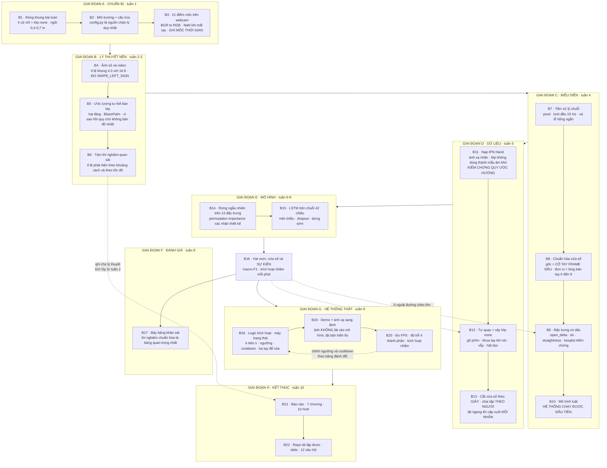

# Cẩm nang thực hiện từng bước
## Nhận dạng cử chỉ bàn tay thời gian thực để điều khiển máy tính

> **Tài liệu này là gì.** Các tài liệu tầng 1–6 cho bạn biết *vì sao*. Tài liệu
> này biến chúng thành một chuỗi **22 bước tuần tự**: mỗi bước nói rõ phải hiểu
> gì trước khi làm, làm gì, làm xong thì kiểm chứng bằng cách nào, và nộp ra sản
> phẩm gì.
>
> Đọc theo thứ tự. Mỗi bước giả định các bước trước đã xong.

> **Bản cập nhật — tháng 9/2026.** Bản trước của cẩm nang này viết cho đề tài
> **nhận dạng hành động toàn thân** (MediaPipe Pose, 33 điểm, 6 hành động, tự
> quay toàn bộ dữ liệu). Đề tài đã chuyển sang **nhận dạng cử chỉ bàn tay**
> (MediaPipe Hand Landmarker, 21 điểm, 4 cử chỉ + lớp nền, huấn luyện trên IPN
> Hand). Toàn bộ nội dung dưới đây đã được viết lại theo đề tài mới, bám sát tài
> liệu tầng 2 và tầng 3 bản bàn tay.

---

## 0. Cách dùng tài liệu này

### 0.1. Cấu trúc một bước

Mỗi bước có sáu mục cố định:

| Mục | Ý nghĩa |
|---|---|
| **Mục tiêu** | Một câu: sau bước này bạn có gì mà trước đó chưa có |
| **Lý thuyết cần nắm** | Khái niệm phải hiểu *trước khi* gõ dòng code đầu tiên |
| **Việc cụ thể** | Danh sách hành động, theo thứ tự |
| **Kiểm chứng** | Cách tự chứng minh bước này làm đúng — không có bước này thì lỗi âm thầm tích lũy |
| **Sản phẩm** | Thứ để lại cho báo cáo hoặc cho bước sau |
| **Cạm bẫy** | Lỗi phổ biến ở đúng bước này |

### 0.2. Bản đồ: 22 bước ↔ các tầng lý thuyết ↔ 10 tuần

| Bước | Nội dung | Tầng | Tuần |
|---|---|---|---|
| 1 | Đóng khung bài toán và chốt phạm vi | — | 1 |
| 2 | Dựng môi trường và cấu trúc dự án | 0 | 1 |
| 3 | Điểm mốc bàn tay chạy trên webcam | 1, 2 | 1 |
| 4 | Ảnh số, video và các quy ước phải **đo** | 1 | 2 |
| 5 | Ước lượng tư thế bàn tay — lý thuyết | 2 | 3 |
| 6 | Thí nghiệm quan sát và giới hạn đo được | 2 | 3 |
| 7 | Tiền xử lý chuỗi — pixel, lưới đều, vá lỗ hổng | 3 | 4 |
| 8 | Chuẩn hóa cửa sổ — gốc tọa độ và đơn vị đo | 3 | 4 |
| 9 | Thiết kế đặc trưng và kiểm chứng bằng boxplot | 3 | 4 |
| 10 | Mô hình luật — hệ thống chạy được đầu tiên | 3 | 4 |
| 11 | Nạp IPN Hand và kiểm chứng quy ước hướng | 3, 5 | 5 |
| 12 | Tự quay dữ liệu và xây lớp `none` | 5, 6 | 5 |
| 13 | Cắt cửa sổ, gán nhãn, chia tập theo người | 4, 5 | 5 |
| 14 | Rừng ngẫu nhiên trên đặc trưng thủ công | 4 | 6 |
| 15 | LSTM trên chuỗi điểm mốc | 4 | 7–8 |
| 16 | Đánh giá ở hai mức: cửa sổ và sự kiện | 5 | 8 |
| 17 | Các bảng khảo sát và thí nghiệm loại bỏ | 4, 5 | 8 |
| 18 | Logic kích hoạt — máy trạng thái | 6 | 9 |
| 19 | Demo thời gian thực và ánh xạ sang lệnh | 6 | 9 |
| 20 | Đo FPS, độ trễ và tỉ lệ kích hoạt nhầm | 1, 5, 6 | 9 |
| 21 | Viết báo cáo | tất cả | 2–10 |
| 22 | Dọn repo và chuẩn bị bảo vệ | 0 | 10 |

> **Trạng thái bộ tài liệu tầng, tính tới lúc viết bản này.** Tầng 2 và tầng 3
> đã có bản bàn tay. Tầng 1 (ảnh số và video) vẫn dùng được vì nội dung của nó
> gần như độc lập với đối tượng, chỉ cần đọc lướt qua các ví dụ về khung xương
> toàn thân. **Tầng 4 (mô hình chuỗi thời gian) và tầng 5 (đánh giá phân loại)
> hiện vẫn là bản viết cho đề tài toàn thân**: khung khái niệm — LSTM, rừng ngẫu
> nhiên, ma trận nhầm lẫn, rò rỉ dữ liệu — giữ nguyên hoàn toàn, nhưng mọi con
> số cụ thể trong hai tài liệu đó (46 chiều vào, 23 khớp, 6 lớp, `delta_hip_y`)
> phải đọc thành con số tương ứng của đề tài mới. Bước 14 tới 17 của cẩm nang
> này đã làm sẵn phép đổi đó cho bạn. **Tầng 6 (logic kích hoạt) chưa có tài
> liệu riêng**; bước 18 và 19 dưới đây là bản phác đủ dùng, và nên được thay
> bằng tài liệu chính thức khi có.

### 0.3. Bốn nguyên tắc xuyên suốt

**Nguyên tắc 1 — Một đường ống, ba nguồn dữ liệu.** Dữ liệu IPN Hand, dữ liệu
bạn tự quay, và luồng webcam lúc chạy thật phải đi qua **cùng một đoạn code**,
import từ `src/`. Hai phiên bản "gần giống nhau" là nguồn lỗi âm thầm số một của
đề tài này: mô hình đạt kết quả đẹp lúc đánh giá nhưng chạy thật thì loạn, và
bạn sẽ mất nhiều ngày để tìm ra vì sao.

**Nguyên tắc 2 — Quy ước thì phải đo, không được đoán.** Đề tài này có ít nhất
ba quy ước mà tài liệu không nói đủ rõ: chiều dương của trục ngang, nhãn tay
trái/phải theo ảnh gương, và hướng cử chỉ trong dữ liệu IPN. Mỗi cái đều có thể
ngược với trực giác của bạn, và **không cái nào báo lỗi khi sai** — hệ thống chỉ
chạy ngược. Mỗi quy ước phải được đo bằng một thí nghiệm nhỏ, ghi thành **một
hằng số duy nhất** trong `config.py`, và kiểm chứng lại khi đổi nguồn dữ liệu.

**Nguyên tắc 3 — Có sản phẩm chạy được từ tuần 4.** Mô hình luật ở bước 10 chỉ
là vài ngưỡng trên ba đặc trưng, nhưng nó là một hệ thống hoàn chỉnh chạy trên
webcam. Từ thời điểm đó, dù có chuyện gì xảy ra bạn vẫn có thứ để nộp và để
demo. Đây là quyết định quản trị rủi ro, không chỉ là quyết định sư phạm.

**Nguyên tắc 4 — Hệ thống này sinh ra *lệnh*, không chỉ sinh ra *nhãn*.** Đây là
khác biệt lớn nhất so với một bài toán phân loại thông thường, và nó chi phối
cách đánh giá (bước 16) lẫn cách ghép hệ thống thật (bước 18). Một mô hình đạt
macro-F1 cao vẫn có thể là một hệ thống điều khiển không dùng được, nếu nó phát
ra ba lệnh cho một cử chỉ hoặc tự phát lệnh trong lúc bạn gõ phím.

---

# GIAI ĐOẠN A — CHUẨN BỊ

---

## Bước 1. Đóng khung bài toán và chốt phạm vi

**Mục tiêu.** Có một câu phát biểu bài toán rõ ràng, bốn cử chỉ cùng lớp nền đã
chốt, kịch bản sử dụng đã chốt, và các quyết định thu hẹp phạm vi đã viết ra kèm
lý do — trước khi cài bất cứ thứ gì.

### Lý thuyết cần nắm

**Nhận dạng cử chỉ khác phân loại ảnh ở hai điểm**, và cả hai đều chi phối mọi
thứ phía sau.

*Điểm thứ nhất:* nhãn không nằm trong một khung hình nào, mà nằm trong **quan hệ
giữa các khung hình**. Một bức ảnh bàn tay đang mở nửa chừng là bằng chứng ngang
nhau cho "đang xòe ra" và "đang chụm lại". Thông tin phân biệt hai lớp đó chỉ
tồn tại khi bạn nhìn nhiều frame liên tiếp **và biết thứ tự của chúng**.

*Điểm thứ hai:* đầu ra của hệ thống không phải một nhãn cho một mẫu có sẵn, mà
là **một chuỗi lệnh rời rạc phát ra trong một luồng video không có điểm bắt đầu
và kết thúc**. Phần lớn thời gian, câu trả lời đúng là "không có cử chỉ nào".
Đây là lý do lớp `none` tồn tại và là lý do bước 16 phải đánh giá ở hai mức.

**Vì sao chọn Hand Landmarker chứ không phải Pose Landmarker.** Đây là quyết
định công nghệ trung tâm, và nó có một lý do kỹ thuật chứ không phải lý do tiện
lợi:

> Biểu diễn 33 điểm toàn thân của Pose chỉ có **ba điểm rất thô cho mỗi bàn tay**
> — cổ tay, ngón trỏ, ngón út. Hai trong bốn cử chỉ của đề tài (xòe, chụm) được
> định nghĩa bằng khoảng cách giữa các đầu ngón, mà ba điểm đó không mô tả được.

Đổi lại, lựa chọn này áp một ràng buộc lên kịch bản sử dụng. Bộ phát hiện lòng
bàn tay của MediaPipe làm việc trên ảnh đã thu nhỏ về **192×192 pixel**, nên thứ
quyết định là **bàn tay chiếm bao nhiêu phần khung hình**, không phải độ phân
giải camera. Ở 2–3 mét, lòng bàn tay chỉ còn năm tới bảy pixel trong ảnh đầu vào
— không bộ phát hiện nào làm việc đáng tin ở kích thước đó. Chi tiết ở bước 5;
số đo thật ở bước 6.

**Hệ quả:** đề tài chốt kịch bản **người dùng ngồi trước laptop, khoảng cách
0,4–0,7 mét**, không phải người đứng thuyết trình.

**Vì sao khung xương chứ không phải pixel.** Một frame 640×480 là 921.600 con
số; 21 điểm mốc là **42 con số**. Nhẹ hơn khoảng hai mươi nghìn lần. Con số thứ
hai là kích thước mà một laptop không GPU xử lý được thời gian thực, và mà vài
nghìn mẫu đủ để huấn luyện.

Cái giá: khung xương vứt bỏ toàn bộ ngoại hình. Hệ thống không phân biệt được
"bàn tay cầm bút" với "bàn tay không cầm gì" ở cùng một tư thế. Với bốn cử chỉ
được chọn theo tiêu chí **hình học**, cái giá này chấp nhận được.

### Việc cụ thể

**1.1. Viết tên đề tài thành một câu.**

> Nhận dạng cử chỉ bàn tay thời gian thực dựa trên điểm mốc bàn tay, ứng dụng
> điều khiển máy tính không chạm.

**1.2. Chốt bốn cử chỉ đích và ghi rõ đặc trưng hình học phân biệt từng cái.**

| # | Nhãn | Cử chỉ | Đặc trưng hình học phân biệt | Lệnh ánh xạ |
|---|---|---|---|---|
| 1 | `swipe_left` | Vuốt bàn tay sang trái | Cổ tay dời ngang, **quỹ đạo thẳng**, dấu âm hoặc dương tùy quy ước | Slide trước |
| 2 | `swipe_right` | Vuốt bàn tay sang phải | Như trên, **dấu ngược lại** | Slide sau |
| 3 | `zoom_in` | Xòe năm ngón ra | Khoảng cách đầu ngón → cổ tay **tăng** | Phóng to |
| 4 | `zoom_out` | Chụm năm ngón lại | Khoảng cách đầu ngón → cổ tay **giảm** | Thu nhỏ |
| 5 | `none` | Mọi thứ khác | Không thỏa bất kỳ mẫu hình nào ở trên | Không làm gì |

Cột "đặc trưng hình học" không phải trang trí — nó là **dàn ý thiết kế đặc
trưng** ở bước 9 và là bảng biện minh trong báo cáo.

**1.3. Hiểu vì sao bốn cử chỉ này được chọn thành hai cặp.** Đây là một lựa chọn
có chủ ý, và nên nói rõ trong báo cáo:

- **Hai cặp, hai loại thông tin.** Cặp vuốt được định nghĩa bởi **chuyển động
  tuyệt đối của cả bàn tay**; cặp zoom được định nghĩa bởi **hình dạng tương đối
  của bàn tay**. Một hệ thống làm được cả hai chứng minh rằng biểu diễn của bạn
  giữ được cả hai loại thông tin — điều không hiển nhiên, như bước 8 sẽ cho thấy.
- **Mỗi cặp là đảo ngược thời gian của nhau.** `zoom_in` và `zoom_out` đi qua
  **đúng cùng những tư thế**, chỉ khác thứ tự. Cặp này là bằng chứng thực nghiệm
  rằng mô hình thực sự học được chiều thời gian chứ không chỉ đoán từ một khung
  hình đơn lẻ.
- **Không có cử chỉ nào theo chiều sâu.** Đây là quyết định tránh né có ý thức:
  ước lượng độ sâu từ camera đơn về bản chất nhập nhằng, nên đề tài không dùng
  trục `z` và không dùng cử chỉ nào phụ thuộc vào nó.

**1.4. Viết ra các quyết định thu hẹp phạm vi kèm lý do.**

| Quyết định | Loại bỏ được gì |
|---|---|
| Chỉ **một bàn tay** trong khung hình (`num_hands=1`) | Không cần gán ID qua các frame, không cần xử lý hai tay tương tác |
| Dùng **MediaPipe Hand Landmarker** có sẵn | Không phải huấn luyện mô hình điểm mốc; chạy thời gian thực trên CPU |
| Kịch bản **ngồi trước laptop**, 0,4–0,7 m | Tránh vùng khoảng cách mà bộ phát hiện lòng bàn tay không làm việc được |
| Huấn luyện chính trên **IPN Hand**, tự quay để kiểm thử | Không phải quay hàng nghìn mẫu; có sẵn 50 người diễn để chia tập theo người |
| Chỉ dùng **tọa độ 2D**, bỏ `z` và `hand_world_landmarks` | Bỏ được 21 chiều nhiễu; tránh phụ thuộc vào ước lượng độ sâu kém tin cậy |
| **Không** cử chỉ hai tay, không cử chỉ theo chiều sâu, không nhận dạng ngôn ngữ ký hiệu | Giữ bài toán ở quy mô một đồ án |

**1.5. Viết ra những thứ bạn KHÔNG làm**, để phần "Phạm vi và giới hạn" trong
chương 1 có sẵn nội dung.

### Kiểm chứng

Trả lời được bốn câu, mỗi câu trong hai phút, không nhìn tài liệu:

1. Vì sao dùng Hand Landmarker chứ không dùng Pose Landmarker?
2. Vì sao kịch bản là ngồi gần chứ không phải đứng xa? *(Gợi ý: phải nêu được cơ
   chế 192 pixel, không được trả lời "vì nhìn rõ hơn".)*
3. Vì sao bốn cử chỉ này, không phải bốn cử chỉ khác?
4. Hệ thống của bạn **không thể** làm gì?

Câu 4 là câu mà một người hiểu bài trả lời tự tin và một người không hiểu bài
trả lời lúng túng.

### Sản phẩm

Một trang ghi chú: tên đề tài, bảng bốn cử chỉ kèm đặc trưng phân biệt và lệnh
ánh xạ, bảng quyết định thu hẹp, danh sách ngoài phạm vi. Đây là bản nháp của
**chương 1** báo cáo.

### Cạm bẫy

- **Chọn cử chỉ phân biệt bằng số ngón giơ lên** (một ngón, hai ngón, ba ngón).
  Nghe dễ, nhưng khi bàn tay hơi nghiêng thì các ngón che nhau và mô hình đếm
  sai. Bốn cử chỉ đã chọn đều dựa trên đại lượng liên tục, bền hơn nhiều.
- **Chọn quá nhiều cử chỉ.** Bốn lớp đích cộng một lớp nền đã là bài toán đủ
  khó, vì lớp nền chứa mọi thứ còn lại của thế giới.
- **Quên lớp `none` ngay từ đầu.** Đây là sai lầm phổ biến nhất của đồ án nhận
  dạng cử chỉ: huấn luyện bốn lớp, rồi phát hiện ra lúc chạy thật hệ thống luôn
  phải chọn một trong bốn, kể cả khi bạn đang gõ phím. Lớp `none` phải là công
  dân hạng nhất từ bước 1, không phải thứ vá vào ở tuần 9.

---

## Bước 2. Dựng môi trường và cấu trúc dự án

**Mục tiêu.** Một môi trường cô lập chạy được, một cây thư mục cố định, và một
file cấu hình duy nhất — trước khi có dòng code xử lý nào.

### Lý thuyết cần nắm

**Vì sao đề tài này không cần GPU.** MediaPipe Hands được thiết kế để chạy trên
điện thoại: biến thể Full của mô hình điểm mốc chỉ có 1,98 triệu tham số và chạy
khoảng 16 ms trên một chiếc Pixel 3. Còn mô hình phân loại của bạn làm việc trên
42 con số mỗi frame, nhỏ tới mức CPU huấn luyện trong vài phút.

**Vì sao cần một file cấu hình duy nhất, và vì sao ở đề tài này nó quan trọng
hơn bình thường.** Ngoài các hằng số thông thường (tần số lấy mẫu, độ dài cửa
sổ, tên lớp), `config.py` còn phải chứa **các quy ước đã được đo bằng thực
nghiệm** — đặc biệt là dấu của trục ngang. Nếu dấu đó nằm rải rác trong code,
bạn sẽ sửa sót đúng một chỗ, và hệ thống sẽ chạy ngược ở đúng chỗ đó mà không
báo lỗi.

### Việc cụ thể

**2.1. Tạo môi trường.**

```
conda create -n gesture -y python=3.10
conda activate gesture

pip install mediapipe opencv-python numpy
pip install scikit-learn matplotlib pandas seaborn
pip install torch          # bản CPU là đủ
pip install pyautogui      # để phát lệnh ở bước 19
```

**2.2. Tải file mô hình.** Lấy `hand_landmarker.task` từ trang tài liệu Hand
Landmarker của Google AI Edge, đặt vào `models/`.

**2.3. Dựng cây thư mục.**

```
project/
├── models/                    hand_landmarker.task
├── data/
│   ├── ipn/                   video và nhãn gốc của IPN Hand
│   ├── raw/                   video tự quay
│   ├── landmarks/             điểm mốc đã trích (.npz), kèm mốc thời gian
│   ├── windows/               cửa sổ đã cắt và gán nhãn
│   └── splits.json            phân chia train/val/test theo người
├── src/
│   ├── config.py              MỌI hằng số và quy ước nằm ở đây
│   ├── hands.py               gọi MediaPipe, trả về 21 điểm + presence
│   ├── preprocess.py          to_pixels, resample, fill_short_gaps, normalize
│   ├── features.py            openness, góc khớp, vận tốc, window_features
│   ├── windows.py             cắt cửa sổ, gán nhãn, tăng cường
│   ├── rules.py               mô hình luật (bước 10)
│   ├── train_rf.py            rừng ngẫu nhiên
│   ├── train_lstm.py          LSTM
│   ├── evaluate.py            chỉ số mức cửa sổ và mức sự kiện
│   ├── activation.py          máy trạng thái logic kích hoạt (bước 18)
│   └── demo.py                chương trình thời gian thực
├── tests/                     kiểm thử đơn vị — xem bước 9
├── notebooks/
├── results/
└── README.md
```

**2.4. Viết `config.py` ngay bây giờ**, dù chưa dùng tới. Tối thiểu phải có:

| Hằng số | Vai trò | Nguồn giá trị |
|---|---|---|
| `CLASSES` | Năm nhãn, theo đúng thứ tự | Bước 1 |
| `WRIST = 0`, `MIDDLE_MCP = 9` | Gốc tọa độ và đơn vị đo | Tầng 3 |
| `TIPS = [4, 8, 12, 16, 20]` | Năm đầu ngón | Tầng 2 |
| `HZ = 15.0` | Tần số lưới thời gian đều | Tầng 3 mục 12 |
| `WIN_SEC`, `STRIDE_SEC` | Cửa sổ tính bằng **giây**, không phải frame | Bước 13 |
| `MAX_GAP = 3` | Lỗ hổng dài hơn thì không nội suy | Tầng 3 mục 12.2 |
| `MIN_PRESENCE = 0.7` | Tỉ lệ bước có tay tối thiểu của một cửa sổ | Tầng 3 mục 12.3 |
| **`SWIPE_LEFT_SIGN`** | **Dấu của `dx` khi làm cử chỉ vuốt trái** | **ĐO ở bước 4** |
| `CAM_W`, `CAM_H`, `CAM_FPS` | Cấu hình camera, giữ nguyên suốt dự án | Bước 4 |
| `SEED = 42` | Tái lập | Bước 22 |

**2.5. Khởi tạo git**, kể cả khi làm một mình. Thêm `data/ipn/`, `data/raw/` và
`models/` vào `.gitignore`.

### Kiểm chứng

- `python -c "import mediapipe, cv2, torch, sklearn"` chạy không lỗi.
- `python -c "import cv2; print(cv2.VideoCapture(0).isOpened())"` in ra `True`.
- Mở `config.py`: mọi con số ma thuật của dự án đều nằm ở đó, và mỗi hằng số
  chưa đo được đánh dấu rõ là **chưa đo**.

### Sản phẩm

Môi trường chạy được + cây thư mục + `config.py` + repo git. Ghi lệnh cài đặt
vào `README.md` ngay, đừng để tới bước 22.

### Cạm bẫy

- **Cài gói khi quên `conda activate`.** Kiểm tra bằng `where python` (Windows).
- **Hard-code đường dẫn tuyệt đối tới file `.task`.** Dùng đường dẫn tương đối
  tính từ gốc dự án.
- **Định nghĩa `TIPS` hoặc `HZ` ở hai file khác nhau.** Một chỗ duy nhất.

---

## Bước 3. Điểm mốc bàn tay chạy trên webcam

**Mục tiêu.** 21 điểm mốc vẽ đè lên bàn tay bạn, bám theo chuyển động, kèm FPS
thực tế và **mốc thời gian được ghi lại cho từng frame**.

### Lý thuyết cần nắm

**Vòng lặp video là một mẫu hình cố định.** Mở nguồn → đọc một frame → kiểm tra
đọc có thành công không → xử lý → hiển thị → chờ phím → lặp → giải phóng tài
nguyên. Bốn chỗ trong chuỗi này hay bị bỏ, mỗi chỗ gây một lỗi khó hiểu (xem
phần cạm bẫy).

**BGR và RGB — lỗi im lặng phổ biến nhất.** OpenCV lưu ảnh theo thứ tự kênh
**BGR**; MediaPipe và gần như mọi thư viện khác dùng **RGB**. Quên chuyển thì
MediaPipe **không báo lỗi**: nó vẫn chạy, chỉ là tỉ lệ phát hiện tụt mạnh và
điểm mốc giật. Lý do: mạng được huấn luyện trên ảnh RGB, nên với nó da người
bây giờ có màu xanh lam — một thứ nó chưa từng thấy.

> Quy tắc: ngay khi frame ra khỏi OpenCV và đi vào bất cứ thư viện nào khác,
> chuyển sang RGB. Ngay khi nó quay lại OpenCV để hiển thị, dùng bản BGR gốc.
> Đặt tên biến `frame_bgr` và `frame_rgb` thì mắt bạn tự bắt lỗi khi đọc code.

**Quy ước lật ảnh — đọc kỹ, đây là chỗ riêng của đề tài bàn tay.** Có hai việc
khác nhau và rất dễ nhập nhằng:

| Việc | Làm gì | Vì sao |
|---|---|---|
| Ảnh đưa **vào mô hình** | **Không lật** | Phải cùng quy ước với dữ liệu huấn luyện. Đổi quy ước giữa chừng là cách chắc chắn nhất để hệ thống chạy ngược |
| Ảnh đưa **ra màn hình** | **Lật như gương** | Người dùng cần thấy ảnh gương để điều khiển tự nhiên; đưa tay sang phải thì hình trên màn hình cũng đi sang phải |

Hệ quả: nhãn `handedness` (`Left` / `Right`) mà MediaPipe trả về có thể **ngược**
với tay thật của bạn, vì tài liệu và code mẫu của họ giả định ảnh đã lật gương.
Đề tài **không dựa vào nhãn này cho quyết định quan trọng** — bốn cử chỉ đều làm
được bằng tay bất kỳ. Nhưng bạn sẽ đo quy ước thực tế ở bước 6 và ghi vào phần
giới hạn của báo cáo.

**Ba ngưỡng tin cậy, ba vai trò khác nhau.** Rất nhiều người chỉnh bừa cả ba vì
không phân biệt được. Chúng tương ứng với ba chỗ khác nhau trong kiến trúc hai
tầng của MediaPipe (chi tiết ở bước 5):

| Tham số | Kiểm soát cái gì |
|---|---|
| `min_hand_detection_confidence` | Ngưỡng để **bộ phát hiện lòng bàn tay** chấp nhận một phát hiện |
| `min_hand_presence_confidence` | Ngưỡng cho **cờ hiện diện** của mô hình điểm mốc; dưới ngưỡng thì coi như mất dấu và chạy lại bộ phát hiện |
| `min_tracking_confidence` | Ngưỡng để coi việc **bám từ frame trước** là thành công |

Cả ba mặc định 0,5. **Để nguyên và đo trước khi chỉnh.**

**Vì sao phải ghi mốc thời gian cho từng frame, ngay từ bước này.** Bước 7 sẽ
nội suy mọi chuỗi về một lưới thời gian đều 15 Hz, và không thể làm việc đó nếu
không biết mỗi frame xảy ra lúc nào. FPS của webcam **không** phải hằng số: nó
tụt khi phòng tối vì camera kéo dài thời gian phơi sáng. Ghi `time.perf_counter()`
cho từng frame là việc tốn một dòng và không thể bổ sung sau khi đã quay xong.

### Việc cụ thể

**3.1.** Viết vòng lặp webcam tối thiểu, với `release()` trong khối `finally`.

**3.2.** Chèn `HandLandmarker` với `running_mode=VIDEO` (chạy tuần tự, dễ hiểu
và dễ gỡ lỗi hơn `LIVE_STREAM` bất đồng bộ), `num_hands=1`.

**3.3. Xử lý đúng trường hợp không có tay.** `result.hand_landmarks` là một
**danh sách**; frame không có tay trả về danh sách **rỗng**, không phải `None`.
Luôn kiểm tra rỗng trước khi lấy phần tử đầu. Và quan trọng: khi không có tay,
**ghi `NaN` chứ đừng bỏ frame** — bỏ frame làm đứt trục thời gian, còn `NaN` giữ
được thông tin "ở thời điểm này không có tay", vốn là một tín hiệu thật.

**3.4.** Vẽ 21 điểm và các đoạn nối theo `HAND_CONNECTIONS`. Landmark trả về
`x`, `y` trong `[0, 1]`; nhân với `W`, `H` rồi ép `int` trước khi vẽ. Lưu ý tọa
độ truyền vào OpenCV là `(x, y)` — ngược với thứ tự chỉ mục mảng `[y, x]`; màu
là `(B, G, R)`; và `putText` không hiển thị được tiếng Việt có dấu.

**3.5.** Đo FPS bằng trung bình trượt trên 30 frame gần nhất, dùng
`time.perf_counter()`.

**3.6.** Ghi ra CSV mỗi frame: mốc thời gian, có tay hay không, 21 cặp tọa độ,
nhãn `handedness` và điểm số. File này là công cụ của toàn bộ bước 6.

### Kiểm chứng

- Điểm mốc bám theo tay bạn, không giật, không nhảy.
- FPS ổn định quanh 25–30 sau vài giây đầu.
- **Phép thử BGR/RGB:** tạm thời `imshow` bản `frame_rgb`. Nếu da tay trông
  **xanh lam** thì `frame_rgb` đúng là RGB — vì `imshow` luôn giả định đầu vào
  là BGR nên nó hoán đổi màu. Thấy màu sai ở đây nghĩa là bạn đã chuyển đúng.
- Đưa tay ra khỏi khung: CSV ghi `NaN`, chương trình không sập.
- Mở CSV, kiểm tra khoảng cách giữa các mốc thời gian: nó **không** đều tuyệt
  đối. Đây chính là lý do bước 7 tồn tại.

### Sản phẩm

Video quay màn hình 30 giây: điểm mốc bám theo tay, kèm FPS. Một file CSV mẫu.
Đây là sản phẩm tuần 1 và là hình minh họa đầu tiên cho chương 3 báo cáo.

### Cạm bẫy

| Hiện tượng | Nguyên nhân | Xử lý |
|---|---|---|
| Cửa sổ xám trắng hoặc treo | Quên `cv2.waitKey` | `waitKey` chính là lúc giao diện được vẽ |
| Lần chạy thứ hai không mở được camera | Quên `cap.release()` | Đặt trong `try/finally` |
| Lỗi khó hiểu `!_src.empty()` | Không kiểm tra biến `ok` từ `cap.read()` | Kiểm tra và `break` |
| Không phát hiện được tay, không báo lỗi | Quên `cvtColor` BGR→RGB | Chuyển ngay sau khi đọc frame |
| `IndexError` khi tay ra khỏi khung | Lấy `hand_landmarks[0]` mà không kiểm tra rỗng | Kiểm tra, rồi ghi `NaN` |
| Điểm mốc biến mất một lúc khi tay vào lại khung | **Không phải lỗi** — đó là lúc bộ phát hiện phải chạy lại | Ghi nhận, giải thích ở bước 5 |
| Quên ghi mốc thời gian | — | Không sửa được sau khi quay. Làm ngay từ bước này |

---

# GIAI ĐOẠN B — NỀN TẢNG LÝ THUYẾT

---

## Bước 4. Ảnh số, video và các quy ước phải đo

**Mục tiêu.** Hiểu dữ liệu vào của toàn hệ thống, **đo xong hai quy ước** sẽ
dùng suốt đồ án, và viết xong mục 2.1 của chương Cơ sở lý thuyết.

### Lý thuyết cần nắm

**Ảnh là một bảng số.** Ảnh xám là lưới ô, mỗi ô một con số 0–255 (một byte).
Ảnh màu là ba ảnh xám chồng lên nhau; `img.shape` trả về `(720, 1280, 3)`: 720
hàng, 1280 cột, 3 kênh.

**Hai cạm bẫy về thứ tự, cả hai đều không báo lỗi:** numpy đánh chỉ số
`[hàng, cột]` = `[y, x]`, ngược với thói quen toán học; và gốc tọa độ ở góc trên
bên trái với **trục y hướng xuống**.

**Cạm bẫy tỉ lệ khung hình — đây là mục quan trọng nhất của bước này.**

MediaPipe trả về `x` chia cho **chiều rộng** và `y` chia cho **chiều cao**. Hai
số chia khác nhau, nên hai trục có thang đo khác nhau. Cùng một đoạn dài 100
pixel:

| Hướng đoạn | Trên ảnh 1280×720 (16:9) | Trên ảnh 640×480 (4:3) |
|---|---|---|
| Nằm ngang | 100 / 1280 = 0,078 | 100 / 640 = 0,156 |
| Nằm dọc | 100 / 720 = 0,139 | 100 / 480 = 0,208 |
| **Hệ số méo** | **1,78 lần** | **1,33 lần** |

Nếu bạn tính khoảng cách hay góc trực tiếp trên `(lm.x, lm.y)`, mọi hình học bị
kéo giãn theo tỉ lệ khung hình. Và tệ hơn cho đề tài này: **IPN Hand quay ở
640×480 còn webcam của bạn chạy ở 1280×720**, nên hai nguồn bị biến dạng theo
hai hệ số khác nhau. Mô hình huấn luyện trên IPN sẽ nhìn dữ liệu webcam của bạn
qua một phép kéo giãn nó chưa từng thấy.

> **Quy tắc:** nhân với `(W, H)` ngay khi lấy điểm mốc ra khỏi MediaPipe, trước
> mọi phép tính hình học. Đây là dòng đầu tiên của đường ống ở bước 7.

**Video là chuỗi frame, và FPS không phải hằng số.** Ở 30 FPS mỗi frame cách
nhau 33 ms. Nhưng *FPS quay* (camera sinh ra bao nhiêu frame mỗi giây) khác *FPS
xử lý* (chương trình bạn xử lý xong bao nhiêu). Ba nguồn của đề tài có ba tần
số:

| Nguồn | Tần số |
|---|---|
| IPN Hand | 30 FPS, ổn định |
| Webcam lúc chạy thật, phòng sáng | khoảng 28–30 FPS |
| Webcam lúc chạy thật, phòng tối | có thể tụt xuống 15–20 FPS |

Đây là lý do cửa sổ của đề tài được định nghĩa bằng **thời gian**, không bằng số
frame. Chi tiết ở bước 7.

**Độ phân giải cao gần như không giúp phát hiện bàn tay.** Bộ phát hiện làm việc
trên ảnh đã thu nhỏ về 192×192, nên đổi sang webcam 4K không cải thiện bước phát
hiện. Nó chỉ giúp ở bước hai, khi vùng bàn tay đã được cắt ra và đưa vào mô hình
điểm mốc ở 224×224. Nhưng nếu bước một không tìm thấy tay thì bước hai không bao
giờ chạy.

### Việc cụ thể

**4.1.** Viết script nhỏ: đọc một video, lấy frame thứ *n*, in `shape`, giải
thích từng con số. Làm phép thử BGR/RGB có ý thức và chụp màn hình cả hai.

**4.2. Chốt cấu hình camera** cho toàn dự án, ghi vào `config.py` và `README`.
Khuyến nghị **640×480** để trùng tỉ lệ khung hình với IPN Hand — quyết định này
loại bỏ hẳn một nguồn khác biệt giữa hai nguồn dữ liệu. Nếu chọn 1280×720, hãy
ghi rõ và kiểm tra kỹ hơn ở bước 11.

**4.3. ĐO `SWIPE_LEFT_SIGN` — việc quan trọng nhất của tuần này.**

Chiều nào là "trái" phụ thuộc hai quy ước: ảnh có bị lật hay không, và "trái"
hiểu theo người làm hay theo ảnh. Với ảnh **không lật** và "trái" hiểu theo
**người làm**: khi bạn đưa tay sang trái của bạn, bàn tay đi về phía **phải của
ảnh**, nên `dx` dương.

**Nhưng đừng tin câu trên. Đo nó.** Quy trình:

```
1. Chạy script ghi CSV ở bước 3, ảnh KHÔNG lật.
2. Làm 10 lần cử chỉ "vuốt sang trái" (theo cảm nhận của người dùng).
3. Với mỗi lần, tính x của cổ tay ở frame cuối trừ x ở frame đầu, đơn vị pixel.
4. Lấy trung vị 10 giá trị. Dấu của nó là SWIPE_LEFT_SIGN.
5. Ghi vào config.py kèm ngày đo và điều kiện đo.
```

Rồi dùng hằng số đó ở mọi nơi. Bạn sẽ phải **kiểm chứng lại** quy ước này một
lần nữa ở bước 11 khi nạp IPN, vì không có gì đảm bảo họ dùng cùng quy ước.

> **Bỏ qua bước này thì mô hình học ngược hướng và không có gì báo lỗi.** Ma
> trận nhầm lẫn chỉ trông "hơi kém", còn hệ thống chạy thật thì mỗi lần vuốt lại
> làm slide đi ngược. Đây là lỗi im lặng tốn nhiều ngày nhất của đề tài này.

**4.4.** Đo FPS thực tế ở hai mức ánh sáng, lập bảng. Con số này biện minh cho
quyết định lấy mẫu lại ở bước 7.

**4.5. Viết ghi chú lý thuyết cho mục 2.1** — khoảng 1,5–2 trang: biểu diễn ảnh
số, hệ tọa độ ảnh, video và FPS, **cạm bẫy tỉ lệ khung hình kèm bảng hai nguồn
dữ liệu**, và một đoạn ngắn về BGR/RGB.

### Kiểm chứng

1. Webcam cho ảnh 1280×720. `img.shape` trả về gì? Giải thích từng số.
2. `lm.x = 0.5, lm.y = 0.5` trên ảnh 1280×720. Tọa độ pixel là bao nhiêu?
3. Nếu tính khoảng cách giữa hai điểm mốc trực tiếp trên `(lm.x, lm.y)` thì sai
   ở đâu, và **vì sao sai lệch đó khác nhau** giữa IPN Hand và webcam của bạn?
4. Đổi webcam 720p sang 4K có giúp phát hiện bàn tay ở 3 mét không? Giải thích
   bằng cơ chế.
5. `SWIPE_LEFT_SIGN` trên máy bạn bằng bao nhiêu, và bạn đo nó thế nào?

### Sản phẩm

Ghi chú mục 2.1 + bảng FPS theo mức ánh sáng + **`SWIPE_LEFT_SIGN` đã đo, ghi
trong `config.py`** + hai ảnh minh họa BGR/RGB.

### Cạm bẫy

- **Đoán dấu thay vì đo.** Xem mục 4.3.
- **Đổi độ phân giải giữa chừng.** Ghi vào README và giữ nguyên.
- **Bỏ qua tuần này vì "đã biết rồi".** Cạm bẫy tỉ lệ khung hình là lỗi im lặng,
  và nó làm hỏng mọi đặc trưng hình học của bạn cùng một lúc.
---

## Bước 5. Ước lượng tư thế bàn tay — lý thuyết

**Mục tiêu.** Hiểu **bên trong** mô hình bạn đang dùng. Đây là tuần thuần lý
thuyết, không viết code mới, và là phần kiến thức thị giác máy tính đáng giá
nhất của cả đồ án.

Tài liệu gốc cần đọc kèm: **MediaPipe Hands: On-device Real-time Hand Tracking**
(Zhang và cộng sự, 2020, arXiv:2006.10214). Chỉ 5 trang.

### Lý thuyết cần nắm

#### 5.a. Bài toán và 21 điểm mốc

Cho một ảnh `(H, W, 3)`, trả về 21 cặp `(x, y)`, mỗi cặp ứng với một vị trí giải
phẫu. Mỗi ngón có bốn điểm đánh số từ gốc ra đầu ngón, cộng cổ tay là 21.

Bốn chỉ số phải thuộc lòng:

| Chỉ số | Điểm | Vai trò trong đề tài |
|---|---|---|
| **0** | Cổ tay | **Gốc tọa độ khi chuẩn hóa** |
| **9** | Gốc ngón giữa (MCP) | **Cùng điểm 0 tạo đơn vị đo** |
| **4, 8, 12, 16, 20** | Năm đầu ngón | Tính độ xòe |
| 6, 10, 14, 18 | Khớp giữa (PIP) các ngón | Tính góc gập |

Viết tắt: **MCP** là khớp nối bàn tay với ngón (đốt gốc), **PIP** là khớp giữa,
**DIP** là khớp gần đầu ngón. Ngón cái có **CMC** và **IP** riêng vì nó chỉ có
hai đốt.

**Một tính chất hình học quyết định toàn bộ tầng 3:** các đoạn nối gốc ngón với
nhau — (5,9), (9,13), (13,17) — cùng với (0,5) và (0,17) tạo thành **gan bàn
tay**, một đa giác **gần như cứng**: nó không đổi hình khi các ngón co duỗi. Đây
là lý do đoạn 0→9 được chọn làm đơn vị đo ở bước 8.

**Tập 21 điểm là một lựa chọn thiết kế, không phải sự thật khách quan.** Bố cục
này theo công trình của Simon và cộng sự (CMU, 2017). Các nguồn khác chọn khác:
SHREC'17 dùng 22 điểm từ camera độ sâu, NYU Hand Pose dùng 36. Hệ quả thực tế:
**dữ liệu theo bộ này không dùng thẳng được với bộ kia.** Đây là một lý do chính
đáng để đề tài chọn IPN Hand — video RGB, tự trích điểm mốc bằng chính công cụ
mình dùng — thay vì một bộ dữ liệu khung xương dựng sẵn.

#### 5.b. Vì sao bàn tay khó hơn cơ thể

Bài báo nói thẳng một câu đáng nhớ: khuôn mặt có những vùng tương phản cao như
quanh mắt và miệng; bàn tay **không có đặc trưng như thế**. Cụ thể hơn, sáu khó
khăn — và hai trong số đó đánh **trực tiếp** vào hai cử chỉ của đề tài:

| Khó khăn | Ảnh hưởng tới đề tài |
|---|---|
| Rất nhiều bậc tự do (~27), nhồi trong một vùng ảnh nhỏ | Chung |
| **Tự che khuất nặng** — chụm tay thì các ngón che nhau | **Đánh trực tiếp vào `zoom_out`** |
| Các ngón trông giống nhau | Mô hình phải dựa vào ngữ cảnh toàn bàn tay |
| Dải tỉ lệ rất rộng — chênh nhau khoảng 20 lần | Chung |
| **Nhòe chuyển động** — ngón mảnh nên nhòe sớm hơn thân người | **Đánh trực tiếp vào cặp vuốt** |
| Nhập nhằng độ sâu | Đề tài tránh bằng cách không dùng cử chỉ theo chiều sâu |

#### 5.c. Đủ về CNN để hiểu phần còn lại

**Tích chập** là một cửa sổ nhỏ trượt qua ảnh, nhân từng phần tử với pixel bên
dưới rồi cộng lại. Ba điều cần rút ra: đầu ra **vẫn là một ảnh** (bản đồ đặc
trưng, và vị trí trong nó vẫn tương ứng với vị trí trong ảnh gốc); cùng một bộ
lọc dùng cho mọi vị trí; các con số trong bộ lọc được **học từ dữ liệu**.

Xếp chồng nhiều lớp, xen kẽ các bước giảm kích thước, thì mỗi ô ở lớp sau nhìn
thấy một vùng lớn hơn của ảnh gốc (*trường tiếp nhận*). Đánh đổi xuyên suốt:

| Độ sâu | Độ phân giải | Biết gì |
|---|---|---|
| Lớp nông | Cao | "Ở đây có cạnh, có góc" — biết *ở đâu*, không biết *là gì* |
| Lớp sâu | Thấp | "Đây là một bàn tay" — biết *là gì*, mất dần *ở đâu* |

Với bài toán định vị ta cần **cả hai**, nên dùng kiến trúc **encoder–decoder**
có **kết nối tắt**: giảm dần độ phân giải để lấy ngữ nghĩa, rồi tăng trở lại để
lấy vị trí, với các đường nối thẳng mang chi tiết sắc nét từ encoder sang
decoder. Bài báo nói họ dùng bộ trích đặc trưng "tương tự **FPN**" — Feature
Pyramid Network chính là dạng này áp dụng cho phát hiện đối tượng.

Vì sao điều này quan trọng với bàn tay: lòng bàn tay ở xa chỉ chiếm vài pixel.
Nhìn riêng vài pixel đó thì không đủ thông tin; nhưng nếu biết ngữ cảnh rằng
phía dưới có cẳng tay và phía trên có năm vật mảnh, thì đoán được.

#### 5.d. Bốn khái niệm về phát hiện đối tượng một giai đoạn

| Khái niệm | Nội dung |
|---|---|
| **Một giai đoạn** | Một lần chạy mạng cho ra luôn mọi hộp và mọi điểm số (SSD, YOLO), thay vì đề xuất vùng rồi phân loại (R-CNN). Nhanh hơn nhiều — lựa chọn bắt buộc khi cần thời gian thực |
| **Hộp mẫu** (*anchor*) | Mạng không "tìm" vật; nó **rải sẵn hàng nghìn hộp** khắp ảnh ở nhiều vị trí, kích thước, tỉ lệ khung, rồi với mỗi hộp dự đoán điểm số và độ hiệu chỉnh. **Số hộp mẫu = số vị trí × số kích thước × số tỉ lệ khung** — ghi nhớ công thức này |
| **NMS** | Một vật thật kích hoạt hàng chục hộp chồng nhau. Triệt tiêu không cực đại giữ hộp điểm cao nhất rồi xóa mọi hộp chồng lấn với nó quá một ngưỡng **IoU** (diện tích giao chia diện tích hợp). Điểm yếu: khi hai vật thật sự chồng lên nhau, nó có thể xóa nhầm |
| **Focal loss** | Trong ~2000 hộp mẫu, gần như tất cả là nền. Với cross-entropy thường, các hộp nền "dễ" áp đảo vài hộp dương "khó". Focal loss **giảm trọng số các mẫu đã phân loại đúng và dễ**, buộc mạng tập trung vào mẫu khó |

> **Liên hệ đáng nêu trong báo cáo.** Vấn đề "lớp đa số áp đảo lớp thiểu số" mà
> focal loss giải quyết ở đây chính là vấn đề bạn sẽ gặp lại ở bước 13 và 16,
> dưới dạng lớp `none` chiếm đa số. Cách giải quyết cũng cùng tinh thần: trọng
> số lớp trong hàm mất mát, và lấy mẫu con lớp đa số.

#### 5.e. Bản đồ nhiệt hay hồi quy — mục thú vị nhất

Mô hình điểm mốc bàn tay chọn **ngược lại** với phần lớn mô hình tư thế người.
Hiểu được vì sao là hiểu được cách các quyết định kiến trúc thực sự được đưa ra.

Có hai cách thiết kế đầu ra. **Cách A — hồi quy trực tiếp:** mạng in ra đúng hai
con số cho mỗi điểm. **Cách B — bản đồ nhiệt:** mạng in ra một *ảnh* cho mỗi
điểm, giá trị mỗi pixel là "độ tin rằng điểm này nằm ở đây", rồi lấy pixel cực
đại.

Bản đồ nhiệt thường thắng, vì **bốn lý do độc lập**:

1. **Giữ được cấu trúc không gian.** Tích chập có tính *tương đẳng tịnh tiến*:
   dịch vật trong ảnh vào thì bản đồ đặc trưng dịch theo đúng như vậy. Bản đồ
   nhiệt khai thác tính chất đó. Hồi quy thì phá vỡ nó: để cho ra hai con số,
   mạng phải làm phẳng bản đồ đặc trưng rồi đi qua lớp nối đầy đủ, và bước làm
   phẳng xóa sạch thông tin vị trí.
2. **Biểu diễn được sự không chắc chắn.** Điểm bị che thì cách A vẫn buộc phải
   quả quyết; cách B in ra một đốm rộng và nhạt ("khoảng đâu đây"), hoặc hai đốm
   ("hoặc đây hoặc kia"). Với bàn tay nắm lại, tình huống hai đốm rất thực: mô
   hình thật sự phân vân giữa ngón giữa và ngón áp út.
3. **Tín hiệu huấn luyện dày đặc.** Cách A cho hai con số mỗi ảnh; cách B cho
   **mỗi pixel** một giá trị đúng, kể cả những pixel phải bằng 0.
4. **Bài toán dễ hơn về bản chất.** Hồi quy đòi mạng học một ánh xạ phi tuyến
   *toàn cục*; bản đồ nhiệt biến nó thành bài toán *cục bộ, lặp lại* — "điểm này
   có ở đây không?" — đúng loại câu hỏi tích chập giỏi.

**Vậy vì sao mô hình bàn tay vẫn hồi quy trực tiếp?** Vì **đầu vào của nó đã
khác**. Bài báo nói rõ: cung cấp ảnh bàn tay đã cắt chính xác cho mô hình điểm
mốc "làm giảm mạnh nhu cầu tăng cường dữ liệu và cho phép mạng dành phần lớn
năng lực của nó cho độ chính xác định vị". Đọc lại bốn lý do dưới ánh sáng đó:

| Lý do ủng hộ bản đồ nhiệt | Còn đúng khi đầu vào đã được cắt và căn chỉnh? |
|---|---|
| Giữ cấu trúc không gian | **Yếu đi nhiều** — bàn tay đã chiếm gần hết vùng cắt và đã được xoay thẳng |
| Biểu diễn không chắc chắn | **Thay bằng thứ khác** — mô hình có riêng một cờ hiện diện làm việc đó ở mức toàn bàn tay |
| Tín hiệu học dày đặc | **Vẫn đúng** — và đây là chỗ giải pháp lai xuất hiện |
| Bài toán dễ hơn | **Yếu đi** — ánh xạ không còn "toàn cục và phi tuyến" |

Trong khi đó chi phí của bản đồ nhiệt vẫn nguyên: tốn bộ nhớ, sai số lượng tử
hóa, `argmax` không khả vi, cần hậu xử lý. **Cán cân nghiêng về hồi quy trực
tiếp.**

> **Bài học tổng quát — đáng viết vào báo cáo.** Không có câu trả lời đúng tuyệt
> đối cho "nên thiết kế đầu ra thế nào". Câu trả lời phụ thuộc vào **đầu vào đã
> được chuẩn bị tới đâu**. Cùng một kỹ thuật, đúng cho bài toán này, thừa cho
> bài toán kia. Bài học này lặp lại ở bước 8 với chuẩn hóa xoay.

Chi tiết đáng nhắc thêm: mô hình tư thế người của Google (BlazePose) giải quyết
cùng đánh đổi này bằng cách **lai** — huấn luyện có nhánh bản đồ nhiệt để lấy
tín hiệu học dày đặc, rồi **gỡ nhánh đó đi trước khi triển khai**. Giữ lợi ích
lúc học, bỏ chi phí lúc chạy.

#### 5.f. Kiến trúc hai tầng

```
Toàn bộ ảnh
     │
     ▼
┌──────────────────────────────────────┐
│  Bộ phát hiện lòng bàn tay BlazePalm │   đầu vào 192×192
│  → hộp bao CÓ HƯỚNG quanh lòng bàn   │
└──────────────────────────────────────┘
     │
     ▼  cắt + xoay + co giãn về khung chuẩn
┌──────────────────────────────────────┐
│  Mô hình điểm mốc bàn tay            │   đầu vào 224×224
│  ├─► 21 điểm (x, y, z)               │
│  ├─► cờ hiện diện                    │
│  └─► tay trái / tay phải             │
└──────────────────────────────────────┘
```

**Vì sao cắt và căn chỉnh trước lại quan trọng đến thế** — đây là ý trung tâm.
Nếu mô hình điểm mốc phải làm việc trên toàn ảnh, nó phải học cách xử lý bàn tay
**ở mọi vị trí, mọi kích thước, mọi góc xoay**: ba chiều biến thiên, mỗi chiều
đòi hoặc nhiều dữ liệu hơn hoặc nhiều năng lực mạng hơn. Khi nhận một vùng cắt
đã căn chỉnh, ba chiều đó **biến mất khỏi bài toán của nó**, và toàn bộ năng lực
dành cho một việc duy nhất: định vị chính xác 21 điểm trên một bàn tay đã được
đặt ngay ngắn trước mặt nó.

> Một chi tiết đáng biết, và đáng nhắc nếu bạn muốn chứng tỏ đã đọc kỹ: bài báo
> 2020 nêu kích thước đầu vào 256×256, còn các file TFLite đang phân phối dùng
> **192×192** cho bộ phát hiện và **224×224** cho mô hình điểm mốc. Khi trích số
> vào báo cáo, nói rõ bạn trích bài báo hay bản triển khai.

#### 5.g. BlazePalm — ba quyết định thiết kế

Đây là phần đáng học nhất, vì nó cho thấy **cách một nhóm kỹ sư biến một khó
khăn cụ thể thành một lựa chọn kiến trúc cụ thể**.

**Quyết định 1 — phát hiện *lòng bàn tay*, không phải cả bàn tay.** Nghe phản
trực giác. Ba lý do độc lập, cùng chỉ về một hướng:

- **(a) Lòng bàn tay gần như là vật cứng.** Cả bàn tay có ~27 bậc tự do và thay
  hình liên tục; lòng bàn tay thì không đổi hình. Ước lượng hộp bao cho vật cứng
  dễ hơn nhiều.
- **(b) Chỉ cần hộp vuông.** Vì lòng bàn tay gần vuông ở mọi tư thế, bộ phát
  hiện chỉ cần **một tỉ lệ khung** cho hộp mẫu thay vì ba tới năm. Nhớ công thức
  ở mục 5.d: bỏ đi một thừa số thì **giảm số hộp mẫu ba tới năm lần**. Đây là
  tiết kiệm tính toán trực tiếp.
- **(c) NMS hoạt động tốt hơn.** Lòng bàn tay nhỏ hơn cả bàn tay, nên hai hộp ít
  chồng lấn hơn, tách được hai tay ngay cả khi chúng tự che nhau.

**Quyết định 2 — bộ trích đặc trưng kiểu FPN.** Để có nhận thức ngữ cảnh rộng
ngay cả với vật nhỏ.

**Quyết định 3 — focal loss.** Để hỗ trợ số lượng lớn hộp mẫu sinh ra từ dải tỉ
lệ rộng.

**Bảng khảo sát loại bỏ** — mỗi quyết định đáng bao nhiêu, đo bằng *average
precision* của bộ phát hiện:

| Cấu hình | Average Precision |
|---|---|
| Không decoder + cross-entropy | 86,22% |
| **Có** decoder + cross-entropy | 94,07% |
| Có decoder + **focal loss** | 95,70% |

Đọc bảng này cho hai điều. Decoder đáng khoảng 8 điểm, focal loss thêm 1,6 điểm.
Và quan trọng hơn: **đây là mẫu mực của một thí nghiệm loại bỏ** — mỗi dòng đổi
đúng một yếu tố, giữ nguyên mọi thứ khác. Bảng thí nghiệm của bạn ở bước 17 nên
có hình dạng giống hệt bảng này.

**Hộp bao có hướng.** Bộ phát hiện trả về hộp kèm góc xoay, nhờ đó bước cắt xoay
vùng bàn tay về hướng chuẩn. Hệ quả cho đề tài: mô hình điểm mốc khá ổn định khi
bạn nghiêng cổ tay, **nhưng tọa độ trả về ở hệ quy chiếu ảnh gốc** — nghĩa là
thông tin về góc nghiêng vẫn còn trong đầu ra. Bước 8 sẽ quyết định có dùng nó
hay không.

#### 5.h. Mô hình điểm mốc, dữ liệu và ba biến thể

**Ba đầu ra dùng chung một bộ trích đặc trưng:** 21 điểm mốc; **cờ hiện diện**;
và phân loại tay trái/phải.

Cờ hiện diện là chi tiết tinh tế nhất. Nó không trả lời "ảnh này có bàn tay
không" mà trả lời "**vùng cắt tôi vừa nhận có chứa một bàn tay được căn chỉnh
hợp lý không**". Sự khác biệt đó cho phép hệ thống phát hiện rằng cơ chế bám
theo đã trượt khỏi bàn tay, và kích hoạt chạy lại bộ phát hiện.

**Ba nguồn dữ liệu huấn luyện, ba mục đích:** ~6.000 ảnh thực ngoài đời (đa dạng
ngoại hình, thiếu tư thế phức tạp); ~10.000 ảnh cử chỉ tự thu (đủ mọi góc, nhưng
chỉ 30 người); ~100.000 ảnh tổng hợp dựng từ mô hình 3D. Kết quả, đo bằng **MSE
chuẩn hóa theo cỡ lòng bàn tay**:

| Dữ liệu huấn luyện | MSE |
|---|---|
| Chỉ ảnh thực | 16,1% |
| Chỉ ảnh tổng hợp | 25,7% |
| **Kết hợp** | **13,4%** |

> **Để ý đơn vị đo sai số: chuẩn hóa theo cỡ lòng bàn tay.** Chính nhóm tác giả
> mô hình cũng coi cỡ lòng bàn tay là đơn vị độ dài tự nhiên của bài toán này.
> Khi bước 8 chia mọi tọa độ cho khoảng cách 0→9, bạn đang dùng đúng đơn vị mà
> họ dùng. Đây là một câu đáng trích vào báo cáo.

**Ba biến thể mô hình điểm mốc:**

| Biến thể | Tham số | MSE | Thời gian trên Pixel 3 |
|---|---|---|---|
| Light | 1,0 triệu | 11,83 | 6,6 ms |
| **Full** | 1,98 triệu | 10,05 | 16,1 ms |
| Heavy | 4,02 triệu | 9,82 | 36,9 ms |

Từ Light lên Full, gấp đôi tham số đổi lấy giảm MSE ~15%. Từ Full lên Heavy,
gấp đôi tham số nữa chỉ đổi lấy ~2%, trong khi thời gian tăng hơn gấp đôi. Đây
là một đường cong đánh đổi kinh điển, và biết chỉ ra **điểm mà thêm tham số
không còn đáng** là một điểm cộng trong báo cáo.

#### 5.i. Bám theo giữa các frame — và hệ quả với cử chỉ vuốt

Chạy bộ phát hiện ở **mọi** frame là lãng phí, vì bàn tay không dịch chuyển
nhiều trong 33 ms. Giải pháp: suy ra hộp bao cho frame hiện tại **từ 21 điểm mốc
của frame trước**; bộ phát hiện chỉ chạy ở frame đầu hoặc khi mất dấu.

```
frame 1:  [phát hiện] → [điểm mốc] ──┐
                                      │ suy ra hộp
frame 2:              → [điểm mốc] ──┤
frame 3:              → [điểm mốc] ──┤
frame 4:  cờ hiện diện tụt thấp       │
          [phát hiện] → [điểm mốc] ───┘  ← chạy lại bộ phát hiện
```

**Hệ quả trực tiếp cho cử chỉ vuốt — đọc kỹ, đây là dự đoán lý thuyết quan trọng
nhất mà bạn tự kiểm chứng được.** Cơ chế bám dựa trên giả định *bàn tay ở frame
sau nằm gần chỗ nó ở frame trước*. Cử chỉ vuốt vi phạm chính giả định đó:

1. Tay dịch chuyển xa giữa hai frame liên tiếp.
2. Hộp suy ra từ frame trước không còn ôm đúng bàn tay.
3. Mô hình điểm mốc nhận một vùng cắt lệch, cờ hiện diện tụt.
4. Hệ thống coi là mất dấu, chạy lại bộ phát hiện trên **toàn ảnh đã thu nhỏ về
   192 pixel**.
5. Nếu bàn tay lúc đó đang nhòe vì chuyển động, bộ phát hiện có thể không tìm
   thấy. **Mất tay vài frame, đúng vào giữa cử chỉ.**

Hai yếu tố cộng hưởng: bám thất bại vì dịch chuyển lớn, và phát hiện lại thất
bại vì nhòe chuyển động. Cả hai đều tệ hơn khi thiếu sáng, vì camera kéo dài
thời gian phơi sáng.

Đây là **lý do kỹ thuật thật** của yêu cầu "đủ sáng" trong giao thức quay dữ
liệu, và nó nghe thuyết phục hơn nhiều so với "cho ảnh đẹp". Nó cũng là lý do
bước 7 phải có cơ chế vá lỗ hổng, và là lý do `presence_ratio` trở thành một
đặc trưng ở bước 9.

#### 5.j. Định dạng đầu ra và những gì đề tài từ chối

`detect_for_video()` trả về ba trường, mỗi trường là **danh sách theo từng bàn
tay**: `hand_landmarks` (tọa độ ảnh, chuẩn hóa `[0,1]`), `hand_world_landmarks`
(tọa độ thế giới, đơn vị mét), và `handedness`.

**Vì sao bỏ `z`.** Bài báo nói rõ một điều quyết định: tọa độ 2D được học từ
**cả ảnh thật lẫn ảnh tổng hợp**, nhưng thành phần độ sâu **chỉ được học từ ảnh
tổng hợp** — vì không ai gán nhãn được độ sâu chính xác cho một ảnh chụp thật.
Hệ quả: `z` mang toàn bộ khoảng cách miền giữa ảnh dựng và ảnh thật, nên kém tin
cậy hơn hẳn `x` và `y`. Ba lý do cụ thể để bỏ: nó là phỏng đoán chứ không phải
phép đo; thêm 21 chiều nhiễu vào dữ liệu vốn ít là mời gọi quá khớp; và bốn cử
chỉ của đề tài phân biệt được hoàn toàn bằng hình học 2D.

**Vì sao bỏ `hand_world_landmarks`.** Nó đặt gốc ở tâm hình học bàn tay nên **đã
vứt bỏ thông tin vị trí bàn tay trong ảnh** — mà vị trí thay đổi theo thời gian
chính là cú vuốt. Dùng trường này thì mất luôn hai lớp. Ngoài ra nó vẫn dựa trên
cùng ước lượng độ sâu kém tin cậy.

> Cả hai quyết định đáng viết một đoạn trong báo cáo, vì chúng cho thấy bạn từ
> chối thông tin có sẵn và miễn phí *sau khi cân nhắc*, chứ không phải vì không
> biết nó tồn tại. Ngoại lệ đáng nhắc trong hướng phát triển: nếu thêm cử chỉ
> "đẩy tay về phía camera" thì `z` trở nên có ích và phải đánh giá lại.

### Việc cụ thể

**5.1.** Đọc bài báo MediaPipe Hands, ghi chú ba quyết định thiết kế của
BlazePalm bằng lời của bạn.

**5.2.** Đọc lướt SSD và Focal Loss — chỉ cần nắm ý tưởng hộp mẫu và mất cân
bằng nền/vật.

**5.3.** Vẽ lại **sơ đồ kiến trúc hai tầng** bằng công cụ của bạn. Đây là hình
dễ vẽ nhất và thể hiện ngay rằng bạn nắm được cấu trúc hệ thống mình dùng.

**5.4.** Viết bản tóm tắt 2 trang cho mục 2.2 báo cáo.

### Kiểm chứng

Câu 1 và 2 là hai câu chính. Nếu chỉ trả lời được hai câu, hãy là hai câu đó.

1. **Nêu ba lý do độc lập vì sao MediaPipe phát hiện *lòng bàn tay* thay vì cả
   bàn tay.** Lý do nào tiết kiệm tính toán trực tiếp, và bằng cơ chế gì?
2. **Vì sao mô hình điểm mốc bàn tay hồi quy trực tiếp, trong khi nhiều mô hình
   tư thế người dùng bản đồ nhiệt?** Trả lời bằng cách chỉ ra điều gì đã thay
   đổi ở *đầu vào* của nó.
3. Nêu bốn lý do bản đồ nhiệt thường thắng, và hai nhược điểm của nó.
4. Hệ thống làm gì để không phải chạy bộ phát hiện ở mọi frame?
5. **Vì sao tỉ lệ mất tay khi vuốt nhanh cao hơn khi xòe tay tại chỗ?** Nêu đủ
   hai cơ chế cộng hưởng.
6. Ba tham số ngưỡng tin cậy kiểm soát ba chỗ khác nhau. Chỗ nào là chỗ nào?
7. Vì sao không dùng `lm.z`, dù nó có sẵn và miễn phí? Nêu một trường hợp mà lời
   khuyên đó phải xem lại.

### Sản phẩm

Bản tóm tắt 2 trang + sơ đồ kiến trúc hai tầng do bạn vẽ + ghi chú ba quyết định
thiết kế. Đây là hạt nhân của mục 2.2 — mục dài nhất và giá trị nhất của chương
Cơ sở lý thuyết.

### Cạm bẫy

- **Chép lại tài liệu API thay vì đọc bài báo.** Chương lý thuyết phải giải
  thích *vì sao*, không phải liệt kê *cái gì*.
- **Học thuộc con số mà không hiểu cơ chế.** Hội đồng hỏi "vì sao", không hỏi
  "bao nhiêu".

---

## Bước 6. Thí nghiệm quan sát và giới hạn đo được

**Mục tiêu.** Biến các dự đoán lý thuyết ở bước 5 thành **số liệu đo được trên
máy của bạn**, và có bộ ảnh minh họa những ca mô hình đoán sai.

### Lý thuyết cần nắm

Mỗi thí nghiệm dưới đây kiểm chứng một ý cụ thể của bước 5. Đây không phải "chơi
thử cho biết" — đây là phần **thực nghiệm riêng của bạn** trong một chương lý
thuyết mà phần còn lại đều là đọc tài liệu người khác.

**Nguyên tắc:** với mỗi thí nghiệm, kết quả phải là **một con số hoặc một đồ
thị**, không phải một nhận xét bằng mắt. "Tôi thấy nó hơi giật" không đưa vào
báo cáo được; "tỉ lệ phát hiện tụt từ 98% xuống 71% khi vuốt nhanh" thì có.

### Việc cụ thể

Dùng script ghi CSV từ bước 3. Mỗi thí nghiệm 10–20 giây.

| # | Thí nghiệm | Đo cái gì | Kiểm chứng ý nào |
|---|---|---|---|
| 1 | Tay đứng yên ở 0,3 / 0,5 / 0,7 / 1,0 m | Tỉ lệ frame phát hiện được tay; độ rung của đầu ngón trỏ tính bằng pixel | Ràng buộc khoảng cách, bước 1 |
| 2 | **Vuốt chậm và vuốt nhanh ở cùng khoảng cách** | Tỉ lệ phát hiện *trong lúc* vuốt; số lần mất tay; độ dài đợt mất dài nhất | **Mục 5.i — thí nghiệm quan trọng nhất** |
| 3 | Xòe và chụm liên tục | Tỉ lệ phát hiện ở tư thế chụm so với tư thế xòe | Tự che khuất, mục 5.b |
| 4 | Phòng sáng và phòng tối | FPS xử lý; tỉ lệ phát hiện khi vuốt nhanh | Mục 5.i |
| 5 | Tay trước mặt, tay trên bàn phím, tay cầm cốc | Có phát hiện không; điểm mốc có hợp lý không | Chuẩn bị cho lớp `none`, bước 12 |
| 6 | Giơ tay phải rồi tay trái, ảnh không lật và ảnh đã lật | Nhãn `Left`/`Right` trong bốn trường hợp | **Cho ra một hằng số dùng suốt đồ án** |
| 7 | Đưa tay ra khỏi khung rồi vào lại | Mất bao nhiêu frame để điểm mốc xuất hiện lại | Mục 5.i — quan sát trực tiếp lúc bộ phát hiện chạy lại |
| 8 | Nghiêng cổ tay 45° và 90° | Điểm mốc còn đúng không | Hộp bao có hướng, mục 5.g |

**6.9. Đo độ rung của điểm mốc**, vì con số này sẽ dùng làm `σ` cho phép tăng
cường bằng nhiễu Gauss ở bước 13: giữ tay hoàn toàn bất động 10 giây, tính độ
lệch chuẩn của từng tọa độ, đổi sang đơn vị cỡ lòng bàn tay.

**6.10. Vẽ đồ thị đáng vẽ nhất:** tỉ lệ phát hiện theo khoảng cách, **hai đường
trên cùng một hình** — một cho tay đứng yên, một cho tay vuốt nhanh. Hình này
một mình lý giải cả lựa chọn công nghệ lẫn lựa chọn kịch bản.

**6.11. Chụp ảnh minh họa các ca đoán sai:** tay chụm bị che khuất, tay nhòe khi
vuốt, tay ở rìa khung hình.

### Kiểm chứng

- Thí nghiệm 2 có cho thấy tỉ lệ mất tay khi vuốt nhanh **cao hơn rõ rệt** khi
  tay đứng yên không? Nếu có, bạn đã xác nhận được dự đoán lý thuyết ở mục 5.i
  và có một đoạn báo cáo hoàn chỉnh: nêu cơ chế từ bài báo → dự đoán hệ quả → đo
  bằng thực nghiệm → giải thích vì sao đường ống cần bước vá lỗ hổng.
- Thí nghiệm 6 có cho ra một kết luận dứt khoát về quy ước `handedness` không?
- Mọi số liệu đã được lưu thành bảng, không chỉ nằm trong đầu bạn.

### Sản phẩm

Bảng số liệu 8 thí nghiệm + đồ thị tỉ lệ phát hiện theo khoảng cách + bộ ảnh các
ca đoán sai + `σ` đo được cho bước 13. Đây là sản phẩm tuần 3.

### Cạm bẫy

- **Đọc lý thuyết mà không chạy thí nghiệm.** Bộ số liệu "mô hình sai ở đâu" là
  thứ phân biệt một chương lý thuyết chép sách với một chương có quan sát riêng.
- **Đo một lần rồi kết luận.** Lặp mỗi thí nghiệm ít nhất ba lần.
- **Trích các con số ước lượng trong tài liệu tầng 2 vào báo cáo như thể chúng
  là kết quả đo của bạn.** Bảng khoảng cách ở tầng 2 mục 10.2 là ước lượng để
  giải thích cơ chế; số thật phải đến từ thí nghiệm 1 của bạn.

---

# GIAI ĐOẠN C — BIỂU DIỄN

> Đây là giai đoạn ngắn nhất về code và quan trọng nhất về hệ quả. Hàm chuẩn hóa
> chỉ khoảng mười dòng, nhưng ba quyết định bên trong nó quyết định toàn bộ chất
> lượng của mọi thứ phía sau. Nếu bạn chỉ có thời gian làm kỹ một giai đoạn, hãy
> chọn giai đoạn này.

---

## Bước 7. Tiền xử lý chuỗi — pixel, lưới thời gian đều, vá lỗ hổng

**Mục tiêu.** Một hàm biến chuỗi điểm mốc thô (tần số không đều, có lỗ hổng)
thành một chuỗi sạch trên lưới thời gian đều — dùng chung cho cả ba nguồn dữ
liệu.

### Lý thuyết cần nắm

#### 7.a. Đổi sang pixel trước mọi thứ

Đã phân tích ở bước 4: `x` chia cho chiều rộng, `y` chia cho chiều cao, hai
thang khác nhau. Nhân lại `(W, H)` là **dòng đầu tiên của đường ống**, chạy ngay
sau khi lấy điểm mốc ra khỏi MediaPipe. Mọi thứ sau đó làm việc trên pixel.

#### 7.b. Vì sao phải lấy mẫu lại về lưới thời gian đều

Nếu cửa sổ được định nghĩa bằng **số frame**, thì 30 frame là một giây ở IPN
(30 FPS ổn định) nhưng là **hai giây** ở webcam trong phòng tối (15 FPS). Mô
hình sẽ thấy cùng một cử chỉ "chậm đi gấp đôi" — một biến dạng nó chưa từng gặp
lúc huấn luyện.

Giải pháp: nội suy mọi chuỗi về một lưới thời gian đều. Đề tài chọn **15 Hz**.
Cửa sổ được định nghĩa bằng **thời gian**, không bằng frame.

**Vì sao 15 Hz là đủ:** cử chỉ ngắn nhất trong IPN Hand khoảng 9 frame ở 30 FPS,
tức khoảng 0,3 giây. Lấy mẫu ở 15 Hz vẫn cho 4–5 điểm dữ liệu cho cử chỉ ngắn
nhất — đủ để mô tả. Đổi lại, khối lượng tính toán giảm một nửa.

**Hệ quả bắt buộc:** phải ghi mốc thời gian cho mỗi frame khi quay dữ liệu
(bước 3). Với video IPN thì mốc thời gian suy từ chỉ số frame chia cho FPS; với
webcam thì phải đọc đồng hồ thật.

#### 7.c. Vá lỗ hổng ngắn, giữ lỗ hổng dài

Frame không tìm thấy tay được lưu là `NaN`. Hai loại lỗ hổng, hai cách xử lý:

| Độ dài lỗ hổng | Nguyên nhân thường gặp | Xử lý |
|---|---|---|
| 1–3 bước (≤ 0,2 giây) | Nhòe chuyển động, bám thất bại thoáng qua | **Nội suy tuyến tính** giữa hai bước có tay |
| Dài hơn | Tay thật sự rời khung hình hoặc bị che | **Giữ `NaN`**, không bịa dữ liệu |

Ranh giới ba bước không phải con số thiêng. Lý do chọn nó: 0,2 giây là khoảng
thời gian mà bàn tay không thể đi quá xa, nên nội suy tuyến tính là xấp xỉ hợp
lý. Dài hơn thì bàn tay có thể đã làm bất cứ điều gì, và nội suy sẽ **bịa ra một
chuyển động thẳng đều không hề xảy ra**. Dữ liệu bịa đó vào tập huấn luyện là
dạy mô hình học thứ không có thật; vào lúc chạy thật thì có thể sinh ra một lệnh
không ai ra.

Lưu ý cài đặt: lỗ hổng ở **đầu chuỗi hoặc cuối chuỗi** không nội suy được vì
thiếu một đầu mút. Giữ nguyên `NaN`.

#### 7.d. Tỉ lệ có tay là một đặc trưng, không phải chỉ là bộ lọc

Sau khi vá, một cửa sổ vẫn có thể còn `NaN`. Quy tắc:

- Cửa sổ thiếu quá **30%** số bước thì loại khỏi tập huấn luyện.
- Cửa sổ có **frame đầu thiếu tay** thì loại, vì frame đầu là gốc tọa độ
  (bước 8).
- Lúc chạy thật, cửa sổ như vậy trả về ngay `none` mà không cần chạy mô hình.

Và quan trọng: **`presence_ratio` được đưa vào vector đặc trưng.** Nó nói cho mô
hình biết nên tin cửa sổ này tới đâu. Nó cũng là một tín hiệu thật về lớp: theo
mục 5.i, cử chỉ vuốt nhanh có tỉ lệ thiếu cao hơn tay đứng yên.

### Việc cụ thể

**7.1.** Viết `to_pixels(seq_norm, w, h)` — một dòng, nhân với `[w, h]`.

**7.2.** Viết `resample(ts, pts, hz=15.0)` — tạo lưới đều từ `ts[0]` tới
`ts[-1]`, nội suy từng tọa độ của từng điểm bằng `np.interp`.

**7.3.** Viết `fill_short_gaps(x, max_gap=3)` — duyệt các đoạn `NaN` liên tiếp,
nội suy tuyến tính đoạn nào ngắn hơn ngưỡng **và** có đủ hai đầu mút.

**7.4.** Viết một hàm `load_sequence()` duy nhất gọi ba hàm trên theo đúng thứ
tự, và **bắt cả ba nguồn dữ liệu đi qua nó**.

### Kiểm chứng

- Nạp một chuỗi webcam có FPS dao động, chạy `resample`, kiểm tra khoảng cách
  giữa các mốc thời gian đầu ra: đều tuyệt đối, bằng `1/15` giây.
- Tạo một chuỗi giả có lỗ hổng 2 bước và một lỗ hổng 10 bước. Sau
  `fill_short_gaps`: lỗ hổng đầu đã được vá, lỗ hổng sau vẫn `NaN`.
- Tạo chuỗi có `NaN` ở ngay đầu: hàm không sập và giữ nguyên `NaN` ở đó.
- Đếm tỉ lệ `NaN` còn lại trên toàn bộ dữ liệu và ghi lại. Một dòng trong chương
  Dữ liệu: *"X% số bước bị thiếu do không phát hiện được bàn tay."*

### Sản phẩm

`preprocess.py` phần tiền xử lý chuỗi + tỉ lệ bước thiếu trên từng nguồn dữ
liệu. Con số cuối cùng này nối ngược về thí nghiệm 2 ở bước 6 và là một bằng
chứng đẹp cho chương Thảo luận.

### Cạm bẫy

- **Bỏ frame thay vì ghi `NaN`.** Bỏ frame làm đứt trục thời gian; sau đó
  `resample` sẽ nội suy qua khoảng trống đó mà bạn không hề biết.
- **Nội suy trước khi lấy mẫu lại**, hoặc ngược thứ tự bất kỳ. Thứ tự là:
  pixel → lưới đều → vá lỗ hổng.
- **Quên rằng chuỗi IPN cũng phải qua `resample`**, dù nó đã 30 FPS ổn định.
  Nếu không, IPN ở 30 Hz còn webcam ở 15 Hz và hai nguồn lệch nhau gấp đôi.

---

## Bước 8. Chuẩn hóa cửa sổ — gốc tọa độ và đơn vị đo

**Mục tiêu.** Một hàm biến một cửa sổ `(T, 21, 2)` pixel thành biểu diễn **bất
biến với vị trí bàn tay trong khung hình và với khoảng cách tới camera, nhưng
GIỮ nguyên quỹ đạo bên trong cửa sổ** — kèm bằng chứng thực nghiệm rằng nó làm
đúng cả ba việc.

### Lý thuyết cần nắm

#### 8.a. Vấn đề: mô hình học vị trí thay vì học cử chỉ

Thí nghiệm tưởng tượng: bạn quay dữ liệu ở bàn làm việc của mình. Vì thói quen,
khi diễn "vuốt trái" bạn luôn bắt đầu từ phía bên phải khung hình; khi diễn "xòe
tay" bạn để tay ở giữa. Bạn đưa tọa độ pixel thô vào mô hình và đạt 96%.

Hôm bảo vệ, bạn ngồi hơi lệch sang trái so với laptop. Hệ thống báo "vuốt trái"
liên tục dù bạn chỉ đang gõ phím.

Mô hình đã phát hiện ra một quy luật **hoàn toàn có thật trong dữ liệu huấn
luyện**: *bàn tay ở nửa phải khung hình → nhãn "vuốt trái"*. Đây là **tương quan
giả**, và nó là một trong những cách thất bại phổ biến nhất của học máy ứng
dụng. Mô hình không "hiểu" gì — nó tìm đường ngắn nhất từ đầu vào tới nhãn.

**Với bàn tay còn một biến nữa: cỡ bàn tay trong ảnh.** Với IPN Hand, nơi 50
người tự quay bằng 50 chiếc máy khác nhau ở khoảng cách khác nhau, biến này rất
mạnh. Không chuẩn hóa tỉ lệ thì mô hình gần như chắc chắn học một phần thông tin
về *người quay* thay vì về *cử chỉ*.

#### 8.b. Khung khái niệm: bất biến với cái gì, giữ lại cái gì

| Biến thiên | Có mang thông tin cử chỉ? | Xử lý |
|---|---|---|
| Vị trí bàn tay trong khung hình | Không | Loại bỏ — chuẩn hóa tịnh tiến |
| Khoảng cách tay tới camera | Không | Loại bỏ — chuẩn hóa tỉ lệ |
| Cỡ bàn tay của người dùng | Không | Loại bỏ — cùng phép chuẩn hóa tỉ lệ |
| Độ phân giải và tỉ lệ khung camera | Không | Loại bỏ — bước 7.a |
| **Vị trí tay thay đổi trong cửa sổ** | **CÓ — đó chính là cú vuốt** | **Giữ lại** |
| **Hình dạng bàn tay thay đổi** | **CÓ — đó chính là xòe và chụm** | **Giữ lại** |
| **Tốc độ chuyển động** | **CÓ** | **Giữ lại** |
| **Hướng thời gian** | **CÓ** | **Giữ lại** |
| Góc xoay bàn tay trong mặt phẳng ảnh | Một phần | Không chuẩn hóa — mục 8.e |
| Tay trái hay tay phải | Không, với đề tài này | Xử lý bằng tăng cường, bước 13 |

> **Nguyên tắc đánh đổi.** Mỗi phép chuẩn hóa vứt bỏ thông tin. Vứt bỏ thông tin
> nhiễu là tốt. Vứt bỏ thông tin có ích là hỏng. Bạn phải quyết định từng cái.

Có **ba cái bẫy**, và điều đáng chú ý là mỗi cái bẫy phá hỏng đúng một cặp lớp —
không phải trùng hợp, mà vì mỗi cặp lớp được định nghĩa bởi đúng một loại thông
tin.

#### 8.c. Bẫy thứ nhất: chọn gốc tọa độ — mục quan trọng nhất của cả giai đoạn

Ta muốn biểu diễn không phụ thuộc vị trí bàn tay trong ảnh, nên dời gốc tọa độ
về một điểm trên chính bàn tay. Nhưng điểm đó lấy ở frame nào?

**Cách A — gốc là cổ tay của TỪNG frame:** `seq - seq[:, [0]]`
**Cách B — gốc là cổ tay của FRAME ĐẦU cửa sổ:** `seq - seq[0, 0]`

Hai dòng code khác nhau một ký tự. Hệ quả khác nhau hoàn toàn.

**Với cách A, cổ tay luôn nằm ở gốc tọa độ, ở mọi frame — theo định nghĩa.**
Nghĩa là mọi thông tin về việc bàn tay đã di chuyển đi đâu đều biến mất:

```
Trước chuẩn hóa (cách A):        Sau chuẩn hóa (cách A):

vuốt trái:    ✋ ← ✋ ← ✋           vuốt trái:    ✋
vuốt phải:    ✋ → ✋ → ✋           vuốt phải:    ✋   ← giống hệt nhau
tay đứng yên: ✋   ✋   ✋           tay đứng yên: ✋
```

Hình dạng bàn tay vẫn còn nguyên nên cách A vẫn phân biệt được xòe với chụm.
Nhưng **hai trong bốn lớp của đề tài đã mất**.

**Với cách B, mọi frame được dời đi cùng một vector** — một phép tịnh tiến cứng
của cả cửa sổ. Kết quả: vẫn bất biến với vị trí bàn tay trong ảnh (làm cùng một
cú vuốt ở góc trái hay góc phải đều cho cùng biểu diễn); **quỹ đạo được giữ
nguyên** (cổ tay ở frame cuối nằm ở đâu so với gốc chính là độ dời của cú vuốt);
và hình dạng bàn tay cũng giữ nguyên vì tịnh tiến không đổi hình.

**Bằng chứng thực nghiệm.** Một nghiên cứu năm 2025 dùng điểm mốc MediaPipe trên
**chính bộ IPN Hand**, đánh giá chia tập theo người:

| Cách chọn gốc | Độ chính xác |
|---|---|
| Cổ tay của từng frame | 83,67% |
| **Cổ tay của frame đầu cửa sổ** | **84,66%** |

Chênh lệch khoảng một điểm — nghe nhỏ. Nhưng đọc cho đúng: bài toán của họ có 14
lớp, **phần lớn là cử chỉ mà hình dạng bàn tay đủ để phân biệt**; các lớp phụ
thuộc quỹ đạo chỉ chiếm một phần nhỏ. Bài toán của bạn thì **hai trong bốn lớp
đích phụ thuộc hoàn toàn vào quỹ đạo**. Chênh lệch sẽ lớn hơn nhiều.

> **Đây là một thí nghiệm bạn phải tự làm** (bước 17): chạy cả hai cách và báo
> cáo kết quả không chỉ ở macro-F1 tổng mà **riêng cho hai lớp vuốt**. Dự đoán:
> với cách A, hai lớp vuốt có F1 rất thấp và ma trận nhầm lẫn cho thấy chúng lẫn
> vào nhau và lẫn vào lớp `none`.

**Vì sao đề tài toàn thân không gặp vấn đề này.** Sáu hành động của đề cương cũ
đều được định nghĩa bởi **tư thế tương đối của các chi so với thân**, không phải
bởi việc cả người dịch chuyển đi đâu. Bốn cử chỉ của đề tài mới thì chia đôi:
hai lớp định nghĩa bởi hình dạng tương đối, hai lớp bởi chuyển động tuyệt đối.

> **Bài học tổng quát, đáng viết vào báo cáo:** phép chuẩn hóa đúng phụ thuộc
> vào **cách các lớp được định nghĩa**, không phải vào loại dữ liệu.

#### 8.d. Bẫy thứ hai: chọn đơn vị đo

Có bốn ứng viên. Chỉ một cái đúng.

| Ứng viên | Công thức | Vấn đề |
|---|---|---|
| Chiều dài cả bàn tay | 0 → 12 | **Co lại khi chụm tay** |
| Ngón cái → ngón út | 4 → 20 | Co lại còn mạnh hơn |
| Đường chéo hộp bao | min/max của 21 điểm | Cũng co lại; rất nhạy với một điểm mốc lệch |
| **Cỡ lòng bàn tay** | **0 → 9** | **Đúng** |

Vì sao ba ứng viên đầu sai? Theo dõi một cú **chụm tay**. Gọi `d` là đại lượng
chia. Khi bạn khép các ngón lại: (1) các đầu ngón tiến lại gần cổ tay — đây
chính là tín hiệu cần đo; (2) nhưng nếu `d` cũng co lại theo, thì khi chia tọa
độ bị **phóng to giả**; (3) hai hiệu ứng triệt tiêu nhau và độ xòe tính ra gần
như không đổi.

> Nói cách khác: **bạn dùng chính đại lượng đang thay đổi làm đơn vị đo nó.**
> Giống như đo chiều dài một thanh cao su bằng một cái thước cũng làm bằng cao
> su và cũng co giãn cùng nhịp.

Đoạn **0 → 9** nối cổ tay với gốc ngón giữa, nằm trên **gan bàn tay** — phần gần
như cứng đã nói ở mục 5.a. Độ dài của nó gần như không đổi khi các ngón co duỗi;
nó chỉ đổi khi bàn tay thật sự lại gần hoặc ra xa camera, tức đúng thứ ta muốn
loại bỏ. Và có một lập luận thẩm quyền ủng hộ: chính nhóm tác giả MediaPipe Hands
đo sai số mô hình bằng **MSE chuẩn hóa theo cỡ lòng bàn tay**.

**Lấy trung vị trên cả cửa sổ.** Điểm mốc có độ rung; tính `d` riêng cho từng
frame thì đơn vị đo nhấp nháy theo. Dùng **trung vị** chứ không phải trung bình,
vì trung vị bền với giá trị ngoại lai — một frame mà điểm mốc nhảy loạn sẽ kéo
trung bình lệch đi nhưng gần như không ảnh hưởng trung vị.

**Cạm bẫy chia cho số gần 0.** Nếu bàn tay chỉ có vài pixel, hoặc điểm 0 và điểm
9 vô tình trùng nhau vì lỗi phát hiện, thì `d` gần 0 và phép chia cho ra vô cực
hoặc `NaN`. Những giá trị đó lan ra toàn bộ mảng và làm hỏng cả quá trình huấn
luyện theo cách rất khó lần ra. Luôn kiểm tra trước khi chia và trả về `None` để
bên gọi loại bỏ cửa sổ đó.

#### 8.e. Bẫy thứ ba: chuẩn hóa xoay — vì sao đề tài này không làm

Nhiều bài báo có bước xoay khung xương bàn tay sao cho trục cổ tay → gốc ngón
giữa luôn thẳng đứng. Nghe hợp lý: loại bỏ ảnh hưởng của việc nghiêng cổ tay.
**Với đồ án này, đừng làm.** Ba lý do:

**Một — nó không giải quyết vấn đề nào bạn đang có.** Kiến trúc hai tầng của
MediaPipe **đã** xoay vùng cắt về hướng chuẩn trước khi đưa vào mô hình điểm mốc
(mục 5.g), nên mô hình vốn đã khá ổn định với cổ tay nghiêng.

**Hai — nó có thể xóa tín hiệu.** Xoay cho bàn tay thẳng đứng ở **từng frame**
xóa mất thông tin bàn tay xoay trong cửa sổ, và làm quỹ đạo cổ tay biến dạng
theo cách khó lường.

**Ba — xoay theo cả cửa sổ còn nguy hiểm hơn.** Một cú vuốt ngang khi bàn tay
nghiêng 45° sẽ trở thành một cú vuốt chéo sau khi xoay. Hai lần vuốt giống hệt
nhau về ý định cho hai biểu diễn khác nhau.

**Cách đúng nếu muốn hệ thống chịu được cổ tay nghiêng:** không phải chuẩn hóa
xoay, mà là **tăng cường dữ liệu bằng xoay nhẹ ngẫu nhiên ±10°** khi huấn luyện
(bước 13).

> Đây là ví dụ thứ ba của cùng một nguyên tắc, sau mục 8.c và 8.d. Nêu rằng bạn
> đã cân nhắc chuẩn hóa xoay và giải thích vì sao từ chối nó là **dấu hiệu rõ
> nhất cho thấy bạn hiểu công cụ mình dùng chứ không chép công thức từ bài báo**.

#### 8.f. Có nên bỏ bớt điểm mốc không

Với 21 điểm, câu trả lời ngắn: **giữ hết.** 42 con số mỗi frame đã rất gọn;
không có điểm nào thừa rõ ràng (mọi điểm đều nằm trên một ngón, và cả năm ngón
đều tham gia vào xòe/chụm); và các điểm gốc ngón cho mạng biết mặt phẳng bàn tay
đang hướng về đâu.

Nghiên cứu trên IPN đã nhắc ở mục 8.c có làm thí nghiệm rút gọn: 6 điểm cho
82,15% và 4 điểm cho 81,46%, so với 84,66% khi dùng cả 21 điểm — **rút gọn mạnh
chỉ mất hai tới ba điểm phần trăm**. Giữ đủ 21 điểm ở phiên bản chính, và để
phương án rút gọn làm một dòng trong bảng thí nghiệm loại bỏ ở bước 17.

### Việc cụ thể

**8.1.** Viết `normalize_window(seq_px)` theo đúng bốn quyết định:

```
1. Kiểm tra frame đầu có tay không → không thì trả về None
2. ref   = cổ tay của FRAME ĐẦU                    ← mục 8.c
3. scale = trung vị của |điểm 9 − điểm 0| trên cả cửa sổ   ← mục 8.d
4. Kiểm tra scale hữu hạn và > 1e-6 → không thì trả về None
5. return (seq_px − ref) / scale
```

Mười dòng. Và ba dòng trong đó — `ref`, `scale`, kiểm tra — là ba quyết định
thiết kế đã tốn bốn mục để giải thích.

**8.2. Chạy ba phép thử kiểm chứng bằng mắt**, mỗi phép thử kiểm tra một tính
chất:

| Phép thử | Cách làm | Kết quả phải thấy |
|---|---|---|
| **Bất biến vị trí** | Cùng một cú vuốt ở góc trái và góc phải khung hình | Hai quỹ đạo cổ tay đã chuẩn hóa **gần trùng nhau** |
| **Bất biến tỉ lệ** | Cùng một cú xòe ở 0,4 m và 0,7 m | Hai đường độ xòe theo thời gian **gần trùng nhau** |
| **Giữ quỹ đạo** | Vuốt trái và vuốt phải | Hai quỹ đạo đi về **hai phía ngược nhau, rõ rệt** |

**Nếu phép thử thứ ba không cho hai đường ngược nhau, bạn đã vô tình viết cách
A.** Quay lại mục 8.c.

**8.3.** Ba cặp hình này là hình bằng chứng cho mục 2.3 của báo cáo. Lưu lại.

### Kiểm chứng

1. Vì sao lấy gốc là cổ tay của **từng** frame sẽ phá hỏng bài toán, còn lấy cổ
   tay của **frame đầu** thì không? Chỉ rõ lớp nào bị mất và vì sao.
2. Vì sao chia cho khoảng cách 0→9 mà không chia cho chiều dài cả bàn tay (0→12)?
   Dùng cử chỉ chụm tay để giải thích.
3. Vì sao đề tài **không** chuẩn hóa xoay? Nếu muốn hệ thống chịu được cổ tay
   nghiêng thì làm cách nào?
4. `scale` gần 0 thì chuyện gì xảy ra, và vì sao lỗi đó khó lần ra?

### Sản phẩm

`normalize_window()` + ba cặp hình kiểm chứng + đoạn ghi chú lý thuyết cho mục
2.3 báo cáo.

**Hình quan trọng nhất của cả chương 2.3:** hai cách chọn gốc tọa độ đặt cạnh
nhau, với ba cử chỉ bị gộp thành một ở bên trái.

### Cạm bẫy

- **Viết `seq - seq[:, [0]]` thay vì `seq - seq[0, 0]`.** Một ký tự, hai lớp.
- **Chia trước khi nhân `(W, H)`.** Hình học méo vĩnh viễn.
- **Tính `scale` theo từng frame thay vì lấy trung vị cả cửa sổ.**
- **Chuẩn hóa mỗi frame theo min–max của riêng frame đó.** Nghe hợp lý nhưng nó
  xóa mất chuyển động giữa các frame — vi phạm trực tiếp hàng "tốc độ chuyển
  động: GIỮ LẠI" trong bảng 8.b.
---

## Bước 9. Thiết kế đặc trưng và kiểm chứng bằng boxplot

**Mục tiêu.** Một vector khoảng 13 đặc trưng cho mỗi cửa sổ, trong đó **mỗi đặc
trưng có lý do tồn tại**, cùng bằng chứng trực quan rằng chúng tách được các lớp
— **trước khi** huấn luyện bất kỳ mô hình nào.

### Lý thuyết cần nắm

#### 9.a. Độ xòe — đặc trưng trung tâm của hai lớp zoom

**Độ xòe** (*openness*) của một frame là khoảng cách trung bình từ năm đầu ngón
tới cổ tay. Bàn tay xòe hết cho giá trị lớn; chụm lại cho giá trị nhỏ. Sau chuẩn
hóa, giá trị này nằm trong khoảng chừng 1,5 đến 3 lần cỡ lòng bàn tay, tùy
người.

**Một chi tiết nhỏ nhưng quyết định.** Khoảng cách phải tính từ đầu ngón tới **cổ
tay của cùng frame đó**, chứ **không** phải tới gốc tọa độ.

Vì sao? Vì sau chuẩn hóa cách B, gốc tọa độ là cổ tay ở **frame đầu**. Nếu bạn
tính khoảng cách tới gốc, thì khi bàn tay vuốt sang ngang, mọi điểm đều xa gốc
hơn, và "độ xòe" sẽ tăng lên dù bàn tay không hề mở ra.

> **Tính sai một chút ở đây sẽ làm cử chỉ vuốt bị nhận nhầm thành xòe tay.** Đây
> là một lỗi thật, dễ mắc, và khó phát hiện vì mô hình vẫn chạy. Nó là cái giá
> phải trả cho việc chuẩn hóa giữ lại quỹ đạo: giữ được thông tin thì phải cẩn
> thận hơn khi tính đặc trưng hình dạng.

Từ chuỗi độ xòe `o` (một giá trị mỗi bước), rút ra năm con số cho cả cửa sổ:

| Đặc trưng | Công thức | Phân biệt cái gì |
|---|---|---|
| `open_start` | `o[0]` | Tay bắt đầu ở trạng thái nào |
| `open_end` | `o[-1]` | Tay kết thúc ở trạng thái nào |
| **`open_delta`** | **`o[-1] − o[0]`** | **Dấu dương là xòe, âm là chụm** |
| `open_range` | `o.max() − o.min()` | Biên độ — cử chỉ có dứt khoát không |
| **`open_trend`** | **`mean(nửa sau) − mean(nửa đầu)`** | **Như `open_delta` nhưng bền hơn với nhiễu** |

`open_delta` và `open_trend` đo cùng một thứ nhưng khác độ bền: `open_delta` chỉ
dùng hai bước nên một điểm mốc nhảy ở đầu hoặc cuối cửa sổ sẽ làm hỏng nó. Giữ
cả hai và để `permutation_importance` ở bước 14 cho biết cái nào hữu ích hơn.

#### 9.b. Vận tốc và hình học quỹ đạo

Vận tốc cổ tay là sai phân bậc một của vị trí. Sau chuẩn hóa, **đơn vị là cỡ
lòng bàn tay trên mỗi bước thời gian** — không phải pixel trên giây. Điều này
chỉ có nghĩa nếu bước thời gian là hằng số, và đó chính là lý do bước 7 bắt buộc
phải lấy mẫu lại về lưới đều.

| Đặc trưng | Công thức | Phân biệt cái gì |
|---|---|---|
| **`dx`** | `wrist[-1,0] − wrist[0,0]` | **Độ dời ngang có dấu — đặc trưng quan trọng nhất của hai lớp vuốt** |
| `dy` | `wrist[-1,1] − wrist[0,1]` | Độ dời dọc có dấu |
| `max_vx` | `max(|v_x|)` | Cử chỉ có dứt khoát không |
| `mean_vx` | `mean(v_x)` | Như `dx` nhưng bền hơn với nhiễu ở hai đầu |
| `max_vy` | `max(|v_y|)` | Vuốt thường ít chuyển động dọc |

**Độ thẳng quỹ đạo — đặc trưng đắt giá nhất của bước này.** Nó giải quyết đúng
câu hỏi: làm sao phân biệt **vuốt** với **vẫy tay qua lại**?

```
straightness = |độ dời tổng| / tổng quãng đường đã đi        ∈ [0, 1]

vuốt:          ✋ ──────────► ✋      net lớn, path ≈ net  →  ≈ 1
vẫy qua lại:   ✋ ◄──►◄──►◄──► ✋      net ≈ 0, path lớn   →  ≈ 0
tay rung nhẹ:  ✋ ∿∿∿ ✋              net ≈ 0, path nhỏ    →  ≈ 0
```

Một đặc trưng duy nhất, ba trường hợp phân biệt được. Và nó lý giải bằng số cho
một quyết định thiết kế ở bước 1: vì sao đề tài dùng "vuốt một chiều" chứ không
dùng "vẫy tay".

Thêm `horiz_ratio = |net_x| / (|net_y| + ε)` để phân biệt vuốt ngang với chuyển
động dọc.

**Gia tốc — không nên thêm ở phiên bản đầu.** Mỗi lần lấy sai phân là một lần
khuếch đại nhiễu; độ rung của điểm mốc vốn đã có ở vị trí, sai phân bậc một làm
nhiễu tăng, bậc hai tăng nữa. Nếu muốn thử, làm mượt chuỗi vị trí trước rồi mới
lấy sai phân hai lần, và so sánh có với không bằng một thí nghiệm loại bỏ.

#### 9.c. Góc khớp — đặc trưng bổ sung, không phải chính

Góc giữa hai đoạn xương **tự nó đã bất biến** với tịnh tiến, tỉ lệ và cả xoay —
không cần chuẩn hóa gì thêm. Với bàn tay, góc gập ở khớp PIP của mỗi ngón mô tả
rất gọn "ngón này đang duỗi hay đang co": năm góc thay cho 42 tọa độ.

Công thức: góc tại đỉnh `b` giữa hai đoạn `b→a` và `b→c`, qua tích vô hướng rồi
`arccos`. **Hai chi tiết bắt buộc, cả hai đều là lỗi thật:**

- **`np.clip(cos, -1, 1)` trước `arccos`.** Sai số dấu phẩy động có thể cho `cos`
  bằng `1,0000001`, và `arccos` của số đó là `NaN`. Giá trị `NaN` đó lan ra toàn
  bộ pipeline — âm thầm, không báo lỗi — cho tới khi mô hình không huấn luyện
  được và bạn không hiểu tại sao.
- **Kiểm tra độ dài hai vector gần 0.** Nếu hai điểm mốc trùng nhau vì lỗi phát
  hiện, phép chia cho ra vô cực.

**Nhược điểm, và vì sao đề tài không dùng góc làm chính:** góc **mất hoàn toàn
thông tin quỹ đạo** (hai lớp vuốt vô hình với góc), và nó nhạy với điểm mốc lệch
(ba điểm gần nhau, một điểm lệch vài pixel là góc đổi nhiều độ).

**Kết luận:** góc là đặc trưng **bổ sung** cho hai lớp zoom. Thêm vào vector đặc
trưng và xem `permutation_importance` ở bước 14 có xếp chúng cao không; nếu
không, bỏ đi cho gọn.

#### 9.d. Đặc trưng có dấu và hướng thời gian — ý tưởng then chốt

Giả sử bạn rút đặc trưng theo cách quen thuộc của xử lý tín hiệu: trung bình, độ
lệch chuẩn, min, max của mỗi kênh trên cả cửa sổ. Thử với hai lớp zoom:

```
zoom_in  (xòe):   độ xòe 1,2 → 1,5 → 1,9 → 2,4 → 2,8
zoom_out (chụm):  độ xòe 2,8 → 2,4 → 1,9 → 1,5 → 1,2
```

| Thống kê | zoom_in | zoom_out |
|---|---|---|
| Trung bình | 1,96 | 1,96 |
| Độ lệch chuẩn | 0,58 | 0,58 |
| Nhỏ nhất | 1,2 | 1,2 |
| Lớn nhất | 2,8 | 2,8 |

**Bốn thống kê, giống hệt nhau.** Mô hình không có cách nào phân biệt. Điều
tương tự xảy ra với cặp vuốt nếu bạn lấy giá trị tuyệt đối của độ dời.

Vì sao? Vì trung bình, độ lệch chuẩn, min, max đều là **hàm đối xứng theo thứ
tự**: đảo ngược thứ tự các phần tử không làm chúng đổi. Mà thứ tự chính là hướng
thời gian, và hướng thời gian chính là thứ phân biệt hai lớp trong mỗi cặp.

**Giải pháp: đặc trưng có dấu** — một hiệu giữa cuối và đầu, giữ nguyên dấu.

| Đặc trưng | `zoom_in` | `zoom_out` | `swipe_left` | `swipe_right` |
|---|---|---|---|---|
| `open_delta` | **+1,6** | **−1,6** | ≈ 0 | ≈ 0 |
| `dx` | ≈ 0 | ≈ 0 | **dấu này** | **dấu kia** |
| `straightness` | thấp | thấp | **cao** | **cao** |

**Bốn lớp tách nhau bằng ba con số.**

> **Bài học tổng quát.** Khi hai lớp là **đảo ngược thời gian của nhau**, mọi
> thống kê đối xứng theo thứ tự đều vô dụng. Bạn cần hoặc đặc trưng có dấu, hoặc
> một mô hình đọc được thứ tự như LSTM. Đây chính là lý do đề tài có cả hai, và
> so sánh chúng là một phần của chương kết quả.

### Việc cụ thể

**9.1.** Viết `openness(seq)` — nhớ trừ cổ tay **của cùng frame**.

**9.2.** Viết `joint_angle(a, b, c)` với `clip` và kiểm tra độ dài.

**9.3.** Viết `window_features(seq, presence_ratio)` trả về 13 đặc trưng:

| Nhóm | Đặc trưng | Số chiều |
|---|---|---|
| Hình dạng | `open_start`, `open_end`, `open_delta`*, `open_range`, `open_trend`* | 5 |
| Quỹ đạo | `dx`*, `dy`*, `max_vx`, `mean_vx`*, `max_vy` | 5 |
| Hình học quỹ đạo | `straightness`, `horiz_ratio` | 2 |
| Chất lượng | `presence_ratio` | 1 |
| **Tổng** | | **13** |

Dấu `*` là đặc trưng **có dấu** — bốn cái đó gánh phần lớn việc phân biệt.

Kèm theo phải có `FEATURE_NAMES` theo đúng thứ tự, vì bạn sẽ cần nó cho biểu đồ
độ quan trọng đặc trưng ở bước 14.

**9.4. Lập bảng biện minh — mỗi đặc trưng tách được cặp nào.** Bảng này là bài
kiểm tra cuối cùng cho thiết kế của bạn: nếu có một đặc trưng không điền được
vào cột phải, hãy cân nhắc bỏ nó.

| Đặc trưng | Phân biệt cặp nào |
|---|---|
| `open_delta`, `open_trend` | `zoom_in` ↔ `zoom_out`, và cả hai ↔ `none` |
| `open_range` | zoom dứt khoát ↔ cử động tay lặt vặt |
| `open_start`, `open_end` | Ngữ cảnh: tay đang mở hay đang nắm |
| `dx` | `swipe_left` ↔ `swipe_right` |
| `dy` | Vuốt ngang ↔ hất lên xuống, nếu sau này thêm lệnh |
| `straightness` | Vuốt ↔ vẫy tay, và vuốt ↔ tay rung |
| `horiz_ratio` | Vuốt ngang ↔ chuyển động dọc |
| `max_vx`, `max_vy` | Cử chỉ có chủ ý ↔ tay dịch chậm không chủ ý |
| `mean_vx` | Như `dx` nhưng bền hơn với nhiễu ở hai đầu |
| `presence_ratio` | Cửa sổ đáng tin ↔ cửa sổ thiếu dữ liệu |

**9.5. Viết kiểm thử đơn vị** cho các tính chất mà bạn vừa thiết kế. Đây là đầu
tư rẻ nhất của cả đồ án, vì nó bắt được đúng loại lỗi im lặng mà bước này sinh
ra:

```
test_flip_doi_dau_dx           : lật ngang thì dx đổi dấu
test_flip_giu_open_delta       : lật ngang thì open_delta không đổi
test_zoom_in_open_delta_duong  : một cửa sổ xòe có open_delta > 0
test_swipe_straightness_cao    : một cửa sổ vuốt có straightness > 0,8
test_khong_co_nan              : không đặc trưng nào là NaN trên toàn bộ dữ liệu
```

### Kiểm chứng — boxplot là bước quan trọng nhất

**Vẽ boxplot của từng đặc trưng theo từng lớp** trên tập huấn luyện. Ba hình bắt
buộc phải nhìn thấy:

- **`open_delta`**: hộp của `zoom_in` nằm hẳn bên dương, hộp của `zoom_out` nằm
  hẳn bên âm, hai hộp gần như không chồng nhau.
- **`dx`**: hai hộp của hai lớp vuốt nằm ở hai phía.
- **`straightness`**: hộp của hai lớp vuốt cao hơn hẳn hộp của lớp `none`.

> **Nếu ba hình này không như mô tả, DỪNG LẠI và quay về kiểm tra bước 7 và 8
> trước khi đi tiếp.** Không mô hình nào cứu được đặc trưng không tách lớp, và
> phát hiện lỗi ở đây rẻ hơn rất nhiều so với phát hiện nó ở tuần 8.

Các boxplot này cũng là cách **chọn ngưỡng cho mô hình luật** ở bước 10: ngưỡng
tốt nằm ở chỗ hai hộp tách nhau.

### Sản phẩm

`features.py` + `tests/` + bảng ánh xạ đặc trưng ↔ cặp lớp + bộ boxplot. Boxplot
là **bằng chứng trực quan rằng thiết kế đặc trưng hoạt động, trước cả khi huấn
luyện mô hình nào** — một hình mà rất ít đồ án có.

### Cạm bẫy

- **Tính độ xòe từ gốc tọa độ thay vì từ cổ tay cùng frame.** Vuốt bị nhận nhầm
  thành xòe.
- **Quên `np.clip` trước `arccos`.** `NaN` lan âm thầm.
- **Chỉ dùng đặc trưng đối xứng theo thời gian.** Hai cặp lớp lẫn hoàn toàn, và
  bạn sẽ đổ lỗi cho mô hình thay vì cho đặc trưng.
- **Bỏ qua boxplot vì "để mô hình tự lo".** Mô hình không tự lo được.

---

## Bước 10. Mô hình luật — hệ thống chạy được đầu tiên

**Mục tiêu.** Một hệ thống hoàn chỉnh chạy trên webcam, phân loại được bốn cử
chỉ bằng vài ngưỡng — **trước khi** đụng tới học máy. Từ đây bạn luôn có thứ để
nộp và để demo.

### Lý thuyết cần nắm

**Vì sao bắt đầu từ mô hình luật, chứ không phải rừng ngẫu nhiên.** Ba lý do độc
lập:

1. **Nó là đường cơ sở thật.** Nếu rừng ngẫu nhiên ở bước 14 chỉ hơn mô hình
   luật vài điểm, đó là một kết quả có ý nghĩa cần báo cáo, không phải điều cần
   giấu. Không có đường cơ sở thì mọi con số đều lơ lửng.
2. **Nó buộc bạn nhìn vào dữ liệu.** Chọn ngưỡng nghĩa là phải đọc boxplot, phải
   biết `open_delta` của một cú xòe điển hình bằng bao nhiêu. Không mô hình học
   máy nào ép bạn làm điều đó.
3. **Nó tách bạch hai loại lỗi.** Khi hệ thống chạy sai, bạn biết ngay là sai ở
   khâu điểm mốc hay ở khâu phân loại — vì khâu phân loại chỉ là bốn dòng `if`
   mà bạn tự viết.

**Cấu trúc của một mô hình luật tốt.** Không phải một chuỗi `if` tùy tiện, mà là
một cây quyết định do bạn thiết kế, với thứ tự có lý do:

```
presence_ratio < MIN_PRESENCE?          → none      (cửa sổ không đáng tin)
straightness > S_HI và |dx| > DX_HI?    → swipe theo dấu của dx
open_delta > O_HI?                      → zoom_in
open_delta < −O_HI?                     → zoom_out
còn lại                                 → none
```

Thứ tự này có chủ ý: kiểm tra chất lượng dữ liệu trước, rồi kiểm tra quỹ đạo
trước hình dạng — vì một cú vuốt cũng làm bàn tay biến dạng chút ít, nhưng một
cú xòe thì gần như không dời chỗ.

**Hai ngưỡng cho mỗi đại lượng, không phải một.** Đặt ngưỡng cao để **phát lệnh**
và ngưỡng thấp hơn để **giữ trạng thái** là ý tưởng *trễ* (*hysteresis*), và nó
sẽ quay lại ở bước 18. Ở phiên bản này chỉ cần một ngưỡng cho mỗi đại lượng,
nhưng hãy đặt chúng thành hằng số riêng biệt để bước 18 tách ra được.

### Việc cụ thể

**10.1. Chọn ngưỡng từ boxplot ở bước 9**, không phải từ trực giác. Với mỗi
ngưỡng, ghi lại **giá trị và lý do**:

| Ngưỡng | Giá trị | Chọn thế nào |
|---|---|---|
| `MIN_PRESENCE` | 0,7 | Từ quy tắc ở bước 7.d |
| `S_HI` (độ thẳng) | ? | Chỗ hộp `swipe` tách khỏi hộp `none` |
| `DX_HI` (độ dời ngang) | ? | Phân vị 10% của hộp `swipe` |
| `O_HI` (độ xòe) | ? | Chỗ hộp `zoom_in` tách khỏi hộp `none` |

**10.2.** Viết `rules.py` — một hàm nhận vector đặc trưng, trả về nhãn.

**10.3. Dùng `SWIPE_LEFT_SIGN`**, không viết cứng dấu vào code. Đây là chỗ đầu
tiên hằng số đó được dùng thật.

**10.4.** Ghép vào vòng lặp webcam: hàng đợi giữ `WIN_SEC` giây gần nhất, mỗi
vài bước thì chuẩn hóa, tính đặc trưng, chạy luật, hiển thị nhãn.

**10.5. Ghi lại các ca sai.** Cố tình làm từng cử chỉ 10 lần, đếm số lần đúng.
Rồi ngồi gõ phím 2 phút và đếm số lần hệ thống báo nhầm. **Con số thứ hai quan
trọng hơn con số thứ nhất**, và nó là bản xem trước của chỉ số "tỉ lệ kích hoạt
nhầm mỗi phút" ở bước 20.

### Kiểm chứng

- Bốn cử chỉ đều được nhận đúng ít nhất 7/10 lần khi làm rõ ràng.
- Ngồi gõ phím 2 phút: đếm số lần báo nhầm. Ghi lại con số này — bạn sẽ so sánh
  với nó ở bước 20.
- Làm cử chỉ vuốt trái: nhãn hiện ra có đúng là `swipe_left` không? Nếu ngược,
  `SWIPE_LEFT_SIGN` sai. **Sửa hằng số, không sửa code.**
- Vẫy tay qua lại: hệ thống có báo `swipe` không? Nếu có, `S_HI` quá thấp.

### Sản phẩm

**Hệ thống phân loại chạy được đầu tiên** — sản phẩm tuần 4. Kèm bảng ngưỡng và
lý do chọn, tỉ lệ nhận đúng, và số lần báo nhầm khi gõ phím. Đây là **đường cơ
sở** trong bảng so sánh mô hình ở bước 17.

### Cạm bẫy

- **Chỉnh ngưỡng bằng cách thử tới khi "trông có vẻ được".** Chọn từ boxplot,
  ghi lý do, rồi chỉ chỉnh khi có số liệu.
- **Quên lớp `none`.** Nếu mô hình luật luôn trả về một trong bốn lớp, nó sẽ
  phát lệnh liên tục và bạn sẽ nghĩ hệ thống hỏng.
- **Bỏ mô hình luật đi sau khi có rừng ngẫu nhiên.** Giữ lại — nó là một hàng
  trong bảng so sánh và là phương án dự phòng khi demo.

---

# GIAI ĐOẠN D — DỮ LIỆU

---

## Bước 11. Nạp IPN Hand và kiểm chứng quy ước hướng

**Mục tiêu.** Toàn bộ video IPN đã biến thành điểm mốc lưu trên đĩa, nhãn đã ánh
xạ về năm lớp của đề tài, và **quy ước hướng đã được kiểm chứng bằng số liệu**.

### Lý thuyết cần nắm

**Vì sao dùng IPN Hand.** Bộ dữ liệu này cho bạn ba thứ mà tự quay không cho
được trong thời gian của một đồ án: **số lượng người diễn** (đủ để chia tập theo
người một cách có ý nghĩa), **độ đa dạng về thiết bị và bối cảnh** (mỗi người
quay bằng máy của họ, ở chỗ của họ), và **một lớp không-cử-chỉ được gán nhãn
sẵn** — thứ đắt nhất để tự tạo.

**Vì sao vẫn phải tự quay (bước 12).** IPN không phải dữ liệu của *bạn*, quay
bằng *webcam của bạn*, trong *phòng của bạn*, với *quy ước lật ảnh của bạn*. Tập
tự quay là thứ trả lời câu hỏi "hệ thống có chạy trong điều kiện thật của tôi
không", và nó phải được giữ **hoàn toàn tách khỏi tập huấn luyện**.

**Ánh xạ nhãn — và vì sao các lớp không dùng lại là tài sản.** IPN có nhiều lớp
cử chỉ hơn bốn lớp bạn cần. Cách xử lý:

| Lớp IPN | Ánh xạ về |
|---|---|
| Hất sang trái | `swipe_left` |
| Hất sang phải | `swipe_right` |
| Zoom in (xòe) | `zoom_in` |
| Zoom out (chụm) | `zoom_out` |
| Không-cử-chỉ | `none` |
| **Mọi lớp cử chỉ còn lại** | **`none`** |

Dòng cuối là dòng quan trọng nhất. Các lớp IPN mà bạn không dùng — chỉ ngón,
click, hất lên, hất xuống, mở hai lần — trở thành **mẫu âm khó** (*hard
negatives*) cho lớp `none`. Chúng là những cử chỉ có chủ ý, có chuyển động rõ
ràng, nhưng **không phải** bốn cử chỉ của bạn. Không có chúng, mô hình chỉ học
được cách phân biệt "cử chỉ" với "tay đứng yên", và sẽ phát lệnh mỗi khi bạn
khua tay.

> **Đây là một điểm đáng viết vào báo cáo.** Nó cho thấy bạn hiểu rằng lớp nền
> của một hệ thống điều khiển không phải là "không có gì", mà là "mọi thứ khác",
> và rằng chất lượng của lớp nền quyết định tỉ lệ kích hoạt nhầm.

**Cẩn thận với hất lên / hất xuống.** Chúng là mẫu âm khó nhất, vì chúng có cùng
`straightness` cao như vuốt ngang và chỉ khác ở `horiz_ratio`. Nếu ma trận nhầm
lẫn ở bước 16 cho thấy `none` bị nhận thành `swipe`, hãy kiểm tra xem các mẫu
sai có phải là hất dọc không.

**Kiểm chứng quy ước hướng — việc bắt buộc, không phải tùy chọn.** Không có gì
đảm bảo IPN dùng cùng quy ước lật ảnh với bạn.

### Việc cụ thể

**11.1. Trích điểm mốc một lần duy nhất.** Duyệt mọi video IPN, đọc **tuần tự**
từng frame (đừng dùng `cap.set(POS_FRAMES, i)` trong vòng lặp — video nén theo
kiểu lưu chênh lệch nên nhảy tới frame bất kỳ vừa chậm hàng chục lần vừa đôi khi
trả về frame lệch), chạy MediaPipe, lưu ra `.npz`.

**Lưu ở dạng nào:** tọa độ `x`, `y` **đã nhân `(W, H)`** cộng với mốc thời gian
suy từ chỉ số frame chia FPS, và cờ có tay. Đừng lưu dạng đã chuẩn hóa — chuẩn
hóa là một quyết định thiết kế bạn có thể muốn đổi ở bước 17, và nếu đã chuẩn
hóa trước khi lưu thì phải trích lại toàn bộ.

**Đây là bước tốn thời gian nhất của cả đồ án.** MediaPipe chiếm 80–90% thời
gian xử lý, và IPN có hàng trăm nghìn frame. Chạy qua đêm. Nhưng làm một lần thì
mọi thí nghiệm sau đó nhanh gấp trăm lần.

**11.2. Ánh xạ nhãn** theo bảng trên, đọc từ file nhãn chính thức của IPN. **Mở
vài video của mỗi lớp và xem bằng mắt** để xác nhận bạn hiểu đúng tên lớp — đặc
biệt là zoom in/out, vì tên gọi có thể không khớp với hình dung của bạn.

**11.3. KIỂM CHỨNG QUY ƯỚC HƯỚNG.** Quy trình:

```
1. Với mỗi mẫu thuộc lớp "hất sang trái" của IPN, tính độ dời ngang
   của cổ tay từ đầu tới cuối cử chỉ.
2. Lấy trung vị theo lớp.
3. So sánh dấu đó với SWIPE_LEFT_SIGN đã đo ở bước 4.
4. Nếu ngược → lật ngang tọa độ IPN NGAY KHI NẠP, trước mọi bước khác.
   Ghi việc lật này vào config.py thành một cờ, kèm ngày và lý do.
```

Làm tương tự với `zoom_in`: trung vị `open_delta` của lớp đó phải **dương**.

> **Bỏ qua bước này thì mô hình học ngược hướng và không có gì báo lỗi.** Ma
> trận nhầm lẫn chỉ trông "hơi kém", còn hệ thống chạy thật thì mỗi lần vuốt lại
> làm slide đi ngược. Đây là lỗi im lặng tốn nhiều ngày nhất của đề tài này.

**11.4. Ghi lại tỉ lệ frame không phát hiện được tay** trên IPN, tách theo lớp.
Dự đoán từ mục 5.i: hai lớp vuốt có tỉ lệ cao hơn. Nếu số liệu xác nhận, bạn có
thêm một bằng chứng cho chương Thảo luận.

**11.5. Lập bảng thống kê** số mẫu theo lớp và theo người, sau khi ánh xạ. Bảng
này vào thẳng chương 4 báo cáo, và nó sẽ cho thấy ngay lớp `none` áp đảo tới mức
nào — vấn đề mà bước 13 và 16 phải xử lý.

### Kiểm chứng

- Số file `.npz` bằng số video.
- Nạp một file ngẫu nhiên, vẽ lại điểm mốc lên frame gốc: khớp.
- **Trung vị `dx` của lớp `swipe_left` cùng dấu với `SWIPE_LEFT_SIGN`.**
- **Trung vị `open_delta` của lớp `zoom_in` là dương.**
- Vẽ boxplot `dx` và `open_delta` theo lớp **trên dữ liệu IPN** và so với
  boxplot trên dữ liệu tự quay ở bước 9: hình dạng phải tương tự. Nếu không, có
  một khác biệt hệ thống giữa hai nguồn mà bạn chưa tìm ra.

### Sản phẩm

`data/landmarks/` cho IPN + bảng ánh xạ nhãn + **bằng chứng số liệu về quy ước
hướng** + bảng thống kê mẫu theo lớp và theo người + tỉ lệ frame thiếu theo lớp.

### Cạm bẫy

- **Giả định quy ước thay vì đo.** Xem mục 11.3.
- **Vứt bỏ các lớp IPN không dùng** thay vì gộp vào `none`. Bạn đang vứt đi
  nguồn mẫu âm khó tốt nhất mà mình có.
- **Trích điểm mốc lại mỗi lần chạy thí nghiệm.** Một lần, lưu ra đĩa.
- **Chuẩn hóa trước khi lưu.**

---

## Bước 12. Tự quay dữ liệu và xây lớp `none`

**Mục tiêu.** Một tập dữ liệu nhỏ do bạn quay, trong điều kiện thật của bạn,
**dành riêng cho kiểm thử** — cộng với một tập `none` phản ánh đúng những gì xảy
ra trước webcam khi người dùng không ra lệnh.

### Lý thuyết cần nắm

**Hai vai trò khác nhau, đừng trộn.** Tập tự quay phục vụ hai mục đích và mỗi
mục đích cần một cách xử lý khác:

| Vai trò | Nội dung | Dùng để |
|---|---|---|
| **Tập kiểm thử điều kiện thật** | 4 cử chỉ, vài người, webcam của bạn | Trả lời "hệ thống có chạy với tôi không". **Không bao giờ đưa vào huấn luyện** |
| **Tập `none` của riêng bạn** | Hoạt động bình thường trước webcam | Bổ sung mẫu âm sát với bối cảnh sử dụng thật |

**Vì sao lớp `none` khó hơn bốn lớp kia cộng lại.** Bốn lớp đích là bốn mẫu hình
xác định; `none` là **phần bù của chúng trong toàn bộ không gian hành vi con
người**. Một lớp `none` chỉ gồm "tay đứng yên" sẽ dạy mô hình rằng *mọi chuyển
động đều là cử chỉ*, và hệ thống sẽ phát lệnh mỗi khi bạn với lấy cốc nước.

**Lớp `none` phải chứa những gì.** Danh sách này là kết quả của thí nghiệm 5 ở
bước 6, và mỗi mục là một kiểu kích hoạt nhầm mà bạn đã tự tay quan sát:

| Nhóm | Ví dụ cụ thể |
|---|---|
| Tay đứng yên | Tay đặt trên bàn, tay chống cằm |
| Hoạt động bình thường | Gõ phím, di chuột, lật trang giấy |
| Chuyển động lớn nhưng vô tình | Với lấy cốc, gãi đầu, chỉnh kính |
| Nói chuyện có khua tay | Cử chỉ minh họa khi nói — nguồn kích hoạt nhầm lớn nhất |
| Chuyển tiếp | Đưa tay vào khung hình, hạ tay xuống |
| **Cử chỉ gần giống nhưng không phải** | Vẫy tay, hất lên, hất xuống, xoay cổ tay |
| Không có tay | Khung hình trống |

Nhóm áp chót là quan trọng nhất và hay bị bỏ sót nhất.

### Việc cụ thể

**12.1. Chốt giao thức quay**, và ghi nó ra giấy **trước khi** bấm nút:

- **Người diễn:** 3–5 người, gồm cả bạn. Càng khác nhau về cỡ bàn tay càng tốt —
  đây là phép kiểm chứng thật cho phép chuẩn hóa tỉ lệ ở bước 8.
- **Mỗi người, mỗi cử chỉ:** lặp 10–15 lần.
- **Khoảng cách:** 0,4–0,7 m, đúng kịch bản đã chốt ở bước 1.
- **Ánh sáng:** đủ sáng. Lý do kỹ thuật thật là giảm nhòe chuyển động (mục 5.i),
  không phải "cho ảnh đẹp". Quay thêm một ít ở điều kiện tối để làm tập kiểm thử
  khó.
- **Cấu hình camera:** đúng như đã chốt ở bước 4.2, không đổi.
- **Ảnh không lật** khi ghi dữ liệu.
- **Một bàn tay** trong khung hình.
- **Ghi mốc thời gian** cho từng frame.

**12.2. Quay lớp `none` ít nhất bằng tổng bốn lớp kia.** Cách rẻ nhất: bật script
ghi CSV rồi **làm việc bình thường 15 phút** — gõ phím, đọc tài liệu, nói chuyện
điện thoại. Toàn bộ đoạn đó là `none`, không cần cắt tay.

**12.3. Quay riêng nhóm "cử chỉ gần giống"** có gán nhãn: vẫy tay 20 lần, hất
lên 20 lần, hất xuống 20 lần, xoay cổ tay 20 lần. Tất cả đều là `none`, nhưng
biết chúng thuộc nhóm nào cho phép bạn **phân tích ma trận nhầm lẫn sâu hơn** ở
bước 16: không chỉ "`none` bị nhận thành `swipe` bao nhiêu lần" mà "*loại* `none`
nào bị nhận nhầm".

**12.4. Kiểm tra chất lượng ngay trong buổi quay.** Sau mỗi người, mở nhanh vài
đoạn và chạy điểm mốc đè lên. Chi phí quay lại một đoạn ngay lúc đó là 30 giây;
chi phí phát hiện dữ liệu hỏng ở tuần 8 là quay lại toàn bộ.

**12.5. Đặt tên file theo quy ước** cho phép suy ra cả nhãn lẫn mã người:
`p03_swipe_left_07.mp4`. Tên file **là** nhãn.

**12.6. Cắt bỏ 0,5 giây đầu và cuối** mỗi đoạn: lúc đó bạn đang đưa tay vào vị
trí hoặc chuẩn bị dừng, chưa thực sự thực hiện cử chỉ. Những bước này mang nhãn
cử chỉ nhưng nội dung không phải cử chỉ đó.

**12.7. Trích điểm mốc** bằng **cùng một hàm** đã dùng cho IPN ở bước 11.

### Kiểm chứng

- Chạy `SWIPE_LEFT_SIGN` check trên dữ liệu tự quay: trung vị `dx` của
  `swipe_left` đúng dấu.
- Boxplot `open_delta`, `dx`, `straightness` trên dữ liệu tự quay có **hình dạng
  tương tự** boxplot trên IPN. Khác biệt lớn nghĩa là có một sai lệch hệ thống
  giữa hai nguồn — tìm ra trước khi huấn luyện.
- Lớp `none` có chứa đủ bảy nhóm ở bảng trên không?
- Số mẫu bốn lớp đích chênh nhau dưới 20%.

### Sản phẩm

`data/raw/` + `data/landmarks/` cho dữ liệu tự quay + giao thức thu thập (bản
nháp mục 4.1 báo cáo) + bảng thống kê + bảng phân nhóm lớp `none`.

### Cạm bẫy

- **Quay lớp `none` chỉ gồm tay đứng yên.** Sai lầm số một, và nó chỉ lộ ra ở
  bước 20 khi hệ thống phát lệnh lúc bạn đang nói chuyện.
- **Trộn dữ liệu tự quay vào tập huấn luyện rồi báo cáo kết quả trên chính nó.**
  Giữ nó tách biệt — đây là tài sản quý nhất để đánh giá trung thực.
- **Đổi quy ước lật ảnh giữa quay và demo.**
- **Quên ghi mốc thời gian.** Không sửa được sau khi quay.

---

## Bước 13. Cắt cửa sổ, gán nhãn, chia tập theo người

**Mục tiêu.** Một tập mẫu có kích thước cố định `(N, T, 42)` kèm nhãn, chia theo
người, sẵn sàng cho cả ba mô hình.

### Lý thuyết cần nắm

#### 13.a. Cửa sổ trượt và ba tham số

Thay vì phân loại một frame, ta phân loại một **đoạn** gồm `T` bước liên tiếp
trên lưới 15 Hz. Mỗi cửa sổ là một **mẫu** có shape `(T, 42)` — `T` bước thời
gian, 21 điểm × 2 tọa độ.

**Độ dài cửa sổ.** Định nghĩa bằng **giây**, không bằng frame (lý do ở bước 7).
Nguyên tắc: **cửa sổ nên bằng hoặc hơi dài hơn cử chỉ ngắn nhất**. Cử chỉ ngắn
nhất trong IPN khoảng 0,3 giây; các cử chỉ của đề tài dài hơn, khoảng 0,8–1,5
giây. Điểm khởi đầu hợp lý: **1,2 giây = 18 bước ở 15 Hz**, và khảo sát 0,8 /
1,2 / 1,6 giây ở bước 17.

| Cửa sổ ngắn (0,8 s) | Cửa sổ dài (1,6 s) |
|---|---|
| Phản hồi nhanh, độ trễ thấp | Độ trễ cao — phải chờ đủ bước |
| Có thể cắt cụt một cử chỉ chậm | Bao trọn cử chỉ chậm |
| Ít trộn lẫn hai cử chỉ | Dễ chứa cả cử chỉ lẫn phần chuyển tiếp |
| Ít tham số cho LSTM | Nhiều bối cảnh hơn |

Điều thú vị cần tìm ở bước 17: **độ dài tối ưu có thể khác nhau giữa các lớp.**
Vuốt là cử chỉ nhanh và có thể tốt hơn ở cửa sổ ngắn; zoom cần đủ dài để thấy
trọn hành trình từ xòe tới chụm.

**Bước trượt.** Khi huấn luyện, bước trượt nhỏ cho nhiều mẫu. Nhưng có cái bẫy:
các cửa sổ chồng lấn **gần như giống hệt nhau**, nên (1) số mẫu hiệu dụng ít hơn
nhiều số mẫu danh nghĩa — đừng để `N = 20.000` làm bạn yên tâm; và (2) chia tập
ngẫu nhiên sẽ gây rò rỉ nghiêm trọng. Khi chạy demo, bước trượt là "mỗi bao
nhiêu bước thì dự đoán lại".

#### 13.b. Gán nhãn — chỗ khác biệt lớn nhất so với bài toán cũ

Với dữ liệu "một cử chỉ một file" thì mọi cửa sổ trong file lấy nhãn của file.
Nhưng IPN là **video liên tục** có đoạn cử chỉ và đoạn không, nên phải có quy
ước. Hai lựa chọn:

- **Nhãn frame cuối** — cửa sổ mang nhãn của bước cuối cùng. Đúng với ngữ cảnh
  thời gian thực: ta hỏi "ngay bây giờ vừa xảy ra chuyện gì?".
- **Nhãn đa số** — nhãn xuất hiện nhiều nhất trong cửa sổ. Đúng cho phân đoạn
  ngoại tuyến.

Đề tài nên dùng một quy ước chặt hơn, hợp với việc **cửa sổ phải chứa trọn cử
chỉ** mới nhận ra được nó:

> Cửa sổ mang nhãn của một cử chỉ **chỉ khi nó phủ ít nhất 60% độ dài của cử chỉ
> đó**. Ngược lại, nhãn là `none`.

Lý do: một cửa sổ chỉ chứa nửa cuối của cú xòe trông giống một cú xòe nhỏ; nó là
mẫu nhiễu cho lớp `zoom_in`. Ngưỡng 60% là một siêu tham số, và nó đáng một dòng
trong bảng khảo sát ở bước 17.

#### 13.c. Tính nhân quả — không được nhìn về tương lai

Trong hệ thống thời gian thực, ở thời điểm `t` bạn chỉ có các bước từ `t−T+1`
tới `t`. Nghe hiển nhiên, nhưng nó **loại bỏ một số kỹ thuật**:

- **LSTM hai chiều** đọc chuỗi cả xuôi lẫn ngược, cần biết toàn bộ chuỗi trước.
  **Không dùng được cho thời gian thực.**
- **Làm mượt hai phía** dùng cả bước trước và sau.
- **Chuẩn hóa theo thống kê của cả video** là nhìn về tương lai. Chuẩn hóa của
  bạn dùng thống kê *của riêng cửa sổ hiện tại*, nên hợp lệ.

> Nếu bạn huấn luyện với LSTM hai chiều rồi báo cáo con số đó cho một hệ thống
> "thời gian thực", đó là sai sót phương pháp nghiêm trọng mà hội đồng có thể
> phát hiện.

#### 13.d. Chia tập theo người — cạm bẫy lớn nhất của cả đồ án

Các cửa sổ liên tiếp chồng lấn gần như hoàn toàn. Chia ngẫu nhiên thì cửa sổ bắt
đầu ở bước 100 vào tập huấn luyện và cửa sổ bắt đầu ở bước 101 vào tập kiểm thử
— mô hình đã thấy gần đúng mẫu kiểm thử rồi, nên **nó chỉ cần nhớ chứ không cần
học**. Kết quả điển hình: 98–99%, hoàn toàn giả.

Chia theo đoạn quay khá hơn nhưng vẫn rò rỉ: cùng một người, cùng buổi quay,
cùng thói quen làm cử chỉ.

**Cách đúng: chia theo người** (*cross-subject*) — toàn bộ dữ liệu của một người
chỉ nằm ở một tập. Đây là chuẩn của lĩnh vực, và nó trả lời đúng câu hỏi mà
người dùng quan tâm: **hệ thống có hoạt động với người nó chưa từng thấy không?**

Cấu trúc ba tập cho đề tài này:

| Tập | Nguồn | Dùng để | Xem bao nhiêu lần |
|---|---|---|---|
| Huấn luyện | IPN, phần lớn người | Học tham số | Rất nhiều |
| Kiểm định | IPN, một nhóm người riêng | Chọn siêu tham số, dừng sớm | Nhiều lần |
| Kiểm thử | IPN, nhóm người còn lại **theo split chính thức** | Báo cáo kết quả chính | **Đúng một lần, ở cuối** |
| **Kiểm thử điều kiện thật** | **Toàn bộ dữ liệu tự quay** | **Đo khoảng cách giữa phòng thí nghiệm và đời thật** | Đúng một lần |

Dòng cuối là thứ ít đồ án nào có, và nó là nội dung giá trị nhất của chương
Thảo luận: **kết quả tụt bao nhiêu khi chuyển từ IPN sang webcam của bạn, và vì
sao?**

Nếu IPN có sẵn phân chia train/test chính thức, **dùng nó** — điều đó cho phép
so sánh con số của bạn với các công bố khác.

#### 13.e. Tăng cường dữ liệu — mỗi phép phải trả lời một câu hỏi

> **Biến đổi này có làm đổi lớp không?**

Trả lời sai câu đó là cách nhanh nhất để dạy mô hình điều ngược lại sự thật.

**Lật ngang — phép quan trọng nhất, và có bẫy.** Mục đích: người thuận tay trái
làm cử chỉ bằng tay trái; nếu dữ liệu chỉ có tay phải, mô hình sẽ hỏng với họ.

Ba nhận xét, và nhận xét đầu là cái bẫy:

- **Cặp vuốt ĐỔI NHÃN cho nhau.** Lật một cú vuốt trái sẽ ra một cú vuốt phải.
  Quên đổi nhãn là dạy mô hình rằng hai lớp này là một.
- **Cặp zoom GIỮ NGUYÊN nhãn.** Độ xòe là một *khoảng cách*, không phụ thuộc
  chiều.
- **Không cần hoán đổi chỉ số điểm mốc.** Đây là điểm khác so với khung xương
  toàn thân, nơi phải hoán đổi vai trái với vai phải. Với bàn tay, 21 điểm không
  có cặp trái phải — chúng là các ngón của cùng một bàn tay.

Các phép còn lại:

| Phép | Mô phỏng điều gì | Tham số | Đổi nhãn? |
|---|---|---|---|
| Co giãn | Tay to nhỏ khác nhau, chuẩn hóa chưa hoàn hảo | ±10% | Không |
| Xoay nhẹ | Camera hơi nghiêng, cổ tay nghiêng | ±10° | Không |
| **Co giãn thời gian** | Người làm nhanh hoặc chậm | 0,8–1,2× rồi nội suy về đúng `T` bước | Không |
| Nhiễu Gauss | Độ rung của điểm mốc | `σ` lấy từ số đo thật ở bước 6.9 | Không |
| Xóa bước ngẫu nhiên | Bước mất tay | Xóa 1–3 bước rồi vá bằng `fill_short_gaps` | Không |

**Co giãn thời gian là phép đáng giá nhất sau lật ngang**, vì bài báo IPN Hand
ghi nhận bộ dữ liệu của họ có **độ biến thiên tốc độ lớn nhất** trong các bộ
cùng loại. **Xoay nhẹ ±10° là cách đúng để xử lý cổ tay nghiêng**, thay cho
chuẩn hóa xoay đã bị từ chối ở bước 8.e.

> **Quy tắc vàng.** Tăng cường **chỉ áp dụng cho tập huấn luyện**, tạo mới ở mỗi
> epoch, **sau khi đã chia tập**, và không bao giờ chạm vào tập kiểm định hay
> kiểm thử. Tăng cường trước khi chia thì một mẫu gốc và bản lật của nó rơi vào
> hai tập khác nhau — đó là rò rỉ.

#### 13.f. Mất cân bằng lớp

Sau khi gộp mọi thứ vào `none`, lớp này sẽ áp đảo — có thể 70–85% số cửa sổ. Ba
cách xử lý, không loại trừ nhau:

| Cách | Ghi chú |
|---|---|
| **Lấy mẫu con lớp `none`** | Rẻ và hiệu quả. Nhưng **giữ lại toàn bộ mẫu âm khó** — chỉ bỏ bớt phần "tay đứng yên" trùng lặp |
| **Trọng số lớp trong hàm mất mát** | Cùng tinh thần với focal loss ở mục 5.d |
| Lấy mẫu có trọng số trong DataLoader | Tương đương cách trên, khác chỗ cài đặt |

**Đừng cân bằng tới mức 1:1.** Lớp `none` *thật sự* chiếm đa số trong lúc chạy
thật, và một mô hình huấn luyện trên phân bố 1:1 sẽ quá sẵn sàng phát lệnh. Tỉ
lệ hợp lý: `none` chiếm khoảng 40–50% sau khi lấy mẫu con.

### Việc cụ thể

**13.1.** Viết `windows.py`: cắt cửa sổ theo `WIN_SEC` và `STRIDE_SEC`, gán nhãn
theo quy tắc phủ 60%, tính `presence_ratio`, loại cửa sổ không đạt (thiếu quá
30% hoặc bước đầu không có tay).

**13.2.** Cắt cửa sổ **trong phạm vi từng video**, không nối các video rồi cắt.

**13.3.** Xây `splits.json` theo người, ưu tiên split chính thức của IPN.

**13.4.** Viết các hàm tăng cường, với `flip_horizontal` trả về **cả chuỗi lẫn
nhãn mới**.

**13.5.** Lưu ra `.npz` để mọi thí nghiệm sau nạp trong một giây.

**13.6.** Lập bảng số cửa sổ theo lớp và theo tập, trước và sau khi lấy mẫu con.

### Kiểm chứng

- **Không mã người nào xuất hiện ở hai tập** — kiểm tra bằng phép giao tập hợp,
  in ra kết quả rỗng. Làm phép kiểm tra này thành một dòng trong `tests/`.
- Shape đúng: `X_train.shape == (N, T, 42)`.
- **Kiểm thử `flip`:** lật một cửa sổ `swipe_left` → nhãn mới là `swipe_right`,
  `dx` đổi dấu, `open_delta` không đổi.
- Nạp một cửa sổ ngẫu nhiên của mỗi lớp, vẽ quỹ đạo cổ tay và đường độ xòe, xem
  bằng mắt: nó có đúng là cử chỉ mang nhãn đó không?
- Tỉ lệ lớp sau khi lấy mẫu con nằm trong khoảng dự định.

### Sản phẩm

`windows.npz` + `splits.json` + module tăng cường + bảng thống kê cửa sổ. Kèm
một dòng cho chương 4: *"Sau khi cắt cửa sổ và lấy mẫu con lớp nền, tập huấn
luyện có N mẫu với phân bố lớp như sau..."*

### Cạm bẫy

- **`train_test_split` ngẫu nhiên trên toàn bộ cửa sổ.** Cách hỏng kết quả nhanh
  nhất và im lặng nhất.
- **Tăng cường trước khi chia tập.**
- **Quên đổi nhãn khi lật cặp vuốt.** Lỗi im lặng nguy hiểm nhất của cả đồ án —
  đây là lý do mục 13.5 của bạn phải có kiểm thử đơn vị.
- **Để cửa sổ bắc cầu qua hai video khác nhau.**
- **Cân bằng lớp tới 1:1.**
---

# GIAI ĐOẠN E — MÔ HÌNH

---

## Bước 14. Rừng ngẫu nhiên trên đặc trưng thủ công

**Mục tiêu.** Mô hình học máy đầu tiên, cùng bằng chứng thực nghiệm rằng thiết
kế đặc trưng ở bước 9 là đúng.

### Lý thuyết cần nắm

#### 14.a. Cây quyết định

Một cây quyết định là một chuỗi câu hỏi có/không:

```
straightness > 0,72?
├── có    → |dx| > 0,9?
│           ├── có    → dx > 0 ? "swipe_A" : "swipe_B"
│           └── không → "none"
└── không → open_delta > 0,45?
            ├── có    → "zoom_in"
            └── không → open_delta < −0,45 ? "zoom_out" : "none"
```

Để ý: nó **giống hệt mô hình luật ở bước 10**, chỉ khác là các ngưỡng do thuật
toán tìm chứ không do bạn chọn. Ở mỗi nút, thuật toán duyệt mọi đặc trưng và mọi
ngưỡng có thể, chọn cặp chia dữ liệu thành hai nhóm "thuần" nhất — đo bằng *chỉ
số Gini* hoặc *entropy* — rồi lặp đệ quy.

**Ưu điểm:** giải thích được hoàn toàn; **không cần chuẩn hóa đặc trưng** (cây
chỉ so sánh với ngưỡng, nên `straightness` trong `[0,1]`, `dx` tính bằng cỡ lòng
bàn tay, và góc tính bằng radian vẫn dùng chung được — lợi thế lớn cho vector
đặc trưng hỗn tạp của bạn); bắt được quan hệ phi tuyến tự nhiên.

**Nhược điểm chí mạng:** một cây đơn lẻ **quá khớp nặng** — cho đủ độ sâu, nó
học thuộc từng mẫu huấn luyện.

#### 14.b. Từ một cây thành một rừng

Ý tưởng: **nhiều cây yếu, mỗi cây sai một kiểu, lấy đa số thì các lỗi triệt tiêu
nhau.** Điều kiện để hoạt động: **các cây phải khác nhau**. Rừng ngẫu nhiên tạo
đa dạng bằng hai nguồn:

**Bagging** — mỗi cây huấn luyện trên một tập con lấy ngẫu nhiên **có hoàn lại**,
cùng kích thước với dữ liệu gốc; khoảng 37% mẫu gốc không xuất hiện trong tập
con đó.

**Không gian con ngẫu nhiên** — ở mỗi nút, cây chỉ được chọn ngưỡng trong một
tập con ngẫu nhiên các đặc trưng.

Nguồn thứ hai quan trọng hơn người ta tưởng, và với đề tài này thì rất cụ thể:
nếu không có nó, **mọi cây sẽ dùng `open_delta` hoặc `dx` ở nút gốc** — hai đặc
trưng mạnh áp đảo — và các cây trở nên rất giống nhau, làm việc bỏ phiếu mất tác
dụng. Ép cây xoay xở khi thiếu đặc trưng mạnh nhất buộc chúng khám phá các đường
khác, chẳng hạn dùng `open_trend` và `mean_vx`.

#### 14.c. Vì sao rừng ngẫu nhiên hợp với đề tài này

- **Hoạt động tốt với ít dữ liệu.**
- **Rất ít siêu tham số phải chỉnh.** `n_estimators=300` và để mặc định phần còn
  lại là gần như tối ưu. Không learning rate, không epoch, không lịch giảm tốc
  độ học.
- **Không cần chuẩn hóa đặc trưng.**
- **Huấn luyện trong vài giây** trên CPU — nghĩa là bạn chạy được hàng chục thí
  nghiệm ở bước 17.
- **Giải thích được**, và đây là lý do quan trọng nhất với đề tài này.

#### 14.d. Độ quan trọng đặc trưng — dùng cẩn thận

Biểu đồ xếp hạng đặc trưng là hình đẹp và dễ hiểu. Nếu `open_delta`, `dx` và
`straightness` chiếm ba vị trí đầu, bạn có **bằng chứng thực nghiệm rằng thiết
kế đặc trưng ở bước 9 đã đúng** — và đó là một vòng lặp khép kín đẹp: bạn dự
đoán ba đặc trưng đó sẽ gánh việc phân biệt, boxplot cho thấy chúng tách lớp, và
mô hình xác nhận chúng quan trọng nhất.

Nhưng ba cảnh báo:

1. **Thiên lệch với đặc trưng nhiều giá trị.** Đặc trưng liên tục có nhiều ngưỡng
   khả dĩ hơn nên dễ được chọn hơn, ngay cả khi không hữu ích thật.
2. **Đặc trưng tương quan chia sẻ điểm.** `open_delta` và `open_trend` đo gần
   như cùng một thứ, nên độ quan trọng bị chia đôi và **cả hai trông kém quan
   trọng hơn thực tế**. Đây là tình huống có thật trong vector đặc trưng của bạn.
3. Đây là độ quan trọng cho việc **chia dữ liệu**, không phải quan hệ nhân quả.

Cách đo chắc chắn hơn: **hoán vị đặc trưng** (*permutation importance*) — xáo
trộn ngẫu nhiên một cột trong tập kiểm định và đo độ chính xác tụt bao nhiêu.
Cách này đo trực tiếp "mô hình phụ thuộc đặc trưng này bao nhiêu". **Nêu được sự
khác biệt giữa hai cách đo trong báo cáo là một điểm cộng.**

### Việc cụ thể

**14.1.** Nén mỗi cửa sổ thành vector 13 chiều bằng `features.py`.

**14.2.** Huấn luyện `RandomForestClassifier(n_estimators=300,
class_weight="balanced_subsample", random_state=SEED)`.

**14.3.** Đánh giá trên tập kiểm định: macro-F1, ma trận nhầm lẫn,
`classification_report` đầy đủ.

**14.4.** Vẽ biểu đồ xếp hạng độ quan trọng đặc trưng, rồi chạy
`permutation_importance` và **so sánh hai bảng xếp hạng**.

**14.5. Đối chiếu với bảng biện minh ở bước 9.4:** những đặc trưng bạn dự đoán
là quan trọng có thực sự đứng đầu không? Nếu một đặc trưng bạn kỳ vọng lại vô
dụng, **viết ra** — đó là một kết quả, không phải một thất bại.

**14.6.** Đọc ma trận nhầm lẫn và ghi giả thuyết cho từng ô lớn ngoài đường
chéo. Đây là đầu vào cho vòng cải tiến ở bước 16.

### Kiểm chứng

- Macro-F1 phải **cao hơn hẳn mô hình luật ở bước 10**. Nếu không, có lỗi ở đâu
  đó trong đường ống chứ không phải ở mô hình.
- Macro-F1 phải cao hơn hẳn hai đường cơ sở: đoán ngẫu nhiên đều (1/5 = 20%) và
  luôn đoán `none`.
- **Nếu macro-F1 trên 97%, gần như chắc chắn có rò rỉ.** Kiểm tra lại
  `splits.json`.
- Ba đặc trưng đứng đầu có phải `open_delta`, `dx`, `straightness` không? Nếu
  không, giải thích được vì sao chưa?

### Sản phẩm

Mô hình rừng ngẫu nhiên + ma trận nhầm lẫn + `classification_report` + hai biểu
đồ độ quan trọng đặc trưng. Sản phẩm tuần 6.

### Cạm bẫy

- **Vui mừng vì con số cao mà không kiểm tra rò rỉ.**
- **Dùng `StandardScaler` fit trên toàn bộ dữ liệu.** Rừng ngẫu nhiên không cần
  scaler, nên cách đơn giản nhất là bỏ hẳn bước này.
- **Đọc `feature_importances_` như quan hệ nhân quả.**
- **Bỏ qua `class_weight`** khi lớp `none` vẫn chiếm đa số.

---

## Bước 15. LSTM trên chuỗi điểm mốc

**Mục tiêu.** Một mô hình học sâu đọc thẳng chuỗi tọa độ chuẩn hóa, kèm đường
loss chứng minh bạn kiểm soát được quá khớp, và một so sánh trung thực với hai
mô hình trước.

### Lý thuyết cần nắm

> **Ghi chú.** Tài liệu tầng 4 hiện vẫn là bản viết cho đề tài toàn thân. Khung
> khái niệm dưới đây giữ nguyên hoàn toàn; chỉ các con số đổi: `input_size` là
> **42** thay vì 46, `n_classes` là **5** thay vì 6, và `T` là số bước ở 15 Hz
> thay vì số frame ở 30 FPS.

#### 15.a. Nền tảng mạng nơ-ron tối thiểu

**Một nơ-ron** nhận nhiều số vào, cho một số ra: `y = f(Σ wᵢxᵢ + b)`, với `w`,
`b` được học và `f` là **hàm kích hoạt** phi tuyến. Không có `f`, xếp chồng bao
nhiêu lớp cũng chỉ tương đương một phép biến đổi tuyến tính duy nhất.

**Softmax** biến 5 logit thành xác suất. Con số này chính là "độ tin cậy" bạn sẽ
dùng làm ngưỡng ở bước 18.

> **Một lưu ý trung thực, và nó quan trọng hơn bình thường với đề tài này:** xác
> suất softmax **không được hiệu chuẩn tốt**. Mạng nơ-ron thường quá tự tin — nó
> có thể nói 95% khi thực tế chỉ đúng 70% số lần. Dùng con số này làm ngưỡng lọc
> thì được; diễn giải nó như xác suất thật thì không nên. Vì bước 18 sẽ dùng
> chính con số này để quyết định **có phát lệnh hay không**, hãy nêu điều này
> trong phần Thảo luận.

**Cross-entropy:** `loss = −log(p_đúng)`. Hàm `−log` **phạt cực nặng sự tự tin
sai lầm** — đúng hành vi ta muốn. Trong PyTorch, `nn.CrossEntropyLoss()` gộp cả
softmax lẫn cross-entropy, **nên đầu ra của mô hình phải là logit thô**. Áp
softmax hai lần là lỗi im lặng phổ biến.

**Gradient descent:** lượt thuận tính loss, lượt nghịch tính đạo hàm theo từng
trọng số, rồi dịch mỗi trọng số một chút. Với dữ liệu nhỏ, `Adam` và learning
rate `1e-3` là điểm khởi đầu tốt.

#### 15.b. Vì sao mạng nối đầy đủ không đủ

Bạn có thể làm phẳng cửa sổ `(18, 42)` thành vector 756 chiều và đưa vào mạng
thường. Nó **sẽ chạy**, nhưng có ba vấn đề, và vấn đề đầu là nghiêm trọng nhất
về mặt khái niệm:

1. **Không chia sẻ tham số theo thời gian.** Mạng học "đặc trưng thứ 5 ở bước 3"
   như một thứ hoàn toàn tách biệt với "đặc trưng thứ 5 ở bước 14". Nhưng **một
   cú vuốt là một cú vuốt dù nó bắt đầu ở bước 3 hay bước 9** — mạng nối đầy đủ
   không biết điều đó và phải học lại từng vị trí.
2. **Số tham số lớn.**
3. **Độ dài cố định** — đổi `T` thì phải xây lại mạng, làm việc khảo sát ở bước
   17 tốn công hơn.

#### 15.c. RNN và vấn đề gradient tiêu biến

**Mạng hồi quy** xử lý chuỗi **từng bước một**, mang theo một **trạng thái ẩn**
`h` tóm tắt mọi thứ đã thấy: `h_t = f(x_t, h_{t−1})`, với **cùng bộ trọng số**
dùng ở mọi bước. Hệ quả: số tham số không phụ thuộc `T`; mẫu hình học được ở
bước 3 tự động áp dụng ở bước 14; xử lý được chuỗi độ dài bất kỳ.

Với bài toán của bạn, `h` cần mã hóa những thứ như "bàn tay đang dịch đều sang
một phía suốt 10 bước qua" — đúng loại thông tin phân biệt vuốt với vẫy.

**Vấn đề gradient tiêu biến.** Lan truyền ngược qua `T` bước phải nhân qua `T`
lần cùng một ma trận trọng số. Nếu các giá trị nhỏ hơn 1: `0,9¹⁸ ≈ 0,15` —
gradient teo. Nếu lớn hơn 1: bùng nổ (dễ chữa bằng cắt ngưỡng). Hậu quả của tiêu
biến: **RNN không học được phụ thuộc dài** — nó nhớ được 5–10 bước.

#### 15.d. LSTM — điều quan trọng nhất cần hiểu

LSTM thêm một đường dẫn thông tin **gần như không bị can thiệp** xuyên qua thời
gian. Ẩn dụ: một **băng chuyền** chạy thẳng qua toàn bộ chuỗi; thông tin đặt lên
đó đi tới cuối gần như nguyên vẹn, không bị nhân với ma trận trọng số ở mỗi
bước. Dọc băng chuyền có ba **van**:

| Cổng | Vai trò | Ví dụ trực quan cho bài toán này |
|---|---|---|
| **Quên** | Bỏ gì khỏi bộ nhớ | Khi bàn tay bắt đầu dịch sang ngang sau một giai đoạn đứng yên, xóa thông tin "đang đứng yên" |
| **Vào** | Thêm gì vào bộ nhớ | Ghi nhận "bàn tay bắt đầu dịch sang phải" |
| **Ra** | Đọc gì ra để dùng ngay | Lọc phần bộ nhớ liên quan tới quyết định ở bước này |

Cập nhật băng chuyền: `c_t = f_t ⊙ c_{t−1} + i_t ⊙ c̃_t`. Chú ý `c_{t−1}` chỉ bị
**nhân với một số trong [0,1]** rồi cộng thêm — nó không đi qua ma trận trọng số.
**Đây chính là lý do gradient không tiêu biến.**

> **Đừng cố nhớ bốn công thức. Nhớ điều này:** RNN thường buộc thông tin đi qua
> một phép biến đổi ở mỗi bước nên nó suy giảm theo hàm mũ. LSTM tạo một đường
> dẫn cộng dồn, chỉ bị nhân với một cổng — nên thông tin đi xa mà không suy
> giảm. Ba cổng học cách quyết định giữ gì, thêm gì, đọc gì.

**GRU** là phiên bản đơn giản hơn: hai cổng thay vì ba. Ít tham số hơn ~25%,
thường tương đương và **đôi khi tốt hơn trên dữ liệu nhỏ**. Đổi một dòng code,
thêm một hàng vào bảng so sánh — đáng thử.

#### 15.e. Kiến trúc cho đề tài này

```
nn.LSTM(input_size=42, hidden_size=128, num_layers=2,
        batch_first=True, dropout=0.3)
nn.Linear(128, 5)
```

| Tham số | Ý nghĩa và lưu ý |
|---|---|
| `input_size=42` | 21 điểm × 2 tọa độ. Sai chỗ này là lỗi shape đầu tiên bạn gặp |
| `hidden_size=128` | **Với dữ liệu ở quy mô này, hãy thử 64** — có thể tốt hơn |
| `num_layers=2` | Với dữ liệu ít, một lớp có thể đủ; đáng khảo sát |
| `batch_first=True` | Thứ tự chiều `(batch, T, F)`. Giữ nhất quán |
| `dropout=0.3` | Chỉ áp dụng **giữa** các lớp, nên vô tác dụng khi `num_layers=1` |
| `out[:, -1, :]` | Chỉ dùng bước cuối, vì `h_T` đã tóm tắt cả chuỗi |

**Các cách gộp khác** — mỗi cách là một hàng bảng rẻ: trung bình mọi bước (bền
hơn với nhiễu, đôi khi tốt hơn trên dữ liệu ít); cực đại mọi bước (bắt được
"khoảnh khắc quyết định" trong cửa sổ — có lý với cử chỉ, vì cú vuốt có một đỉnh
vận tốc rõ ràng); nối trung bình với cực đại.

**Đếm tham số — con số phải có trong báo cáo.** Với cấu hình trên, mô hình có
khoảng **221.000 tham số**. Nếu tập huấn luyện của bạn có, chẳng hạn, 6.000 cửa
sổ độc lập, đó là gần **37 tham số cho mỗi mẫu**. Đặt hai con số này cạnh nhau —
nó giải thích ngay tại sao bạn cần dropout, tăng cường dữ liệu và dừng sớm, và
tại sao rừng ngẫu nhiên có thể thắng.

Và nhớ điều đã nói ở bước 13.a: **số mẫu hiệu dụng ít hơn nhiều số mẫu danh
nghĩa**, vì các cửa sổ chồng lấn gần như giống hệt nhau. Con số thật còn đáng lo
hơn nó trông.

#### 15.f. Quá khớp và cách nhận ra

```
loss
  │ ╲
  │  ╲___                    ← loss kiểm định (val)
  │      ╲___........····
  │           ╲·····
  │  ╲          ╲___
  │    ╲____        ╲____    ← loss huấn luyện (train)
  └──────────┬──────────────► epoch
             │
      val bắt đầu tăng còn train tiếp tục giảm → DỪNG Ở ĐÂY
```

**Vẽ cả hai đường trên cùng một biểu đồ là bắt buộc.** Chỉ vẽ đường train thì
không nói lên gì — nó luôn giảm.

Các biện pháp chống quá khớp, xếp theo hiệu quả với đề tài này:

| Biện pháp | Ghi chú |
|---|---|
| **Tăng cường dữ liệu** | Bước 13.e. Lật ngang nhân đôi dữ liệu |
| **Dừng sớm** | Miễn phí, luôn nên làm |
| **Mô hình nhỏ hơn** | `hidden=64`, `num_layers=1`. Rất đáng thử |
| **Dropout** | Đã có 0,3; thử 0,5 |
| **Suy giảm trọng số** | `Adam(..., weight_decay=1e-4)` |

### Việc cụ thể

**15.1. Học PyTorch ở mức tối thiểu:** tensor và autograd qua *60 Minute Blitz*
(chỉ hai phần đầu). Đọc *Understanding LSTM Networks* của Christopher Olah
**trước khi** đụng vào code.

**15.2.** Viết `Dataset` và `DataLoader`, áp tăng cường **chỉ cho tập huấn
luyện**, và dùng `WeightedRandomSampler` hoặc `class_weight` cho lớp `none`.

**15.3.** Viết vòng lặp huấn luyện. **Hai chỗ hay sai, cả hai đều không báo
lỗi:**

- **`optimizer.zero_grad()`** — PyTorch *cộng dồn* gradient thay vì ghi đè. Quên
  xóa thì gradient của mọi batch cộng lại. Triệu chứng: loss không giảm, nhảy
  loạn, hoặc thành `nan`.
- **`model.train()` / `model.eval()`** — dropout phải bật khi huấn luyện và tắt
  khi đánh giá. Quên `eval()` thì kết quả đánh giá thấp hơn thực tế và bạn sẽ
  nghĩ mô hình dở trong khi nó ổn.

**15.4.** Cài dừng sớm với `patience ≈ 10`, lưu `state_dict` ở epoch có val loss
thấp nhất, và **nạp lại bản tốt nhất sau vòng lặp**. Dòng nạp lại rất hay bị
quên — không có nó, bạn đánh giá mô hình đã quá khớp.

**15.5.** Vẽ đường loss train và val trên cùng biểu đồ, đánh dấu điểm dừng sớm.

**15.6.** Dùng **LSTM một chiều**. Xem bước 13.c.

**15.7.** So sánh với hai mô hình trước. Đây là nội dung chính của chương thí
nghiệm.

### Kiểm chứng

- Loss huấn luyện giảm trong 5 epoch đầu. Nếu không: kiểm tra `zero_grad`,
  learning rate, và xem có áp softmax hai lần không.
- Không có `nan` trong loss.
- **Phép thử chẩn đoán nhanh nhất trong học sâu:** trên một tập con nhỏ (50
  mẫu), mô hình phải **quá khớp được tới gần 100%**. Nếu không quá khớp nổi 50
  mẫu thì có lỗi trong đường ống chứ không phải mô hình thiếu năng lực.
- Đường val loss có hình chữ U. Nếu nó chỉ giảm mãi, có thể tập kiểm định quá dễ
  hoặc có rò rỉ.

### Sản phẩm

Mô hình LSTM + đường loss + bảng so sánh ba mô hình + số tham số đặt cạnh số mẫu
huấn luyện.

### Nếu LSTM không thắng rừng ngẫu nhiên

**Chuyện này hoàn toàn có thể xảy ra, và nó không phải thất bại.** Đây là điểm
sư phạm quan trọng nhất của cả đồ án. Bốn lý do khả dĩ, và với đề tài này lý do
thứ hai đặc biệt mạnh:

1. **Ít dữ liệu hiệu dụng.** ~221.000 tham số ước lượng từ vài nghìn cửa sổ chồng
   lấn nhau.
2. **Đặc trưng thủ công đã mã hóa sẵn tri thức chuyên môn.** Bạn đã *nói cho* mô
   hình biết rằng độ thẳng quỹ đạo là thứ phân biệt vuốt với vẫy. LSTM phải tự
   khám phá khái niệm đó từ 42 tọa độ thô — và `straightness` là một đại lượng
   phi tuyến (tỉ số của một chuẩn với một tổng chuẩn) mà một mạng nhỏ khó dựng
   lại được.
3. **Bốn lớp đích khác nhau rõ rệt** về hình học. Bài toán không đủ khó để cần
   biểu diễn học sâu.
4. **Đặc trưng có dấu đã bao gồm thông tin thời gian** mà LSTM lẽ ra phải tự học.

Cách viết kết quả này trong báo cáo:

> "Rừng ngẫu nhiên trên đặc trưng thủ công đạt macro-F1 X, cao hơn LSTM (Y).
> Chúng tôi cho rằng nguyên nhân chính là tập đặc trưng thủ công đã mã hóa sẵn
> tri thức về hình học quỹ đạo — đặc biệt là độ thẳng và các đặc trưng có dấu —
> mà LSTM phải tự học từ tọa độ thô với chỉ N mẫu huấn luyện độc lập trên
> 221.000 tham số. Đường loss cho thấy quá khớp xuất hiện từ epoch thứ Z. Kết
> quả này phù hợp với nhận định chung rằng lợi thế của học sâu chỉ bộc lộ khi
> quy mô dữ liệu đủ lớn."

Đoạn đó thể hiện sự hiểu biết tốt hơn nhiều so với "LSTM đạt 0,91". Nhiều đồ án
bỏ lỡ đúng bài học này vì họ mặc định học sâu phải thắng và giấu kết quả ngược
lại.

### Cạm bẫy

- **Dùng LSTM hai chiều** rồi báo cáo cho hệ thống thời gian thực.
- **Quên nạp lại `best.pth`** sau dừng sớm.
- **Áp softmax rồi vẫn dùng `CrossEntropyLoss`.**
- **Chọn siêu tham số trên tập kiểm thử.** Xem bước 16.

---

# GIAI ĐOẠN F — ĐÁNH GIÁ

---

## Bước 16. Đánh giá ở hai mức: cửa sổ và sự kiện

**Mục tiêu.** Một bộ chỉ số phản ánh đúng chất lượng của một **hệ thống điều
khiển**, không chỉ của một bộ phân loại — cùng một ma trận nhầm lẫn **đã được
phân tích bằng lời**.

### Lý thuyết cần nắm

#### 16.a. Vì sao một con số độ chính xác không đủ — và với đề tài này thì tệ hơn bình thường

**Vấn đề chung: nó che giấu lớp nào sai.** Hai mô hình cùng đạt 90% có thể rất
khác nhau — một mô hình sai đều ở mọi lớp, một mô hình đúng hoàn toàn bốn lớp dễ
và sai hoàn toàn lớp khó.

**Vấn đề riêng của đề tài này: lớp `none` áp đảo.** Nếu `none` chiếm 75% số cửa
sổ trong tập kiểm thử, thì một mô hình **luôn đoán `none`** — không cần học gì
cả, không bao giờ phát lệnh, hoàn toàn vô dụng — cũng đạt 75%.

Vì thế **luôn phải nêu hai đường cơ sở**: đoán ngẫu nhiên đều là 1/5 = **20%**;
luôn đoán `none` bằng tỉ lệ lớp đó trong tập kiểm thử. Một dòng rẻ tiền và tăng
độ tin cậy đáng kể.

**Chỉ số tóm tắt đúng là macro-F1**, vì nó trung bình đều qua các lớp và không
cho phép lớp `none` che lấp bốn lớp đích.

> Lưu ý: micro-F1 cho bài toán phân loại đơn nhãn **bằng đúng độ chính xác** —
> báo cáo cả hai là báo cáo cùng một con số hai lần dưới hai cái tên.

#### 16.b. Precision, recall, và loại lỗi nào tệ hơn

Xét lớp `swipe_left`:

- **Precision** — *"Trong tất cả những lần hệ thống kêu 'vuốt trái', bao nhiêu
  lần đúng?"* Thấp = **phát lệnh khi người dùng không ra lệnh**.
- **Recall** — *"Trong tất cả những cú vuốt trái thật, hệ thống bắt được bao
  nhiêu?"* Thấp = **người dùng phải làm lại cử chỉ**.
- **F1** — trung bình điều hòa, **phạt sự mất cân bằng**: với `P=1,0, R=0,0` thì
  trung bình cộng cho 0,50 nhưng F1 cho 0,00.

**Với một hệ thống điều khiển, precision quan trọng hơn recall.** Đây là điểm
đối lập thú vị với bài toán phát hiện ngã của đề tài cũ, nơi recall quan trọng
hơn — và nó đáng một đoạn trong báo cáo:

> Một cú vuốt bị bỏ sót chỉ khiến người dùng làm lại, mất một giây và không gây
> hậu quả. Một lệnh phát nhầm thì **chuyển slide sai lúc bạn đang thuyết trình**
> — nó phá vỡ luồng công việc và, tệ hơn, làm người dùng mất tin tưởng vào hệ
> thống tới mức không dùng nữa. Vì thế hệ thống được chỉnh theo hướng ưu tiên
> precision: ngưỡng tin cậy cao, yêu cầu đồng thuận nhiều cửa sổ, và cooldown
> sau mỗi lệnh.

Cách hiện thực hóa lựa chọn đó: **nâng** ngưỡng tin cậy lên trên 0,5. Một bảng
precision–recall của từng lớp đích ở các ngưỡng khác nhau là nội dung rất tốt
cho chương thí nghiệm — nó cho thấy bạn hiểu rằng chọn ngưỡng là một **quyết
định ứng dụng**, không phải một hằng số mặc định.

| Ngưỡng | Precision | Recall | F1 | Kích hoạt nhầm / phút |
|---|---|---|---|---|
| 0,50 | ? | ? | ? | ? |
| 0,70 | ? | ? | ? | ? |
| 0,85 | ? | ? | ? | ? |

#### 16.c. Ma trận nhầm lẫn — hình quan trọng nhất của báo cáo

Bảng 5×5, **hàng là nhãn thật, cột là nhãn dự đoán**. Chuẩn hóa theo hàng thì
đường chéo chính là **recall của từng lớp**.

**Bốn ô cần soi kỹ nhất**, mỗi ô kể một câu chuyện khác nhau và gợi một cách sửa
khác nhau:

| Ô | Nghĩa là gì | Giả thuyết đầu tiên cần kiểm tra |
|---|---|---|
| `swipe_left` ↔ `swipe_right` | **Lẫn hướng** | Quy ước dấu sai ở đâu đó. Kiểm tra `SWIPE_LEFT_SIGN` và bước lật khi nạp IPN. **Nếu ô này lớn, đừng sửa mô hình — đi tìm lỗi dấu** |
| `zoom_in` ↔ `zoom_out` | **Lẫn hướng thời gian** | Đặc trưng có dấu có thật sự vào vector không? Hoặc cửa sổ quá ngắn nên chỉ thấy nửa cử chỉ |
| `none` → `swipe` | **Kích hoạt nhầm** | Loại `none` nào bị nhận nhầm? Nếu là hất lên/xuống thì `horiz_ratio` chưa đủ mạnh; nếu là vẫy tay thì `straightness` chưa đủ |
| `swipe` → `none` | **Bỏ sót** | Có phải các mẫu sai đều có `presence_ratio` thấp không? Nếu đúng, đây là hệ quả trực tiếp của mục 5.i — mất tay giữa cú vuốt |

Việc chia nhỏ lớp `none` thành các nhóm ở bước 12.3 phát huy đúng ở đây: bạn trả
lời được không chỉ "`none` bị nhận nhầm bao nhiêu" mà "***loại* `none` nào** bị
nhận nhầm" — và đó là khác biệt giữa một nhận xét và một phát hiện.

**Vì sao đây là chỗ nghiên cứu thật sự diễn ra.** Một con số macro-F1 không cho
bạn hành động tiếp theo nào. Ma trận nhầm lẫn cho bạn một danh sách vấn đề cụ
thể và một giả thuyết cho mỗi vấn đề:

```
1. Tìm ô ngoài đường chéo lớn nhất
2. Đặt giả thuyết: hai lớp này chia sẻ đặc điểm gì?
3. Thiết kế một đặc trưng hoặc thay đổi tách chúng ra
4. Chạy lại, xem ô đó có nhỏ đi không
5. Quay về bước 1
```

#### 16.d. Đánh giá mức sự kiện — mức mà bài toán này thật sự sống

Đây là mục quan trọng nhất của bước 16, và là chỗ đề tài này khác hẳn một bài
toán phân loại thông thường.

**Vấn đề:** ở mức cửa sổ, một cú vuốt kéo dài 1 giây với bước trượt 0,2 giây sẽ
sinh ra khoảng năm cửa sổ mang nhãn `swipe_left`. Nếu mô hình đoán đúng cả năm,
mức cửa sổ cho điểm tuyệt đối. Nhưng **hệ thống thật sẽ phát ra năm lệnh chuyển
slide cho một cú vuốt** — và đó là một hệ thống không dùng được.

Ngược lại, nếu mô hình đoán đúng 3 trên 5 cửa sổ, mức cửa sổ cho 60% — nghe tệ —
nhưng hệ thống thật, sau khi qua logic kích hoạt ở bước 18, vẫn phát ra **đúng
một lệnh đúng**. Hoàn hảo.

> **Hai mức đo có thể cho hai kết luận ngược nhau.** Đó là lý do phải báo cáo cả
> hai, và là lý do chỉ báo cáo mức cửa sổ là chưa đủ.

**Cách đo mức sự kiện.** Chạy hệ thống **hoàn chỉnh** (mô hình + logic kích hoạt
ở bước 18) trên các video kiểm thử liên tục, rồi so chuỗi lệnh phát ra với chuỗi
cử chỉ thật:

| Khái niệm | Định nghĩa |
|---|---|
| **Đúng** (TP) | Một lệnh đúng loại, phát ra trong khoảng dung sai quanh cử chỉ thật (ví dụ ±1 giây kể từ lúc cử chỉ kết thúc) |
| **Nhầm** (FP) | Một lệnh không khớp với cử chỉ thật nào — gồm cả lệnh thứ hai cho cùng một cử chỉ |
| **Sót** (FN) | Một cử chỉ thật mà không có lệnh nào khớp |

Từ đó tính precision, recall, F1 **ở mức sự kiện**. Và thêm hai chỉ số mà không
chỉ số phân loại nào thay thế được:

- **Tỉ lệ kích hoạt nhầm mỗi phút** trong một phiên "làm việc bình thường" không
  có cử chỉ nào. Đây là chỉ số quyết định người dùng có bật tính năng này lên
  hay không.
- **Số lệnh trên một cử chỉ.** Lý tưởng là đúng 1,0. Lớn hơn nghĩa là logic
  chống lặp chưa đủ.

### Việc cụ thể

**16.1.** Viết `evaluate.py` in ra: macro-F1, hai đường cơ sở,
`classification_report` đầy đủ, và ma trận nhầm lẫn cả dạng thô lẫn chuẩn hóa
theo hàng.

**16.2.** Vẽ ma trận nhầm lẫn dạng **hình nhiệt** có số trong từng ô, và biểu đồ
cột precision/recall/F1 theo từng lớp.

**16.3. Chạy thí nghiệm "hai con số cạnh nhau"** — một trong những nội dung có
giá trị nhất bạn có thể đưa vào báo cáo:

| Cách chia | Macro-F1 |
|---|---|
| Ngẫu nhiên theo cửa sổ | ? (sẽ rất cao) |
| **Theo người (cross-subject)** | ? |
| **Tập tự quay, điều kiện thật** | ? |

Rồi giải thích cả hai khoảng cách. Khoảng cách thứ nhất chứng minh bạn **hiểu**
rò rỉ chứ không chỉ tránh nó. Khoảng cách thứ hai là thứ hiếm thấy: nó đo sự
chênh lệch giữa **bộ dữ liệu chuẩn và điều kiện triển khai thật**, và mọi lý do
bạn nêu để giải thích nó — khác webcam, khác ánh sáng, khác thói quen làm cử
chỉ, khác tỉ lệ khung hình — đều là nội dung chương Thảo luận.

**16.4.** Cài đánh giá mức sự kiện và chạy nó sau khi có bước 18.

**16.5. Viết phân tích bằng lời cho ít nhất hai ô ngoài đường chéo.**

**16.6. Chạy vòng cải tiến** ở mục 16.c ít nhất một lần. **Kể cả khi không cải
thiện**, quá trình này là nội dung của chương Thảo luận.

### Kiểm chứng — danh sách trước khi viết bất kỳ con số nào vào báo cáo

- [ ] Tập kiểm thử chia **theo người**, không theo cửa sổ
- [ ] Không người nào xuất hiện ở cả tập huấn luyện lẫn kiểm thử
- [ ] Tăng cường chỉ áp dụng **sau khi chia** và chỉ cho tập huấn luyện
- [ ] Siêu tham số chọn trên tập kiểm định, không phải tập kiểm thử
- [ ] Tập kiểm thử chỉ được chạy ở cuối cùng
- [ ] Tập tự quay chưa bao giờ được dùng để huấn luyện hay chọn siêu tham số
- [ ] Có nêu hai đường cơ sở
- [ ] Có ma trận nhầm lẫn và **phân tích bằng lời** ít nhất hai ô ngoài đường chéo
- [ ] Có precision/recall/F1 **cho từng lớp**, không chỉ trung bình
- [ ] Có macro-F1, không chỉ độ chính xác
- [ ] **Có chỉ số mức sự kiện, không chỉ mức cửa sổ**
- [ ] **Có tỉ lệ kích hoạt nhầm mỗi phút**

### Sản phẩm

`evaluate.py` + ma trận nhầm lẫn dạng hình nhiệt + `classification_report` +
bảng ba cách đánh giá + chỉ số mức sự kiện + phân tích bằng lời.

### Cạm bẫy

- **Chỉ báo cáo mức cửa sổ.** Với hệ thống điều khiển, đó là báo cáo nửa sự
  thật.
- **Báo cáo độ chính xác khi lớp `none` chiếm 75%.**
- **Sửa mô hình khi ô `swipe_left` ↔ `swipe_right` lớn.** Đi tìm lỗi dấu trước.
- **Dùng tập tự quay để chọn siêu tham số** rồi báo cáo kết quả trên chính nó.

---

## Bước 17. Các bảng khảo sát và thí nghiệm loại bỏ

**Mục tiêu.** Biến "tôi đã chọn các tham số này" thành "tôi đã khảo sát và chọn
có cơ sở".

### Lý thuyết cần nắm

**Hình dạng của một thí nghiệm loại bỏ tốt.** Nhớ lại bảng khảo sát của BlazePalm
ở mục 5.g: mỗi dòng đổi **đúng một yếu tố**, giữ nguyên mọi thứ khác, và cột kết
quả cho phép đọc ra "yếu tố này đáng bao nhiêu điểm". Bảng của bạn nên có hình
dạng giống hệt.

**Vì sao một lần chạy không nói lên gì.** Mạng nơ-ron khởi tạo ngẫu nhiên, rừng
ngẫu nhiên lấy mẫu ngẫu nhiên. Báo cáo `0,834 ± 0,021` thay vì `0,851` (lần chạy
may nhất). **Nếu độ lệch chuẩn là 0,02 thì chênh lệch 1 điểm giữa hai mô hình
không có ý nghĩa** — và bạn phải nói ra điều đó thay vì tuyên bố mô hình A thắng
mô hình B.

**Kiểm định chéo bỏ một người (LOSO).** Với IPN có 50 người thì LOSO đầy đủ quá
tốn; dùng **k-fold theo nhóm người** (chẳng hạn 5 fold, mỗi fold 10 người) để
vừa dùng được mọi dữ liệu vừa có độ lệch chuẩn. Nếu macro-F1 dao động từ 0,68
tới 0,91 giữa các fold, đó là thông tin quan trọng: hệ thống hoạt động rất khác
nhau tùy người.

### Việc cụ thể — bảy bảng, xếp theo tỉ lệ giá trị trên công sức

**17.1. Bảng so sánh ba mô hình.** Bắt buộc, và **phải có mô hình luật** làm
đường cơ sở:

| Mô hình | Macro-F1 (cửa sổ) | F1 mức sự kiện | Kích hoạt nhầm/phút | Thời gian suy luận |
|---|---|---|---|---|
| Mô hình luật | | | | |
| Rừng ngẫu nhiên | | | | |
| LSTM | | | | |

**17.2. Thí nghiệm chuẩn hóa — bảng quan trọng nhất về mặt học thuật.** Chạy cả
hai cách chọn gốc tọa độ ở bước 8.c, và báo cáo **không chỉ macro-F1 tổng mà
riêng F1 của hai lớp vuốt**:

| Cách chọn gốc | Macro-F1 | F1 `swipe_left` | F1 `swipe_right` | F1 `zoom_in` |
|---|---|---|---|---|
| Cổ tay **từng frame** | | (dự đoán: rất thấp) | (rất thấp) | (không đổi) |
| **Cổ tay frame đầu** | | | | |

Nếu số liệu xác nhận dự đoán, bạn có một đoạn báo cáo hoàn chỉnh với đủ lập
luận, dự đoán lý thuyết và bằng chứng thực nghiệm — đúng cấu trúc mà một chương
thí nghiệm tốt cần.

**17.3. Khảo sát độ dài cửa sổ** 0,8 / 1,2 / 1,6 giây. Nhìn cả F1 **từng lớp**:
độ dài tối ưu có thể khác nhau giữa cặp vuốt và cặp zoom.

**17.4. Bảng chia tập** — ngẫu nhiên theo cửa sổ / theo người / tập tự quay. Xem
bước 16.3.

**17.5. Thí nghiệm loại bỏ đặc trưng.** Mỗi dòng bỏ một nhóm:

| Cấu hình | Macro-F1 | Điều đáng tìm |
|---|---|---|
| Đủ 13 đặc trưng | | Đường cơ sở |
| Bỏ đặc trưng **có dấu** | | Dự đoán: hai cặp lớp sập hoàn toàn |
| Bỏ `straightness` | | Dự đoán: `none` bị nhận thành `swipe` tăng mạnh |
| Bỏ `presence_ratio` | | Đo xem đặc trưng chất lượng dữ liệu đáng bao nhiêu |
| Thêm góc khớp | | Góc có giúp cặp zoom không? |

**17.6. Bảng nhiều lần chạy** với 5 seed, báo cáo trung bình ± độ lệch chuẩn.

**17.7. k-fold theo nhóm người.**

**Các dòng rẻ khác, mỗi cái một hàng:**

| Khảo sát | Chi phí | Điều đáng tìm |
|---|---|---|
| 21 điểm / 11 điểm rút gọn | Nửa tiếng | Rút gọn có mất nhiều không? Nghiên cứu trên IPN báo mất 2–3 điểm |
| GRU thay LSTM | Một dòng code | Thường ngang, đôi khi hơn trên dữ liệu nhỏ |
| `hidden` 64 so với 128 | Một dòng | Với dữ liệu ít, 64 có thể tốt hơn |
| Cách gộp: bước cuối / trung bình / cực đại | Một dòng | Cực đại có lý với cử chỉ, vì cú vuốt có một đỉnh vận tốc |
| Có tăng cường so với không | Một lần chạy | Định lượng hiệu quả của lật ngang |
| Ngưỡng phủ nhãn 40% / 60% / 80% | Ba lần chạy | Quy tắc gán nhãn ở bước 13.b |
| Chỉ IPN so với IPN + tự quay trong tập huấn luyện | Hai lần chạy | Dữ liệu của chính bạn đáng bao nhiêu? |

### Kiểm chứng

- Mỗi bảng có ít nhất một câu diễn giải bên dưới. **Bảng không có diễn giải là
  bảng chưa hoàn thành.**
- Mọi so sánh có chênh lệch nhỏ hơn độ lệch chuẩn đều được ghi rõ là **không đủ
  bằng chứng để kết luận**.
- Tập kiểm thử vẫn chỉ được chạy một lần ở cuối; mọi khảo sát chạy trên tập kiểm
  định hoặc bằng k-fold.

### Sản phẩm

Bảy bảng. Đây là phần lớn nội dung **chương 5** báo cáo.

### Cạm bẫy

- **Chạy 20 cấu hình rồi báo cáo cấu hình tốt nhất trên tập kiểm thử.**
- **Chỉ báo cáo những hàng đẹp.** Người chấm có kinh nghiệm nhận ra ngay qua
  việc bảng thí nghiệm chỉ có kết quả thuận lợi một cách đáng ngờ.
- **Tuyên bố mô hình A thắng B khi chênh lệch nhỏ hơn độ lệch chuẩn.**
---

# GIAI ĐOẠN G — HỆ THỐNG THẬT

> Đây là giai đoạn biến một bộ phân loại thành một hệ thống điều khiển. Nó ngắn
> về lý thuyết nhưng quyết định hoàn toàn việc người dùng có chịu dùng hay
> không. Một mô hình macro-F1 0,90 với logic kích hoạt tồi là một hệ thống tệ
> hơn một mô hình 0,80 với logic kích hoạt tốt.

---

## Bước 18. Logic kích hoạt — máy trạng thái

**Mục tiêu.** Một tầng logic biến chuỗi nhãn liên tục thành **chuỗi sự kiện rời
rạc**: mỗi cử chỉ thật phát ra đúng một lệnh, và những lúc còn lại không phát
gì.

> **Ghi chú.** Tầng 6 chưa có tài liệu riêng. Bước này là bản phác đủ dùng, bám
> theo các ràng buộc đã được nêu rải rác trong tầng 2 và tầng 3 (đặc biệt là ý
> "hạ tay xuống là thao tác xóa trạng thái"). Khi tài liệu tầng 6 chính thức ra
> đời, hãy thay bước này bằng nó.

### Lý thuyết cần nắm

#### 18.a. Vì sao cần một tầng riêng

Mô hình phân loại trả lời câu hỏi *"cửa sổ vừa rồi trông giống cử chỉ gì?"*. Hệ
thống điều khiển cần trả lời một câu hỏi khác: *"có nên phát lệnh ngay bây giờ
không?"*. Bốn khoảng cách giữa hai câu hỏi đó:

| Vấn đề | Biểu hiện nếu không xử lý |
|---|---|
| **Một cử chỉ, nhiều cửa sổ** | Một cú vuốt sinh ra 5 cửa sổ `swipe_left` → slide nhảy 5 lần |
| **Nhãn nhấp nháy** | `swipe, swipe, none, swipe, none` → lệnh phát rồi ngắt quãng |
| **Cửa sổ chuyển tiếp** | Lúc đưa tay vào khung hình, cửa sổ nửa `none` nửa cử chỉ có thể trông giống một cử chỉ thật |
| **Không có cách nào "hủy"** | Người dùng lỡ tay không rút lại được |

**Không vấn đề nào trong bốn vấn đề trên sửa được bằng cách huấn luyện mô hình
tốt hơn.** Chúng là vấn đề của tầng trên.

#### 18.b. Máy trạng thái

Cấu trúc tối thiểu có bốn trạng thái:

```
      ┌──────────────────────────────────────────────────┐
      │                                                  │
      ▼                                                  │
   ┌──────┐   tay xuất hiện   ┌───────┐  k/n cửa sổ    ┌──────────┐
   │ IDLE │ ────────────────► │ READY │ ─────────────► │  FIRED   │
   └──────┘                   └───────┘  cùng nhãn +   └──────────┘
      ▲                           │      conf > NGƯỠNG      │
      │      tay rời khung        │                         │ phát lệnh
      │      hoặc presence thấp   │                         ▼
      │ ◄─────────────────────────┘                   ┌──────────┐
      └───────────────────────────────────────────────│ COOLDOWN │
                    hết thời gian chờ                 └──────────┘
```

| Trạng thái | Nghĩa | Chuyển đi khi |
|---|---|---|
| `IDLE` | Không có tay, hoặc tay không đáng tin | `presence_ratio` vượt ngưỡng trong vài cửa sổ liên tiếp |
| `READY` | Có tay, đang theo dõi | Đủ `k` trên `n` cửa sổ gần nhất cùng một nhãn đích **và** độ tin cậy vượt ngưỡng |
| `FIRED` | Vừa phát lệnh | Ngay lập tức → `COOLDOWN` |
| `COOLDOWN` | Không nhận lệnh mới | Hết `COOLDOWN_SEC` → `READY` |

#### 18.c. Năm cơ chế, mỗi cơ chế chữa một vấn đề

**1. Đồng thuận k trên n.** Chỉ phát lệnh khi ít nhất `k` trong `n` cửa sổ gần
nhất cùng cho một nhãn. Chữa nhãn nhấp nháy. Giá trị khởi đầu: 3 trên 5.

**2. Ngưỡng tin cậy, và nên đặt cao.** Bước 16.b đã lập luận rằng precision quan
trọng hơn recall với hệ thống điều khiển, nên ngưỡng nên **trên** 0,5 — thử
0,7–0,85. Nhớ cảnh báo ở mục 15.a: xác suất softmax không được hiệu chuẩn, nên
đây là một tham số cần chỉnh bằng thực nghiệm, không phải một xác suất thật.

**3. Cooldown.** Sau khi phát lệnh, **không nhận lệnh mới trong `COOLDOWN_SEC`**
(khởi đầu: 1,0–1,5 giây). Chữa vấn đề "một cử chỉ, nhiều lệnh" — đây là cơ chế
quan trọng nhất trong năm cái, và là cơ chế trực tiếp làm chỉ số "số lệnh trên
một cử chỉ" tiến về 1,0.

**4. Trễ** (*hysteresis*). Ngưỡng để **phát lệnh** cao hơn ngưỡng để **giữ trạng
thái**. Tránh việc hệ thống dao động quanh đúng một ngưỡng duy nhất.

**5. Hạ tay để xóa trạng thái.** Khi bàn tay rời khung hình hoặc `presence_ratio`
tụt, máy trạng thái về `IDLE` và quên mọi lịch sử.

> Cơ chế thứ năm là một ví dụ đẹp của việc **biến một hạn chế kỹ thuật thành một
> tính năng**. Tầng 2 mục 11 ghi nhận rằng với camera laptop, tay đặt trên bàn
> phím thường nằm dưới mép dưới khung hình nên không phát hiện được. Thay vì
> chống lại điều đó, đề tài dùng nó làm **thao tác hủy tự nhiên**: hạ tay xuống
> là "thôi, không ra lệnh nữa". Người dùng học được thao tác này trong ba giây
> mà không cần ai dạy. Đây là một câu đáng viết vào báo cáo.

#### 18.d. Bảng tham số

Mọi tham số dưới đây phải nằm trong `config.py`, và mỗi cái phải được **chỉnh
bằng số liệu ở bước 20**, không phải bằng cảm giác:

| Tham số | Khởi đầu | Tăng lên thì sao |
|---|---|---|
| `CONF_FIRE` | 0,75 | Ít kích hoạt nhầm hơn, nhưng người dùng phải làm cử chỉ dứt khoát hơn |
| `CONF_HOLD` | 0,55 | — |
| `K_OF_N` | 3/5 | Ổn định hơn, **độ trễ cao hơn** |
| `COOLDOWN_SEC` | 1,2 | Chắc chắn một lệnh mỗi cử chỉ, nhưng không làm hai cử chỉ liên tiếp nhanh được |
| `MIN_PRESENCE` | 0,7 | Ít nhận cửa sổ thiếu dữ liệu, nhưng bỏ sót cú vuốt nhanh nhiều hơn |

**Chú ý mâu thuẫn ở hàng cuối.** Mục 5.i đã cho biết cửa sổ có cử chỉ vuốt nhanh
chính là cửa sổ hay bị mất tay nhất. Nâng `MIN_PRESENCE` để chống kích hoạt nhầm
sẽ đồng thời **bỏ sót đúng những cú vuốt mà bạn muốn bắt**. Đây là một đánh đổi
thật, xuất phát từ một cơ chế cụ thể của MediaPipe, và nêu được nó — kèm số liệu
— là một trong những đoạn hay nhất bạn có thể viết trong chương Thảo luận.

### Việc cụ thể

**18.1.** Viết `activation.py` với một lớp `ActivationFSM` có một phương thức
`update(label, confidence, presence) -> command | None`.

**18.2.** Giữ toàn bộ trạng thái **bên trong** lớp đó, không dùng biến toàn cục.
Lý do thực dụng: bạn cần chạy nó trên video kiểm thử ở bước 16.4, và một máy
trạng thái sạch thì chạy lại được từ đầu cho mỗi video.

**18.3.** Viết kiểm thử đơn vị cho máy trạng thái — nó là logic thuần, không cần
camera, nên kiểm thử rất rẻ:

```
test_mot_cu_chi_mot_lenh    : đưa vào 8 cửa sổ swipe_left liên tiếp → đúng 1 lệnh
test_nhay_nhan_khong_phat   : swipe, none, swipe, none, swipe → 0 lệnh
test_cooldown               : hai cụm cử chỉ cách nhau 0,5 s → 1 lệnh
test_ha_tay_xoa_trang_thai  : 2 cửa sổ swipe, mất tay, 2 cửa sổ swipe → 0 lệnh
test_nguong_tin_cay         : 5 cửa sổ swipe với conf 0,6 và CONF_FIRE 0,75 → 0 lệnh
```

**18.4.** Ghi log mọi chuyển trạng thái ra file khi chạy demo. Đây là công cụ gỡ
lỗi duy nhất có ích khi hệ thống "thỉnh thoảng phát lệnh lạ".

### Kiểm chứng

- Năm kiểm thử đơn vị ở trên đều qua.
- Chạy máy trạng thái trên một video kiểm thử có 20 cử chỉ đã đếm tay: số lệnh
  phát ra gần bằng 20, và **số lệnh trên một cử chỉ gần 1,0**.
- Chạy trên một video "làm việc bình thường" 5 phút không có cử chỉ nào: đếm số
  lệnh phát ra. Con số này chính là chỉ số quan trọng nhất của cả hệ thống.

### Sản phẩm

`activation.py` + `tests/test_activation.py` + bảng tham số kèm lý do + sơ đồ máy
trạng thái (hình cho chương 3 báo cáo).

### Cạm bẫy

- **Cài logic kích hoạt rải rác trong vòng lặp demo** thay vì gói thành một lớp.
  Khi đó bạn không chạy lại nó trên video kiểm thử được, và không đo được mức sự
  kiện ở bước 16.
- **Đặt `COOLDOWN_SEC` quá dài.** Người dùng làm hai cử chỉ liên tiếp sẽ thấy hệ
  thống "điếc".
- **Chỉnh tham số bằng cảm giác** thay vì bằng bảng ở bước 20.
- **Quên rằng máy trạng thái cũng là một phần của hệ thống được đánh giá.** Mọi
  con số mức sự kiện phụ thuộc vào nó.

---

## Bước 19. Demo thời gian thực và ánh xạ sang lệnh

**Mục tiêu.** Một chương trình chạy trên webcam, hiển thị trạng thái hệ thống, và
thực sự điều khiển được một ứng dụng.

### Lý thuyết cần nắm

#### 19.a. Điều phải giữ nhất quán giữa huấn luyện và demo

Đây là nguồn lỗi phổ biến nhất ở bước này: **đường ống lúc demo phải giống hệt
đường ống lúc huấn luyện.**

| Thành phần | Vì sao phải giống |
|---|---|
| Độ phân giải và tỉ lệ khung camera | Tỉ lệ khung khác làm mọi hình học méo theo hệ số khác (bước 4) |
| Quy ước lật ảnh | Ảnh **không lật** đưa vào mô hình; chỉ lật bản hiển thị |
| Tần số lưới thời gian | Phải cùng `HZ` với lúc huấn luyện |
| Độ dài cửa sổ | Cùng `WIN_SEC` |
| Hàm chuẩn hóa | Từng bước, đúng thứ tự |
| Hàm trích đặc trưng | Với mô hình luật và rừng ngẫu nhiên |
| `SWIPE_LEFT_SIGN` | Cùng giá trị |

**Cách phòng ngừa tốt nhất:** demo **gọi đúng những hàm mà script huấn luyện đã
gọi**, import từ `src/`. Không viết lại phiên bản thứ hai của chúng.

#### 19.b. Lấy mẫu lại trong thời gian thực

Đây là chỗ demo khác với huấn luyện về mặt kỹ thuật. Lúc huấn luyện, bạn có cả
chuỗi và nội suy một lần. Lúc chạy thật, frame đến từng cái một với khoảng cách
không đều.

Cách làm đơn giản và đủ tốt: giữ một bộ đệm các cặp (mốc thời gian, điểm mốc)
trong `WIN_SEC` giây gần nhất, rồi **mỗi lần cần dự đoán thì nội suy bộ đệm đó
về lưới đều** bằng đúng hàm `resample` ở bước 7. Chi phí không đáng kể so với
MediaPipe.

Cách này cũng xử lý tự nhiên trường hợp FPS tụt: bộ đệm vẫn phủ đúng `WIN_SEC`
giây, chỉ là ít điểm dữ liệu hơn để nội suy.

#### 19.c. Vì sao không dự đoán ở mọi frame

Cửa sổ chỉ đổi một phần nhỏ nội dung sau vài frame, nên dự đoán lại mỗi frame
gần như không thêm thông tin mà tốn chi phí. Dự đoán mỗi `STRIDE_SEC` (khởi đầu:
0,2 giây, tức mỗi 3 bước ở 15 Hz) là hợp lý. Đây cũng chính là `n` trong cơ chế
đồng thuận `k/n` ở bước 18.

#### 19.d. Giao diện phải cho người dùng thấy trạng thái

Một hệ thống cử chỉ không có phản hồi trực quan là một hệ thống bực mình: người
dùng không biết hệ thống có thấy tay mình không, có đang nghe không, hay đang
trong cooldown. Tối thiểu phải hiển thị:

| Thành phần | Vì sao |
|---|---|
| Khung xương 21 điểm | Người dùng thấy ngay hệ thống có nhận ra tay không |
| **Trạng thái máy** (`IDLE`/`READY`/`COOLDOWN`) | Biết khi nào ra lệnh được |
| Nhãn hiện tại và độ tin cậy | Hiểu vì sao hệ thống làm hoặc không làm gì |
| Lệnh vừa phát, nhấp nháy 1 giây | Xác nhận |
| FPS | Cho bạn, khi demo và khi đo |

Nhớ dùng nhãn **không dấu** vì `cv2.putText` không hiển thị được tiếng Việt có
dấu.

#### 19.e. Ánh xạ sang lệnh — và một nút tắt

Bốn cử chỉ ánh xạ sang bốn phím tắt qua `pyautogui`. Hai điều cần cẩn thận:

- **Có một phím bật/tắt điều khiển.** Trong lúc phát triển, bạn sẽ chạy demo
  hàng chục lần, và một hệ thống tự bấm phím trong lúc bạn đang gõ code là một
  trải nghiệm tệ. Mặc định **tắt**, bấm một phím để bật.
- **Ghi log mọi lệnh phát ra** kèm mốc thời gian. Đây là dữ liệu thô cho chỉ số
  mức sự kiện ở bước 20.

### Việc cụ thể

**19.1.** Ghép: vòng lặp webcam (bước 3) → bộ đệm theo thời gian → `resample` →
`fill_short_gaps` → `normalize_window` → mô hình → `ActivationFSM` → lệnh.

**19.2.** Xử lý trường hợp bộ đệm chưa đủ `WIN_SEC` giây ở vài giây đầu: trả về
`none`, hiển thị "dang khoi dong".

**19.3.** Cho phép chọn mô hình bằng tham số dòng lệnh (luật / rừng ngẫu nhiên /
LSTM) — bạn cần điều này để so sánh cả ba trong cùng điều kiện ở bước 20.

**19.4.** Vẽ giao diện theo bảng ở mục 19.d.

**19.5.** Ánh xạ sang phím tắt, có nút bật/tắt và ghi log.

**19.6.** Ghi video demo, và **ghi chú các trường hợp hệ thống làm sai** — đây là
tư liệu cho chương Thảo luận.

### Kiểm chứng

- Làm cử chỉ vuốt trái: slide đi **đúng chiều**. Nếu ngược, `SWIPE_LEFT_SIGN`
  sai hoặc bạn đã lật ảnh trước khi đưa vào mô hình.
- Làm một cử chỉ: **đúng một lệnh** được phát.
- Ngồi gõ phím 3 phút với điều khiển bật: đếm số lệnh phát nhầm.
- Đưa tay ra khỏi khung rồi vào lại: trạng thái về `IDLE` rồi `READY`, không có
  lệnh lạ.
- Chạy cả ba mô hình trong cùng một phiên và so sánh cảm nhận — rồi kiểm tra xem
  cảm nhận đó có khớp với số liệu ở bước 20 không. (Thường là không, và đó là
  một bài học.)

### Sản phẩm

`demo.py` + **video demo hoàn chỉnh** — thứ gây ấn tượng nhất khi trình bày — +
file log lệnh. Sản phẩm tuần 9.

### Cạm bẫy

- **Viết lại hàm chuẩn hóa trong `demo.py`.** Bất kỳ khác biệt nhỏ nào cũng làm
  demo tệ hơn hẳn kết quả offline, và bạn sẽ mất nhiều giờ để hiểu tại sao.
- **Lật ảnh trước khi đưa vào mô hình.** Hệ thống chạy ngược.
- **Chạy demo ở độ phân giải khác lúc huấn luyện.**
- **Quên nút bật/tắt điều khiển.**

---

## Bước 20. Đo FPS, độ trễ và tỉ lệ kích hoạt nhầm

**Mục tiêu.** Số liệu định lượng cho chữ "thời gian thực" trong tên đề tài, và
cho câu hỏi "hệ thống này có dùng được không". **Bắt buộc**, không phải tùy
chọn.

### Lý thuyết cần nắm

**Bốn nguyên tắc đo FPS đúng cách:**

1. **Bỏ qua 2–3 giây đầu.** Lần gọi MediaPipe đầu tiên phải nạp mô hình.
2. **Đo trên ít nhất 30 giây.**
3. **Báo cả trung bình và phân vị thấp.** Trung bình 28 FPS nghe tốt, nhưng nếu
   phân vị thấp là 12 FPS thì hệ thống giật rõ rệt lúc dùng thật — và tệ hơn,
   cửa sổ 1,2 giây lúc đó chỉ còn vài điểm dữ liệu.
4. **Nêu cấu hình phần cứng.** "30 FPS" vô nghĩa nếu không biết CPU gì.

**Phân rã thời gian từng khâu.** Kết quả điển hình: MediaPipe chiếm 80–90%, phân
loại gần như miễn phí. Kết luận này **biện minh cho việc chọn mô hình phân loại
dựa trên độ chính xác chứ không phải tốc độ** — một lập luận nhỏ nhưng cho thấy
bạn hiểu hệ thống mình xây. Nó cũng giải thích vì sao ba mô hình của bạn cho FPS
gần như nhau.

**Độ trễ có bốn thành phần cộng dồn** với đề tài này, và nên phân tích rõ:

```
độ trễ tổng = độ trễ cửa sổ + độ trễ dự đoán + độ trễ đồng thuận + độ trễ xử lý

  độ trễ cửa sổ:     phải chờ cử chỉ nằm trọn trong cửa sổ   →  tới ~1,2 giây
  độ trễ dự đoán:    chỉ dự đoán mỗi STRIDE_SEC              →  tới 0,2 giây
  độ trễ đồng thuận: chờ k trên n cửa sổ đồng ý              →  tới ~0,6 giây
  độ trễ xử lý:      MediaPipe + mô hình + vẽ                →  ~0,04 giây
                                                     tổng   ≈  tới 2 giây
```

**Ba thành phần đầu là do bạn chọn, không phải do máy yếu.** Đây là điểm quan
trọng: bạn **mua độ ổn định bằng độ trễ**. Nêu được đánh đổi này kèm số liệu là
một trong những đoạn hay nhất của chương thí nghiệm.

**Chỉ số quyết định: tỉ lệ kích hoạt nhầm mỗi phút.** Không chỉ số phân loại nào
thay thế được nó. Cách đo: bật hệ thống, làm việc bình thường 10 phút **không
làm cử chỉ nào**, đếm số lệnh phát ra, chia cho 10.

### Việc cụ thể

**20.1. Đo FPS** theo bốn nguyên tắc, cho cả ba mô hình và cả hai mức ánh sáng.

**20.2. Đo phân rã thời gian:** chuyển màu / MediaPipe / chuẩn hóa + đặc trưng /
mô hình / vẽ. Lập bảng phần trăm.

**20.3. Đo độ trễ nhận dạng thủ công** — hoàn toàn khả thi, không cần công cụ
đặc biệt:

```
1. Quay video demo có ghi màn hình, có cả khung hình webcam và ứng dụng bị điều khiển
2. Xem lại từng frame, ghi frame số mấy cử chỉ THẬT kết thúc
3. Ghi frame số mấy lệnh được phát ra
4. Độ trễ = hiệu hai số chia cho FPS
5. Lặp 10 lần cho mỗi cử chỉ, báo cáo trung bình và độ lệch chuẩn
```

**20.4. Đo tỉ lệ kích hoạt nhầm**, ba kịch bản riêng biệt — và ba con số này sẽ
rất khác nhau:

| Kịch bản | Thời lượng | Điều đáng tìm |
|---|---|---|
| Ngồi yên đọc tài liệu | 10 phút | Đường cơ sở, nên gần 0 |
| Gõ phím và dùng chuột | 10 phút | Tay vào ra khung hình liên tục |
| **Nói chuyện có khua tay** | 10 phút | **Kịch bản khó nhất** — cử chỉ minh họa khi nói rất giống vuốt |

**20.5. Đo số lệnh trên một cử chỉ.** Làm 20 cử chỉ đã đếm, chia số lệnh phát ra
cho 20. Lý tưởng 1,0.

**20.6. Lập bảng đánh đổi chính của hệ thống** — bảng có giá trị nhất của chương
thí nghiệm, vì nó cho thấy hai chiều cùng lúc và cho phép người đọc tự rút kết
luận:

| Cấu hình | F1 mức sự kiện | Kích hoạt nhầm/phút | Độ trễ (giây) |
|---|---|---|---|
| `CONF_FIRE` 0,60, k/n = 2/5 | | | |
| `CONF_FIRE` 0,75, k/n = 3/5 | | | |
| `CONF_FIRE` 0,85, k/n = 4/5 | | | |

**20.7. Chọn cấu hình cuối cùng dựa trên bảng này**, và **viết ra lý do chọn**.
Đây là một quyết định ứng dụng có căn cứ, không phải một hằng số mặc định.

**20.8. Ghi cấu hình máy đo** vào chú thích mọi bảng tốc độ.

### Kiểm chứng

- Tổng phần trăm phân rã thời gian cộng lại xấp xỉ 100%.
- Độ trễ đo được nằm trong khoảng dự đoán lý thuyết (1–2 giây). Lớn hơn nhiều
  thì có bước nào đó chạy chậm bất thường.
- Số lệnh trên một cử chỉ trong khoảng 0,9–1,1.
- Ba con số kích hoạt nhầm có tăng dần theo độ khó của kịch bản không? Nếu kịch
  bản "nói chuyện" **không** tệ hơn kịch bản "ngồi yên", hãy nghi ngờ phép đo.
- Đo lại lần hai cho kết quả gần giống lần một.

### Sản phẩm

Bảng FPS + bảng phân rã thời gian + bảng độ trễ bốn thành phần + **bảng kích
hoạt nhầm theo ba kịch bản** + bảng đánh đổi ở 20.6 + cấu hình cuối cùng kèm lý
do. Toàn bộ là nội dung chương 5.

### Cạm bẫy

- **Tính cả vài giây đầu vào trung bình FPS.**
- **Chỉ báo trung bình, bỏ phân vị.**
- **Chỉ đo kích hoạt nhầm trong kịch bản dễ.** Kịch bản "nói chuyện có khua tay"
  là kịch bản thật, và nó là kịch bản mà hệ thống của bạn sẽ gặp khi demo trước
  hội đồng.
- **Quên nêu cấu hình máy.**

---

# GIAI ĐOẠN H — KẾT THÚC

---

## Bước 21. Viết báo cáo

**Mục tiêu.** Ráp các ghi chú đã viết từ bước 4 thành một báo cáo hoàn chỉnh.
Nếu bạn ghi chú đều đặn, phần lớn nội dung đã có sẵn.

### Lý thuyết cần nắm

**Hội đồng đánh giá ba thứ:** hệ thống có chạy thật không (video demo trả lời);
bạn có hiểu từng khâu mình dùng không (chương 2 và phần trả lời câu hỏi); và bạn
có đánh giá trung thực không (chương 5 và 6).

Chương 2 dày dặn cộng với một demo chạy mượt sẽ đưa bạn đi rất xa.

### Cấu trúc báo cáo và nguồn nội dung

| Chương | Nội dung | Lấy từ bước |
|---|---|---|
| 1. Mở đầu | Bài toán, ứng dụng điều khiển không chạm, phạm vi và giới hạn | 1 |
| 2. Cơ sở lý thuyết | 2.1 Ảnh số và video · 2.2 Ước lượng tư thế bàn tay · 2.3 Biểu diễn khung xương bàn tay · 2.4 Mô hình chuỗi thời gian · 2.5 Phương pháp đánh giá | 4, 5, 7–9, 14–15, 16 |
| 3. Hệ thống | Kiến trúc pipeline, logic kích hoạt, các quyết định thu hẹp và lý do | 1, 2, 18, 19 |
| 4. Dữ liệu | IPN Hand, ánh xạ nhãn, giao thức tự quay, cách chia tập và vì sao theo người | 11, 12, 13 |
| 5. Thí nghiệm | So sánh ba mô hình, khảo sát, ma trận nhầm lẫn, FPS, độ trễ, kích hoạt nhầm | 14, 15, 16, 17, 20 |
| 6. Thảo luận | Cặp lớp nào bị lẫn và vì sao, khoảng cách IPN ↔ điều kiện thật, giới hạn | 16, 19, 20 |
| 7. Kết luận | Tổng kết, hướng phát triển | 22 |

**Tỉ trọng gợi ý cho chương 2:**

| Mục | Số trang | Ghi chú |
|---|---|---|
| 2.1 Ảnh số và video | 1,5–2 | Cạm bẫy tỉ lệ khung hình là điểm nhấn |
| 2.2 Ước lượng tư thế bàn tay | 4–6 | **Dài nhất.** Bản đồ nhiệt so với hồi quy là mục trung tâm |
| 2.3 Biểu diễn khung xương bàn tay | 3–4 | Chọn gốc tọa độ là mục có giá trị cao nhất |
| 2.4 Mô hình chuỗi thời gian | 3–4 | LSTM ba cổng là mục trung tâm |
| 2.5 Phương pháp đánh giá | 2–3 | Rò rỉ dữ liệu và đánh giá mức sự kiện |

### Mười hình nên có

| # | Hình | Từ bước |
|---|---|---|
| 1 | Sơ đồ pipeline tổng thể | 1, 19 |
| 2 | **Sơ đồ kiến trúc hai tầng của MediaPipe Hands** | 5 |
| 3 | Khung hình từ dữ liệu của bạn, 21 điểm đánh số, đoạn 0–9 tô đậm | 5 |
| 4 | **Đồ thị tỉ lệ phát hiện theo khoảng cách, hai đường tay yên và tay vuốt** | 6 |
| 5 | Ảnh các ca đoán sai: tay chụm bị che, tay nhòe, tay ở rìa khung | 6 |
| 6 | **Hai cách chọn gốc tọa độ đặt cạnh nhau, ba cử chỉ bị gộp làm một ở bên trái** | 8 |
| 7 | Boxplot `open_delta` và `dx` theo lớp | 9 |
| 8 | Sơ đồ máy trạng thái logic kích hoạt | 18 |
| 9 | Đường loss train/val, đánh dấu điểm dừng sớm | 15 |
| 10 | **Ma trận nhầm lẫn dạng hình nhiệt** | 16 |

Hình 4 và hình 6 là hai hình "của bạn" có giá trị cao nhất — chúng không tồn tại
trong bất kỳ tài liệu nào khác.

### Năm câu nên có trong báo cáo, gần như nguyên văn

1. *"Chúng tôi chọn Hand Landmarker thay vì Pose Landmarker vì hai trong bốn cử
   chỉ dựa trên hình dạng ngón tay, mà biểu diễn 33 điểm toàn thân chỉ có ba
   điểm thô cho mỗi bàn tay nên không mô tả được."*
2. *"Kịch bản người dùng ngồi trước máy tính được chọn dựa trên số liệu đo được:
   do bộ phát hiện lòng bàn tay làm việc trên ảnh đã thu nhỏ về 192 pixel, tỉ lệ
   phát hiện suy giảm nhanh theo khoảng cách, và mức suy giảm này không khắc
   phục được bằng cách tăng độ phân giải camera."*
3. *"Phép chuẩn hóa tịnh tiến dời toàn bộ cửa sổ theo vị trí cổ tay tại khung
   hình đầu tiên, thay vì chuẩn hóa từng khung hình theo cổ tay của chính nó.
   Lựa chọn này giữ lại quỹ đạo chuyển động bên trong cửa sổ, vốn là đặc trưng
   phân biệt duy nhất giữa hai lớp vuốt, trong khi vẫn đạt được tính bất biến
   với vị trí bàn tay trong khung hình."*
4. *"Chúng tôi đã cân nhắc chuẩn hóa xoay và quyết định không dùng, vì kiến trúc
   hai tầng của MediaPipe đã căn chỉnh hướng ở mức ảnh, và vì xoay từng khung
   hình sẽ làm biến dạng quỹ đạo của hai lớp vuốt."*
5. *"Hệ thống được đánh giá ở hai mức. Ở mức cửa sổ, macro-F1 đạt X. Ở mức sự
   kiện — mức phản ánh đúng trải nghiệm người dùng — F1 đạt Y với tỉ lệ kích
   hoạt nhầm Z lệnh mỗi phút trong kịch bản làm việc bình thường."*

### Danh sách giới hạn cần nêu

Nêu giới hạn **không làm giảm điểm**. Nó làm tăng, vì nó cho thấy bạn biết chính
xác mình đã chứng minh được gì và chưa chứng minh được gì.

- Chỉ một bàn tay trong khung hình
- Chỉ hoạt động trong khoảng 0,4–0,7 m; suy giảm nhanh ở khoảng cách lớn hơn
- Bốn cử chỉ, đều trong mặt phẳng ảnh; không có cử chỉ theo chiều sâu
- Huấn luyện chính trên IPN Hand — một bộ dữ liệu có bối cảnh riêng, và kết quả
  trên webcam của bạn thấp hơn X điểm
- Lớp `none` dù đã thu thập kỹ vẫn không phủ hết mọi hành vi con người
- Độ trễ tới ~2 giây, là cái giá của độ ổn định
- Xác suất softmax không được hiệu chuẩn, nên "độ tin cậy" hiển thị không phải
  xác suất thật
- Nhãn `handedness` theo quy ước ảnh gương nên đề tài không dựa vào nó
- Nâng `MIN_PRESENCE` để chống kích hoạt nhầm đồng thời làm bỏ sót cú vuốt nhanh
  — một đánh đổi chưa giải quyết được

### Cạm bẫy

- **Để việc viết tới tuần 10.** Sai lầm tốn kém nhất trong danh sách.
- **Chép hình từ bài báo.** Vẽ lại bằng công cụ của bạn — vừa tránh vấn đề bản
  quyền vừa chứng tỏ bạn hiểu.
- **Giấu kết quả xấu.**
- **Viết chương 2 bằng cách dịch tài liệu API.**

---

## Bước 22. Dọn repo và chuẩn bị bảo vệ

**Mục tiêu.** Người khác — hoặc chính bạn sáu tháng sau — chạy lại được toàn bộ
kết quả, và bạn trình bày trơn tru.

### Việc cụ thể

**22.1. Viết `README.md`:** mô tả đề tài, lệnh cài môi trường, cách tải
`hand_landmarker.task` và IPN Hand, cấu hình camera đã dùng, **giá trị của
`SWIPE_LEFT_SIGN` và cờ lật IPN kèm cách đo chúng**, thứ tự chạy các script,
seed, và cấu hình máy đã đo tốc độ.

**22.2.** Xuất `requirements.txt` với **số phiên bản cụ thể**.

**22.3.** Cố định seed ở ba chỗ: `random`, `numpy`, `torch`.

**22.4.** Dọn code: xóa file nháp, gom hằng số về `config.py`, bỏ đường dẫn
tuyệt đối. **Chạy lại toàn bộ `tests/`** — nhất là kiểm thử `flip` và kiểm thử
máy trạng thái.

**22.5. Phép thử tái lập duy nhất có ý nghĩa:** xóa môi trường conda, tạo lại từ
đầu theo đúng README, chạy lại, kiểm tra có ra cùng con số không. Làm phép thử
này **trước** tuần cuối.

**22.6. Chuẩn bị slide** theo cấu trúc: bài toán và kịch bản → vì sao Hand chứ
không Pose → pipeline → dữ liệu và cách chia → ba mô hình → kết quả hai mức →
demo → giới hạn và hướng phát triển.

**22.7. Chuẩn bị demo trực tiếp — và LUÔN có video dự phòng.** Với đề tài này,
rủi ro demo trực tiếp cao hơn bình thường: ánh sáng phòng hội đồng khác phòng
bạn, và ánh sáng ảnh hưởng trực tiếp tới nhòe chuyển động và FPS (mục 5.i).
**Diễn tập ở một phòng khác, ánh sáng khác.** Nếu hệ thống hoạt động kém ở đó,
đó là dữ liệu đáng nói trong phần giới hạn chứ không phải điều cần giấu.

**22.8. Chuẩn bị hướng phát triển:**

| Hướng | Nói gì |
|---|---|
| **Phương án lai Pose + Hand** | Dùng Pose để định vị cổ tay, cắt một vùng vuông quanh bàn tay từ frame gốc, rồi đưa vùng cắt đó vào Hand Landmarker. Khi ấy bàn tay lấp gần đầy ảnh 192 px nên bước phát hiện không còn là nút thắt, và hệ thống dùng được ở khoảng cách xa hơn. Ý tưởng "khoanh vùng trước, nhận dạng sau" này trùng với chiến lược của nhóm LD-ConGR cho cử chỉ ở xa, nên trích dẫn được |
| Cử chỉ theo chiều sâu | Lúc đó `z` trở nên có ích và phải đánh giá lại quyết định bỏ nó |
| Hai tay | Cần gán ID và xử lý tương tác giữa hai tay |
| Học liên tục từ người dùng | Cho phép người dùng sửa lệnh sai, dùng phản hồi đó để tinh chỉnh |
| Transformer / TCN | Transformer cần dữ liệu lớn nên gần như chắc thua ở quy mô này; TCN song song hóa được và đáng thử ngay ở bước 17 |

**22.9. Chuẩn bị trả lời 12 câu hỏi có xác suất cao nhất:**

1. Vì sao dùng khung xương bàn tay chứ không dùng trực tiếp ảnh?
2. Vì sao Hand Landmarker chứ không phải Pose Landmarker?
3. Vì sao MediaPipe phát hiện lòng bàn tay chứ không phải cả bàn tay?
4. Vì sao mô hình điểm mốc bàn tay hồi quy trực tiếp thay vì dùng bản đồ nhiệt?
5. Vì sao lấy gốc tọa độ là cổ tay của frame đầu chứ không phải từng frame?
6. Vì sao chia cho khoảng cách 0→9 chứ không phải chiều dài cả bàn tay?
7. Vì sao không chuẩn hóa xoay? Vì sao không dùng `z`?
8. Vì sao lấy mẫu lại về 15 Hz thay vì dùng thẳng chuỗi frame?
9. Lớp `none` của bạn gồm những gì, và vì sao điều đó quan trọng?
10. Vì sao chia tập theo người? Con số nào là con số thật?
11. Vì sao cần logic kích hoạt riêng, mô hình tốt chưa đủ sao?
12. **Hệ thống của bạn không làm được gì?**

### Sản phẩm

Repo sạch chạy lại được + slide + video demo dự phòng + bản trả lời 12 câu hỏi.

---

# PHỤ LỤC

---

## A. Lịch 10 tuần

| Tuần | Bước | Trọng tâm | Sản phẩm |
|---|---|---|---|
| 1 | 1, 2, 3 | Cài đặt và thấy 21 điểm mốc chuyển động | Video quay màn hình kèm FPS; script ghi CSV |
| 2 | 4 | Ảnh số, video, **đo `SWIPE_LEFT_SIGN`** | Ghi chú mục 2.1 + hằng số đã đo |
| 3 | 5, 6 | Lý thuyết MediaPipe Hands + 8 thí nghiệm quan sát | Tóm tắt 2 trang + bảng số liệu + ảnh các ca sai |
| 4 | 7, 8, 9, 10 | Tiền xử lý, chuẩn hóa, đặc trưng, mô hình luật | **Hệ thống chạy được đầu tiên** + boxplot |
| 5 | 11, 12, 13 | Nạp IPN, tự quay, cắt cửa sổ, chia tập | Bộ dữ liệu + bằng chứng quy ước hướng |
| 6 | 14 | Rừng ngẫu nhiên | Ma trận nhầm lẫn + độ quan trọng đặc trưng |
| 7 | 15 (a–d) | PyTorch, RNN, LSTM | Ghi chú LSTM + đường ống dữ liệu |
| 8 | 15, 16, 17 | Huấn luyện LSTM, đánh giá, bảy bảng khảo sát | Bảng so sánh + đường loss + thí nghiệm loại bỏ |
| 9 | 18, 19, 20 | Logic kích hoạt, demo, đo đạc | **Video demo hoàn chỉnh** + bảng đánh đổi |
| 10 | 21, 22 | Báo cáo, repo, bảo vệ | Báo cáo, slide, repo, video |

## B. Bảng cạm bẫy tổng hợp

| Hiện tượng | Nguyên nhân | Cách xử lý | Bước |
|---|---|---|---|
| **Vuốt trái thì slide đi ngược** | Quy ước dấu của IPN ngược với webcam, hoặc lật ảnh không nhất quán | Đo lại `SWIPE_LEFT_SIGN`, kiểm chứng trên IPN, lật tọa độ IPN khi nạp | 4, 11 |
| Macro-F1 trên 97% | Rò rỉ do chia tập theo cửa sổ thay vì theo người | Chia lại theo người; con số sẽ tụt và đó mới là thật | 13, 16 |
| MediaPipe không phát hiện được tay | Ảnh đưa vào là BGR thay vì RGB | `cv2.cvtColor`. Lỗi phổ biến nhất và im lặng nhất | 3 |
| **Hai lớp vuốt lẫn hoàn toàn vào nhau và vào `none`** | Chuẩn hóa theo cổ tay **từng frame** — quỹ đạo bị xóa | Đổi sang cổ tay **frame đầu** cửa sổ | 8 |
| **Hai lớp zoom lẫn nhau** | Chia cho chiều dài cả bàn tay — "thước cao su" | Chia cho khoảng cách 0→9 | 8 |
| **Vuốt bị nhận thành xòe tay** | Tính độ xòe từ gốc tọa độ thay vì từ cổ tay cùng frame | Sửa `openness()` | 9 |
| `NaN` lan khắp nơi | `arccos` của giá trị ngoài `[-1,1]` do sai số dấu phẩy động | `np.clip` trước `arccos` | 9 |
| Hình học sai một cách khó hiểu, và **sai khác nhau giữa IPN và webcam** | Tính trên `(lm.x, lm.y)` chưa nhân `(W, H)` | `to_pixels()` là dòng đầu tiên của đường ống | 4, 7 |
| Cùng cử chỉ nhưng mô hình thấy "chậm gấp đôi" | Cửa sổ định nghĩa bằng frame trong khi FPS dao động | Lấy mẫu lại về lưới 15 Hz, cửa sổ tính bằng giây | 7 |
| **Một cử chỉ phát ra 5 lệnh** | Không có cooldown | Thêm `COOLDOWN_SEC` | 18 |
| **Hệ thống phát lệnh lúc đang gõ phím** | Lớp `none` chỉ gồm tay đứng yên | Bổ sung mẫu âm khó: vẫy tay, hất dọc, khua tay khi nói | 11, 12 |
| Mất tay đúng giữa cú vuốt | Bám thất bại cộng hưởng với nhòe chuyển động | Vá lỗ hổng ngắn; tăng sáng; hạ `min_tracking_confidence` | 5, 7 |
| Lật ngang mà kết quả tệ đi | Quên đổi nhãn cặp vuốt khi lật | Kiểm thử đơn vị `test_flip` | 13 |
| Loss không giảm | Quên `optimizer.zero_grad()` | Gradient cộng dồn — lỗi im lặng điển hình | 15 |
| Kết quả đánh giá thấp bất thường | Quên `model.eval()` — dropout còn bật | Bật `eval()` khi đánh giá | 15 |
| Demo tệ hơn hẳn kết quả offline | Đường ống demo khác đường ống huấn luyện | Demo phải gọi đúng những hàm mà script huấn luyện gọi | 19 |

**Nguyên tắc gỡ lỗi bao trùm.** Khi kết quả sai, hỏi theo đúng thứ tự này:

```
1. Điểm mốc có đúng không?        → vẽ 21 điểm đè lên video, xem bằng mắt
2. Dấu và quy ước có đúng không?  → in trung vị dx và open_delta theo lớp
3. Đặc trưng có tách lớp không?   → vẽ boxplot
4. Mô hình có học được không?     → đường loss, ma trận nhầm lẫn
5. Logic kích hoạt có đúng không? → log chuyển trạng thái
```

Ba bước đầu rẻ và bắt được phần lớn lỗi. Đừng bắt đầu từ bước 4.

## C. Tài liệu học theo bước

| Bước | Tài liệu | Ghi chú |
|---|---|---|
| 4 | Tài liệu OpenCV — Core Operations và Video | Đọc khi cần, không đọc tuần tự |
| 5 | **Zhang et al., *MediaPipe Hands*, arXiv:2006.10214 (2020)** | Chỉ 5 trang. Nguồn của mọi con số ở bước 5 |
| 5 | Tài liệu *Hand landmarks detection guide*, Google AI Edge | Định dạng đầu ra, ba ngưỡng tin cậy |
| 5 | Simon et al., *Hand Keypoint Detection using Multiview Bootstrapping*, CVPR 2017 | Nguồn của bố cục 21 điểm |
| 5 | Liu et al., *SSD* (2016); Lin et al., *Focal Loss* (2017); Lin et al., *FPN* (2017) | Đọc lướt, chỉ cần ý tưởng |
| 11 | **Benitez-Garcia et al., *IPN Hand*, ICPR 2020** | Bộ dữ liệu chính. Đọc phần giao thức và phần thống kê |
| 8, 11 | Nghiên cứu cử chỉ bằng điểm mốc MediaPipe trên IPN Hand, SciTePress 2025 | Nguồn của con số 83,67% so với 84,66% |
| 15 | Olah, *Understanding LSTM Networks* | Đọc **trước** khi đụng vào code |
| 15 | PyTorch — *60 Minute Blitz* | Chỉ hai phần đầu: tensor và autograd |
| 16 | Tài liệu scikit-learn — Model Evaluation | Ma trận nhầm lẫn, precision, recall |
| 22 | Liu et al., *LD-ConGR*, CVPR 2022 | Chiến lược khoanh vùng cử chỉ ở xa, cho hướng phát triển |

## D. Checklist trước khi nộp

**Quy ước và tính nhất quán**

- [ ] `SWIPE_LEFT_SIGN` đã đo, ghi trong `config.py` kèm cách đo
- [ ] Quy ước hướng của IPN đã kiểm chứng bằng số liệu
- [ ] Ảnh **không lật** khi vào mô hình, chỉ lật bản hiển thị — nhất quán ở cả
      huấn luyện lẫn demo
- [ ] Một đường ống duy nhất cho IPN, dữ liệu tự quay và webcam
- [ ] `tests/` chạy qua hết, nhất là `test_flip` và kiểm thử máy trạng thái

**Dữ liệu và đánh giá**

- [ ] Tập kiểm thử chia theo người; không người nào ở cả hai tập
- [ ] Tăng cường chỉ áp dụng sau khi chia, chỉ cho tập huấn luyện
- [ ] Tập tự quay chưa bao giờ dùng để huấn luyện hay chọn siêu tham số
- [ ] Siêu tham số chọn trên tập kiểm định; tập kiểm thử chạy đúng một lần
- [ ] Có nêu hai đường cơ sở, gồm cả "luôn đoán `none`"
- [ ] Có kết quả nhiều lần chạy với độ lệch chuẩn

**Kết quả**

- [ ] Có ma trận nhầm lẫn kèm **phân tích bằng lời** ít nhất hai ô ngoài đường chéo
- [ ] Có precision/recall/F1 cho **từng lớp**
- [ ] Có macro-F1, không chỉ độ chính xác
- [ ] **Có chỉ số mức sự kiện, không chỉ mức cửa sổ**
- [ ] **Có tỉ lệ kích hoạt nhầm mỗi phút, đo ở ba kịch bản**
- [ ] Có số lệnh trên một cử chỉ
- [ ] Có FPS và độ trễ đo thật, kèm cấu hình máy
- [ ] Có bảng đánh đổi ngưỡng ↔ kích hoạt nhầm ↔ độ trễ
- [ ] Nếu LSTM thua rừng ngẫu nhiên, có giải thích thay vì giấu

**Báo cáo**

- [ ] Chương 2 có đủ năm mục 2.1–2.5
- [ ] Có mục "các phép chuẩn hóa đã cân nhắc và từ chối"
- [ ] Có bảng "mỗi đặc trưng tách được cặp nào"
- [ ] Có ba cặp hình kiểm chứng chuẩn hóa
- [ ] Có mục giới hạn trung thực
- [ ] Mọi hình do bạn vẽ lại, không chép từ bài báo

---

# SƠ ĐỒ TỔNG HỢP

## Toàn bộ 22 bước



## Luồng dữ liệu của hệ thống khi chạy

```
  ┌──────────────┐   ┌───────────────┐   ┌────────────────┐   ┌──────────────┐
  │ Frame webcam │──▶│ MediaPipe     │──▶│ to_pixels      │──▶│ Bộ đệm theo  │
  │ + mốc TG     │   │ Hand Landmark │   │ nhân (W, H)    │   │ THỜI GIAN    │
  │   (B3)       │   │ 21 điểm (B5)  │   │    (B7)        │   │ WIN_SEC giây │
  └──────────────┘   └───────────────┘   └────────────────┘   └──────┬───────┘
         │                   │                                      │
         │            không có tay → ghi NaN, KHÔNG bỏ frame         │
         │                                                          ▼
         │                              ┌──────────────────────────────────┐
         │                              │ resample 15 Hz → fill_short_gaps │
         │                              │            (B7)                  │
         │                              └──────────────┬───────────────────┘
         │                                             ▼
         │                              ┌──────────────────────────────────┐
         │                              │ normalize_window            (B8) │
         │                              │ gốc  = cổ tay FRAME ĐẦU          │
         │                              │ đơn vị = trung vị |điểm 9 − 0|   │
         │                              │ → GIỮ quỹ đạo, bỏ vị trí và cỡ   │
         │                              └──────────────┬───────────────────┘
         │                                             │
         │                        ┌────────────────────┴───────────────────┐
         │                        ▼                                        ▼
         │            ┌───────────────────────┐              ┌──────────────────────┐
         │            │ window_features  (B9) │              │ chuỗi (T, 42)        │
         │            │ 13 số, 4 số CÓ DẤU    │              │ vào thẳng LSTM (B15) │
         │            └───────────┬───────────┘              └──────────┬───────────┘
         │                        ▼                                     │
         │            ┌───────────────────────┐                         │
         │            │ luật (B10) / RF (B14) │                         │
         │            └───────────┬───────────┘                         │
         │                        └──────────────┬──────────────────────┘
         │                                       ▼
         │                        ┌──────────────────────────────┐
         │                        │ ActivationFSM          (B18) │
         │                        │ k/n · ngưỡng · cooldown      │
         │                        │ hạ tay → IDLE                │
         │                        └──────────────┬───────────────┘
         │                                       ▼
         ▼                        ┌──────────────────────────────┐
  ┌──────────────┐                │ LỆNH  (B19)                  │
  │ Hiển thị     │◀───────────────│ slide trước / sau            │
  │ ẢNH ĐÃ LẬT   │                │ phóng to / thu nhỏ           │
  │ + trạng thái │                │ đúng MỘT lệnh mỗi cử chỉ     │
  └──────────────┘                └──────────────────────────────┘

  Hai quy ước phải giữ suốt hệ thống:
    • Ảnh vào mô hình KHÔNG lật; chỉ lật bản hiển thị cho người dùng.
    • Chiều dương của dx lấy từ SWIPE_LEFT_SIGN, đo ở B4, kiểm chứng lại ở B11.

  Ràng buộc nhân quả: ở thời điểm t chỉ có dữ liệu tới t.
  Đây là lý do không dùng LSTM hai chiều và không làm mượt hai phía.

  Độ trễ ≈ cửa sổ (~1,2 s) + dự đoán (0,2 s) + đồng thuận (~0,6 s) ≈ 2 s
           ba thành phần đều do BẠN chọn — mua độ ổn định bằng độ trễ.
```

## Ba vòng lặp cải tiến

Đồ án không chạy thẳng một mạch từ bước 1 tới bước 22. Có ba vòng quay ngược, và
biết trước chúng giúp bạn không hoảng khi phải quay lại:

```
  Vòng 1 — Vòng đặc trưng          B16 ──▶ B9 ──▶ B14 ──▶ B16
           "ô ngoài đường chéo lớn nhất nói gì về đặc trưng còn thiếu?"
           rẻ nhất — chạy được nhiều lần trong một buổi

  Vòng 2 — Vòng lớp nền            B16 ──▶ B12 ──▶ B13 ──▶ B14
           "loại none nào bị nhận nhầm? quay thêm đúng loại đó"
           trung bình — nửa buổi quay, một buổi xử lý

  Vòng 3 — Vòng tham số kích hoạt  B20 ──▶ B18 ──▶ B20
           "ngưỡng nào cho tỉ lệ kích hoạt nhầm chấp nhận được?"
           rẻ — không cần huấn luyện lại, chỉ đổi hằng số và đo lại
```

---

*Tài liệu này ghép lộ trình 10 tuần với các tài liệu tầng 1–5 trong cùng dự án.
Tầng 2 và tầng 3 đã có bản bàn tay và được bám sát ở đây. Tầng 4 và tầng 5 hiện
vẫn là bản viết cho đề tài toàn thân — bước 14 tới 17 đã làm sẵn phép đổi con số
tương ứng. Tầng 6 chưa có tài liệu riêng; bước 18 và 19 là bản phác đủ dùng cho
tới khi có.*
